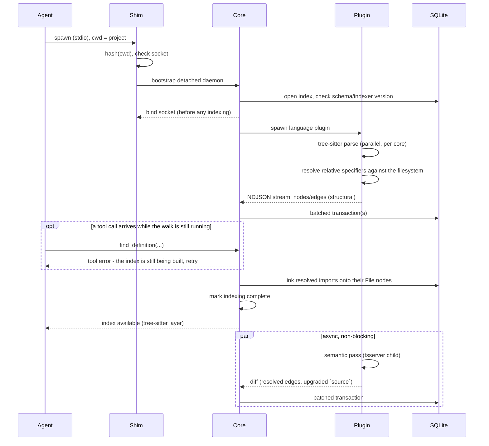
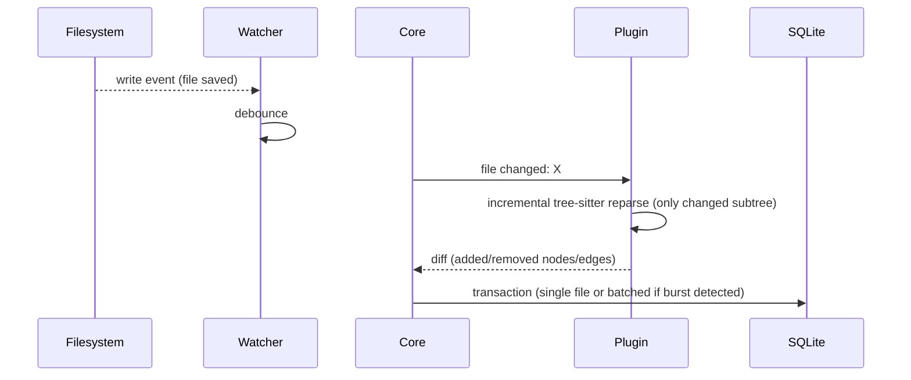
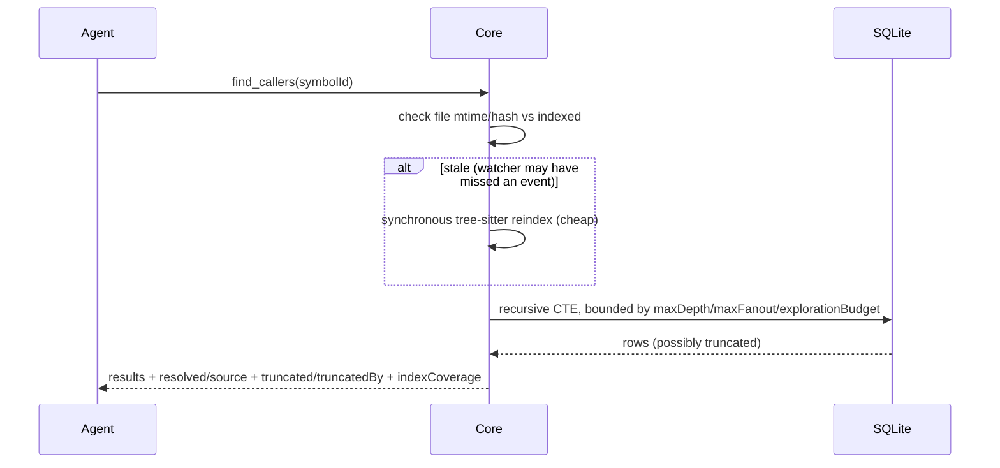
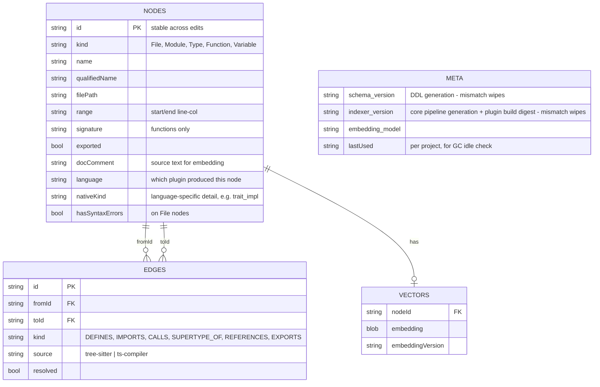

# g-mesh v1 — Architecture

> Synthesized from `REQUIREMENTS.md`. This doc restates decisions already
> reached through discussion in that file — it does not introduce new
> decisions. Where a number is marked "unvalidated", that flag is carried
> over verbatim from the requirements doc, not softened.

## Context & Problem

AI coding agents today understand code structure by grepping and reading
files, which is slow and unreliable for questions like "who calls this
function" or "what implements this interface". `g-mesh` is a local source
code indexer that builds a structural + semantic index of a project and
exposes it to an AI agent over MCP, so the agent can query exact
relationships instead of inferring them from raw text.

## Goals / Non-goals

**Goals**
- Build an accurate graph of code structure (symbols, calls, imports, types)
  via static analysis, independent of any LLM (standalone).
- Layer semantic (embedding) search on top of the graph for
  find-by-meaning queries.
- Serve both to an AI agent through a fixed set of MCP tools.
- Reindex incrementally on file changes, not by rebuilding the whole project.
- Run entirely on the developer's machine; no code content leaves it by
  default.
- Support additional languages later without redesigning the core.

**Non-goals (v1)**
- GUI / visual graph browser (CLI-only; see [UI](#ui-scope)).
- Switching embedding models at runtime (mechanism is laid out in the
  schema, but not implemented).
- OS-level plugin sandboxing (namespaces/seccomp/App Sandbox/AppContainer).
- Git-hook-triggered reindexing.
- HTTP transport for MCP (stdio only).
- A plugin registry / `g-mesh plugin install <language>` from a remote
  source (local bundling only).
- Telemetry of any kind (not even opt-out — simply not built).

## Constraints

- **Scale target**: monorepos up to ~100k files / 1-2GB source. Cold
  tree-sitter pass target ≤2 minutes on an 8+-core laptop (**unvalidated,
  order-of-magnitude estimate — confirm on a prototype**).
- **Resource footprint**: embedding model 100–500M params, <1GB footprint,
  CPU-only (no GPU dependency). Core ships as a single binary with no
  runtime dependency for the user.
- **Platforms**: Linux, macOS, Windows ≥ 10 build 17063 / Server 2019+
  (minimum version driven by native `AF_UNIX` socket support).
- **Transport**: MCP stdio only, per the MCP spec's standard transport —
  must work with any MCP client without custom integration.
- **Privacy**: project content must not leave the machine in any default
  configuration; no exceptions without explicit opt-in.
- **Durability**: a crash must never leave the on-disk index corrupted —
  at worst an uncommitted transaction is lost (the index is a reproducible
  cache, not source of truth).

## Options Considered

**Indexing strategy — graph vs. vector vs. hybrid.**
A pure graph (static analysis only) is precise for structural questions but
useless when the agent doesn't know exact symbol names. A pure vector index
is language-agnostic and cheap but unreliable for structural questions
("who calls X"). **Chosen: hybrid** — graph as source of truth for
structure, embeddings as a search layer over graph nodes for
find-by-meaning. Reference points: Sourcegraph SCIP (graph precision model),
aider's repo-map (tree-sitter + PageRank).

**Multi-language extensibility — in-process tree-sitter vs. plugin
processes.**
Parsing every language with tree-sitter in one process is operationally
simpler (no process management, no IPC overhead on every edit) but caps out
at syntax-only understanding — no type resolution, no overload resolution.
**Chosen: core + separate language plugin processes** communicating over an
LSP-style protocol, so each plugin can wrap its language's native tooling
(e.g. TypeScript compiler API) for real semantic resolution. Reference:
Sourcegraph's core + per-language SCIP indexers.

**Storage engine — DuckDB vs. LanceDB vs. SQLite+sqlite-vec.**
DuckDB is a columnar/OLAP engine, strong at bulk analytical scans but not at
the actual write pattern here (frequent small transactional updates — one
file edit touches a handful of rows). LanceDB is a strong pure vector store
but has no graph query language, which would mean running two storage
engines instead of one. **Chosen: SQLite + `sqlite-vec`** — a single
embedded engine for both graph (tables + recursive CTE) and vectors, matched
to the OLTP-shaped write pattern. Accepted trade-off: SQLite's recursive CTE
is less ergonomic and slower than a native graph engine (e.g. embedded Kùzu)
on deep multi-hop traversals — see the concrete migration trigger in
[Failure Modes](#storage-scaling-trigger).

**MCP transport/lifecycle — plain HTTP daemon vs. stdio + shim.**
A pure Streamable HTTP daemon (no shim) was the original design but was
rejected: the daemon would either have to stay alive forever (resource cost
per open project) or idle-timeout out — at which point nothing respawns it,
since a plain HTTP client has no "spawn on demand" behavior the way stdio
MCP clients do. **Chosen: stdio + shim process** — the MCP client spawns
`g-mesh mcp-shim` the way it spawns any stdio MCP server (its normal
behavior, nothing special required); the shim detects/bootstraps a detached
per-project daemon and proxies over an `AF_UNIX` socket.

**Core implementation language — Rust vs. faster-iteration alternative
(e.g. TypeScript).**
A TS/Node core would iterate faster on schema/protocol changes, but conflicts
with the standalone/single-binary distribution requirement (would need a
bundled Node runtime) and loses native `tree-sitter` bindings. **Chosen:
Rust** — single-binary distribution, first-class tree-sitter bindings (same
foundation as Zed/Helix/ast-grep), mature `rusqlite`. Accepted trade-off:
slower iteration on graph-shaped data structures (borrow checker pushes
toward arena/index patterns over pointers) and a less plug-and-play local
embedding story (ONNX via `ort`, workable but not as smooth as
Python/JS).

## Chosen Approach

A Rust core process per project, running as a background daemon, holds a
hybrid graph+vector index in a single SQLite (`sqlite-vec`-extended) file.
Language-specific understanding comes from separate plugin processes
(bundled with the core for v1's JS/TS plugin) that speak a small
LSP-inspired protocol to the core over stdio. The MCP client talks to a
thin, stateless shim process which transparently bootstraps and proxies to
the per-project daemon over a Unix domain socket. Indexing is driven by a
cross-platform file watcher with a query-time staleness check as a safety
net, and updates are incremental at both the plugin (per-file diff) and
storage (batched SQLite transactions) layers.

## Components

```mermaid
graph TD
    Agent["AI Agent<br/>(MCP client)"] -->|stdio, spawned per session| Shim["g-mesh mcp-shim<br/>(stateless proxy)"]
    Shim -->|AF_UNIX socket<br/>bootstraps if absent| Core["Daemon core (Rust)<br/>per project"]

    subgraph Core Responsibilities
        Watcher["File watcher<br/>(notify crate)"]
        ToolLogic["MCP tool logic<br/>(find_*, search_code, ...)"]
        SockListener["Unix socket listener"]
    end
    Core --- Watcher
    Core --- ToolLogic
    Core --- SockListener

    Core -->|JSON-RPC (control)<br/>NDJSON (bulk graph)| Plugin["Language plugin process<br/>(JS/TS: tree-sitter)"]
    Plugin -->|tsserver protocol| TsServer["tsserver child<br/>(semantic pass, killable)"]
    Core -->|rusqlite, WAL mode| DB[("SQLite + sqlite-vec<br/>~/.g-mesh/projects/&lt;hash&gt;/index.db")]

    Config[("~/.g-mesh/projects/&lt;hash&gt;/config.toml<br/>~/.g-mesh/config.toml (global)")] -.-> Core
```

- **Shim**: spawned fresh per MCP session by the client; no state of its own.
  Hashes project `cwd`, checks for a live daemon socket, bootstraps a
  detached daemon if none is found (file lock guards concurrent first-start
  races), then pure-proxies JSON-RPC frames between stdio and the socket.
- **Daemon core**: one per project, identified by a hash of the project
  path. Owns the file watcher, the SQLite handle, MCP tool implementations,
  and the plugin process lifecycle. Two independent idle timers — see
  [MCP transport & lifecycle](#lifecycle).
- **Language plugin process**: one per active language per project, spawned
  and owned by the core. For JS/TS: tree-sitter for the fast structural
  layer, and for point semantic resolution a `tsserver` child of its own
  (see [TS semantic layer](#ts-semantic-layer) — the compiler is
  deliberately *not* loaded in-process, because it is synchronous and would
  stall the plugin's event loop for seconds at a time). Read-only access to
  project source; never writes to the index directly — all writes go
  through the core.
- **Storage**: single SQLite file per project, WAL mode, holding both graph
  tables and the `sqlite-vec` vector index.

## Data Flow

### 1. Cold start / initial index



Structural graph is available almost immediately; semantic resolution
(`source: 'ts-compiler'`, `resolved: true`) fills in asynchronously without
blocking tool availability.

"Asynchronously" is a statement about *answers*, not about the wire. The
pass is requested over the ordinary synchronous control plane
(`semanticPass`, below): core sends one request and waits for its diff, the
same way it waits for a `fileChanged` diff. What makes it non-blocking is
where it sits — the walk's index is committed and the daemon is already
serving off it before the request goes out, so no tool call waits on the
checker, and a pass that fails or never answers costs the graph nothing it
had.

<a id="bind-before-walk"></a>The socket is bound **before** the cold-start
walk, not after it. The invariant is unchanged — *no caller is ever served off
a half-built graph* — but it is enforced in the response rather than in the
transport: a tool call arriving mid-walk is answered with an explicit
tool-level error naming indexing as the reason, and the daemon starts giving
real answers the instant the walk's last batch and its linking passes are
committed. Refusing the connection outright enforced exactly the same thing
and was the original design, on the reasoning that nothing should reach the
agent until the plugin's whole stream has landed — "all or nothing". It stopped
being viable once [an indexer-version bump](#failure-modes--edge-cases) made a
full re-walk a routine part of *upgrading*: a walk longer than the shim's
bootstrap timeout then left the MCP client with no g-mesh tools at all, which
is a strictly worse answer than "not ready yet, ask again". "All or nothing"
now describes the answers, which is where it was always doing the work.

#### Import resolution

`IMPORTS` is the one edge kind the structural layer can resolve on its own,
and it does — without waiting for the semantic pass. A module specifier is a
literal, not a name, so a *relative* one (`./x`, `../x`) is answered by plain
Node-style path arithmetic: try the literal path, then each source extension
this plugin parses, then `index.*` inside a directory — plus TypeScript's
extension substitution, without which `import "./x.js"` in an ESM TypeScript
project would resolve to nothing, since `./x.js` does not exist on disk until
the project is built.

A *bare* specifier is answered the same way when — and only when — it names a
package of the project's own workspace. The manifest
(`pnpm-workspace.yaml`, or `workspaces` in the root package.json) says which
directories are packages, each package.json says what that package is called
and where its entry is (`exports` conditions, then `source`/`main`/`module`/
`types`, then the `src/index.*` convention that an unbuilt monorepo is
actually resolvable by), and from there it is the same path arithmetic
producing the same project-relative path. This is the normal way cross-package
code is imported in a monorepo — `import { pointFrom } from "@excalidraw/math"`,
not a `../../math/src` path — so without it a monorepo's cross-package edges
are simply absent. Everything else — packages that live only in
`node_modules`, `node:` builtins, `paths` aliases, `#private` imports maps —
is left to the backlog semantic layer, which has the type information and the
module-resolution machinery to answer it properly. Nothing of theirs is in the
index anyway.

The work is split across the process boundary, because neither side has both
halves of the answer:

- **The plugin** decides *which path* a specifier names. Extension guessing
  and `index.*` directory imports are language rules, and core is
  deliberately language-agnostic; the stat calls they cost land on the side
  that is walking the tree anyway. Existence alone is not enough to claim a
  path, so the same side also applies its own walk's exclusion policy — hard-excluded
  directories, `.gitignore` — to every candidate: a target the walk would
  never turn into a `File` node is never reported as resolved either. Without
  that, a built checkout resolves `@excalidraw/math` to the `dist/` output
  its manifest declares and loses the edge into the source the walk did index.

Symlinks are **followed**, on both sides of that policy. A symlinked package —
the normal yarn/lerna layout, and how vendored shared code is linked into
`packages/` — is walked and indexed like any other, rather than being silently
absent because a `Dirent` reports a link as neither file nor directory. The file
walk and the workspace-glob expansion share one guard module
(`plugins/js-ts/src/symlinks.ts`), each building its own instance per traversal,
so the two cannot disagree about which packages exist and which files are theirs.
The guard's rules: identity for cycle and duplicate detection is the resolved
real path, never the path used to reach it; a link onto one of its own ancestors
is refused rather than descended into forever; two paths onto the same real
target (two links, or a real directory plus a link to it) index it exactly once,
under whichever path the walk's own sorted depth-first order reaches first — the
other is dropped entirely, never merged onto or renamed to a canonical path,
because a package's identity here *is* the path it was reached by and rewriting
it would break every specifier naming it; a link resolving outside the project
root is refused on the same never-escape-`projectRoot` grounds as every other
path this index holds; and a dangling link is a skip, not a crash.
- **The core** decides *whether that path is a node*, in a linking pass
  (`core/src/graph/imports.rs`) that repoints the edge — once the cold-start
  stream is over, and scoped to each diff afterwards. What is left for it is
  timing, not policy: a path can be a perfectly indexable target that simply
  has not reached a `File` node yet mid-walk, or belong to another language's
  plugin. Since edges are foreign keys onto nodes, only the side that knows
  what the index holds can point one at a real node.

An import that survives both steps unlinked stays what it was before any of
this: a placeholder `Module` node carrying the raw specifier, with an
unresolved `IMPORTS` edge into it. That covers off-workspace packages
(`"zod"`, `"node:crypto"`) and dangling relative imports alike — a specifier pointing
at nothing is reported as pointing at nothing, never quietly dropped and
never invented.

#### Computed import specifiers

Everything above assumes the specifier is a string literal — what
`stringLiteralValue` extracts from a `string` or `template_string` node in
`plugins/js-ts/src/extract.ts`. `import()`/`require()` do not require that:
`import(\`./plugins/${name}\`)`, `import(getPath())`,
`import(path.join(__dirname, name))` are all legal, and none of them is a
literal.

`recordCallImport` today only asks whether the first argument node is a
literal at all, and — this is a real bug this scoping pass surfaced, not a
hypothetical — it is *not* consistent about it. A plain literal or a
template string with no interpolation resolves correctly. A template string
that *does* interpolate does not fail cleanly: `stringLiteralValue` returns
the first `string_fragment` child of the `template_string` node,
unconditionally, rather than checking whether a `template_substitution`
sibling exists at all. So `import(\`./plugins/${name}/index\`)` is recorded
today as an IMPORTS edge to the literal path `./plugins/` — a silently
*wrong* resolution, not an honestly missing one, which is worse than the gap
this ticket set out to scope. The follow-up ticket implementing the subset
below should close this as part of that work rather than build on top of it.

Scoping what is worth building means drawing a real line between what a
static pass — tree-sitter alone, or the TS-compiler-backed semantic pass
(`plugins/js-ts/src/semantic.ts`) — can honestly answer, and what only
running the program answers. Concretely:

**Resolvable without running anything (in scope for the next ticket):**

- A template literal whose every interpolated part is itself statically
  known *within the same file*: a reference to a `const` bound to a string
  literal (or to another such fully-static template), or a qualified
  reference to an enum member (`Plugin.Foo`) whose own initializer is a
  string literal, declared in the file the pass is already walking. The
  scope/binding machinery this needs — resolving a name to its declaration
  and asking what that declaration is — already exists for exactly this kind
  of same-file question (`LocalBindings`, `lookupByName`, `lookupType`); what
  is missing is that `recordCallImport` decides at the call site instead of
  deferring past the walk the way `pendingCalls`/`pendingSupertypes` already
  do.
- A short conditional of literal branches — `import(cond ? "./a" : "./b")` —
  resolvable by recording one IMPORTS edge per literal branch from the same
  call site. A File node already carries more than one outgoing IMPORTS edge
  in the ordinary multi-import case, so this is not a new edge shape, just
  more than one `recordImport` call attributed to one AST node.
- `path.join(__dirname, ...)` / `path.resolve(__dirname, ...)` where the
  receiver is a bare identifier already known — via the namespace-import
  bookkeeping `recordImportBindings` builds — to be `node:path`, and every
  segment after the `__dirname` anchor is a string literal: plain path
  arithmetic against this file's own directory, no different in kind from the
  relative-specifier resolution `recordImport` already does.

**Theoretically resolvable, not worth this release:**

- Any of the above where the constant lives in *another* file. The pass sees
  one file at a time, so folding it needs either a new tsserver query that
  returns a symbol's literal value directly, or chaining the semantic pass's
  existing `definition` request (`SemanticProject.definition` in
  `plugins/js-ts/src/semantic.ts`) to the declaration site and re-running the
  same structural fold there. That is real plumbing, not a shape decision,
  and deserves its own ticket.
- A specifier whose interpolated part is not one known literal but a value
  the checker can only *type* as a finite union of literals (a
  `"a" | "b" | "c"` parameter, or a plain value of enum type rather than one
  named member). `semantic.ts`/`semanticPass.ts` only ever ask
  `definition`/`projectInfo` today — nothing asks the checker for a type at
  all — so this needs both a new query and a real decision about what "one
  call site, N candidate files" should mean as an edge set. Guessing across N
  files starts to look more like a lint hint than an index edge, and that
  tradeoff deserves its own discussion rather than riding in on this ticket.
- `path.join`/`path.resolve` where the *last* segment, not the whole
  specifier, is dynamic (`path.join(__dirname, "./plugins", name)`).
  Resolvable only down to "somewhere under `./plugins`" — turning that into
  edges means enumerating a directory's contents as fan-out candidates, a
  materially different feature (directory-level fan-out) than resolving a
  specifier, and out of scope here.

**Not resolvable, by construction — a hard limit to document, not a gap to
close later:**

- `import(getPath())` / `import(computeSpecifier())`: the specifier is the
  return value of an arbitrary function call. Nothing about a function's
  return value is knowable without running it — it may read a file, hit the
  network, branch on an argument — and no amount of static analysis,
  tree-sitter or the full checker alike, changes that.
- A specifier built from `process.env.*`, `process.argv`, or any other
  environment/I-O-sourced value — its value is only ever known at runtime, by
  definition of what those are.
- A specifier fed from a variable TypeScript's own checker widens to plain
  `string` (reassigned in a loop, mutated across branches, etc.) — if the
  checker itself cannot narrow it to a literal, nothing built on top of the
  checker has a better answer than the checker does.

The next ticket ("Implement resolution for the statically-resolvable
computed-import subset") is scoped to exactly the first bucket above, and
should fix the `stringLiteralValue` truncation bug described above as part
of that work rather than leave it as a silent wrong answer.

#### Cross-file symbol resolution

A resolved import is also what makes the *symbols* behind it resolvable. The
extractor sees one file at a time, so `foo()` after
`import { foo } from "./x"` has no local declaration to point a `CALLS` edge
at — and dropping that edge, which is what the structural pass used to do,
made `find_callers`/`find_references`/`find_implementations` answer "nothing"
for any symbol used outside the file declaring it, i.e. the normal case.

So the same handshake runs one level finer. Where the specifier resolved to a
project file, the plugin records which local names that import binds and what
each one is called in the target file, and a usage of such a name gets a
placeholder node addressed by `<target file>#<imported name>`, with the
`CALLS`/`REFERENCES`/`SUPERTYPE_OF` edge hung on it. Core
(`core/src/graph/symbol_links.rs`) then looks for a symbol of that name
**exported** by that file and, when exactly one fits the edge — a `CALLS`
edge only ever lands on a `Function`, a `SUPERTYPE_OF` edge only on a `Type`,
`REFERENCES` on whatever is unambiguous — repoints the edge and marks it
resolved. Anything else is left alone, on the same rule the extractor's own
name lookup follows: a missing edge beats a wrong one. In practice that
leaves `import * as ns` and `default` imports of a *named* default export to
the semantic layer, along with everything reached through a specifier that did
not resolve — a package outside the workspace, in practice.

The file a placeholder addresses is very often not the one declaring the
symbol. A bare workspace specifier resolves to a package's entry point, and in
a monorepo that entry point is typically a barrel that declares nothing and
only re-exports — six of excalidraw's seven packages are entered that way — so
looking for the name *in* that file finds nothing, and every usage written as
`import { mutateElement } from "@excalidraw/element"` silently loses its edge
while the same import written relatively keeps it. So the split runs one level
further: the plugin, which is the side that parses the syntax and resolves the
specifier, records each `export * from "./y"` / `export { x as y } from "./z"`
as a placeholder saying "this file publishes *this* name, which is *that* name
over there"; core, which is the side that knows what the index holds, follows
those hops breadth-first until it reaches a declaration, up to a bounded number
of them. Shallowest wins, so a file that declares a name shadows what it
re-exports under the same one, as it does in the language; a cycle terminates
on the walk's visited set rather than hanging the index; and a chain that ends
nowhere leaves the edge exactly as unresolved as before, never guessed at.

What that walk cannot settle is a name **two** branches offer at the same
depth — `export * from "./a"; export * from "./b"` where both declare
`mutate`. All a name-matching walk sees is two equally good candidates, so it
leaves the edge alone. The language does have an answer, and the semantic pass
(`plugins/js-ts/src/semanticPass.ts`) asks the compiler for it rather than
reimplementing it. Measured against TypeScript 5.9.3 on exactly that fixture:

| asked | answer |
| --- | --- |
| `tsc --noEmit` | `TS2308: Module "./a" has already exported a member named 'mutate'`, reported on the **second** `export *` — a diagnostic about the barrel, not one that removes the name from a consumer's view |
| `definition` at a consumer's `import { mutate } from "./index"` | exactly **one** location, in `a.ts` |
| `quickinfo` at the call site | `(alias) mutate(): "a"` |
| the same, with the two `export *` statements swapped | `b.ts` |

So the rule is *the first `export *` in the barrel's own source order that
offers the name* — not the first file alphabetically, not the shortest chain —
which is `extendExportSymbols` in the checker: the first star export to
contribute a name keeps it, and later ones only add to the TS2308 collision
list. The pass re-sends the edge under its own id with `source: "ts-compiler"`,
`resolved: true` and the declaration it landed on, and core's `apply_diff`
rewrites the row in place.

To keep that cheap, the pass only ever asks about a placeholder whose target
file does **not** itself declare the name: where it does, core's own walk
reaches the same node in a lookup instead of a subprocess round trip, so the
questions actually put to the checker are barrel questions — a small fraction
of a project's imports. An answer is dropped, leaving the edge exactly as the
structural pass left it, when the checker returns anything but a single
location, when that location is outside what this index holds (a
`node_modules` or gitignored declaration), or when the declaration is of the
wrong kind for the edge.

Unlike an import placeholder, a linked-away symbol placeholder is kept rather
than deleted: it carries one edge per usage, so a later edit to the same file
can add another one to it, and the plugin sends that new edge without
re-sending the unchanged placeholder. The rows are excluded from every
"which symbol is this?" lookup (`core/src/graph/queries.rs`), so they never
surface as a definition.

### 2. Incremental edit



A burst of watcher events (e.g. `git checkout`/`pull`) is detected and
folded into one SQLite transaction rather than one per file.

The same import linking runs on each applied diff, scoped to what that diff
could have changed rather than to the whole index: the reindexed file's own
imports, plus any placeholder elsewhere that was waiting for a `File` node
the diff has just added — which is what keeps a newly created file from
staying invisible to its importers until they happen to be edited too.

Symbol linking follows on the same diff and by the same rule, with one extra
trigger: the reindexed file's own pending symbols, any placeholder elsewhere
waiting for an *export* the diff has just added, and any new usage edge onto
a placeholder that is already in the index — the last one because that
placeholder did not change, so nothing else in the diff would point at it. A
new export is not only waited on under its own address: the same walk that
follows re-exports down from an importer is run back up from what changed, so
a declaration added behind a barrel reaches the placeholders addressed at the
barrel, and a barrel that newly re-exports something reaches the placeholders
that were waiting on it.

### 3. MCP query with staleness check



## Data Model



Granularity is symbol-level: `File`, `Module` (namespace/package/crate),
`Type` (class/interface/struct/trait/enum), `Function` (function/method),
`Variable` (module-level/exported only — no locals). The schema is
deliberately language-agnostic: instead of JS/TS-shaped `Class`/`Interface`
+ `Extends`/`Implements`, there's a generic `Type` node kind and a single
`SUPERTYPE_OF` edge kind, with language-specific detail escaping into
`nativeKind` rather than the core enum. Reference: SCIP's minimal universal
schema + language-specific detail split out.

`Module` carries one language-agnostic special case: an import specifier that
resolves to nothing this index holds is stored as a `Module` node standing in
for it, so the `IMPORTS` edge has somewhere to point (see
[Import resolution](#import-resolution)). Such a node's `filePath` is the
file the specifier is *written in*, not a file it names — nothing else in the
model works that way, and the query layer accounts for it.

<a id="overloads"></a>
### Overloads and merged declarations: one node per declaration group

One symbol can be written as several declarations — TypeScript overloads, an
interface or namespace merged across statements, a function that also carries
a namespace. A node's identity does not mention position or signature
(`nodeIdFor` = `hash(filePath, kind, qualifiedName, nativeKind)`, deliberately,
so ids survive edits elsewhere in the file), so all of them land on one node
and everything but the first is discarded.

Measured on a fixture with every shape of this (Node 20.6.1, TypeScript 5.9.3,
`plugins/js-ts/src/extract.ts` at release 0.19.0), the damage was worse than
"the first declaration wins" — the first two below are what the extractor did
before this design landed in it, kept as the measurement the design answers:

- **Top-level overload signatures are dropped entirely.** `tree-sitter`
  parses `export function parse(input: string): string[];` as
  `function_signature`, a type `Extractor.visit` has no case for, so it falls
  through to a plain child walk. `parse` gets exactly one node, built from the
  implementation, and its `signature` is
  `parse(input: string | number, radix?: number): any` — the one signature
  TypeScript deliberately never shows a caller.
- **A class method's overloads split the method in two.** `methodNativeKind`
  maps `method_signature` → `"method_signature"` and `method_definition` →
  `"method"`, and `nativeKind` is part of the id, so `Repo#find` with two
  overloads and an implementation becomes **two** nodes — one holding the
  first signature, one holding the implementation — and the second overload is
  lost. `get_file_outline` already answers that file with a confusing extra
  row today.
- **Nothing anywhere records which overload a call site binds to**, which is
  the question the semantic layer exists to answer.

**TypeScript's own model, measured rather than assumed.** Every row below is
a real `tsserver` answer against that fixture, through
`plugins/js-ts/src/semantic.ts`'s live child:

| asked of `tsserver` | overloaded `parse` (2 sigs + impl) | merged `interface Options` (2 decls) | `class Model` + `interface Model` |
| --- | --- | --- | --- |
| `navtree` (its own file outline) | **one** row, `spans: 3` | **one** row, `spans: 2`, members unioned | **two** rows, `spans: 1` each |
| `definition` at a use | **1** location — the overload actually bound | 2 locations | 2 locations |
| `definition` at the import specifier | 3 locations | 2 locations | 2 locations |
| `navto` (search by name) | 1 row, at the implementation | 2 rows | 2 rows |
| `quickinfo` | first *call* signature + `(+1 overload)` | `interface Options` | — |
| `references` from any one declaration | the same whole-symbol answer from all three | — | — |

Two facts decide the design. First, `definition` at a call site really does
return the single bound overload (`parse("x")` → the `string` signature,
`parse(10, 16)` → the `number` one; likewise for class and interface methods),
so the call-site question is answerable. Second, `tsserver` does **not**
distinguish "overload" from "merge" anywhere: both are one symbol with N
declarations, and what separates a merge from a genuinely separate symbol is
the *declaration kind*, not the number of declarations. Its outline groups by
(name, kind) and hangs N spans off the row — which is precisely what
`nodeIdFor` already keys on:

| declarations in one file | `tsserver` `navtree` | g-mesh nodes today | agree? |
| --- | --- | --- | --- |
| `function parse` ×3 (2 sigs + impl) | 1 row, 3 spans | 1 node | yes |
| `interface Options` ×2 | 1 row, 2 spans | 1 node | yes |
| `namespace NS` ×2 | 1 row, 2 spans, members unioned | 1 node, members unioned | yes |
| `function widget` + `namespace widget` | 2 rows | 2 nodes | yes |
| `class Model` + `interface Model` | 2 rows | 2 nodes | yes |
| `get value` + `set value` | 2 rows (`getter`, `setter`) | 2 nodes | yes |
| `find` ×3 in a class body | 1 row, 3 spans | **2 nodes** | **no** |

So the node id scheme is already isomorphic to TypeScript's own grouping, in
every case but the last. **The identity scheme is kept; what it was missing is
that a node holds only one declaration's worth of data.**

**The rule.** Two declarations in one file belong to the same node **iff they
agree on `(filePath, kind, qualifiedName, nativeKind)`**. Overloads and merges
are the same fact under this rule, deliberately — TypeScript treats them the
same way, and the existing merged-namespace behaviour (one `Module` node,
members unioned from both statements) is already right and stays untouched.
What distinguishes an overload set is not identity but whether its
declarations carry *distinct call signatures*, which is a property of the
declaration list; and *which* one a given use binds to is a property of a call
site, which is why it belongs on an edge and not in a node.

**The shape.**

- A node gains an ordered **declaration list** — one entry per declaration in
  source order, each with its own range, its own `signature`, and whether it
  has a body. Stored as a `DECLARATIONS` child table (`nodeId` FK, `ordinal`,
  range, `signature`, `hasBody`), written only for nodes with more than one
  declaration, so an ordinary symbol costs zero extra rows and its NDJSON wire
  shape is byte-identical to today's.
- The node's own flat fields stay, and stay primary — which is what keeps
  every single-declaration node bit-for-bit unchanged. For a multi-declaration
  node they are filled the way TypeScript's own tools fill them: **range** from
  the implementation if there is one, else the first declaration (what `navto`
  points at); **`signature`** from the first *call* signature, never the
  implementation's (what `quickinfo` displays); **`docComment`** from the first
  declaration that has one; **`exported`** OR'd across all of them, as today.
- An edge gains **`toDeclaration`** — an ordinal into the target node's
  declaration list, set only by the semantic pass, only on `CALLS`, and only
  when the target really has more than one call signature. It participates in
  edge identity via `edgeIdFor(from, kind, to, toDeclaration?)` hashing
  `toDeclaration ?? ""`, exactly as `nodeIdFor` already hashes
  `nativeKind ?? ""`: absent, the hash is identical to today's, so **no
  existing edge id changes**. Participating in identity is what lets one
  function calling two overloads store both bindings instead of one
  overwriting the other.
- `schema_version` 4 → 5. A mismatch wipes and rebuilds, so there is no
  migration to write.

**What each MCP tool answers for a multi-declaration symbol.**

| tool | behaviour |
| --- | --- |
| `get_file_outline` | One row per node, as today — an overloaded function is listed **once**, matching `navtree`. Rows for multi-declaration symbols carry `declarationCount` and, for functions, `signatures` (all call signatures, implementation excluded). The only row-count change on any real file is that `Repo#find`'s spurious second row disappears. |
| `find_definition(symbolName)` | One node. An overloaded or merged name is **not** `ambiguous` — it is one symbol, so no candidate page is returned and no extra round trip is forced. The node carries `signatures` and `declarations` when there is more than one; its `signature`/range are the primary ones above, which is a straight fix to today's answer for `parse`. |
| `find_definition(file, position)` | Same node as by name. At a call site the semantic pass annotated, the response also carries `boundDeclaration` (the ordinal) so the caller learns which overload that position binds — the direct mirror of `tsserver`'s own single-location `definition`. |
| `find_callers` | Unchanged row set: inbound `CALLS` **grouped back to one row per caller**, so page sizes, `limit` and pagination behave exactly as today even though storage now holds one edge per bound overload. A row additionally carries `boundSignatures` naming which overloads that caller binds. Anchoring by `symbolId` means the whole symbol; there is no per-overload anchor, and none is offered. |
| `find_callees` | Mirror image: one row per callee symbol, with `boundSignatures` when the callee is overloaded. |
| `find_references` | Symbol-wide, unpartitioned — which is what `tsserver` itself does: asked from any one of `over`'s three declarations it returned the same whole-symbol answer, three times identically. Other declarations of the same symbol are declarations, not usages, so they do not appear as reference rows (unchanged from today). |
| `find_implementations` | Unaffected. `SUPERTYPE_OF` is type-level and has no per-declaration variant; a merged interface is one node, so it keeps giving one answer rather than one per merged statement. |
| `get_dependencies` | Unaffected — `File`/`Module` granularity. |
| `search_code` | Unaffected: still one vector per node (`VECTORS.nodeId`), with all call signatures available as embedding input. |

**Why not a node per overload declaration.** It is the obvious shape and it was
rejected on three counts. (1) A per-overload id cannot use position — ids must
survive edits elsewhere in the file — so it would have to hash the signature
text, which makes *renaming a parameter* a delete-plus-insert: every inbound
edge is destroyed and rebuilt and the node's embedding vector is evicted, on an
edit that changed nothing semantic. (2) `find_definition("parse")` would start
answering with an `ambiguous: true` candidate page for a name that is not
ambiguous at all, forcing a second round trip on the single most common lookup
— the exact cost the `symbolName` anchor was added to remove. (3) It gives no
account of merges, so it needs the merge rule as a *second*, separate
mechanism anyway; the shape above needs one rule for both because TypeScript
has one. Its genuine advantage — an inbound edge onto a specific overload is
addressable by plain node id, with no new edge column — is real but small
against those.

**Known limitation, unchanged by this.** `class Model` + `interface Model` are
one symbol to TypeScript but two nodes here, since a `Type` node cannot be both
at once, so `find_definition("Model")` returns an ambiguous pair. That is
pre-existing and deliberate (the two declarations carry genuinely different
information), and `tsserver`'s own outline lists them as two rows too.

**Implementation follow-ups.** In `extract.ts`, **done**: `function_signature`
is in the declaration switch, so a top-level overload signature is seen at all
and lands on its implementation's node; `methodNativeKind` no longer returns
`method_signature`, so a method's signatures and its implementation share one
node (`getter`/`setter`/`constructor`/`abstract_method` keep splitting, and
`navtree` agrees — it labels a signature-only interface method `method` as
well). Two consequences of `nativeKind` being part of the id: the choice must
be made when a declaration is first seen and can never be "upgraded" once the
node exists, and dropping `method_signature` changed the id of every interface
and overload-signature method — a one-time reindex, which `indexer_version`
already forces from the rebuilt plugin's own digest. A node that has more than
one declaration now carries the ordered list, and its primary range, signature
and doc comment are filled from the group as described above.

Still open, in this order: the storage half — the `DECLARATIONS` table, the
`toDeclaration` edge column, `edgeIdFor` hashing it, `schema_version` 4 → 5 —
which is also what puts `declarations` on the wire (`toWireNode` deliberately
does not send a field core would drop, and `nodesEqual` deliberately does not
compare one, which would otherwise churn a byte-identical node out of an edit
to an overload); and then the semantic pass filling `toDeclaration` from
`definition` at each unresolved-or-overloaded call site, for which the
extractor's declaration ranges are the lookup table.

## Interfaces

### MCP tools

| Tool | Input | Returns |
|---|---|---|
| `find_definition` | symbol name, or `file+position` | node: kind, signature, docstring, location (candidate list if name is ambiguous, ranked by inbound `REFERENCES`/`CALLS` count) |
| `find_references` | `symbolId` or `symbolName` + `limit`? | usage sites (inbound `REFERENCES`/`CALLS`/`SUPERTYPE_OF` edges - the extractor files each usage under exactly one of these, so references is their union and a superset of `find_callers`/`find_implementations`) |
| `find_callers` | `symbolId` or `symbolName` + `limit`? | inbound `CALLS` |
| `find_callees` | `symbolId` or `symbolName` + `limit`? | outbound `CALLS` |
| `find_implementations` | `symbolId` or `symbolName` + `limit`? | inbound `SUPERTYPE_OF` |
| `search_code` | free-text query | semantic matches via embeddings, ranked by similarity |
| `get_file_outline` | `filePath` | symbols defined in the file |
| `get_dependencies` | `filePath`/`moduleId` + direction | impact analysis before a change: a bounded transitive `IMPORTS` walk over the files linked as described in [Import resolution](#import-resolution) |

All list-shaped responses are cursor-paginated: `results`, `hasMore`,
`nextCursor` (opaque token — chosen over `offset` because background
reindexing can shift/duplicate rows mid-pagination). Structural tool
results are ordered `resolved: true` before `resolved: false`, then by
locality; `search_code` is ordered by similarity score. Every edge-derived
result carries `resolved`/`source` so the agent knows how much to trust a
given relationship.

One response shape cuts across all of them: while a project's cold-start walk
is running, every tool answers with a tool-level error whose text names
indexing as the reason and asks the caller to retry (see
[Cold start / initial index](#bind-before-walk)). Deliberately an error rather
than an empty `results` page — an empty page with `hasMore: false` is
indistinguishable from a genuine "nothing found", and an agent that reads it
as one stops looking. The daemon's own MCP `instructions` say so too, so a
client learns to retry rather than to fall back to grep.

`find_references`/`find_callers`/`find_callees`/`find_implementations` also
accept an optional `limit` (default 20, capped at 200) to raise the page
size for a single call instead of paging through `cursor` — added after
g-mesh-bench measured that, in a stateless CLI-agent conversation, every
extra pagination round-trip re-pays the whole resent-conversation cost, so a
fixed small page forced more of exactly that on high-fan-out lookups.

The same four tools take their anchor as *either* a `symbolId` or a
`symbolName`, exactly one per call — measured against the same
resent-conversation cost, since a mandatory `symbolId` made every lookup a
two-call sequence even when the name was unambiguous. A `symbolName` is
resolved by the same code path `find_definition` uses for its own
`symbol_name` (fully qualified name first, then the bare name), so the two
tools cannot disagree about what a name means. Ambiguity is never guessed
at and never unioned across candidates: the tool answers with
`find_definition`'s ranked candidate list, marked `ambiguous: true` to
separate it from a normal results page, and the caller re-asks with the
`id` of the candidate it picks — still two calls, the same as the pair this
replaces. Candidates carry that `id` precisely because `qualifiedName` is
not a unique handle either (excalidraw has two distinct
`getNonDeletedElements` functions sharing one), so a name-based re-ask
could return the same candidate page forever.

Traversal responses that hit a limit carry `truncated: true` and
`truncatedBy: 'maxDepth' | 'maxFanout' | 'explorationBudget' | 'responseSize'`
— never a silent "no more results". Continuation differs by cause: `maxFanout`
→ agent issues a normal single-hop paginated call on the node where it was
cut; `maxDepth` → response includes `frontierNodes` to re-root the same
traversal call one level further; `explorationBudget` → response includes
an opaque `resumeToken` encoding visited-set + frontier queue, since budget
is spent across the whole traversal rather than per-node. That state is
cumulative across an entire resume chain (each call reseeds from everything
returned so far, see `graph::resume_token::ResumeState`'s doc comment), so
the token grows every call - on real (32-hex-char) ids, a single budget
cutoff alone reaches the hundreds of KB. `resumeToken` is gzipped before
base64 for exactly that reason (measured ~2.3x smaller); it is well short of
the 64 MiB NDJSON frame limit either way, but it is retransmitted by the
caller on every hop of a chain, so keeping it small matters for an LLM
agent's context budget even though nothing rejects the request outright.

`responseSize` is a fourth, independent cause layered on top of the other
three (`core::mcp::pagination::bound_page`/`bound_walk`): even a response
already bounded by depth, fanout and row `limit` can still serialize to more
JSON than an MCP client's own transport will accept as one tool result —
measured directly in the g-mesh-bench benchmark corpus, where an unbounded
`find_references` call came back at 54,600 characters and an `Incoming`
`get_dependencies` walk at the old `maxDepth = 5` default came back at
115,863, both rejected outright by the calling client rather than truncated.
Neither of g-mesh's own transports (the control-plane JSON-RPC channel below,
capped at 64 MiB; the shim's stdio NDJSON proxy, same cap) enforce anything
close to this size, so the limit is external and not g-mesh's to learn
exactly - the fix is to stay well under it by construction:
`pagination::MAX_RESPONSE_BYTES` (20,000 bytes, comfortably under the
smallest observed real rejection) bounds every list-shaped tool response's
serialized size, truncating to the longest row prefix that still fits.
Continuation for a `responseSize` cut reuses the `explorationBudget` arm's
own `resumeToken` mechanism exactly (opaque token, cumulative across a resume
chain) rather than a separate scheme, so a caller does not need to
distinguish the two causes to know how to continue - only `truncatedBy`
itself tells them why the cut happened, not how to resume from it.

An import that resolved to nothing is still reported as a dependency —
`get_dependencies` answers what a file depends on, and "on a package we do
not index" is part of that answer — but as the `Module` placeholder it is,
carrying the specifier in `qualifiedName` and **no `filePath`**. The only
path such a node stores is the importing file's, which as a dependency row
would both name the wrong file and collide with the importer's own row in
the same walk.

Defaults (unvalidated, confirm on a prototype): the walk engine's own
generic `maxDepth = 5`, `maxFanout = 50`, internal exploration budget = 5000
visited nodes per query. `get_dependencies` itself defaults `maxDepth` to a
stricter `2`, not the engine's 5 - an `Incoming` walk's fan-out compounds
with every extra hop of depth in a way `maxFanout` alone cannot bound, and
depth 5 is what produced the 115,863-character `responseSize` failure above
on a real, shared module; depth 2 stays an order of magnitude more
conservative while still answering the "what depends on what depends on
this" shape the tool mostly exists for (see `mcp::get_dependencies`'s own
`DEFAULT_MAX_DEPTH` doc comment for the full reasoning). An explicit
`maxDepth` from the caller is always honored exactly, unaffected by this
tighter default.

### Core ↔ language plugin protocol

- **Control plane** (reindex requests, file-changed notifications, status,
  semantic-pass requests):
  JSON-RPC 2.0 with LSP-style framing (`Content-Length` header + JSON body)
  — chosen partly so a `tsserver`-based plugin needs little adapter code.
  Measured against a real `tsserver` (see [TS semantic layer](#ts-semantic-layer)),
  that holds for half the wire and not the other: `tsserver`'s *output* is
  byte-identical `Content-Length: N\r\n\r\n{body}` framing, which
  `plugins/js-ts/src/jsonrpc.ts`'s `FrameReader` parses verbatim, but its
  *input* is newline-delimited JSON and it rejects a `Content-Length` frame
  outright (`Unexpected token 'C', "Content-Length: 45" is not valid JSON`),
  with a `{seq, type: "request", command, arguments}` envelope rather than
  JSON-RPC 2.0's `{jsonrpc, id, method, params}`. "Almost no adapter" was
  optimistic; ~40 lines is the real figure.
- **Bulk graph transfer** (initial full index): NDJSON, one compact JSON
  object per line, streamed rather than buffered. Producer must emit
  single-line compact JSON; core's parser strips trailing `\r` (Windows)
  and has no fixed line-length cap.
- **Versioning**: a protocol version field is part of the handshake. A
  mismatch is a hard load failure with a clear error — never best-effort
  compatibility (a protocol is code, not data; there's nothing to
  "reindex" when it doesn't match).
- **Conformance**: a shared fixture/golden-file suite validates any plugin
  (first-party or third-party) against the protocol — correct edge
  kinds/types, valid NDJSON framing — independent of how complete that
  plugin's language coverage is.
- **`semanticPass`**: core asks for the semantic layer's answer with a
  control-plane request like any other — core-initiated, one round trip,
  answered with the *same* diff shape `fileChanged` answers with. It is sent
  at two moments: once the cold-start walk has committed and the daemon has
  begun serving off it, and again after each incremental reparse settles.
  Its `params.filePaths` is a list rather than a single path because those
  two moments differ in kind; an **empty** list is the cold-start case and
  means "everything indexed so far", not "nothing".

  The diff it answers with goes through the pipeline an ordinary reparse
  already runs (`apply_diff` → `imports::link_diff` →
  `symbol_links::link_diff`) and needs no storage or schema work of its own:
  an edge id is derived from the edge's content, so a re-sent edge is
  upserted onto its existing row, flipping exactly its `source`
  (`tree-sitter` → `ts-compiler`) and `resolved` (`false` → `true`) and
  leaving every edge the pass did not answer for untouched.

  **Not every answer is an upgrade.** `import * as ns from "./mod"` followed
  by `ns.someExport()` has no edge to upgrade at all: the structural pass
  never sees the bare name `someExport` at the use site, only a property
  access on a module object, so it emits nothing for it — deliberately, since
  telling that apart from an ordinary property access needs a checker. The
  pass therefore *adds* an edge, and adds the pending-symbol placeholder it
  hangs on, addressed at the declaration `tsserver`'s `definition` reported
  rather than at the module the namespace names. Addressing it that way is
  the point: the checker has already followed the alias chain, so a member
  republished by a barrel and renamed on the way lands on the file that
  really declares it. From there `symbol_links::link_diff` links it exactly
  as it links a named import's placeholder — the address is the whole
  contract, and `source` is the plugin's to set, so a repointed edge keeps
  saying `ts-compiler`. Retracting an edge whose call site an edit deleted is
  the pass's own job (the reparse diff never knew about it), which is why the
  plugin remembers what it last emitted per file
  (`plugins/js-ts/src/semanticPass.ts`).

  **Which unresolved edges are re-asked**: only those whose target file does
  not itself declare the name. Where it does, core's own walk reaches the same
  node in a lookup and a round trip would buy nothing; where it does not, the
  name comes through a re-export chain, which is the family that walk
  documents as beyond it. Two shapes fall in it. One is a barrel with two
  `export *` branches offering a name — ambiguous to a name-matching walk,
  settled in the language, which hands a consumer the first branch to offer
  it. The other is `export default class Foo {}` imported as
  `import Bar from "./x"`: the edge is addressed at `x.ts#default`, a name no
  file ever declares, so no chain will ever produce it — while `definition` at
  the importer's own binding lands straight on `Foo`. The local name (`Bar`)
  is not the difficulty and never reaches the index at all, which is also why
  every importer of that default is answered the same way whatever each of
  them called it (`core/tests/default_export_linking.rs` follows one through
  to a `find_references` answer).

  A failed pass is logged and dropped, never propagated. It improves a graph
  that is already committed and serviceable, so failing the reparse (or
  daemon startup) because the checker was unavailable would trade a better
  answer that did not arrive for a worse one that did.

<a id="ts-semantic-layer"></a>
### TS semantic layer: `tsserver` subprocess, not the in-process compiler API

The JS/TS plugin's semantic pass drives TypeScript's own type checker
through a **`tsserver` child process**, not through `ts.createProgram` /
`ts.createLanguageService` inside the plugin process.

Both shapes give *identical answers* — same compiler, same checker, and the
prototypes agreed symbol-for-symbol on every probe (136 of 200 identifier
probes resolved, same 136 under both). So the choice is not about
correctness; it is about where the compiler's cost and its failure modes
land. Numbers below are measured, not estimated: Node 20.6.1, TypeScript
5.9.3, macOS/arm64, against `task-tracker-mcp` (46 root files, ~7.3k LOC,
`node_modules` present) and `excalidraw` (618 root files, a real
multi-package monorepo with `paths` aliases — measured *without* its
`node_modules`, so its figures are a floor, not a real-world number).

| | in-process (`LanguageService`) | `tsserver` subprocess |
| --- | --- | --- |
| First semantic answer, 46 files (median of 5) | **1686 ms** (1466–1825) | 2527 ms (2328–2643) |
| First semantic answer, 618 files | **2626–2738 ms** | 2447–2469 ms |
| Worst event-loop stall reaching it, 46 files | 1677 ms (1456–1815) | **26 ms** (3–44) |
| Worst event-loop stall reaching it, 618 files | 2618–2729 ms | **8–41 ms** |
| Plugin-process RSS once warm, 46 files | 243.6 MB | **24.9 MB** (+265 MB in the child) |
| Plugin-process RSS once warm, 618 files | 359–369 MB | **25.7–26.0 MB** (+314–316 MB in the child) |
| Re-query after one edit | 84 ms | **44 ms** |
| Per-edge cost over 200 probes, cold | 3.20 ms | **3.06 ms** |
| Per-edge cost over 200 probes, warm | ~1 ms (direct call) | 0.47 ms incl. round trip |

Four things decided it, in order of weight.

**1. The compiler API is synchronous, and the pass is specified as async.**
The [cold-start diagram](#1-cold-start--initial-index) already draws the
semantic pass as `par, async, non-blocking` alongside the plugin's other
work. In-process that drawing is false: the plugin is one Node event loop
that also carries the control plane and the tree-sitter reparse path
(`plugins/js-ts/src/incremental.ts`), and building a `Program` stalls it in
one unbroken block — **1677 ms** on a 46-file project, **2729 ms** on 618
files, versus **26 ms** worst-case with the subprocess. A `fileChanged`
notification arriving in that window simply is not served. Recovering async
in-process means a `worker_thread`, which is a subprocess with extra steps,
worse isolation, and no version fidelity (point 4).

**2. Blast radius.** The semantic pass is an *optional upgrade* over an
index that already works without it, so it must not be able to take that
index down. Capping the heap at 80 MB to force the compiler to OOM: the
in-process plugin died outright (`SIGABRT`, exit 134), which under
[plugin-crash handling](#failure-modes--edge-cases) costs a relaunch and a
dirty-file replay of the *structural* layer too. The same cap applied to
the child left the plugin alive at 24.9 MB with an uninterrupted heartbeat,
free to report the failure and keep serving tree-sitter queries. g-mesh
targets repos where the compiler OOMing is a real outcome, not a
hypothetical.

**3. The memory is reclaimable, and it is only paid when used.** Killing
the child returns all ~265 MB to the OS. In-process it does not come back:
after `service.dispose()` plus two forced GCs (which needs `--expose-gc`,
so the real plugin would do worse) RSS settled at 146.4 MB, against a
30.8 MB tree-sitter-only baseline. Worse, merely `require`ing the compiler
— zero compiler work done — costs **+61.5 MB permanently** (21.6 MB bare
Node → 92.3 MB), a tax paid on every plugin process including plain-JS
projects with no `tsconfig.json` that will never run a semantic pass. Both
shapes need `typescript` as a runtime `dependencies` entry either way
(`tsserver` ships *inside* that package), so promoting it is not a cost
unique to the in-process shape — but only the subprocess shape gets to not
*load* it.

**4. Version fidelity.** The subprocess can be spawned from the *target
project's own* `node_modules/typescript/lib/tsserver.js` (verified present
and independently spawnable), falling back to the bundled copy — so a
project pinned to an older TypeScript is analyzed by the compiler it
actually builds with. The in-process equivalent is `require`ing an
arbitrary-version 9.1 MB compiler into the plugin's own heap: API drift on
every version, and arbitrary project code executing in-process.

**The one real cost on the security side, and how it is paid.** This is
the single axis where the in-process shape is genuinely better, and it was
nearly missed: the plugin's `security.test.ts` encodes the [Security
Model](#security-model)'s first mitigation as an executable invariant, and
the prototype tripped it. All three results below come from that file's own
malicious-plugin fixture, pointed at each shape in turn.

A bare in-process `LanguageService` never loads a project's
`compilerOptions.plugins`: the config parser does surface them
(`options.plugins` came back as `[{name: "evil-ts-plugin"}]`), but nothing
acts on them — plugin loading lives in tsserver's `Project`, not in
`createLanguageService` — so the fixture answered semantics normally and
never executed. The mitigation holds structurally, for free. tsserver *does*
know how to load them, so the subprocess turns that structural guarantee
into a default: with `--allowLocalPluginLoads` it **does** `require()` an
attacker-controlled plugin out of the project's own `node_modules`; without
it, it **does not**, and still answers semantic queries normally. The flag is off unless passed, so the mitigation survives
— and `security.test.ts` now pins that neither it nor
`--globalPlugins`/`--pluginProbeLocations` ever reaches the spawn, alongside
`--disableAutomaticTypingAcquisition` (ATA npm-installs `@types/*`, and is
the only network path in the `typescript` package). That is the same
assurance shape the other mitigations already have — true by construction,
pinned by a test that fails loudly — not a weakening of it. `child_process`
is on that file's forbidden-pattern list as a shell-out proxy; the
exemption is scoped to `semantic.ts` alone and bounded by a test asserting
the only thing it ever spawns is Node itself with an argv array, never a
shell. Running the checker out-of-process also *contains* any future
compiler-side execution bug in a child rather than in the process holding
the index.

What (b) costs, and why it is affordable: **+841 ms** to the first answer
on the small project (the child pays its own Node boot and module load
serially). That lands entirely off the critical path — the pass is async by
construction and the structural index is already queryable — and it
*inverts* on the larger project, where the child is already ahead
(2447–2469 ms vs 2626–2738 ms). Protocol overhead is **under 0.5 ms per
edge** warm, far below the ~3 ms the checking itself costs, so a backlog of
10k unresolved edges pays a few seconds of framing against minutes of real
work. The adapter is ~40 lines.

**`ts.createProgram` is ruled out explicitly**, separately from the
in-process/subprocess axis: it is the worst option on every measured axis,
including against the in-process `LanguageService`. Re-querying after a
single edit took **715 ms** (570 ms rebuild with `oldProgram` reuse + 145 ms
to answer) versus 84 ms, and RSS grew 235 → 338 MB across that one edit
because the superseded `Program` stays reachable. Anything in-process would
have to be `LanguageService`-shaped anyway.

The incremental fit is the one place the two shapes are close, and it
favours the subprocess for a reason worth recording: `tsserver`'s `change`
command takes `{line, offset, endLine, endOffset, insertString}`, which is
the shape `incremental.ts`'s `computeSourceEdit` **already derives** from
its old/new text diff. The existing edit derivation feeds `tsserver`
directly modulo 0-based-row → 1-based-line conversion, and the invalidation
itself is `tsserver`'s problem rather than ours. Point queries are also
per-*project*, not per-file: an unopened file answers in 2.2 ms — but only
once some file in its project has been opened. Asked of a freshly spawned
child, a `definition` on an unopened file fails outright with `No Project`,
so the pass does keep one piece of open-file state after all (which files it
has sent an `open` for, one notification each, no round trip), rather than
none at all.

The client is `plugins/js-ts/src/semantic.ts`: `SemanticServer` is the
~40-line wire adapter over one child, `SemanticProject` its lifecycle — one
child per project root, spawned by the first semantic question actually asked
(never at plugin startup), replaced lazily if it dies, and stopped with the
plugin on its stdin's `end`, with a `process.on("exit")` hook as the backstop
against orphaning one. Under a `SIGKILL` neither can run, and there the
backstop is `tsserver`'s own: it exits when its stdin closes. The project's
`tsconfig.json` — `paths` aliases included — is applied by `tsserver`
natively, from the file's own location upward, so nothing of
`tsconfigPaths.ts` is reused here; `projectInfo` reports which config was
actually in force, which is what the tests assert on rather than assuming.
Turning answers into edges lives one file over, in
`plugins/js-ts/src/semanticPass.ts`, so this one knows no g-mesh vocabulary at
all: it decides which sites are worth a question and what an answer becomes in
the graph (today, namespace-import member accesses — see
[`semanticPass`](#core--language-plugin-protocol) above). The node and edge
shape overloads resolve *into* is decided in
[Overloads and merged declarations](#overloads).

### Shim ↔ daemon

`AF_UNIX` sockets on every platform (native on Windows ≥ 10 build 17063 via
Rust/tokio), carrying the same JSON-RPC framing the shim received from the
MCP client on stdio — the shim is a pure repacking proxy.

## Failure Modes & Edge Cases

- **Plugin process crash** (panic, OOM-killer — distinct from a deliberate
  idle sleep): core detects the unexpected exit and lazily relaunches the
  plugin on the next request that needs it, replaying the queued "dirty"
  file list rather than leaving indexing silently broken.
- **Syntax errors mid-edit**: g-mesh only sees what's on disk via the
  watcher, so "live editing" means "just-saved, momentarily
  incomplete-looking file", not per-keystroke. tree-sitter is
  error-tolerant and yields a partial tree (`ERROR` node for the broken
  region, rest parses normally). Update strategy is **keep-last-good**, not
  replace-wholesale: nodes/edges outside the `ERROR` region update
  normally; nodes overlapping or downstream of it keep their last known
  good state until a clean parse confirms real deletion. Rationale: a
  false "symbol might still exist" is safer for an agent than a false
  "symbol is definitely gone", which could drive a destructive edit based
  on a save-timing artifact rather than real code state. Surfaced via
  `hasSyntaxErrors` on the `File` node, plus a `rawContent` fallback
  (whole file if small, else a window around the last known symbol
  position) on tool responses touching stale data.
- **inotify watch-limit exhaustion** on very large monorepos: fall back to
  partial polling rather than failing outright.
- **Bulk changes** (`git checkout`/`pull` touching hundreds of files):
  detected as a burst of watcher events in a short window and folded into
  one SQLite transaction instead of one per file.
- **Symlink loops and aliases** in the tree being walked: symlinks are followed
  (see [Import resolution](#import-resolution)), so a link cycle would otherwise
  be an infinite descent and a link alias of a real directory a doubly-indexed
  file. Both are refused by real-path identity — a location is claimed once, by
  whichever path the sorted walk reaches first — and links escaping the project
  root, or dangling, are skipped rather than crashing the walk.
- <a id="storage-scaling-trigger"></a>**Graph traversal cost on hub nodes**:
  response-level `maxDepth`/`maxFanout` limit what's returned, but not what
  a recursive CTE visits internally — a separate internal exploration
  budget (hard `LIMIT` on visited rows) bounds the query itself,
  independent of pagination. Concrete migration trigger to an embedded
  graph engine (Kùzu) for the graph portion only: once a prototype exists,
  benchmark a synthetic large-monorepo-shaped graph with a hub node at the
  budget ceiling; if p95 latency exceeds ~200-300ms, migrate — this is the
  threshold at which MCP tool latency becomes agent-visible.
- **Schema version mismatch** (the DDL changed): full local reindex, no
  migration framework in v1 — the index is a reproducible cache, not user
  data, so rebuilding is cheaper than maintaining migrations. Revisit only
  if the schema stabilizes while core releases stay frequent, or monorepo
  rebuild time becomes an UX problem at scale.
- **Indexer version mismatch** (the same source tree would now produce a
  different graph — a resolver fix, a new edge kind, changed linking):
  same full local reindex, tracked separately in `meta.indexer_version`
  because it is the far more frequent event and shares none of its timing
  with a DDL change. Without it an index is never invalidated at all: the
  schema still matches and the project has already been walked, so the
  daemon keeps serving whatever generation of the extractor first filled
  it, indefinitely and without a symptom other than wrong answers.
  `indexer_version` is two facts joined, because the pipeline is two
  artifacts: a constant core maintains by hand for its own linking stage,
  and a digest of the language plugin's compiled output. The constant alone
  was what shipped first, and it failed the way hand-maintained invalidation
  keys do — a release changed the extractor and left it alone, so every
  existing index went on serving the previous extraction with a current
  schema, a current constant and a current binary. The plugin's half is
  derived from the artifact so that nothing has to remember; the constant
  remains for what the digest cannot see (a grammar dependency upgrade,
  core-side linking changes).
- **Plugin rebuilt under a running daemon** (`npm run build` after an
  extractor change, with the core binary untouched): the daemon's published
  build stamp carries the same plugin digest, so a shim finds the incumbent
  holding a plugin that no longer exists on disk and retires it — after which
  the mismatch above wipes and re-walks. Detected only when the two
  executables are the same file: the core binary's mtime still decides
  first and by ordering, so a shim never retires a daemon from a build ahead
  of its own (see `daemon::build_stamp`).
- **Cold-start walk longer than the shim's bootstrap timeout** (a large
  monorepo's very first index, or any project's first start after an
  indexer-version bump): the daemon binds its socket before the walk, so the
  shim connects immediately, and every tool call until the walk commits comes
  back as a tool-level error that names indexing as the reason and asks the
  caller to retry (see [Cold start / initial index](#bind-before-walk)). The
  alternative — bind last, which is what v1 originally specified — turned a
  slow first index into an MCP client with no g-mesh tools at all and a bare
  connection-timeout message to explain it. A caller told "not yet" retries; a
  caller with no tools goes back to grepping.
- **SQLite durability**: WAL-mode transactional writes — a core crash
  mid-operation loses at most an uncommitted transaction, never corrupts
  the index.
- **Embedding model invalidation**: not implemented in v1 (single fixed
  model), but every vector row carries `embeddingVersion` and `meta` holds
  the active model version now, specifically so a future model switch
  doesn't require a schema migration.

## Lifecycle & Operational Model

<a id="lifecycle"></a>Two independent idle timers, because "the daemon" is
actually two components with very different costs:

- **Daemon core** (watcher, SQLite handle, socket listener): cheap to keep
  alive, and fs-watcher registration is a one-time cost per core lifetime —
  so it does *not* die on a short idle timeout. It lives until explicitly
  stopped (`g-mesh stop`), the machine reboots, or a separate, much longer
  `daemon.coreIdleTimeoutHours` (default 24h) elapses with zero MCP
  requests — this exists purely to bound OS resource accumulation
  (inotify watchers, sockets) across many projects touched over a long
  uptime, not to save memory during normal use.
- **Language plugin process** (e.g. the JS/TS plugin's tree-sitter +
  TS-compiler-API process): heavy on memory/CPU, sleeps after
  `plugin.idleTimeoutMinutes` (default 1h) of inactivity. While asleep, the
  core keeps accumulating watcher events into a dirty-file queue without
  processing them; waking the plugin (on the next request that needs it)
  replays only that queue, not a full rescan.

Per-project identity is a hash of the project path — no manually configured
ports, no `g-mesh start` step. Switching a client's `cwd` to a different
project is enough for the shim to find or boot the right daemon. Index data
lives under `~/.g-mesh/projects/<hash>/`, outside the repo (not
`.gitignore`-dependent, not affected by read-only/networked mounts, freely
cleanable without touching the repo).

**Garbage collection**: no automatic deletion, ever — only warnings.
`cleanup.enabled` / `cleanup.idleThresholdDays` (default 90) live in the
global `~/.g-mesh/config.toml`. Any interactive CLI invocation (not the
shim, since its stdout goes to the agent, not a human) checks `lastUsed`
per project and prints a warning if `cleanup.enabled`. Deletion is always
explicit: `g-mesh clean [<project-id>]` (cwd-scoped without an argument),
`g-mesh clean expired`, `g-mesh clean all --force`.

<a id="ui-scope"></a>**UI scope**: CLI-only for v1, lowest priority of all
decisions in the requirements doc. Commands: `g-mesh init` (bootstrap,
no-questions-asked defaults, optional — the zero-config path works without
it), `g-mesh config [--global]` (interactive wizard for
per-project/global settings), `g-mesh status`, `g-mesh reindex` (full
forced rebuild, cwd-scoped), `g-mesh plugins list`, `g-mesh clean`,
`g-mesh stop`. A local web UI on the daemon's existing process is a
plausible post-v1 addition, not a new service.

## Security Model

No OS-level sandboxing for plugins in v1 (cross-platform namespacing/App
Sandbox/AppContainer work judged not worth it against a threat model
already equivalent to "an editor's language server has your project open").
Cheap, targeted mitigations instead:

- Plugins never load tsconfig-style `plugins` extension points that execute
  code at language-server startup (a known attack vector via a malicious
  `tsconfig.json`) — not needed for indexing, so skipping it removes the
  vector for free. The structural layer never opens `tsconfig.json` at all;
  the [semantic layer](#ts-semantic-layer) drives a `tsserver`, which *can*
  load them, so it is spawned without `--allowLocalPluginLoads` (verified:
  with the flag a plugin in the project's `node_modules` executes, without
  it it does not) and without `--globalPlugins`/`--pluginProbeLocations`.
- Plugins have no write access to the index at all — writes are core-only;
  the protocol only carries plugin → core diffs over stdio. Plugin file
  access is read-only on project source; write access, if any, is limited
  to the plugin's own temp/log files.
- Plugins get no network access beyond what analysis strictly needs,
  reinforcing "project content doesn't leave the machine". For JS/TS that
  means `tsserver` always runs with `--disableAutomaticTypingAcquisition`:
  typings acquisition npm-installs `@types/*` for the project and is the
  only network path the `typescript` package has.
- The trust model is documented plainly: a plugin runs in the same trust
  zone as an editor's language server — no stronger guarantee is implied.

## Distribution

Install via `curl | sh` pulling checksummed, platform-named binaries
(standard Rust target triples, e.g. `g-mesh-x86_64-apple-darwin`) from
GitHub Releases for v1; an `npm install -g g-mesh` wrapper around the same
artifacts is a plausible future addition, not a blocker. The JS/TS plugin
ships as a self-contained executable (Node SEA / `bun build --compile`) in
the same release archive — no system Node.js required, consistent with the
standalone requirement. Plugin discovery/loading is a general/pluggable
interface from v1 (`~/.g-mesh/plugins/<language>/` + manifest with a
protocol version) even though the only populated path in v1 is the bundled
JS/TS plugin — this avoids an architecture rework when a second, separately
distributed plugin shows up.

## Open Questions / Risks

All flagged explicitly in the requirements doc as directional estimates,
not measured results — validate on a working prototype before hardening
into defaults:

- **Cold-start throughput target** (~100k files / 1-2GB in ≤2 minutes) is
  an order-of-magnitude estimate from tree-sitter's typical MB/s-per-core
  throughput, not a benchmark. If the miss is an order of magnitude rather
  than a small margin, the parallelization/warm-up approach needs
  rethinking, not just tuning.
- **Kùzu migration trigger** (p95 ~200-300ms on a synthetic hub-node
  traversal) needs a real prototype benchmark before it's actionable.
- **Default embedding model** (`jina-embeddings-v2-base-code`) is an
  architectural pick based on training-data fit (code+NL pairs, ~30
  languages, 8192-token context, Apache 2.0), not a benchmark result on
  real code — validate before hard-fixing `meta.embedding_model`.
- **Idle timeout defaults** (`plugin.idleTimeoutMinutes` = 60,
  `daemon.coreIdleTimeoutHours` = 24) and traversal limits (`maxDepth` = 5,
  `maxFanout` = 50, exploration budget = 5000) are reasonable-sounding
  starting points, not tuned values.
- A hard cap on simultaneously-live daemon cores (LRU eviction) is a
  candidate if the long idle timeout alone proves insufficient — deferred
  until there's evidence it's actually needed.

### Ideas surfaced while comparing kungfu (external tool)

g-mesh-bench added kungfu ([denyzhirkov/kungfu](https://github.com/denyzhirkov/kungfu),
a comparable Rust/tree-sitter MCP code-intelligence server) as a benchmark
comparison arm; see g-mesh-bench's `docs/results/` for the head-to-head
findings. Two things surfaced during that work are worth recording here even
though neither was implemented — one is a real, verified gap in this
project's own reasoning, the other is a pointer for when the already-planned
semantic layer gets built:

- **The `IndexingStatus`/`STILL_INDEXING` signal (added for cold start,
  #99/#105/#107) does not cover the ongoing incremental-edit watcher path —
  decided (task #111) to leave it that way.** `mark_ready()` is only called
  once, after the initial bulk walk (`daemon/mod.rs:303`); the watcher's
  write → reparse → transaction cycle (see "Incremental edit" above) never
  re-arms it, so a query landing in that window gets a silent stale (pre-edit)
  answer instead of a "still indexing" signal. Investigating this surfaced two
  corrections to the framing above: first, there is currently no debounce
  actually wired into `daemon::run`'s watcher thread — `watcher::debounce::
  Debouncer` exists and is unit-tested but is never constructed there — so the
  real window is "OS file-watch event latency plus one reparse-and-commit
  round trip to the plugin", not a deliberate hundreds-of-ms batching delay;
  second, `apply_file_change` holds the same connection mutex every MCP
  handler locks to answer a query for that entire round trip, and `apply_diff`
  is one transaction, so a query can never observe torn or half-committed
  data — only a query that arrives *before* the watcher thread has picked the
  change off its channel reads pre-edit data, and only silently, never
  inconsistently. That makes this a narrower failure mode than cold start's,
  where an in-progress graph can have nodes with no edges yet — a confidently
  *wrong* answer, not just a delayed one. The decision: not worth extending
  `IndexingStatus` to cover it, because `IndexingStatus` is deliberately a
  single project-wide flag — correct for a bulk walk that really does leave
  the whole graph incomplete, but the wrong shape for a single-file edit;
  flipping it around every watcher commit would make an unrelated query pause
  or read "still indexing" on every save in a live-edited project, trading a
  rare, narrow, internally-consistent staleness for a much more common false
  positive. A per-file signal would need a genuinely different mechanism —
  `watcher::staleness::ensure_fresh` was written for close to that shape (an
  mtime/hash check before answering). **Update (task #117, closed):** this
  actually was a real, unfinished gap, not redundant with the mutex-
  serialization argument above — that argument only covers a query landing
  *while* a watcher commit is in flight; it says nothing about a file edited
  while no daemon was running at all, which `storage::schema::ensure_current`
  does not catch on restart either. `ensure_fresh` is now wired into the
  three file-anchored MCP tools (`find_definition`, `get_file_outline`,
  `get_dependencies`) — deliberately not the four symbol-anchored ones
  (`find_references`/`find_callers`/`find_callees`/`find_implementations`),
  which have no single file to check before resolving the query itself.
  Proven by `core/tests/query_time_staleness.rs`: edit a file while the
  daemon is down, restart, query immediately — the edit is now visible with
  no artificial delay.

  A separate, still-open gap surfaced by the same investigation, distinct
  from staleness: `watcher::debounce::Debouncer` and `watcher::burst::
  BurstBatcher` are both implemented and unit-tested but neither is actually
  constructed in `daemon/mod.rs`'s watcher loop (confirmed directly — the
  only reference there is a comment: "wiring them in is nice-to-have, not
  required by this ticket's acceptance criteria - left for a later pass").
  Every file-watch event today triggers its own individual reparse/plugin
  round-trip with no coalescing, so a burst of rapid saves (editor autosave,
  a bulk find-and-replace, a branch checkout touching many files) costs one
  round-trip per file rather than one per batch. Not yet filed as its own
  task as of this writing.

  kungfu's `PostToolUse`-hook-triggered reindex, which
  sidesteps the watcher's race window entirely for edits made through Claude
  Code's own Edit tool, remains a reasonable idea for the common case but is a
  separate mechanism from this signaling question and was not evaluated
  further here.
- **Semantic/embedding search**: this doc already planned an embedding model
  (`jina-embeddings-v2-base-code`, above) but nothing in the current
  implementation ships it yet. kungfu has a real, shipped opt-in semantic
  layer (`BAAI/bge-small-en-v1.5`, 384-dim) — a concrete existing reference
  point to look at for model/dimension trade-offs when this project's own
  planned layer is actually built, not a new idea in itself.

kungfu's other headline features — a `tiny/small/medium/full` context-budget
tier and server-side "intent detection" query routing — were looked at and
not carried forward as ideas: this project already made the deliberate choice
to expose composable primitive tools plus byte-budget pagination
(`pagination::longest_prefix_fitting`) and let the calling agent orchestrate,
rather than a tiered-budget or server-side-routed API. Noted here so that
choice reads as considered, not overlooked.
