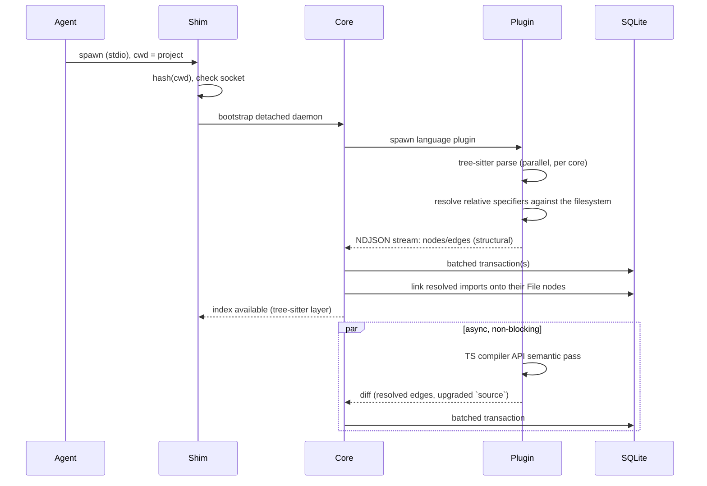
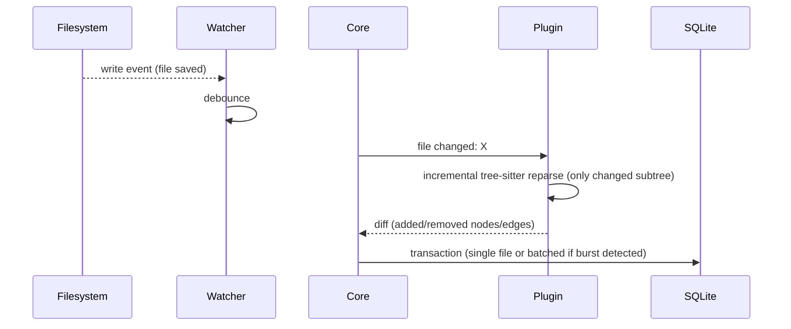
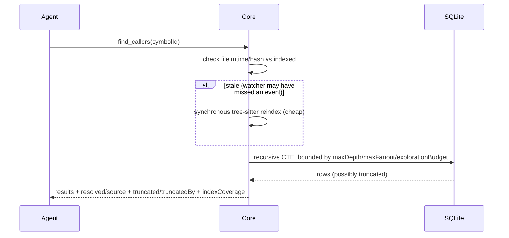
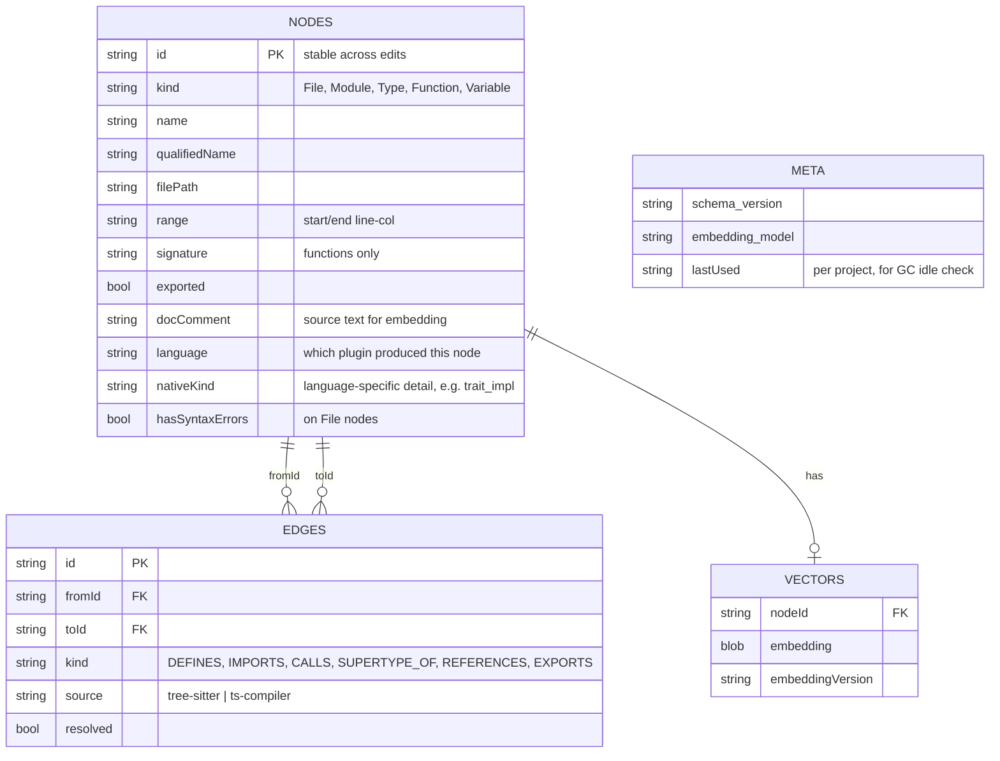

# g-mesh v1 — Architecture

> Synthesized from `REQUIREMENTS.md`. This doc restates decisions already
> reached through discussion in that file — it does not introduce new
> decisions. Where a number is marked "unvalidated", that flag is carried
> over verbatim from the requirements doc, not softened.

## Context & Problem

AI coding agents today understand code structure by grepping and reading
files, which is slow and unreliable for questions like "who calls this
function" or "what implements this interface". `g-mesh` is a local source
code indexer that builds a structural + semantic index of a project and
exposes it to an AI agent over MCP, so the agent can query exact
relationships instead of inferring them from raw text.

## Goals / Non-goals

**Goals**
- Build an accurate graph of code structure (symbols, calls, imports, types)
  via static analysis, independent of any LLM (standalone).
- Layer semantic (embedding) search on top of the graph for
  find-by-meaning queries.
- Serve both to an AI agent through a fixed set of MCP tools.
- Reindex incrementally on file changes, not by rebuilding the whole project.
- Run entirely on the developer's machine; no code content leaves it by
  default.
- Support additional languages later without redesigning the core.

**Non-goals (v1)**
- GUI / visual graph browser (CLI-only; see [UI](#ui-scope)).
- Switching embedding models at runtime (mechanism is laid out in the
  schema, but not implemented).
- OS-level plugin sandboxing (namespaces/seccomp/App Sandbox/AppContainer).
- Git-hook-triggered reindexing.
- HTTP transport for MCP (stdio only).
- A plugin registry / `g-mesh plugin install <language>` from a remote
  source (local bundling only).
- Telemetry of any kind (not even opt-out — simply not built).

## Constraints

- **Scale target**: monorepos up to ~100k files / 1-2GB source. Cold
  tree-sitter pass target ≤2 minutes on an 8+-core laptop (**unvalidated,
  order-of-magnitude estimate — confirm on a prototype**).
- **Resource footprint**: embedding model 100–500M params, <1GB footprint,
  CPU-only (no GPU dependency). Core ships as a single binary with no
  runtime dependency for the user.
- **Platforms**: Linux, macOS, Windows ≥ 10 build 17063 / Server 2019+
  (minimum version driven by native `AF_UNIX` socket support).
- **Transport**: MCP stdio only, per the MCP spec's standard transport —
  must work with any MCP client without custom integration.
- **Privacy**: project content must not leave the machine in any default
  configuration; no exceptions without explicit opt-in.
- **Durability**: a crash must never leave the on-disk index corrupted —
  at worst an uncommitted transaction is lost (the index is a reproducible
  cache, not source of truth).

## Options Considered

**Indexing strategy — graph vs. vector vs. hybrid.**
A pure graph (static analysis only) is precise for structural questions but
useless when the agent doesn't know exact symbol names. A pure vector index
is language-agnostic and cheap but unreliable for structural questions
("who calls X"). **Chosen: hybrid** — graph as source of truth for
structure, embeddings as a search layer over graph nodes for
find-by-meaning. Reference points: Sourcegraph SCIP (graph precision model),
aider's repo-map (tree-sitter + PageRank).

**Multi-language extensibility — in-process tree-sitter vs. plugin
processes.**
Parsing every language with tree-sitter in one process is operationally
simpler (no process management, no IPC overhead on every edit) but caps out
at syntax-only understanding — no type resolution, no overload resolution.
**Chosen: core + separate language plugin processes** communicating over an
LSP-style protocol, so each plugin can wrap its language's native tooling
(e.g. TypeScript compiler API) for real semantic resolution. Reference:
Sourcegraph's core + per-language SCIP indexers.

**Storage engine — DuckDB vs. LanceDB vs. SQLite+sqlite-vec.**
DuckDB is a columnar/OLAP engine, strong at bulk analytical scans but not at
the actual write pattern here (frequent small transactional updates — one
file edit touches a handful of rows). LanceDB is a strong pure vector store
but has no graph query language, which would mean running two storage
engines instead of one. **Chosen: SQLite + `sqlite-vec`** — a single
embedded engine for both graph (tables + recursive CTE) and vectors, matched
to the OLTP-shaped write pattern. Accepted trade-off: SQLite's recursive CTE
is less ergonomic and slower than a native graph engine (e.g. embedded Kùzu)
on deep multi-hop traversals — see the concrete migration trigger in
[Failure Modes](#storage-scaling-trigger).

**MCP transport/lifecycle — plain HTTP daemon vs. stdio + shim.**
A pure Streamable HTTP daemon (no shim) was the original design but was
rejected: the daemon would either have to stay alive forever (resource cost
per open project) or idle-timeout out — at which point nothing respawns it,
since a plain HTTP client has no "spawn on demand" behavior the way stdio
MCP clients do. **Chosen: stdio + shim process** — the MCP client spawns
`g-mesh mcp-shim` the way it spawns any stdio MCP server (its normal
behavior, nothing special required); the shim detects/bootstraps a detached
per-project daemon and proxies over an `AF_UNIX` socket.

**Core implementation language — Rust vs. faster-iteration alternative
(e.g. TypeScript).**
A TS/Node core would iterate faster on schema/protocol changes, but conflicts
with the standalone/single-binary distribution requirement (would need a
bundled Node runtime) and loses native `tree-sitter` bindings. **Chosen:
Rust** — single-binary distribution, first-class tree-sitter bindings (same
foundation as Zed/Helix/ast-grep), mature `rusqlite`. Accepted trade-off:
slower iteration on graph-shaped data structures (borrow checker pushes
toward arena/index patterns over pointers) and a less plug-and-play local
embedding story (ONNX via `ort`, workable but not as smooth as
Python/JS).

## Chosen Approach

A Rust core process per project, running as a background daemon, holds a
hybrid graph+vector index in a single SQLite (`sqlite-vec`-extended) file.
Language-specific understanding comes from separate plugin processes
(bundled with the core for v1's JS/TS plugin) that speak a small
LSP-inspired protocol to the core over stdio. The MCP client talks to a
thin, stateless shim process which transparently bootstraps and proxies to
the per-project daemon over a Unix domain socket. Indexing is driven by a
cross-platform file watcher with a query-time staleness check as a safety
net, and updates are incremental at both the plugin (per-file diff) and
storage (batched SQLite transactions) layers.

## Components

```mermaid
graph TD
    Agent["AI Agent<br/>(MCP client)"] -->|stdio, spawned per session| Shim["g-mesh mcp-shim<br/>(stateless proxy)"]
    Shim -->|AF_UNIX socket<br/>bootstraps if absent| Core["Daemon core (Rust)<br/>per project"]

    subgraph Core Responsibilities
        Watcher["File watcher<br/>(notify crate)"]
        ToolLogic["MCP tool logic<br/>(find_*, search_code, ...)"]
        SockListener["Unix socket listener"]
    end
    Core --- Watcher
    Core --- ToolLogic
    Core --- SockListener

    Core -->|JSON-RPC (control)<br/>NDJSON (bulk graph)| Plugin["Language plugin process<br/>(JS/TS: tree-sitter + TS compiler API)"]
    Core -->|rusqlite, WAL mode| DB[("SQLite + sqlite-vec<br/>~/.g-mesh/projects/&lt;hash&gt;/index.db")]

    Config[("~/.g-mesh/projects/&lt;hash&gt;/config.toml<br/>~/.g-mesh/config.toml (global)")] -.-> Core
```

- **Shim**: spawned fresh per MCP session by the client; no state of its own.
  Hashes project `cwd`, checks for a live daemon socket, bootstraps a
  detached daemon if none is found (file lock guards concurrent first-start
  races), then pure-proxies JSON-RPC frames between stdio and the socket.
- **Daemon core**: one per project, identified by a hash of the project
  path. Owns the file watcher, the SQLite handle, MCP tool implementations,
  and the plugin process lifecycle. Two independent idle timers — see
  [MCP transport & lifecycle](#lifecycle).
- **Language plugin process**: one per active language per project, spawned
  and owned by the core. For JS/TS: tree-sitter for the fast structural
  layer, TypeScript compiler API for point semantic resolution. Read-only
  access to project source; never writes to the index directly — all writes
  go through the core.
- **Storage**: single SQLite file per project, WAL mode, holding both graph
  tables and the `sqlite-vec` vector index.

## Data Flow

### 1. Cold start / initial index



Structural graph is available almost immediately; semantic resolution
(`source: 'ts-compiler'`, `resolved: true`) fills in asynchronously without
blocking tool availability.

#### Import resolution

`IMPORTS` is the one edge kind the structural layer can resolve on its own,
and it does — without waiting for the semantic pass. A module specifier is a
literal, not a name, so a *relative* one (`./x`, `../x`) is answered by plain
Node-style path arithmetic: try the literal path, then each source extension
this plugin parses, then `index.*` inside a directory — plus TypeScript's
extension substitution, without which `import "./x.js"` in an ESM TypeScript
project would resolve to nothing, since `./x.js` does not exist on disk until
the project is built.

A *bare* specifier is answered the same way when — and only when — it names a
package of the project's own workspace. The manifest
(`pnpm-workspace.yaml`, or `workspaces` in the root package.json) says which
directories are packages, each package.json says what that package is called
and where its entry is (`exports` conditions, then `source`/`main`/`module`/
`types`, then the `src/index.*` convention that an unbuilt monorepo is
actually resolvable by), and from there it is the same path arithmetic
producing the same project-relative path. This is the normal way cross-package
code is imported in a monorepo — `import { pointFrom } from "@excalidraw/math"`,
not a `../../math/src` path — so without it a monorepo's cross-package edges
are simply absent. Everything else — packages that live only in
`node_modules`, `node:` builtins, `paths` aliases, `#private` imports maps —
is left to the backlog semantic layer, which has the type information and the
module-resolution machinery to answer it properly. Nothing of theirs is in the
index anyway.

The work is split across the process boundary, because neither side has both
halves of the answer:

- **The plugin** decides *which path* a specifier names. Extension guessing
  and `index.*` directory imports are language rules, and core is
  deliberately language-agnostic; the stat calls they cost land on the side
  that is walking the tree anyway. Existence alone is not enough to claim a
  path, so the same side also applies its own walk's exclusion policy — hard-excluded
  directories, `.gitignore` — to every candidate: a target the walk would
  never turn into a `File` node is never reported as resolved either. Without
  that, a built checkout resolves `@excalidraw/math` to the `dist/` output
  its manifest declares and loses the edge into the source the walk did index.

Symlinks are **followed**, on both sides of that policy. A symlinked package —
the normal yarn/lerna layout, and how vendored shared code is linked into
`packages/` — is walked and indexed like any other, rather than being silently
absent because a `Dirent` reports a link as neither file nor directory. The file
walk and the workspace-glob expansion share one guard module
(`plugins/js-ts/src/symlinks.ts`), each building its own instance per traversal,
so the two cannot disagree about which packages exist and which files are theirs.
The guard's rules: identity for cycle and duplicate detection is the resolved
real path, never the path used to reach it; a link onto one of its own ancestors
is refused rather than descended into forever; two paths onto the same real
target (two links, or a real directory plus a link to it) index it exactly once,
under whichever path the walk's own sorted depth-first order reaches first — the
other is dropped entirely, never merged onto or renamed to a canonical path,
because a package's identity here *is* the path it was reached by and rewriting
it would break every specifier naming it; a link resolving outside the project
root is refused on the same never-escape-`projectRoot` grounds as every other
path this index holds; and a dangling link is a skip, not a crash.
- **The core** decides *whether that path is a node*, in a linking pass
  (`core/src/graph/imports.rs`) that repoints the edge — once the cold-start
  stream is over, and scoped to each diff afterwards. What is left for it is
  timing, not policy: a path can be a perfectly indexable target that simply
  has not reached a `File` node yet mid-walk, or belong to another language's
  plugin. Since edges are foreign keys onto nodes, only the side that knows
  what the index holds can point one at a real node.

An import that survives both steps unlinked stays what it was before any of
this: a placeholder `Module` node carrying the raw specifier, with an
unresolved `IMPORTS` edge into it. That covers off-workspace packages
(`"zod"`, `"node:crypto"`) and dangling relative imports alike — a specifier pointing
at nothing is reported as pointing at nothing, never quietly dropped and
never invented.

#### Cross-file symbol resolution

A resolved import is also what makes the *symbols* behind it resolvable. The
extractor sees one file at a time, so `foo()` after
`import { foo } from "./x"` has no local declaration to point a `CALLS` edge
at — and dropping that edge, which is what the structural pass used to do,
made `find_callers`/`find_references`/`find_implementations` answer "nothing"
for any symbol used outside the file declaring it, i.e. the normal case.

So the same handshake runs one level finer. Where the specifier resolved to a
project file, the plugin records which local names that import binds and what
each one is called in the target file, and a usage of such a name gets a
placeholder node addressed by `<target file>#<imported name>`, with the
`CALLS`/`REFERENCES`/`SUPERTYPE_OF` edge hung on it. Core
(`core/src/graph/symbol_links.rs`) then looks for a symbol of that name
**exported** by that file and, when exactly one fits the edge — a `CALLS`
edge only ever lands on a `Function`, a `SUPERTYPE_OF` edge only on a `Type`,
`REFERENCES` on whatever is unambiguous — repoints the edge and marks it
resolved. Anything else is left alone, on the same rule the extractor's own
name lookup follows: a missing edge beats a wrong one. In practice that
leaves `import * as ns`, `default` imports of a *named* default export, and
re-exported (`export { x } from "./y"`) names to the semantic layer, along
with everything reached through a specifier that did not resolve — a package
outside the workspace, in practice.

Unlike an import placeholder, a linked-away symbol placeholder is kept rather
than deleted: it carries one edge per usage, so a later edit to the same file
can add another one to it, and the plugin sends that new edge without
re-sending the unchanged placeholder. The rows are excluded from every
"which symbol is this?" lookup (`core/src/graph/queries.rs`), so they never
surface as a definition.

### 2. Incremental edit



A burst of watcher events (e.g. `git checkout`/`pull`) is detected and
folded into one SQLite transaction rather than one per file.

The same import linking runs on each applied diff, scoped to what that diff
could have changed rather than to the whole index: the reindexed file's own
imports, plus any placeholder elsewhere that was waiting for a `File` node
the diff has just added — which is what keeps a newly created file from
staying invisible to its importers until they happen to be edited too.

Symbol linking follows on the same diff and by the same rule, with one extra
trigger: the reindexed file's own pending symbols, any placeholder elsewhere
waiting for an *export* the diff has just added, and any new usage edge onto
a placeholder that is already in the index — the last one because that
placeholder did not change, so nothing else in the diff would point at it.

### 3. MCP query with staleness check



## Data Model



Granularity is symbol-level: `File`, `Module` (namespace/package/crate),
`Type` (class/interface/struct/trait/enum), `Function` (function/method),
`Variable` (module-level/exported only — no locals). The schema is
deliberately language-agnostic: instead of JS/TS-shaped `Class`/`Interface`
+ `Extends`/`Implements`, there's a generic `Type` node kind and a single
`SUPERTYPE_OF` edge kind, with language-specific detail escaping into
`nativeKind` rather than the core enum. Reference: SCIP's minimal universal
schema + language-specific detail split out.

`Module` carries one language-agnostic special case: an import specifier that
resolves to nothing this index holds is stored as a `Module` node standing in
for it, so the `IMPORTS` edge has somewhere to point (see
[Import resolution](#import-resolution)). Such a node's `filePath` is the
file the specifier is *written in*, not a file it names — nothing else in the
model works that way, and the query layer accounts for it.

## Interfaces

### MCP tools

| Tool | Input | Returns |
|---|---|---|
| `find_definition` | symbol name, or `file+position` | node: kind, signature, docstring, location (candidate list if name is ambiguous, ranked by inbound `REFERENCES`/`CALLS` count) |
| `find_references` | `symbolId` or `symbolName` + `limit`? | usage sites (inbound `REFERENCES`/`CALLS`/`SUPERTYPE_OF` edges - the extractor files each usage under exactly one of these, so references is their union and a superset of `find_callers`/`find_implementations`) |
| `find_callers` | `symbolId` or `symbolName` + `limit`? | inbound `CALLS` |
| `find_callees` | `symbolId` or `symbolName` + `limit`? | outbound `CALLS` |
| `find_implementations` | `symbolId` or `symbolName` + `limit`? | inbound `SUPERTYPE_OF` |
| `search_code` | free-text query | semantic matches via embeddings, ranked by similarity |
| `get_file_outline` | `filePath` | symbols defined in the file |
| `get_dependencies` | `filePath`/`moduleId` + direction | impact analysis before a change: a bounded transitive `IMPORTS` walk over the files linked as described in [Import resolution](#import-resolution) |

All list-shaped responses are cursor-paginated: `results`, `hasMore`,
`nextCursor` (opaque token — chosen over `offset` because background
reindexing can shift/duplicate rows mid-pagination). Structural tool
results are ordered `resolved: true` before `resolved: false`, then by
locality; `search_code` is ordered by similarity score. Every edge-derived
result carries `resolved`/`source` so the agent knows how much to trust a
given relationship.

`find_references`/`find_callers`/`find_callees`/`find_implementations` also
accept an optional `limit` (default 20, capped at 200) to raise the page
size for a single call instead of paging through `cursor` — added after
g-mesh-bench measured that, in a stateless CLI-agent conversation, every
extra pagination round-trip re-pays the whole resent-conversation cost, so a
fixed small page forced more of exactly that on high-fan-out lookups.

The same four tools take their anchor as *either* a `symbolId` or a
`symbolName`, exactly one per call — measured against the same
resent-conversation cost, since a mandatory `symbolId` made every lookup a
two-call sequence even when the name was unambiguous. A `symbolName` is
resolved by the same code path `find_definition` uses for its own
`symbol_name` (fully qualified name first, then the bare name), so the two
tools cannot disagree about what a name means. Ambiguity is never guessed
at and never unioned across candidates: the tool answers with
`find_definition`'s ranked candidate list, marked `ambiguous: true` to
separate it from a normal results page, and the caller re-asks with the
`id` of the candidate it picks — still two calls, the same as the pair this
replaces. Candidates carry that `id` precisely because `qualifiedName` is
not a unique handle either (excalidraw has two distinct
`getNonDeletedElements` functions sharing one), so a name-based re-ask
could return the same candidate page forever.

Traversal responses that hit a limit carry `truncated: true` and
`truncatedBy: 'maxDepth' | 'maxFanout' | 'explorationBudget'` — never a
silent "no more results". Continuation differs by cause: `maxFanout` →
agent issues a normal single-hop paginated call on the node where it was
cut; `maxDepth` → response includes `frontierNodes` to re-root the same
traversal call one level further; `explorationBudget` → response includes
an opaque `resumeToken` encoding visited-set + frontier queue, since budget
is spent across the whole traversal rather than per-node.

An import that resolved to nothing is still reported as a dependency —
`get_dependencies` answers what a file depends on, and "on a package we do
not index" is part of that answer — but as the `Module` placeholder it is,
carrying the specifier in `qualifiedName` and **no `filePath`**. The only
path such a node stores is the importing file's, which as a dependency row
would both name the wrong file and collide with the importer's own row in
the same walk.

Defaults (unvalidated, confirm on a prototype): `maxDepth = 5`,
`maxFanout = 50`, internal exploration budget = 5000 visited nodes per
query.

### Core ↔ language plugin protocol

- **Control plane** (reindex requests, file-changed notifications, status):
  JSON-RPC 2.0 with LSP-style framing (`Content-Length` header + JSON body)
  — chosen so a `tsserver`-based plugin needs almost no adapter.
- **Bulk graph transfer** (initial full index): NDJSON, one compact JSON
  object per line, streamed rather than buffered. Producer must emit
  single-line compact JSON; core's parser strips trailing `\r` (Windows)
  and has no fixed line-length cap.
- **Versioning**: a protocol version field is part of the handshake. A
  mismatch is a hard load failure with a clear error — never best-effort
  compatibility (a protocol is code, not data; there's nothing to
  "reindex" when it doesn't match).
- **Conformance**: a shared fixture/golden-file suite validates any plugin
  (first-party or third-party) against the protocol — correct edge
  kinds/types, valid NDJSON framing — independent of how complete that
  plugin's language coverage is.

### Shim ↔ daemon

`AF_UNIX` sockets on every platform (native on Windows ≥ 10 build 17063 via
Rust/tokio), carrying the same JSON-RPC framing the shim received from the
MCP client on stdio — the shim is a pure repacking proxy.

## Failure Modes & Edge Cases

- **Plugin process crash** (panic, OOM-killer — distinct from a deliberate
  idle sleep): core detects the unexpected exit and lazily relaunches the
  plugin on the next request that needs it, replaying the queued "dirty"
  file list rather than leaving indexing silently broken.
- **Syntax errors mid-edit**: g-mesh only sees what's on disk via the
  watcher, so "live editing" means "just-saved, momentarily
  incomplete-looking file", not per-keystroke. tree-sitter is
  error-tolerant and yields a partial tree (`ERROR` node for the broken
  region, rest parses normally). Update strategy is **keep-last-good**, not
  replace-wholesale: nodes/edges outside the `ERROR` region update
  normally; nodes overlapping or downstream of it keep their last known
  good state until a clean parse confirms real deletion. Rationale: a
  false "symbol might still exist" is safer for an agent than a false
  "symbol is definitely gone", which could drive a destructive edit based
  on a save-timing artifact rather than real code state. Surfaced via
  `hasSyntaxErrors` on the `File` node, plus a `rawContent` fallback
  (whole file if small, else a window around the last known symbol
  position) on tool responses touching stale data.
- **inotify watch-limit exhaustion** on very large monorepos: fall back to
  partial polling rather than failing outright.
- **Bulk changes** (`git checkout`/`pull` touching hundreds of files):
  detected as a burst of watcher events in a short window and folded into
  one SQLite transaction instead of one per file.
- **Symlink loops and aliases** in the tree being walked: symlinks are followed
  (see [Import resolution](#import-resolution)), so a link cycle would otherwise
  be an infinite descent and a link alias of a real directory a doubly-indexed
  file. Both are refused by real-path identity — a location is claimed once, by
  whichever path the sorted walk reaches first — and links escaping the project
  root, or dangling, are skipped rather than crashing the walk.
- <a id="storage-scaling-trigger"></a>**Graph traversal cost on hub nodes**:
  response-level `maxDepth`/`maxFanout` limit what's returned, but not what
  a recursive CTE visits internally — a separate internal exploration
  budget (hard `LIMIT` on visited rows) bounds the query itself,
  independent of pagination. Concrete migration trigger to an embedded
  graph engine (Kùzu) for the graph portion only: once a prototype exists,
  benchmark a synthetic large-monorepo-shaped graph with a hub node at the
  budget ceiling; if p95 latency exceeds ~200-300ms, migrate — this is the
  threshold at which MCP tool latency becomes agent-visible.
- **Schema version mismatch** (core binary upgraded/downgraded): full local
  reindex, no migration framework in v1 — the index is a reproducible
  cache, not user data, so rebuilding is cheaper than maintaining
  migrations. Revisit only if the schema stabilizes while core releases
  stay frequent, or monorepo rebuild time becomes an UX problem at scale.
- **SQLite durability**: WAL-mode transactional writes — a core crash
  mid-operation loses at most an uncommitted transaction, never corrupts
  the index.
- **Embedding model invalidation**: not implemented in v1 (single fixed
  model), but every vector row carries `embeddingVersion` and `meta` holds
  the active model version now, specifically so a future model switch
  doesn't require a schema migration.

## Lifecycle & Operational Model

<a id="lifecycle"></a>Two independent idle timers, because "the daemon" is
actually two components with very different costs:

- **Daemon core** (watcher, SQLite handle, socket listener): cheap to keep
  alive, and fs-watcher registration is a one-time cost per core lifetime —
  so it does *not* die on a short idle timeout. It lives until explicitly
  stopped (`g-mesh stop`), the machine reboots, or a separate, much longer
  `daemon.coreIdleTimeoutHours` (default 24h) elapses with zero MCP
  requests — this exists purely to bound OS resource accumulation
  (inotify watchers, sockets) across many projects touched over a long
  uptime, not to save memory during normal use.
- **Language plugin process** (e.g. the JS/TS plugin's tree-sitter +
  TS-compiler-API process): heavy on memory/CPU, sleeps after
  `plugin.idleTimeoutMinutes` (default 1h) of inactivity. While asleep, the
  core keeps accumulating watcher events into a dirty-file queue without
  processing them; waking the plugin (on the next request that needs it)
  replays only that queue, not a full rescan.

Per-project identity is a hash of the project path — no manually configured
ports, no `g-mesh start` step. Switching a client's `cwd` to a different
project is enough for the shim to find or boot the right daemon. Index data
lives under `~/.g-mesh/projects/<hash>/`, outside the repo (not
`.gitignore`-dependent, not affected by read-only/networked mounts, freely
cleanable without touching the repo).

**Garbage collection**: no automatic deletion, ever — only warnings.
`cleanup.enabled` / `cleanup.idleThresholdDays` (default 90) live in the
global `~/.g-mesh/config.toml`. Any interactive CLI invocation (not the
shim, since its stdout goes to the agent, not a human) checks `lastUsed`
per project and prints a warning if `cleanup.enabled`. Deletion is always
explicit: `g-mesh clean [<project-id>]` (cwd-scoped without an argument),
`g-mesh clean expired`, `g-mesh clean all --force`.

<a id="ui-scope"></a>**UI scope**: CLI-only for v1, lowest priority of all
decisions in the requirements doc. Commands: `g-mesh init` (bootstrap,
no-questions-asked defaults, optional — the zero-config path works without
it), `g-mesh config [--global]` (interactive wizard for
per-project/global settings), `g-mesh status`, `g-mesh reindex` (full
forced rebuild, cwd-scoped), `g-mesh plugins list`, `g-mesh clean`,
`g-mesh stop`. A local web UI on the daemon's existing process is a
plausible post-v1 addition, not a new service.

## Security Model

No OS-level sandboxing for plugins in v1 (cross-platform namespacing/App
Sandbox/AppContainer work judged not worth it against a threat model
already equivalent to "an editor's language server has your project open").
Cheap, targeted mitigations instead:

- Plugins never load tsconfig-style `plugins` extension points that execute
  code at language-server startup (a known attack vector via a malicious
  `tsconfig.json`) — not needed for indexing, so skipping it removes the
  vector for free.
- Plugins have no write access to the index at all — writes are core-only;
  the protocol only carries plugin → core diffs over stdio. Plugin file
  access is read-only on project source; write access, if any, is limited
  to the plugin's own temp/log files.
- Plugins get no network access beyond what analysis strictly needs,
  reinforcing "project content doesn't leave the machine".
- The trust model is documented plainly: a plugin runs in the same trust
  zone as an editor's language server — no stronger guarantee is implied.

## Distribution

Install via `curl | sh` pulling checksummed, platform-named binaries
(standard Rust target triples, e.g. `g-mesh-x86_64-apple-darwin`) from
GitHub Releases for v1; an `npm install -g g-mesh` wrapper around the same
artifacts is a plausible future addition, not a blocker. The JS/TS plugin
ships as a self-contained executable (Node SEA / `bun build --compile`) in
the same release archive — no system Node.js required, consistent with the
standalone requirement. Plugin discovery/loading is a general/pluggable
interface from v1 (`~/.g-mesh/plugins/<language>/` + manifest with a
protocol version) even though the only populated path in v1 is the bundled
JS/TS plugin — this avoids an architecture rework when a second, separately
distributed plugin shows up.

## Open Questions / Risks

All flagged explicitly in the requirements doc as directional estimates,
not measured results — validate on a working prototype before hardening
into defaults:

- **Cold-start throughput target** (~100k files / 1-2GB in ≤2 minutes) is
  an order-of-magnitude estimate from tree-sitter's typical MB/s-per-core
  throughput, not a benchmark. If the miss is an order of magnitude rather
  than a small margin, the parallelization/warm-up approach needs
  rethinking, not just tuning.
- **Kùzu migration trigger** (p95 ~200-300ms on a synthetic hub-node
  traversal) needs a real prototype benchmark before it's actionable.
- **Default embedding model** (`jina-embeddings-v2-base-code`) is an
  architectural pick based on training-data fit (code+NL pairs, ~30
  languages, 8192-token context, Apache 2.0), not a benchmark result on
  real code — validate before hard-fixing `meta.embedding_model`.
- **Idle timeout defaults** (`plugin.idleTimeoutMinutes` = 60,
  `daemon.coreIdleTimeoutHours` = 24) and traversal limits (`maxDepth` = 5,
  `maxFanout` = 50, exploration budget = 5000) are reasonable-sounding
  starting points, not tuned values.
- A hard cap on simultaneously-live daemon cores (LRU eviction) is a
  candidate if the long idle timeout alone proves insufficient — deferred
  until there's evidence it's actually needed.
