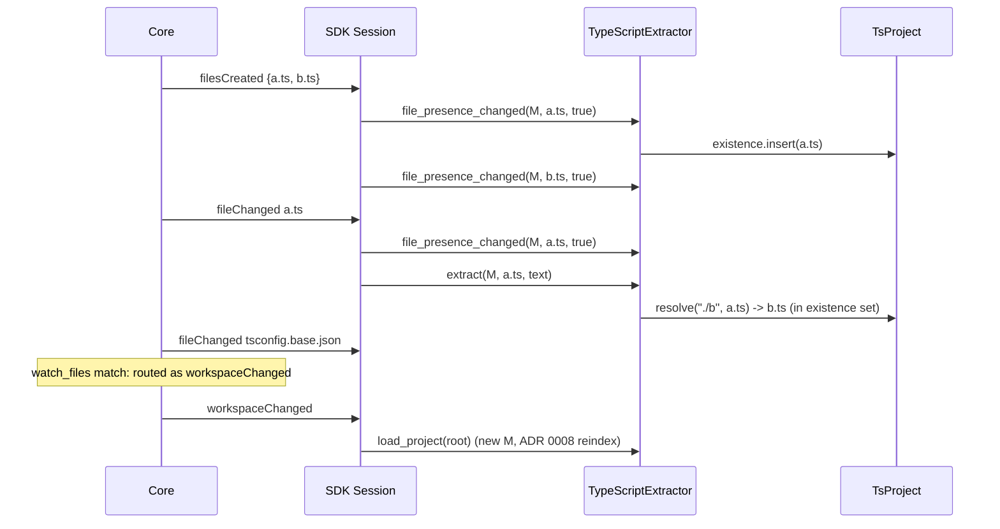

# GM-324: the TypeScript structural tier on the Rust SDK

Design for porting `plugins/typescript`'s structural tier (Node, `src/extract.ts`
plus the project model) to a Rust binary on `plugins/sdk`, a cargo workspace
member shaped like `plugins/python` and `plugins/rust`. The semantic tier stays
on Node until GM-325 replaces it.

Inputs, none re-decided here:
[GM-323 inventory](gm-323-ts-port-inventory.md) (what must survive),
[GM-350](gm-350-ts-resolution-placement.md) with
[ADR 0023](../adr/0023-project-model-tracks-file-presence.md) (project model in
the load step, presence through the hook, configs through `watch_files`),
[ADR 0024](../adr/0024-semantic-tier-refines-by-binding-a-declaration.md)
(overload binding by declaration ordinal),
[ADR 0025](../adr/0025-project-walk-follows-symlinks.md) (the SDK walk follows
links), [ADR 0026](../adr/0026-batch-created-files-notification.md)
(`filesCreated`, `capabilities.files_created`).
`plugins/python/src/extractor` is the structural precedent;
`plugins/typescript/src/extract.ts` is the specification. "Carry across" below
means: same output for the same input, not a redesign.

## 0. Summary

- **Crate:** `plugins/typescript/Cargo.toml` (`g-mesh-plugin-typescript`,
  version 4.0.0, bin `g-mesh-plugin-typescript`), added to the root workspace.
  Rust sources live in `plugins/typescript/rust/` beside the Node `src/*.ts`
  until GM-325 deletes those (section 1.1). Modules mirror
  python's: `extractor/{mod,grammar,syntax,keys,scope,model,emit,decls,imports,bodies,sites}`,
  `project/{mod,jsonc,tsconfig,workspace,exports,resolve}`, `semantic.rs`
  (interim Node bridge), `main.rs`, `lib.rs`.
- **Grammars:** three, as today: `typescript` for `.ts/.mts/.cts` (and so
  `.d.ts`), `tsx` for `.tsx`, `javascript` for `.js/.jsx/.mjs/.cjs`. Crates
  `tree-sitter-typescript 0.23.2` and `tree-sitter-javascript 0.23.1`, the same
  grammar versions the npm plugin pins. Declared in `plugin.toml` as
  `[plugin.grammars]` and pinned to the code by a unit test.
- **Ids are byte-for-byte the Node plugin's.** Not optional: during the
  interim the Node semantic tier upgrades edges *under the structural edge's
  id* and retracts collapsed overload edges by id, so a Rust id that differs
  from Node's would leave a duplicate edge. A parity test (Rust `--bulk-index`
  vs Node `--bulk-index`, same fixture) is the port's main oracle.
- **Interim semantic tier:** the Rust binary's `SemanticEngine` spawns the
  existing Node plugin (`node dist/src/index.js <root>`) as a child and
  forwards each `semanticPass` to it over the protocol it already speaks. No
  new Node code. GM-325 deletes the bridge and every `src/*.ts`.
- **Project model:** read once in `load_project` from the SDK walk plus the
  config files it names; `file_presence_changed` inserts/removes in the
  existence set; `watch_files = ["package.json", "tsconfig*.json",
  "jsconfig*.json", "pnpm-workspace.yaml"]`; `files_created = true`.
- **Slices:** five code slices, each followed by its own tests slice, then
  verify and measure (section 5).

## 1. Crate layout, grammar routing, keys, open sites, declarations

### 1.1 Where the crate lives

`plugins/typescript/` stays the plugin directory (core's discovery requires the
directory name to equal `language = "typescript"`). It already holds an npm
package whose `src/` is TypeScript and whose `tsconfig.json` compiles `src/**`
to `dist/`. Putting Rust files in `src/` beside them is legal (tsc ignores
`.rs`) but makes `src/` mean two languages at once, and GM-325 deletes exactly
the `.ts` half. Decision: **Rust sources go in `plugins/typescript/src/` only
after GM-325 empties it; until then they live in `plugins/typescript/rust/`**
with `Cargo.toml` at `plugins/typescript/Cargo.toml` pointing `[lib] path =
"rust/lib.rs"`, `[[bin]] path = "rust/main.rs"`. GM-325's last slice moves
`rust/` to `src/` with one `git mv` and two path edits. Cost of the
alternative (Rust directly in `src/`): `npm run build` and `cargo build` share
a directory for one release; `tsc --listFiles` is unaffected, so this is taste,
recorded as owner question Q8.

```
plugins/typescript/
  Cargo.toml                    new; deps below
  plugin.toml                   switched in slice C5
  package.json, src/*.ts, test/ unchanged until GM-325 (package.json version only)
  conformance/                  unchanged (E1-E15 already there)
  rust/
    lib.rs, main.rs
    extractor/
      mod.rs       TypeScriptExtractor: Extractor; the decisions (module doc)
      grammar.rs   extension -> grammar; GRAMMARS table
      syntax.rs    text/literal/heritage/signature/doc-comment helpers
      keys.rs      qualifiedName/qualifiedPath, placeholder addresses, native kinds
      scope.rs     Scope, LocalBindings, hoisting/block/type-parameter scopes
      model.rs     the per-file draft graph (nodes/edges by id, declarations)
      emit.rs      draft -> FileGraphBuilder, char columns, syntax-error flag
      decls.rs     class/interface/type/enum/namespace/function/method/field/variable
      imports.rs   import/export/re-export/default/require/dynamic import, folding
      bodies.rs    calls, new, references, heritage, member access, resolution
      sites.rs     open sites (OverloadCall, Reference, ReceiverCall)
      tests/       one file per pass (decls.rs, imports.rs, bodies.rs, sites.rs)
    project/
      mod.rs       TsProject: Extractor::Project; load; presence; EXCLUDE_DIRS
      jsonc.rs     JSONC strip + parse
      tsconfig.rs  nearest tsconfig/jsconfig, extends chain, paths/baseUrl
      workspace.rs workspace packages: package.json workspaces, pnpm yaml, globs
      exports.rs   exports/imports condition maps, wildcards
      resolve.rs   resolve(specifier, importer, &TsProject) -> Option<RelPath>
      tests/       resolve.rs, tsconfig.rs, workspace.rs, exports.rs, presence.rs
    semantic.rs    interim NodeSemantic engine (deleted by GM-325)
  tests/
    conformance.rs   g-mesh plugins check --expect (python precedent)
    node_parity.rs   Rust vs Node --bulk-index, interim only (deleted by GM-325)
```

Dependencies: `anyhow`, `g-mesh-plugin-sdk`, `g-mesh-wire`, `serde`,
`serde_json` (JSONC after stripping, package.json), `tree-sitter = "0.25"`, `tree-sitter-typescript = "0.23"`,
`tree-sitter-javascript = "0.23"`, `globset` or a ported `globToRegExp` (ported:
workspace globs have Node-specific semantics, 30 lines, and `globset` would add
a crate for one call site). No hashing crate: `plugins/sdk/src/ids.rs`
(`node_id`, `edge_id`) already is the TS id scheme. No YAML crate: `pnpm-workspace.yaml` is read by the
ported 40-line reader (`pnpmWorkspacePatterns`, `flowSequenceItems`,
`scalarValue`), which GM-350 section 8 allows to change and this design keeps,
so its two tests port unchanged.

### 1.2 Grammar routing

Decision: **keep today's three-grammar split.** `typescript` for
`.ts/.mts/.cts`, `tsx` for `.tsx`, `javascript` for `.js/.jsx/.mjs/.cjs`
(`extract.ts:451 grammarFor`).

Argument:
- **Parity.** The ids, kinds and edge set of every JS file in today's indexes
  come from the javascript grammar's tree. tsx is derived from it but differs
  in node types where TypeScript syntax overlaps JS (`a < b > (c)` parses as a
  generic call in tsx; `<T>` arrow heads; contextual `type`/`interface`/`enum`
  identifiers; decorators placement). Any such file would change ids under the
  port, and the parity test would have to carry an exception list for a
  decision nobody needs to make now.
- **Correctness for JS.** tsx rejects valid JS that the TS checker would not
  (the generic-vs-comparison ambiguity is the common one), which turns into
  `hasSyntaxErrors` and dropped symbols. The javascript grammar accepts JSX,
  so `.jsx` needs nothing else.
- **Cost.** One more grammar crate, ~1-1.5 MB of parse tables in the binary.
  The distribution budget (plugin-distribution.md: 5-8 MB per plugin) absorbs
  it.

Rejected: tsx for all JS (one grammar fewer, the parity and correctness costs
above); typescript (not tsx) for `.js` (cannot parse JSX at all).

"Manifest-expressed": the routing is data in `plugin.toml`, read by nobody at
run time but pinned to the code, the same arrangement `exclude_dirs` has
(python's `plugin_toml_exclude_dirs_equal_exclude_dirs`):

```toml
# Read by this plugin's tests only (core ignores unknown [plugin] tables, as it
# does [plugin.semantic]). Must equal extractor::grammar::GRAMMARS; a unit
# test pins the two, and that every extension in [plugin.languages] has
# exactly one grammar.
[plugin.grammars]
typescript = [".ts", ".mts", ".cts"]
tsx = [".tsx"]
javascript = [".js", ".jsx", ".mjs", ".cjs"]
```

Not read at run time because a grammar named in a manifest but not compiled in
is a failure mode with no upside: the binary can only parse what it links.
Extension matching is case-insensitive, as `path.extname(...).toLowerCase()`
is today. The wire `language` stays `"typescript"` for every extension
(`extract.ts:439 WIRE_LANGUAGE`).

`.d.ts`: unchanged. It is a `.ts` file to the walk and to the grammar router;
ambient modules (`declare module "x" {}` -> `Module`, nativeKind
`ambient_module`, `extract.ts:1924`), bodiless signatures and `declare`
functions are extracted exactly as today.

### 1.3 Key scheme and `qualifiedName` rules (carried from extract.ts)

All of these are pinned by the parity test; the list is what the Rust code
must reproduce, with the TS source it comes from.

| Rule | Source |
|---|---|
| Node id = `sha256("node {path} {kind} {qualifiedName} {nativeKind or ''}")[..32]`, edge id = `sha256("edge {from} {kind} {to}[ {toDeclaration}]")[..32]`. Already `plugins/sdk/src/ids.rs` (`node_id`, `edge_id`). | `extract.ts:528 nodeIdFor`, `:555 edgeIdFor` |
| Node kinds `File`, `Module`, `Type`, `Function`, `Variable`; nativeKind distinguishes getter/setter/method, class/interface/type alias/enum, namespace/ambient_module. Getter and setter of one name are two nodes (nativeKind in the id). | `:41`, `:3198 methodNativeKind`, `:1901 handleNamespace` |
| `File` node: `name` = basename, `qualifiedName` = path. | `:1037 run` (SDK `file_node` agrees) |
| `qualifiedName` = lexical path joined by separators: namespace and static members `.`, instance members `#` (`Store#pick`, `Store.drop`), dotted namespace names kept as one path (`Outer.Inner.deepFn`). A `#private` member keeps its `#` in `name`: `C##priv` is `C`, `#`, `#priv`. | `:815 qualify`, `:831 joinPath`, `:839 qualifiedIn`, `:1967 handleMethod`, `:1989 handleField` |
| `qualifiedPath` sent only when `isSendablePath` holds (non-empty names, sep on every non-first segment, no U+001F/NUL, ends in `name`). | `:855 isSendablePath` |
| Visibility: `public` when exported (including `export { name }` after the fact, which also adds the `EXPORTS` edge), else `file`. | `:1284 markExported`, `:1613 handleExport` |
| Locals are not nodes; module-level `const f = () => ...` is a `Function`, other module-level bindings `Variable`; class field arrows are methods of the class (`Holder#fire`). | `:2019 handleVariableDeclaration`, `:1989 handleField`, `:873 FUNCTION_VALUE_TYPES` |
| Same id twice is one node with several declarations (overloads, merged interface/namespace, ambient overload sets). | `:1087 addNode`, `:1145 recordDeclaration` |
| Placeholders (all `Module` kind): `external_module` (qualifiedName = raw specifier, no target); `resolved_module` (qualifiedName = **resolved path**, target `{file: path, name: "*"}`); `pending_symbol` (qualifiedName `path#name`, target `{file, name}`); `reexport` (qualifiedName `path#nameInThatFile`, name = published name; `*` for `export *`). | `:81`-`:183`, `:1591 recordSpecifier`, `:1675 recordReexport`, `:2732 importedSymbol` |
| `resolved` = target is not a placeholder. Edge dedup by id; no dangling edge. | `:1258 addEdge` |
| Columns: tree-sitter rows, **character** columns (accepted difference, section 1.6). | `:1087` |

One trap the parity test exists for: the SDK's `FileGraphBuilder::add_placeholder`
derives a placeholder's qualifiedName as `render_target(target)`, which for a
`resolved_module` is `path#*`, while the Node plugin uses the bare `path`. The
port builds placeholders as plain `NodeSpec`s with the Node qualifiedName and
target (the route `plugins/rust`'s re-export node already takes), never through
`add_placeholder`. `emit.rs` owns this, with a unit test per placeholder kind
comparing against a literal id computed from the Node formula.

The draft-then-flush shape: Node mutates nodes after creating them
(`markExported` flips visibility, `fillDeclarationLists` moves a node's range to
its implementation and picks the first call signature, `:1176`). The SDK
builder appends. So `model.rs` keeps an insertion-ordered map of draft nodes
and edges by id (python's `emit.rs` dedup layer, extended with mutation), and
`emit.rs` flushes it into `FileGraphBuilder` once, at the end of `extract`.
Output order: Node emits nodes and edges in map insertion order; the SDK
streams per file nodes before edges in push order. The flush preserves
insertion order, so the streams are equal as sequences, not only as sets (the
parity test compares sets and reports order separately, since order is not a
contract).

### 1.4 Open sites the port emits

The Node plugin emits no open sites on the wire (the SDK concept is
plugin-internal; `FileGraph::open_sites` feeds an engine's `SdkIndex`). It
collects two private question lists for its own semantic pass. The port turns
each into SDK open sites so GM-325's `LspBridge` has its questions on day one,
plus the receiver calls GM-325 needs to decide the `receiver_calls` flip.

| Node today | Rust port | Fields |
|---|---|---|
| `OverloadCallSite` (kept only when the target has >1 declaration in this file, or is a `pending_symbol`; `:1074 keptCallSites`, `:1274 recordCallSite`) | `OpenSiteKind::OverloadCall`, same filter | `from_id` caller, `position` = callee name token, `edge_kind = Calls`, `replaces = Some(structural CALLS edge id)` (required by ADR 0024) |
| `NamespaceMemberUse` (`ns.member` / `ns.member()` on `import * as ns` of a project file; `:2603 collectNamespaceMemberUse`) | `OpenSiteKind::Reference` | `edge_kind` = `Calls` inside a function, else `References` (Node's rule); `replaces = None` (no structural edge exists) |
| nothing (receiver calls `x.foo()` are dropped) | `OpenSiteKind::ReceiverCall` | `edge_kind = Calls`, `replaces = None` |
| barrel upgrades (unresolved edge onto a `pending_symbol` whose file does not declare the name) | **none in GM-324**: an engine finds these from the structural edges themselves; how the bridge expresses them is GM-325's design (its S1) | - |

`record_untyped_receiver_calls` is **not** enabled: it would put
`untypedCalls` on the wire, which the Node plugin never sends, changing what
core stores and what the MCP caller pages say. That is a behaviour change for
GM-325 to make together with the `receiver_calls*` flip (Q5). Open sites cost
nothing on the wire and nothing in the interim (the Node bridge ignores the
`SdkIndex`).

### 1.5 Declarations and overloads (ADR 0024)

Carried exactly (`:1176 fillDeclarationLists`): a node with two or more
declarations gets `declarations` sorted by `(startLine, startCol)` with
`ordinal`, ranges, `hasBody`, `signature`; the node's own range becomes the
first declaration with a body (else the first); its signature the first
bodiless declaration's (else the first's); its doc comment the first
declaration's that has one. A single-declaration node carries no list.
Placeholders never record declarations. `toDeclaration` is never set by the
structural tier (`extract.test.ts` 339). This is what core's
`overload_declaration_storage.rs` and E13/E15 assert, and what GM-325's
`OverloadCall` binding reads.

### 1.6 Accepted differences (recorded, not regressions to fix)

1. **Character columns, not UTF-16.** The SDK and the other Rust plugins send
   character columns (`plugins/python/src/extractor/emit.rs` `Positions`);
   Node sends UTF-16 code units. They differ only after a non-BMP character
   (emoji, some CJK extensions) on the same line. Ids never contain positions,
   so no id changes; ranges and open-site positions on such lines shift by one
   per astral character. The parity test compares columns only on lines with
   no astral character and checks the rest by recomputation.
2. **Re-extract-and-diff instead of incremental reparse.** The SDK re-parses
   the whole file on `fileChanged` and diffs by id (`plugins/sdk/src/diff.rs`);
   Node passed the old tree to tree-sitter. Same graph, different cost; the
   measure slice records the cost on excalidraw's largest files.
3. **Resolution freshness** (ADR 0023): presence through the hook and
   `filesCreated`, configs through `watch_files` reindex. GM-350 W2-W4 stand as
   named there (W1 is closed by ADR 0026 for this plugin, since it declares
   `files_created`).
4. **Walk semantics from the SDK** (`.gitignore` layering, `exclude_dirs`,
   symlinks per ADR 0025) instead of `ignorePolicy.ts`/`symlinks.ts`. Where the
   two disagree on a symlink alias the SDK wins and the existence set follows.
5. **No NUL stand-in.** `extract.ts:502` swaps NUL for U+0001 to dodge a
   node-tree-sitter read-buffer bug; Rust tree-sitter takes a byte slice with a
   length. The three NUL tests (`extract` 485/499/504) port as they are and
   must hold without the stand-in.

## 2. Project model port

### 2.1 Module map and size

TS project-model sources total 1776 lines. Ported: about 1290 of them; not
ported: `ignorePolicy.ts` (158, SDK walk) and `symlinks.ts` (161, ADR 0025), plus
the stat-and-memo layers GM-350 section 7 retires.

| TS source | Lines | Rust module | What is ported | What is not |
|---|---|---|---|---|
| `tsconfigPaths.ts` | 443 | `project/tsconfig.rs` + `project/jsonc.rs` | `createTsconfigPathsIndex:94` (as a per-directory map built at load), `expandPathsCandidates:163`, `readRawTsconfig:192`, `extendsList:213`, `pathsEntries:221`, `resolveEffectiveConfig:248`, `extendsTarget:304` (relative and package-named `extends`; a missing package target is not fatal), `ownResolveDir:331` (baseUrl-less configs resolve against the declaring config), `parseJsonc:360`, `stripJsonc:377` | `isFile:433` (existence set) |
| `workspace.ts` | 653 | `project/workspace.rs`, `project/exports.rs` | `parseBareSpecifier:86`, `packageEntryTargets:115`, `readWorkspacePackages:152`, `createPackageImportsIndex:220`, `readPackageImports:265`, `importsTargets:286`, `workspacePatterns:309` (array and yarn object form), `pnpmWorkspacePatterns:334`, `flowSequenceItems:366`, `scalarValue:375`, `exportsTargets:384`, `keyTargets:426`, `collectConditionTargets:433`, `conditionRank:448` with `CONDITION_PRIORITY:61`, `matchWildcard:454`, `globToRegExp:559` with `!` negation, `insidePackage:593` | `expandPattern:472`, `descendants:503`, `subdirectoryLister:532`, `isDirectory`/`isFile`/`readText` helpers (replaced by section 2.2's walk-derived directories) |
| `resolve.ts` | 361 | `project/resolve.rs` | `EXTENSIONS:75` (incl. `.d.ts`), `TS_SUBSTITUTIONS:84` (`.js`->`.ts`/`.tsx`, `.mjs`->`.mts`, ...), `isRelativeSpecifier:92`, `extensionOf:97`, `resolveRelativeSpecifier:140` (directory -> `index`), `resolveWorkspaceSpecifier:167` (declared entries first, then source conventions, `dist/` entry never shadows source), `resolveTsconfigPathsSpecifier:199`, `resolvePackageImportsSpecifier:226` (nearest package.json), `createSpecifierResolver:264` (order: relative, `#imports`, tsconfig paths, workspace) | `createProjectFileExists:315`, `createProjectResolver:354` (become `TsProject::load` + `resolve`) |
| `ignorePolicy.ts` | 158 | - | - | all: SDK walk; `HARD_EXCLUDED_DIRS` minus `.git`/`.claude` becomes `project::EXCLUDE_DIRS = ["node_modules", "dist"]`, pinned to `plugin.toml` by a unit test |
| `symlinks.ts` | 161 | - | - | all: ADR 0025 |

Estimate: ~1500 lines of Rust code plus ~1300 lines of tests (72 S-port tests
from GM-350 section 8, 6 more from `bulkIndex`/`incremental`, 4 new).

### 2.2 Where file reads happen

Only in `TypeScriptExtractor::load_project(root)`; `extract` and
`file_presence_changed` touch no disk (Extractor contract, ADR 0023).

`load_project` does, in order:
1. `walk_project(root, scope)` with the manifest's extensions and
   `EXCLUDE_DIRS`: the **existence set** (`BTreeSet<RelPath>`), by construction
   the files the bulk walk indexes (gitignored and hard-excluded targets are
   absent, which is what `bulkIndex` 634/654 assert).
2. The **directory set**: every ancestor directory of a walked file, plus the
   root. This replaces `subdirectoryLister`/`descendants`: a workspace glob is
   matched against these directories rather than against a second directory
   walk. Consequences, all intended: `node_modules` is never a candidate
   (workspace 212), symlinked package directories appear under the spelling the
   walk listed and cycles cannot hang (the G349 rows of workspace 291-372, now
   owned by the SDK walk), and a package directory with no indexable file is
   not a package (it has nothing to resolve to anyway). Risk named in
   section 6.
3. For each directory in the set: read `package.json` if present (name, `main`,
   `module`, `types`, `exports`, `imports`, `workspaces`) and
   `tsconfig.json`/`jsconfig.json` if present. Root `pnpm-workspace.yaml`. Each
   tsconfig's `extends` chain is followed and read (relative paths, and
   package-named targets under `node_modules`, read even though the walk skips
   that directory; a missing one is noted and skipped, `tsconfigPaths` 200).
4. Builds: `packages: BTreeMap<name, WorkspacePackage>` (globs with negation,
   sorted-first wins on duplicates), `tsconfig_by_dir: BTreeMap<dir,
   Arc<EffectiveConfig>>` (only directories that have a config),
   `imports_by_dir: BTreeMap<dir, PackageImports>` (only directories with a
   `package.json`; a package.json without `imports` is recorded as "has no
   imports", so a grandparent's map is not inherited - workspace 469).

Lookups walk up the importer's path components against these maps
(nearest-ancestor), so a directory created later needs no model update.

Error policy: an unreadable or malformed config is a note in the load log and is
skipped, never an `Err` (an `Err` from `load_project` is fatal for
`--bulk-index`). Only a failed walk is an `Err`.

### 2.3 How presence updates flow



`file_presence_changed(project, path, present)`: insert or remove `path` in the
existence set. Idempotent, O(log n), cannot panic. Nothing else moves:
packages and configs change only through a watched file, i.e. a reload.
`capabilities.files_created = true` goes into `plugin.toml` in the same slice
that wires the hook, so core starts sending `filesCreated` only to a binary that
handles it.

### 2.4 The project-model tests

GM-350 section 8's 90 tests, as GM-323 refined them:

| TS file | Tests | S-port -> Rust test module | S-sdk | G349 | Moot |
|---|---|---|---|---|---|
| `resolve.test.ts` | 33 | 30 -> `project/tests/resolve.rs` | 2 (SDK walk: gitignore/hard-excluded targets, covered by the existence set + `walk.rs` tests) | 0 | 1 |
| `tsconfigPaths.test.ts` | 15 | 14 -> `project/tests/tsconfig.rs` (JSONC 4, extends 5, paths/baseUrl 5) | 0 | 0 | 1 |
| `workspace.test.ts` | 33 | 28 -> `project/tests/workspace.rs` (specifier split, globs, pnpm, yarn object form, negation, node_modules, malformed manifests: 16) and `project/tests/exports.rs` (exports/imports maps, conditions, wildcards, nearest package.json, import-over-require: 12) | 0 | 5 -> SDK walk (ADR 0025) and the walk-derived directory set; one TS crate test asserts a symlinked package dir resolves under its link spelling | 0 |
| `ignorePolicy.test.ts` | 9 | 0 | 6 -> SDK walk; 3 have no SDK test yet and gain one in `plugins/sdk/src/walk.rs` (GM-323 "add test": nested `.gitignore` scoped to its subtree, `bulkIndex` 301 / `ignorePolicy` 88; deeper negation overriding the root, `ignorePolicy` 120) | 0 | 3 |
| **Total** | **90** | **72** | **8** | **5** | **5** |

Six more resolution tests from outside those files port to
`project/tests/presence.rs` and `extractor/tests/imports.rs`: `bulkIndex` 591
(relative resolved, off-workspace package not), 634 and 654 (gitignored and
hard-excluded targets stay unresolved), 739 (a gitignored `dist` entry does not
shadow source), 781 (`#private` with no matching key is a placeholder, not a
crash), `incremental` 544 (becomes the presence test below).

New tests this design requires (GM-350 section 8 "New tests", restated for
what exists now):
1. `presence.rs`: `file_presence_changed(true)` makes a later `extract` of an
   importer resolve; `false` makes it unresolved. Control: make the hook a
   no-op.
2. `presence.rs`: the existence set equals `walk_project`'s file list for the
   conformance fixture.
3. The TypeScript arm of GM-515's same-batch test (section 3.4).
4. The TypeScript arm of B13 (section 3.4).
5. `workspace_changed`: a `tsconfig.base.json` save under the TS manifest
   reindexes TypeScript; one under `node_modules` does not. Core already has the
   glob-routing test (`a_glob_watch_files_pattern_triggers_the_same_reindex`);
   the TS-manifest instance goes in the C5 tests slice as a core test reading
   the real `plugins/typescript/plugin.toml`.

## 3. Interim coexistence with the Node semantic tier (until GM-325)

### 3.1 The problem

One language, one manifest, one spawned process (core's discovery rule). After
the switch-over that process is the Rust binary. The Node semantic pass
(`src/semanticPass.ts`) must keep answering E7, E8, E14 and the namespace and
overload entries of `expect.toml`, which carry `tier = "semantic"` or fail
without it. It cannot be reached from Rust in-process.

### 3.2 Options

| | Option | For | Against |
|---|---|---|---|
| **A** | **Rust `SemanticEngine` that spawns the existing Node plugin as a child** (`node <plugin dir>/dist/src/index.js <root>`) and forwards each `semanticPass` over the control protocol Node already speaks | Zero new Node code; the Node pass is self-contained (re-extracts every file it looks at with `extract.ts` and its own resolver, `semanticPass.ts:882 ProjectIndex`); the SDK already models it (`SemanticEngine::answer` returns a `FileChangeDiff`, laziness and the kit marker come free); GM-325 replaces it by swapping the factory | Node still required for the semantic tier in dev/CI (it already is); depends on Rust/Node **id parity** (section 3.3); one extra process while a pass has ever run |
| B | `semantic_pass = false` until GM-325 | Simplest; no Node at run time | Fails this task's acceptance (`plugins check --expect` with semantic entries) unless run with `--skip-semantic-expectations`; core's 8 semantic-result tests go red in the interim; a release-branch state with TypeScript semantics silently gone |
| C | Keep the Node plugin as the spawned process; ship the Rust binary unused | No interim risk | Proves nothing about the port: the conformance kit would test Node |
| D | A new narrow Node sidecar entry (`semanticSidecar.ts`) | Cleaner protocol | New Node code to write, test and delete in GM-325, for no behaviour A lacks |

**Decision: A.**

### 3.3 How A works

- `rust/semantic.rs`: `NodeSemantic` implementing `SemanticEngine`.
  The factory (called by the SDK on the first `semanticPass` or
  `prepareSemanticPass`, never before) locates the entry as
  `<dir of ResolvedSpec.manifest_path>/dist/src/index.js` (core sets
  `G_MESH_PLUGIN_MANIFEST`), overridable by `G_MESH_TS_SEMANTIC_ENTRY` for
  tests, checks it is a file, and spawns `node <entry> <root>` with piped
  stdin/stdout and inherited stderr. A missing `node` or entry is a factory
  `Err`: one log line, structural-only for the process lifetime (the SDK's
  existing degradation), `incomplete` passes with that reason.
- It reads the child's handshake frame, then per `answer(files, _index)` writes
  a `semanticPass` request (`params.filePaths`, empty = whole project) and
  reads the response. `result` is already a `FileChangeDiff` in wire shape;
  `incomplete`/`incompleteReason` become `SemanticAnswer::incomplete_because`.
  A dead child or a malformed frame is an `Err` (empty incomplete answer).
  Framing: the SDK's `framing` module is private; this slice makes
  `framing::{read_frame, write_frame}` `pub` (two-line SDK change) rather than
  copying 40 lines that GM-325 deletes.
- `workspace_changed`, `prepare`: no-ops. The Node pass builds a fresh resolver
  per pass and tsserver watches its own files, exactly as when Node was the
  plugin.
- The child dies with its parent: Node exits on stdin end
  (`index.ts` `process.stdin.on("end")`), and the Rust process holds the only
  write end. `plugins_die_with_daemon.rs`'s long-lived TypeScript case covers
  it (the kill reaches the Rust binary; the child sees EOF). C5's tests slice
  adds an explicit check that no `node` child outlives a SIGKILLed plugin.
- The kit's lazy-engine marker is written by the SDK when the factory runs;
  Node writes the same marker when it starts tsserver. Same file, harmless.
- `semantic_sweep` stays `false` (Node upgrades in place, ADR 0008 section 3).

**Why id parity is load-bearing.** The Node pass answers about files it
extracted itself, with `extract.ts`. Its upgrades are "the same edge re-sent
under its own id", its overload bindings retract the collapsed structural
`CALLS` edge by id, its new edges start at the caller's node id, and its target
nodes are upserted with Node's fields. All four land correctly only if the
Rust structural tier produced the same ids (and, for upserted nodes, the same
fields). Hence the parity test (`tests/node_parity.rs`, in the C3 tests slice,
re-run in C5's and on excalidraw in the measure slice) is a gate, not a nicety.
Where parity fails on a shape the fixture does not cover, the symptom is a
duplicate caller row, which `files` tallies in `expect.toml` catch for the
covered shapes.

One more interim seam: with an empty `filePaths` the Node pass enumerates the
project with its own walk (`semanticPass.ts:1324 allProjectFiles`, using
`ignorePolicy.ts`/`symlinks.ts`), not the SDK's. On a symlink alias the two
walks spell differently, the Node pass may answer about a path the Rust index
does not have, and core rejects an edge from an unknown node. Fixture-only in
practice (B13's TS arm uses a gitignored link target, where both walks agree on
the link spelling); recorded in section 6.

### 3.4 What changes where, in this task vs later

| Area | GM-324 (this task) | Later |
|---|---|---|
| `plugins/typescript/plugin.toml` | C5: `command = "${G_MESH_BIN_DIR}/g-mesh-plugin-typescript"`, no `args`; `plugin_version = "4.0.0"` (workspace member: tracks the release, GM-303 rule) and its comment rewritten; `[plugin.capabilities] files_created = true`; `watch_files` per GM-350 6.2; `[plugin.grammars]`; header comment says the semantic tier is the Node child until GM-325; `receiver_calls*`, `semantic_sweep`, `exclude_dirs`, `entry_points`, the query tables unchanged | GM-325: `[plugin.semantic]` for the LSP server, `receiver_calls*` per its trace |
| `package.json` / `package-lock.json` | C5: `version` 4.0.0 in both (and the lock's `packages[""]`), so `every_declaration_of_the_bundled_plugins_version_agrees` and `cut-release.sh`'s self-versioned check keep agreeing with no core edit. The Node handshake then also says 4.0.0, which is true of the child | GM-325 deletes the npm package |
| Root `Cargo.toml` | C1: `plugins/typescript` added to `members` | - |
| `core/build.rs` (npm build) | unchanged: `dist/` is still needed for the child and for the core tests that use `bundled_manifest()` | GM-351 |
| `core/src/daemon/plugin.rs` (`bundled_manifest`, `plugin_entry_path`, `launch_command_for`, `PLUGIN_PATH_ENV`, `bundled_fingerprint`, `missing_node_entry_hint`) | unchanged. In the interim `bundled_manifest()` still describes the Node plugin, so `plugin_crash_recovery.rs`, `overload_declaration_storage.rs`, `embedding_generation_pipeline.rs`, `incremental_matches_full_reindex.rs`, `repeated_edits_through_a_warm_plugin.rs` keep exercising Node structural code, while discovery-driven tests exercise Rust (Q6) | GM-351 re-points them |
| `core/tests/*` discovery-driven (`plugin_check.rs`, cold-start tests) | C5 runs them; a test that breaks only because it encodes the Node layout through the discovered manifest (most likely `plugin_check.rs::a_namespace_import_caller_needs_the_semantic_pass_to_resolve`, which builds a scratch plugin dir from `dist` and `node_modules` links) gets the minimal test-side fix in C5, listed in its report | GM-351 otherwise |
| `core/tests/walk_follows_symlinks.rs` (B13) | C5 tests slice: TypeScript arm (`("typescript", "gen_ts.ts", "generated_typescript_symbol", "export function generated_typescript_symbol(): number {\n  return 1;\n}\n")`), the discovery root links `typescript` too, the module doc's "TypeScript has no arm" goes. Control: `follow_links(false)` in the SDK walker drops the TS row with the Rust and Python ones | - |
| GM-515 TypeScript arm | C5 tests slice: core test with the real plugin (`core/tests/files_created_typescript.rs`): one watcher batch creates `b.ts` and `a.ts` importing `./b`, routed importer-first; `a.ts`'s import resolves. Control: `files_created = false` in a scratch copy of the manifest, or a no-op hook: unresolved. `core/src/daemon/tests.rs`'s `declaring_registry` tests use fake plugins and need no TypeScript entry; the real-plugin test is the end-to-end case ADR 0026 says is missing | - |
| `scripts/bundle-plugin.sh`, `build-targets.sh`, `cut-release.sh`, `release.yml` | unchanged: `bundle-plugin.sh` writes its own manifest for a Node SEA, so a release built in the interim would still ship the Node plugin, consistently. No release is cut in the interim (GM-325 is in the same release batch) | GM-325/GM-351: a `bundle-typescript-plugin.sh` like python's (rewrite `command`), SEA removed |
| `.github/workflows/ci.yml` | unchanged (Node and `npm ci` already there; `cargo build --workspace` builds the new binary) | GM-325 installs a TS language server |
| `plugins/sdk/src/lib.rs` | C5: the "Relationship to the TS plugin" section rewritten (GM-350 5.3); `framing` read/write made `pub` (C5) | - |

## 4. GM-323 must-survive mapping

Buckets A (47) and B (199) by where each test lives after the port. "Kit"
means an `expect.toml` entry already present (E1-E15 landed in GM-323 S2/S3),
which C5's `tests/conformance.rs` runs against the Rust binary.

| Destination | Count | Tests (GM-323 per-file rows) | Where |
|---|---|---|---|
| **ts-unit, extractor** | 55 | `extract` 75, 140, 163, 203, 217, 287, 316, 339, 365, 385, 428, 462, 485, 499, 504, 530, 1301; `bulkIndex` 332; `qualifiedPath` 110; `incremental` 374 | `extractor/tests/decls.rs` (C1 tests slice) |
| | | `extract` 593, 613, 626, 674, 696, 710, 724, 741, 800, 820, 871, 1013, 1243, 1251, 1260, 1271, 1282; `semanticPass` 413 | `extractor/tests/imports.rs` (C2 tests) |
| | | `extract` 858, 991, 1042, 1179, 1344 (x8), 1350, 1368, 1422, 1459, 1551, 1567, 1584, 1599, 1614, 1698, 1728, 1761; `semanticPass` 890; **E5 positive half** (a bare `pick()` inside `Store#pick` binds the module function `pick`, not the method) | `extractor/tests/bodies.rs`, `sites.rs` (C3 tests) |
| **ts-unit, project model** | 78 | `resolve` 30, `tsconfigPaths` 14, `workspace` 28 (section 2.4); `bulkIndex` 591, 634, 654, 739, 781; `incremental` 544 | `project/tests/*` (C4 tests) |
| ts-unit, security | 1 | `security` 94 (a malicious tsconfig `plugins` entry is never loaded): `load_project` on such a tsconfig reads no module and runs nothing | `project/tests/tsconfig.rs` (C4 tests) |
| **kit (existing entries)** | 13 | `extract` 100, 254, 325 and the 5 A rows marked `kit:`; `semanticPass` A/B `kit:` rows; `semantic` 1 | `conformance/expect.toml` via `tests/conformance.rs` (C5) |
| **kit (E1-E15)** | 22 | `bulkIndex` 676, 717 (E1), 764 (E12); `extract` E5/E6/E7/E9/E10/E11/E13/E14/E15 rows; `qualifiedPath` 66, 90 (E5), 129 (E15); `semanticPass` E7/E8/E14 rows | same; E7, E8, E14 need the interim Node child (section 3) |
| **kit-check** | 14 | `bulkIndex` 130; `e2e` 5; `extract` 120 + 1; `incremental` 4; `semantic` 1; `semanticPass` 1 | the kit's session checks, run by the same `tests/conformance.rs` |
| **sdk (already covers)** | 39 | `bulkIndex` 7 (walk, empty/unsupported/ignored projects), `e2e` 3, `ignorePolicy` 6, `incremental` 10 (diff, cache, removal), `protocol` 6, `qualifiedPath` 1, `resolve` 2, `semantic` 2, `semanticPass` 10 (pass plumbing, laziness) | `plugins/sdk` tests; the C5 tests slice adds the 3 missing walk tests (section 2.4) and lists each SDK test that covers the rest |
| core (existing) | 5 | `extract` 1, `incremental` 3, `semanticPass` 1 | unchanged core tests; discovery-driven ones now run the Rust binary |
| sem-unit | 7 | `security` 261, 281; `semanticPass` 384, 490, 515, 766; `semantic` server/new rows | **GM-325** (the Node tier keeps them green in the interim, `npm test` unchanged) |
| dependency audit | 1 | `security` 247 (no networking API in source) | C5 tests slice: a `cargo tree` assertion that the crate's normal dependency graph has no HTTP/socket crate (`reqwest`, `hyper`, `ureq`, `tokio` net), the GM-323 loss #4 stated as such |

Counts are GM-323's; rows whose "Lives on as" names two homes are listed once,
under the first. Bucket D rows already actioned (GM-348, GM-349, GM-510..513)
are not repeated. Bucket C (47) is not ported.

Everything in the kit rows runs in CI from C5 on, against the Rust binary; until
C5 the Node suite (`npm test`) keeps running unchanged, so no must-survive test
is unguarded at any commit.

## 5. Port order: slices

Rules: each code slice leaves `cargo test -p g-mesh-plugin-typescript` and the
rest of the workspace green and changes nothing core sees until C5 (the
manifest still spawns Node until then). One kind of work per slice; every code
slice has its own tests slice written by a different agent; controls described
by the implementer, built by the verify agent.

Sizes: Rust lines are code without tests; tokens are the slice agent's rough
context re-read budget (`slice_metrics.py` units), for the tracker's
`estimated_tokens`.

### C1 (code) - crate, grammars, declaration pass

Shippable state: a workspace member whose `--bulk-index` emits every
declaration node, `DEFINES`/`EXPORTS`, declarations lists, syntax-error flags,
for all eight extensions; imports and bodies not yet walked.

Edit map:
- `Cargo.toml` (root): add `"plugins/typescript"` to `members`.
- `plugins/typescript/Cargo.toml`: new (section 1.1).
- `rust/lib.rs`, `rust/main.rs`: new; `main` runs `run(TypeScriptExtractor,
  PluginSpec::new("typescript", env!("CARGO_PKG_VERSION"), &EXTENSIONS)
  .exclude_dirs(&project::EXCLUDE_DIRS), None)`. `TsProject` is a stub
  (`existence` only) until C4.
- `extractor/grammar.rs`: `GRAMMARS`, `grammar_for(path)` <- `extract.ts:421-470`.
- `extractor/keys.rs`: `qualify`, `join_path`, `qualified_in`,
  `is_sendable_path`, placeholder qualifiedName/target builders <- `:815-864`,
  `:148-183`.
- `extractor/syntax.rs`: `string_literal_value` `:3052`, `heritage_names`
  `:3150`, `has_body` `:3183`, `method_native_kind` `:3198`,
  `function_signature` `:3210`, `doc_comment_for` `:3227`.
- `extractor/model.rs` + `emit.rs`: draft graph, `add_node` `:1087`,
  `record_declaration` `:1145`, `fill_declaration_lists` `:1176`,
  `declare_symbol` `:1230`, `add_edge` `:1258`, `mark_exported` `:1284`;
  flush to `FileGraphBuilder` with char columns (python `emit.rs::Positions`
  precedent; see Q4), placeholders as plain `NodeSpec`.
- `extractor/scope.rs` (declaration-side parts): `Scope`, `type_parameter_scope`
  `:2833`.
- `extractor/decls.rs`: `visit_declaration` `:1411`, `handle_class` `:1724`,
  `handle_interface` `:1777`, `handle_type_alias` `:1823`, `handle_enum`
  `:1852`, `handle_namespace` `:1901`, `handle_function_declaration` `:1940`,
  `handle_method` `:1967`, `handle_field` `:1989`,
  `handle_variable_declaration` `:2019`, the `export` statement's declaration
  half of `handle_export` `:1613`; `visit` `:1300` dispatch skeleton.
- `extractor/mod.rs`: `TypeScriptExtractor` with the decisions module doc
  (sections 1.2-1.6 of this note, condensed).

~1700 Rust lines. ~250k tokens.

### T1 (tests) - declaration pass

The 20 `decls.rs` rows of section 4, plus: id literals per node kind computed
from the Node formula (constants computed, not typed from memory), the
`[plugin.grammars]` and `exclude_dirs` pins, a NUL round-trip. Controls: drop
nativeKind from the id (getter/setter test fails); route `.js` to tsx (530
fails). ~150k tokens.

### C2 (code) - imports, exports, re-exports, specifier folding

Shippable state: every import shape emits its placeholder and `IMPORTS` edge
through an injected resolver (`&dyn Fn(&str, &RelPath) -> Option<RelPath>`,
the Rust `SpecifierResolver`, `extract.ts:402`); C4 plugs the real one in.
Until then the resolver answers `None`, which is today's behaviour without a
resolver (`external_module` everywhere), so the binary stays correct.

Edit map (`extractor/imports.rs`): `handle_import` `:1464`,
`record_path_module_binding` `:1482`, `record_import_bindings` `:1513`,
`bind_import` `:1543`, `record_import` `:1577`, `record_specifier` `:1591`,
the re-export half of `handle_export` `:1613`, `record_reexport` `:1675`,
`handle_default_export_value` `:1695`, `record_enum_member_values` `:1885`,
`record_call_import` `:2376`, `resolve_call_import` `:2397`,
`fold_specifiers` `:2420`, `fold_static` `:2446`, `fold_quoted` `:2468`,
`fold_constant` `:2492`, `fold_enum_member` `:2513`, `fold_path_call` `:2539`,
`is_foldable_specifier_shape` `:898`, `is_path_arithmetic_shape` `:919`,
`is_path_module_require` `:3066`, `is_whole_module_reexport` `:3011`;
`model.rs` gains `ImportBinding` `:803`, `ConstantInitializer` `:761`.

~1000 Rust lines. ~200k tokens.

### T2 (tests) - imports

The 18 `imports.rs` rows; E11's unfoldable half (no edge for
``import(`./locales/${code}.json`)``) as a unit test. Controls: stop folding
same-file constants (696/E11 rows fail); emit `path#*` as a resolved module's
qualifiedName (id literal test fails). ~130k tokens.

### C3 (code) - bodies, scope, open sites

Shippable state: complete structural extraction except real resolution; the
parity test can run.

Edit map:
- `extractor/scope.rs`: `LocalBindings`, `is_locally_bound` `:705`,
  `function_scope` `:2797`, `block_scope` `:2848`, `collect_hoisted_bindings`
  `:2885`, `collect_block_bindings` `:2914`, `declares_binding` `:2940`,
  `collect_declaration_names` `:2947`, `collect_pattern_names` `:2961`,
  `is_binding_position` `:3022`.
- `extractor/bodies.rs`: the remaining `visit` cases `:1300-1410`,
  `visit_function_body` `:2080`, `visit_function_parts` `:2096`,
  `caller_fallback` `:2131`, `visit_catch_clause` `:2140`,
  `visit_for_statement` `:2159`, `visit_parameters` `:2176`, `handle_call`
  `:2195`, `handle_new` `:2249`, `visit_heritage_type_arguments` `:2284`,
  `handle_member_expression` `:2312`, `record_member_access` `:2323`,
  `resolve_pending` `:2569`, `resolve_call` `:2626`, `lookup_call_target`
  `:2679`, `resolve_reference` `:2714`, `imported_symbol` `:2732`,
  `add_usage` `:2745`, `lookup_member` `:2752`, `lookup_type` `:2759`,
  `lookup_by_name` `:2778`; `PendingCall`/`PendingReference`/
  `PendingSupertype`/`PendingMemberAccess` `:714-802` into `model.rs`.
- `extractor/sites.rs`: `kept_call_sites` `:1074`, `record_call_site` `:1274`,
  `collect_namespace_member_use` `:2603` -> SDK `OpenSite`s (section 1.4), plus
  `ReceiverCall` at the point `handle_call` drops a receiver call today.

~1600 Rust lines. ~300k tokens (the largest; split C3a scope+calls / C3b
members+heritage+sites if the agent's estimate exceeds it).

### T3 (tests) - bodies, open sites, parity

The 19 `bodies.rs`/`sites.rs` rows incl. the E5 positive half; one test per
open-site kind; and `tests/node_parity.rs`: runs `node dist/src/index.js
--bulk-index conformance/project` and the Rust binary's `--bulk-index`, compares
node and edge id sets exactly and every field per id (columns per section 1.6),
reports first differences per file. Needs `dist/` built (it is, by
`core/build.rs`). Controls: disable scope shadowing (1344 and E10 rows fail);
let a bare name bind a class member (E5 positive half fails); change one
nativeKind spelling (parity fails). ~200k tokens.

### C4 (code) - project model and resolver

Shippable state: real resolution in `extract`; `file_presence_changed`
implemented; nothing core-visible yet (manifest still Node).

Edit map: `project/{mod,jsonc,tsconfig,workspace,exports,resolve}.rs` per
section 2.1-2.3 (TS functions with lines in the table there); `TsProject`
replaces the C1 stub; `TypeScriptExtractor::load_project` and
`file_presence_changed`; `extract` passes `|spec, from| project.resolve(spec,
from)` to the C2 resolver seam. Can run in parallel with C2/C3 after C1 (own
worktree), since it touches only `project/` and one line in `mod.rs`.

~1500 Rust lines. ~250k tokens.

### T4 (tests) - project model

The 78 + 1 rows of section 4 and new tests 1-2 of section 2.4, under
`project/tests/`, each building a real temporary tree (python `extractor/tests.rs`
precedent: never the default model). Controls from E1-E4/E12's control column,
applied to the unit tests: ignore `workspaces`, let a `dist/` entry shadow
source, drop the `src` subpath fallback, ignore `extends`, anchor a
baseUrl-less `paths` at the root, remove `.js`->`.ts` substitution, remove
directory->`index`, ignore `imports`, inherit a grandparent's `imports`. ~250k
tokens.

### C5 (code) - switch-over and the interim Node bridge

Shippable state: core spawns the Rust binary for TypeScript; semantics via the
Node child; acceptance criteria met.

Edit map: `plugin.toml`, `package.json`, `package-lock.json` (section 3.4);
`rust/semantic.rs` (`NodeSemantic`, section 3.3); `main.rs` passes
`Some(Box::new(semantic::engine))`; `plugins/sdk/src/lib.rs` doc + `pub mod
framing` exports; `tests/conformance.rs` (python's three-configuration
precedent reduced to two: semantic on, `--skip-semantic-expectations` off-arm);
any minimal core test-side fix the switch needs (section 3.4), named in the
report. ~120k tokens.

### T5 (tests) - switch-over

`core/tests/walk_follows_symlinks.rs` TS arm; `core/tests/files_created_typescript.rs`;
the TS-manifest `watch_files` reindex test; the three SDK walk tests; the
dependency audit; a SIGKILL-orphan check for the Node child; the
`NodeSemantic` factory failing cleanly without `node`/`dist`. ~150k tokens.

### V (verify, fresh agent)

Builds every control above in one throwaway worktree, runs the full suite once
(nextest), `g-mesh plugins check plugins/typescript --fixture
plugins/typescript/conformance/project --expect
plugins/typescript/conformance/expect.toml` against the release build, and the
Node suite once (`npm test`, still the semantic tier's guard). ~200k tokens.

### M (measure, fresh agent)

On excalidraw at `1acf66ed` (g-mesh-bench corpus), `uptime` and
`/usr/bin/time -p` recorded per rep, 3 reps each, REPS=low caveats apply:
1. Whole-language TypeScript reindex per watch-file save: daemon running,
   `touch packages/tsconfig.base.json`, time from the event to the swap
   (daemon log), user/sys of the plugin process; against the Node plugin's
   ~20 s CPU (GM-350 M4). Control: the same save under the Node manifest in a
   scratch plugin dir, same session conditions.
2. Cold `--bulk-index` CPU, Rust vs Node.
3. `fileChanged` latency on the three largest `.ts` files (re-extract cost,
   section 1.6 item 2).
4. Id parity on excalidraw with T3's comparator; any difference is a finding
   for the owner before GM-325 starts.
~150k tokens.

Order and parallelism: C1 -> T1; then {C2 -> T2 -> C3 -> T3} and {C4 -> T4} in
parallel (two worktrees); then C5 -> T5 -> V -> M. Total roughly 2.5M re-read
tokens, ~7.3k Rust lines of code, ~4k of tests.

## 6. Risks, trade-offs, owner questions

### Risks

| Risk | Effect | Mitigation |
|---|---|---|
| Id drift Rust vs Node on a shape the fixture lacks | Interim duplicate edges after a semantic upgrade; after GM-325 none (no Node) | Parity test on fixture (T3) and excalidraw (M); a red parity is a stop-and-ask |
| tree-sitter runtime 0.21 (npm) vs 0.25 (Rust) parse the same grammar differently on error recovery | Different nodes in broken files only | Parity on excalidraw; syntax-error tests compare "what parsed", not exact trees |
| Walk-derived directory set misses a workspace package with no indexable file | Such a package cannot be a workspace target; it had no target file anyway | Stated in `project/mod.rs` doc; workspace tests cover packages with sources |
| `extends` target not matching `tsconfig*.json` (GM-350 W3) | Edit stays unseen until a watched save or restart | Named; a load-time list of extends targets could later feed a dynamic watch (out of scope) |
| Node pass walks differently on symlink aliases (section 3.3) | Interim: an edge from an unknown node is rejected | Interim only; GM-325 removes the Node walk |
| Two TypeScript implementations live at once (structural Rust, semantic Node re-extracting) | Double parse cost during a semantic pass | Interim only; same cost the Node plugin paid (its cache was empty after bulk) |
| Core tests split: `bundled_manifest()` tests run Node, discovery tests run Rust | A Node-only regression could hide in the interim | `npm test` and the parity test keep Node honest; GM-351 closes it |
| C3 size | One agent's context | Pre-planned C3a/C3b split |

### Trade-offs taken

- Three grammars over one: +1 crate, ~1 MB, for parity and JS correctness.
- Node child over a semantic-free interim: Node stays a dev/CI dependency one
  task longer; in return no release-branch commit loses TypeScript semantics.
- Ported mini-parsers (JSONC, pnpm YAML, globs) over crates: behaviour-exact
  with today's tests, ~150 lines more to own.

### Owner questions (numbered, with recommendations)

1. **Interim semantic tier: Node child (A) or `semantic_pass = false` (B)?**
   Recommend A: no commit on the release branch drops semantics, zero new Node
   code, deleted wholesale by GM-325.
2. **Id parity with the Node plugin as a hard gate**, including on excalidraw
   in the measure slice? Recommend yes: the interim depends on it, and it is
   the strongest evidence the port carried `extract.ts`'s decisions across.
3. **Grammar routing: keep javascript for JS, typescript/tsx for TS?**
   Recommend yes (section 1.2).
4. **Character-column helper: a third copy in the TS crate, or lift
   python's/rust's `Positions` into the SDK now?** Recommend: add it to the SDK
   in C1 and have the TS crate use it; moving python and rust onto it is a
   backlog task (mechanical, outside this task's acceptance).
5. **Receiver calls: record `ReceiverCall` open sites now but leave
   `untypedCalls` off the wire until GM-325?** Recommend yes: wire output stays
   the Node plugin's; GM-325 flips `receiver_calls*` and untyped reporting
   together.
6. **Interim core test split** (`bundled_manifest()` tests keep running Node
   until GM-351): accept? Recommend accept; GM-351 owns re-pointing them, and
   C5 only makes minimal test-side fixes forced by the switch.
7. **Versioning:** `plugin_version` becomes 4.0.0 (workspace rule) and
   `package.json`/lock are bumped to 4.0.0 to keep core's agreement test and
   `cut-release.sh` green without touching core. Recommend yes.
8. **Rust sources in `plugins/typescript/rust/` until GM-325, then moved to
   `src/`**, or in `src/` beside the `.ts` files now? Recommend `rust/` now
   (one `git mv` later, no mixed-language `src/` for a release).

## Appendix: how the facts were found

g-mesh (project `g-mesh`, index of the main checkout at this commit's parent
lineage; the worktree branch adds no code yet):

- `get_dependencies Outgoing plugins/typescript/src/resolve.ts depth 2` ->
  `workspace.ts`, `tsconfigPaths.ts`, `ignorePolicy.ts`, `extract.ts`,
  `symlinks.ts` (depth 2), `node:fs`/`node:path`, `ignore`, tree-sitter
  packages. Truncated at depth only. This is the port's project-model closure.
- `get_dependencies Incoming plugins/typescript/src/resolve.ts depth 2` ->
  `semanticPass.ts`, `incremental.ts`, `bulkIndex.ts`, `index.ts` and tests;
  complete. So `semanticPass.ts` builds its own resolver (section 3.3).
- `find_callers createProjectResolver` -> `ProjectIndex#constructor`
  (`semanticPass.ts`), `bulkIndexProject`, `reparseChangedFile`, three test
  helpers; complete (`hasMore: false`). The semantic pass re-resolves on its
  own, so the interim Node child needs nothing from the Rust model.
- `find_references bundled_manifest` -> `bundled_fingerprint`, five
  `daemon::plugin::tests`, `mcp::query_shapes::tests`,
  `mcp::semantic_rung_worker_tests`, and core tests
  `repeated_edits_through_a_warm_plugin`, `overload_declaration_storage`,
  `plugin_crash_recovery`, `embedding_generation_pipeline`,
  `incremental_matches_full_reindex`; complete. These keep running Node in the
  interim (Q6).
- `find_references PLUGIN_PATH_ENV` -> `plugin_entry_path` and
  `core/tests/plugin_build_staleness.rs`; complete.

grep/read (non-code, or one known file): `plugins/typescript/plugin.toml`,
`package.json`; `plugins/python/{plugin.toml,Cargo.toml,src/main.rs,src/lib.rs}`
and module docs of `extractor/*`, `project/*`; `plugins/sdk/src/{lib.rs,
semantic.rs,graph.rs,manifest.rs}` outlines; `extract.ts` outline and
`:1-183`, `:300-470`, `:517-566`, `:643-712`, `:813-880`, `:1037-1290`,
`:1300-1410` (case labels), `:1577-1612`; `semanticPass.ts` header and
`:283-434`, `:882-960`; `index.ts` `:117-168`, `:286-375`;
`core/src/daemon/plugin.rs:300-420, 640-670`;
`core/src/daemon/manifest/tests.rs:30-120`; `core/src/daemon/tests.rs:536-642`;
`plugins/sdk/src/run.rs:1600-1670`; `core/tests/walk_follows_symlinks.rs`
header; `scripts/bundle-plugin.sh` header and manifest heredoc;
`docs/architecture/{gm-323-ts-port-inventory,gm-350-ts-resolution-placement,
gm-515-batch-presence,plugin-distribution}.md`; ADRs 0023-0026. Test counts in
section 4 were aggregated from GM-323's per-file tables with an `awk` over the
"Lives on as" column. Crate availability: `tree-sitter-typescript 0.23.2` and
`tree-sitter-javascript 0.23.1` match `package.json`'s npm pins; neither is in
the local cargo registry yet (first build fetches them).
