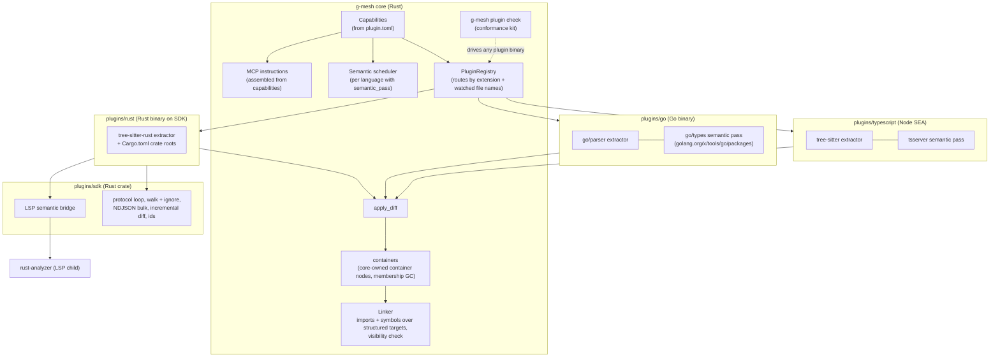
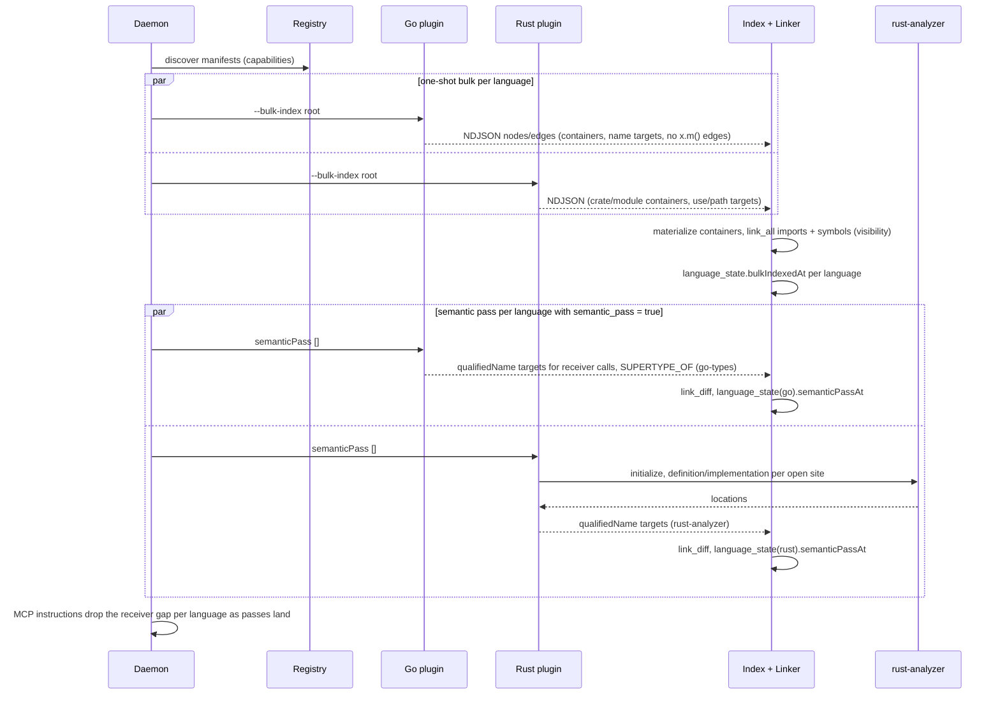

# Multi-language plugins: Go and Rust first, without paying again for language N+1

**Status**: Draft for review (GM-261). Go and Rust are the first two languages
built on this design. C#, C++, Python, Java and Kotlin are planned after them, and
this doc checks the design against them on paper rather than building for them.

## Context & Problem

g-mesh indexes one language. `plugin-modularity.md` made the plugin *mechanism*
multi-language: manifest discovery, lazy per-language processes, one wire model.
But the *graph semantics* the core applies on top are still TypeScript-shaped, and
nothing has tested them against a second language. Reading the core against Go and
Rust (2026-09-15) found the assumptions that would break. The first four are the
ones that decide the design:

- **Cross-file linking is file-addressed.** A plugin marks an unknown symbol with a
  placeholder `<file>#<name>`, and `graph::symbol_links` looks for an *exported*
  symbol of that *bare name* in *that file*. None of the three holds up:
  - a Go package symbol lives in *some* file of a directory;
  - bare names are ambiguous for methods (`Close` exists on many types);
  - `exported` is too coarse, since unexported Go functions are called across the
    files of one package all the time.
- **Imports target one `File`.** `graph::imports` repoints an `IMPORTS` edge onto
  the `File` node at an exact path. A Go import names a package directory, and a C#
  `using` names a namespace, which is no path at all.
- **Receiver calls produce no edge.** `x.foo()` is a documented gap, repeated in
  the MCP server instructions. That is tolerable in TS. In Go and Rust nearly every
  method call has this shape, so `find_callers` on a method would answer almost
  nothing.
- **The semantic layer is hardwired to TS.** `daemon::semantic` calls
  `plugin::BUNDLED_LANGUAGE`, `EdgeSource` is `tree-sitter | ts-compiler` behind an
  SQL `CHECK`, and `meta.semanticPassAt` is a single project-wide flag.
- Smaller gaps:
  - routing is by extension only, so edits to `go.mod`/`Cargo.toml` reach no
    plugin;
  - miss-path heuristics know `index.*` but not `mod.rs`/`lib.rs` or package
    directories;
  - `protocol::conformance` only checks the JSON *shape* of a plugin's output;
  - g-mesh-bench has no Go or Rust corpus.

The requirement is not only Go and Rust working. When C#, C++, Python, Java and
Kotlin arrive, each should cost a plugin rather than another round of core surgery.

## Goals / Non-goals

**Goals**
- Go and Rust plugins that reach TS-level answer quality on the tools' own
  contract: `resolved: true` means right, and a documented gap means a real gap.
  That includes receiver calls, where each language's semantic layer resolves them.
- Core generalizations that are sufficient for all seven languages. Each one is
  justified by a concrete Go or Rust need, and each is checked against the five
  paper languages.
- A plugin SDK and an LSP semantic bridge, so a later language is mostly an
  extractor plus configuration.
- A conformance kit that tests any plugin binary for *meaning*, not only shape.
- Go and Rust corpora in g-mesh-bench, so both plugins are measured the way TS is.
- No regression for TS. This is measured, not assumed.

**Non-goals**
- Cross-language edges (a Go file calling Rust through FFI). A plugin still
  understands only its own language, per `plugin-modularity.md`.
- Building anything for C#, C++, Python, Java or Kotlin now. The multi-file symbol
  model they need is *designed* here (see "Symbols declared in several files") and
  deliberately *not built* until the first of them is.
- Core-side name resolution for every language, in the style of stack-graphs (see
  Options).
- A plugin installer or registry. That stays out of scope as before.

## Constraints

- **Wire and schema changes are hard breaks.** A protocol mismatch fails the load,
  and a schema version bump wipes and reindexes. Both are accepted here, once: one
  protocol bump (v1 → v2) and one schema bump, landed together with the TS plugin
  migrated in the same release. Every user's projects reindex once.
- **Edges never leave their file** in the structural stream. Bulk batches can be
  cut anywhere, and the placeholder handshake exists for exactly that reason. The
  generalization keeps the invariant.
- **Per-file ownership of rows.** A plugin's diff upserts and deletes nodes by id
  for one file at a time. Anything shared across files has to be owned by core,
  never by one plugin's diff.
- **MCP instructions are capped at ~2KB** (Claude Code truncates them), and the
  budget is nearly used. Per-language wording must fit in it.
- **Distribution:** four target triples, built per release. Each plugin written in
  its own language would be its own toolchain times four platforms (.NET AOT, JVM,
  Go, Rust, Node). That cost multiplies with every language.
- Go and Rust developers have their toolchains installed; users of other languages
  may not. Semantic tiers may depend on a toolchain being present. Structural tiers
  may not.

## Options Considered

The decision that shapes everything else is **where cross-file references get
resolved**.

**A. Generalize the placeholder address (chosen).** Keep the handshake: the plugin
emits a placeholder, and core links it against what is actually in the index. The
address gets richer:
- **scope**: a file, or a *logical container*;
- **key**: a bare name, or an exact qualified name;
- **visibility** of the target, sent as data.

A semantic tier (go/types, rust-analyzer) sends exact keys, and a structural tier
sends name keys. TS keeps working as a special case (scope = file, key = name). The
trade-off is that core still owns an addressing contract, so it has to be specified
precisely and enforced by the conformance kit.

**B. Core models scopes and resolves names for every language.** Core would carry a
language-neutral scope graph, the plugins would emit declarations and uses, and core
would resolve. This is the stack-graphs idea, and a language without a semantic
engine would get good references for free. It was rejected on cost. GitHub's
stack-graphs was built for exactly this and never became a general multi-language
solution. The scope rules of seven languages (C++ ADL, Kotlin extensions, Rust
trait resolution) are compilers' work, and every language's real compiler already
does it.

**C. Plugins emit resolved cross-file edges with computed target ids.** Core becomes
a pure store that parks edges whose target has not been indexed yet. Core carries no
addressing convention at all. It was rejected because only a semantic tier knows a
target's file, kind and qualified name well enough to compute its id. The structural
tiers (TS today, Python and C++ without their engines) cannot, so they would need
option A anyway. The id scheme would also become a cross-plugin contract.

**Plugin implementation language.**
- **Go:** the Go plugin is written in Go, because `go/types` gives exact semantics
  in-process with no gopls. Its cost is one duplicated protocol loop (an estimated
  few hundred lines of Go), kept honest by the conformance kit.
- **Everything else:** plugins are written in Rust on a shared SDK:
  - tree-sitter grammars for structure;
  - an LSP bridge for semantics.

  Writing each in its own language was rejected on the distribution constraint.
  gopls through the bridge was the considered alternative for Go: uniform, but it
  needs gopls installed, which Go developers often lack outside an editor.

**Rust semantics.**
- **Chosen: rust-analyzer as an LSP child through the bridge.** The bridge is
  needed for C#, C++, Java, Kotlin and Python anyway, and `rust-analyzer` ships as a
  rustup component.
- **Rejected: in-process `ra_ap_*` crates.** No external binary, but a weekly
  unstable API, a very heavy compile, and nothing any other language reuses.

## Chosen Approach

Five pieces. The first release is the first three, with TS migrated onto them and
no new language. That release alone must show no TS regression on the bench.

1. **Core graph generalization.**
   - Logical containers as core-owned nodes.
   - Structured placeholder targets (scope + key).
   - Visibility as data.
   - An open edge source (tier + engine).
   - Per-language semantic state.
2. **Capability-driven core.**
   - The manifest declares what a plugin can do.
   - Core branches on that, never on a language name: semantic pass, receiver-call
     resolution, watched workspace files, entry-point names, excluded directories.
   - The MCP instructions are assembled from the same declarations.
3. **Conformance kit.** `g-mesh plugin check` runs any plugin against fixtures
   through the real core linker, and asserts meaning as well as shape.
4. **Go plugin** (Go): `go/parser` structure plus `go/types` semantics.
5. **Rust plugin SDK + LSP bridge + Rust plugin** (Rust):
   - structure first;
   - rust-analyzer semantics as a separate release.

Two further pieces are designed but not built:
- **symbols declared in several files**, needed first by C# and C++;
- **per-language bench corpora** beyond Go and Rust.

## Components



| Component | Owns | New / changed |
|---|---|---|
| `protocol::types` | Wire v2: `container`, `visibility`, structured `target`, open `source` | changed, protocol v2 |
| `storage::schema` | `containers`, `placeholder_targets`, `language_state`, `edges.source`/`engine`, `nodes.container`/`visibility` | changed, schema bump |
| `graph::containers` | Materializes container nodes from member declarations; GCs empty ones; parent chain | new |
| `graph::imports` | Links `IMPORTS` onto a `File` *or* a container | changed |
| `graph::symbol_links` | Links structured targets: file/container scope, name/qualifiedName key, visibility check, re-export walk | changed, re-export walk kept |
| `daemon::manifest` | `[plugin.capabilities]`, `[plugin.workspace]` | changed |
| `daemon::registry` | Routes watched workspace file names; per-language reindex | changed |
| `daemon::semantic` | Runs the pass for every language whose manifest declares it; state per language; request timeouts | changed |
| `mcp::mod` | Instructions assembled from the capabilities of the languages present | changed |
| `graph::queries` / `mcp::get_dependencies` | Entry-point names from manifests instead of `index.*` literals | changed |
| `cli::plugin_check` | The conformance kit | new |
| `plugins/sdk` | Rust plugin SDK and LSP bridge | new |
| `plugins/go`, `plugins/rust` | The two plugins | new |
| `plugins/typescript` | Migrated to wire v2, behaviour unchanged | changed |

## Data Model

### Logical containers

A **container** is the unit a language groups declarations into and imports from.
It is a key string namespaced by language:

| Language | Container key | Parent | Imports name it? |
|---|---|---|---|
| TS/JS | none: the file is the scope | none | no, imports name files |
| Go | import path, `github.com/org/repo/pkg` (`pkg_test` for external test files) | none (Go packages are flat) | yes, `import "…/pkg"` |
| Rust | `<crate>::<module path>`, `ripgrep::search::matcher` | enclosing module; crate root has none | yes, `use crate::a::b::*` glob, and path calls `a::b::f()` |
| C# | namespace `System.Collections.Generic`, plus assembly for `internal` | enclosing namespace | yes, `using` |
| C++ | namespace `llvm::sys` (reopenable in any file) | enclosing namespace | no, `#include` names files; `using namespace` names a container |
| Python | module `pkg.sub.mod`; package `pkg.sub` | package | yes |
| Java / Kotlin | package `com.acme.core` (Kotlin: not tied to directories) | none (flat, like Go) | yes, `import a.b.*` |

Every declaration node may carry `container`. **Core, not a plugin, owns container
nodes.** A container has members in many files, so no single file's diff can own
it; see the per-file ownership constraint. Core materializes a node for a key the
first time a member is upserted, and deletes it when the last member goes:

```sql
-- One row per logical container actually present in the index.
CREATE TABLE containers (
    nodeId     TEXT PRIMARY KEY REFERENCES nodes(id) ON DELETE CASCADE,
    language   TEXT NOT NULL,
    key        TEXT NOT NULL,
    parentKey  TEXT,             -- NULL for a root (Go package, crate root, top namespace)
    memberCount INTEGER NOT NULL, -- maintained by apply_diff; 0 => GC
    UNIQUE (language, key)
);

ALTER TABLE nodes ADD COLUMN container TEXT;      -- key, same language as the node
CREATE INDEX idx_nodes_container ON nodes(language, container);
```

A container node is an ordinary `Module` row with `nativeKind = 'container'`, a
`filePath` of `""`, and an id of `hash("container", language, key)`, so plugins and
core compute the same id. Keeping it an ordinary node is what lets
`get_dependencies` walk `File -IMPORTS-> container` edges with no new edge kind.
Its members hang off it by `DEFINES` edges, which core writes alongside the
membership count.

Parents come from the plugin: the member declaration's own `containerParent` field
(see Interfaces). There is no core rule for splitting keys, because `::`, `.` and
`/` mean different things in different languages.

### Visibility

`exported: bool` is replaced on the wire by `visibility`. `exported` stays as a
derived column, so `get_file_outline`'s output does not change.

| `visibility` | Meaning | Examples |
|---|---|---|
| `public` | visible from anywhere | TS `export`, Go capitalized, Rust `pub`, Java/C# `public` |
| `{ "container": "<key>" }` | visible to requesters whose container is `<key>` or a descendant | Go unexported → own package; Rust private → own module; `pub(crate)` → crate root; `pub(super)` → parent; Java package-private; C# `internal` → assembly; Kotlin `internal` → module |
| `file` | visible only within the declaring file | C++ `static` / anonymous namespace; TS non-exported top-level |

Member-level privacy (a `private` field of a class) is **not** modelled. The linker
only ever links top-level and type-member *names* that a structural pass addresses,
and the semantic tiers already answer from the compiler's own rules. Modelling it
would add rows and add nothing a query uses.

### Structured placeholder targets

Placeholder nodes stay `Module` rows with `nativeKind` `pending_symbol`, `reexport`
or `resolved_module`. What used to be packed into `qualifiedName` becomes a row:

```sql
CREATE TABLE placeholder_targets (
    nodeId        TEXT PRIMARY KEY REFERENCES nodes(id) ON DELETE CASCADE,
    scopeKind     TEXT NOT NULL CHECK (scopeKind IN ('file', 'container')),
    scope         TEXT NOT NULL,   -- file path, or container key
    keyKind       TEXT NOT NULL CHECK (keyKind IN ('name', 'qualifiedName')),
    key           TEXT NOT NULL,   -- bare name, '*', 'default', or an exact qualifiedName
    fromContainer TEXT,            -- requester's container, for the visibility check
    fromFile      TEXT NOT NULL    -- requester's file, for 'file' visibility
);
CREATE INDEX idx_targets_scope ON placeholder_targets(scopeKind, scope, key);
```

- **`name` key**: TS's existing contract, used by every structural tier. Only
  visible nodes match. The kind filter still applies: `CALLS` lands only on a
  `Function`, `SUPERTYPE_OF` only on a `Type`. If several match, the edge stays
  unresolved. The re-export walk, `*` and `default` behave as today.
- **`qualifiedName` key**: a semantic tier's answer. It means "this exact
  declaration", so it matches on `(scope, qualifiedName)` only. There is no
  ambiguity to refuse, and it still gets the visibility check. This is what makes
  `T.Close` distinguishable from `U.Close`.
- `resolved_module` imports gain `scopeKind = 'container'`, and `graph::imports`
  links onto a container node as well as onto a `File`.

### Edge source

```sql
-- was: source TEXT CHECK (source IN ('tree-sitter','ts-compiler'))
source  TEXT NOT NULL CHECK (source IN ('syntactic', 'semantic')),
engine  TEXT NOT NULL   -- 'tree-sitter', 'ts-compiler', 'go-parser', 'go-types', 'rust-analyzer', ...
```

The **tier** is the closed set that code and queries branch on. The **engine** is a
free label for diagnostics. A new language needs neither a schema change nor a
protocol change. Migration: `tree-sitter` → (`syntactic`, `tree-sitter`),
`ts-compiler` → (`semantic`, `ts-compiler`). This is moot in practice, because the
schema bump reindexes.

### Per-language index state

```sql
CREATE TABLE language_state (
    language       TEXT PRIMARY KEY,
    bulkIndexedAt  TEXT,
    semanticPassAt TEXT,   -- NULL until that language's whole-project pass has completed
    pluginFingerprint TEXT
);
```

`meta.bulkIndexedAt` / `semanticPassAt` stay as a project roll-up: set when every
present language's row is set. A slow rust-analyzer then does not hold a Go
project's semantic flag hostage, and the "pass still owed" retry in `daemon::mod`
works per language.

### Symbols declared in several files: designed, not built

C++ (`.h` declaration and `.cpp` definition), C# `partial`, Kotlin
`expect`/`actual` and Python `.pyi` stubs all write one symbol in several files. Go
and Rust never need this. TS's merged declarations are same-file and stay in
`declarations`.

- **Chosen shape:** one node per file, plus a new edge kind
  `DECLARATION_OF (declaration node -> defining node)`.
  - The link is made by a `qualifiedName`-keyed placeholder in the symbol's
    container, so no new linker concept is needed.
  - `find_definition` prefers the defining node and lists the others the way it
    lists `declarations` today.
  - `find_references` / `find_callers` aggregate over the group.
- **Rejected:** separating symbol identity from files (a `symbols` table, with nodes
  as declarations). It is cleaner in the abstract, but it rewrites every query and
  breaks per-file diff ownership.

It is built in the first release that adds C# or C++.

## Interfaces

### `plugin.toml` additions

```toml
[plugin]
language = "go"
protocol_version = 2
plugin_version = "0.1.0"

[plugin.spawn]
command = "./g-mesh-plugin-go"

[plugin.languages]
extensions = [".go"]

[plugin.capabilities]
# Core sends semanticPass (per file after a reparse, whole project after a walk)
# only when true. false: core never sends it, and no empty-diff answer is required.
semantic_pass = true
# "resolved": receiver calls (x.foo()) get edges; the MCP instructions do not list
# the receiver gap for this language. "unresolved": they are listed.
receiver_calls = "resolved"
# Whether the structural tier alone resolves receiver calls ("unresolved" here and
# "resolved" above means: resolved once semanticPassAt is set for the language).
receiver_calls_structural = "unresolved"

[plugin.workspace]
# Exact file names (any directory) routed to this plugin. A change triggers a
# per-language reindex, because module paths / crate roots may have moved.
watch_files = ["go.mod", "go.work"]
# Directory names the watcher never routes, matching the plugin's own walk exclusions.
exclude_dirs = ["vendor", "testdata"]
# File or directory names a miss-path lookup treats as a container's entry point.
entry_points = []          # rust: ["lib.rs", "main.rs", "mod.rs"]; typescript: ["index"]
```

Capabilities are read from the manifest rather than the handshake. Routing and
instruction assembly need them before any plugin process exists, and the manifest
is already the startup-time source of truth. Validation follows `read_manifest`'s
hard-failure rule.

### Wire v2 (`protocol::types`, `CURRENT_PROTOCOL_VERSION = 2`)

```rust
pub struct WireNode {
    // ...v1 fields, minus `exported`...
    pub visibility: Visibility,               // replaces `exported`
    #[serde(default, skip_serializing_if = "Option::is_none")]
    pub container: Option<String>,            // container key, if the language has one
    #[serde(default, skip_serializing_if = "Option::is_none")]
    pub container_parent: Option<String>,     // parent key of `container`, sent with members
    #[serde(default, skip_serializing_if = "Option::is_none")]
    pub target: Option<PlaceholderTarget>,    // required iff nativeKind is a placeholder kind
}

#[serde(rename_all = "camelCase")]
pub enum Visibility { Public, File, Container(String) }

pub struct PlaceholderTarget {
    pub scope: TargetScope,                   // { "file": "src/a.ts" } | { "container": "github.com/x/pkg" }
    pub key: TargetKey,                       // { "name": "foo" } | { "qualifiedName": "Server.Close" }
    #[serde(default, skip_serializing_if = "Option::is_none")]
    pub from_container: Option<String>,
}

pub struct WireEdge {
    // ...v1 fields...
    pub source: SourceTier,                   // "syntactic" | "semantic"
    pub engine: String,
}
```

The control messages are unchanged apart from one addition. `fileChanged` and
`semanticPass` keep their shapes, and the `FileChangeDiff` answer is the same diff.

- **New:** `workspaceChanged { filePath }`, a notification. It exists so a plugin
  can drop cached module or crate maps. Core follows it with the per-language
  reindex, so the plugin does not have to answer with a diff.

### Linker contract: what `graph::symbol_links` guarantees

For a placeholder with target `(scope, key, fromContainer, fromFile)` and a usage
edge of kind `K`:

1. **Candidates.**
   - `scope = file`: the nodes whose `filePath = scope`.
   - `scope = container`: the nodes whose `(language, container) = (placeholder
     language, scope)`.
   - Placeholders are always excluded.
2. **Key filter.**
   - `name`: `name = key` and the node is *visible* to the requester (below).
   - `qualifiedName`: `qualifiedName = key`.
3. **Kind filter.** `CALLS` → `Function`, `SUPERTYPE_OF` → `Type`, `REFERENCES` → any.
4. **Result.**
   - Exactly one candidate: repoint the edge and set `resolved = 1`.
   - None under a `name` key: walk the re-exports of `scope` as today (bounded at
     8 hops).
   - Otherwise: leave the edge alone.
5. **Visibility.**
   - `public`: always visible.
   - `file`: visible iff `fromFile = node.filePath` **and the node is looked up in
     a container scope**. In a file scope a `file`-visible node is never a
     candidate (GM-266): a file sees its own unpublished declarations only
     lexically, as direct same-file edges, and the narrowing keeps TS exactly
     equivalent to its old `exported = 1` rule for a placeholder addressed at its
     own file.
   - `container(c)`: visible iff `fromContainer` is `c` or has `c` on its parent
     chain (from `containers.parentKey`).
   - A `qualifiedName` key is checked too, so a semantic tier's mistake cannot link
     a private symbol from outside.

`link_diff` gains one trigger: a node upserted into a container can answer
placeholders waiting on that container, the counterpart of today's
"new export in a file". Building it showed a second one is needed for
`link_all` and `link_diff` to agree: a container that comes into existence
extends the parent chain of every container below it, so the placeholders in
those containers' files are revisited too. `graph::symbol_links`' module doc
has the full contract, including how re-exports apply to a container scope.

### Conformance kit

```
g-mesh plugin check <plugin-dir> --fixture <project-dir> [--expect <expect.toml>]
```

Built in GM-276 as `g-mesh plugins check` (next to `plugins list`; `plugin`
stays accepted as an alias), without `--expect`, which GM-277 adds. The checks
as built, with the evidence each reads and why `semanticPass` diffs are
exempt from the per-file stream rules, are documented in
`core/src/cli/plugin_check/checks.rs` and the README's "Writing a language
plugin" section.

The kit runs the plugin exactly as the daemon does (spawn, handshake, `--bulk-index`,
`fileChanged`, `semanticPass`) against an in-memory index and the real
`apply_diff` + linker. It asserts:

- **Shape:** the v1 checks plus the v2 fields; a placeholder `nativeKind` requires
  a `target`.
- **Stream order:** every edge's `fromId` and same-file `toId` were emitted before
  the edge, and no edge in a file's stream targets another file's node id.
- **Same-file rule:** same-file edges are `resolved: true`, and edges onto
  placeholders are `false`.
- **Id stability:**
  - two bulk runs produce identical id sets;
  - a whitespace-only edit yields an empty diff;
  - `deleteNodeIds` only name ids previously emitted.
- **Ownership:**
  - `DEFINES`/`EXPORTS` run File → symbol;
  - `language` matches the manifest;
  - no plugin emits `nativeKind = 'container'`.
- **Capabilities:**
  - `semantic_pass = false` plugins are never sent the request;
  - `receiver_calls = "resolved"` is backed by the expectations file actually
    containing receiver calls.
- **Expectations** (`expect.toml`, per language), checked after linking. Each is
  answered by the same query code the MCP tools use:

  ```toml
  [[callers]]
  symbol = "Server.Close"
  expect = ["cmd/main.go:run", "server_test.go:TestClose"]
  [[implementations]]
  symbol = "io.Closer"            # project-local interface in the fixture
  expect = ["Server", "Conn"]
  [[imports]]
  file = "cmd/main.go"
  expect = ["container:github.com/x/app/server"]
  ```

The same fixtures run in core's CI for every bundled plugin. They are the
per-language acceptance test, replacing "the TS integration tests happen to cover
it".

### Plugin SDK (`plugins/sdk`, Rust crate)

```rust
pub trait Extractor: Send + Sync {
    const LANGUAGE: &'static str;
    /// One file, parsed from `source`. Pure: no filesystem access beyond `ctx`.
    fn extract(&self, ctx: &ProjectContext, path: &RelPath, source: &str) -> FileGraph;
    /// Workspace model (crate roots, module map). Rebuilt on workspaceChanged.
    fn load_project(&self, root: &Path) -> anyhow::Result<ProjectContext>;
}

pub struct FileGraph {
    pub nodes: Vec<WireNode>,
    pub edges: Vec<WireEdge>,
    /// Use sites the structural tier could not resolve (receiver calls, ambiguous
    /// paths): position + kind. Kept by the SDK in memory and handed to the
    /// semantic bridge. Never sent to core.
    pub open_sites: Vec<OpenSite>,
}

pub trait SemanticEngine {
    /// Answer open sites for `files` (empty = all). Returns upgrades as a diff:
    /// qualifiedName-keyed placeholders plus `source = semantic` edges, and
    /// retractions of the syntactic edges they replace.
    fn answer(&mut self, files: &[RelPath], index: &SdkIndex) -> anyhow::Result<FileChangeDiff>;
}

pub fn run<E: Extractor>(extractor: E, semantic: Option<Box<dyn SemanticEngine>>) -> !;
```

- **What the SDK owns:**
  - the handshake and control loop;
  - `--bulk-index` streaming;
  - the project walk (`ignore` crate: `.gitignore` plus the manifest's
    `exclude_dirs`);
  - the per-file cache and id-keyed incremental diff (the TS plugin's
    `incremental.ts` logic);
  - id hashing;
  - placeholder builders;
  - a `#[test]` helper that runs `g-mesh plugin check` against a fixture.
- **`LspBridge: SemanticEngine`:**
  - spawns the configured server (command from the manifest's
    `[plugin.semantic] command`);
  - runs `initialize`, `didOpen`/`didChange` from the SDK's file cache;
  - asks:
    - `textDocument/definition` at each open site;
    - `textDocument/implementation` on each trait/interface node;
    - `callHierarchy/incomingCalls` only where definition is insufficient;
  - maps each returned location to a node by position from `SdkIndex` and emits a
    `qualifiedName` target.
  - Budgets: per-request timeout, a max number of sites per pass, and
    readiness-waiting (see Failure Modes).

### Go plugin (`plugins/go`)

- **Structure:** `go/parser` with `parser.ParseComments | parser.AllErrors`.
  - It returns a partial AST on syntax errors, so `hasSyntaxErrors` can be set.
  - It is per file and needs no toolchain.
  - Package names come from the `package` clause, and import paths from `go.mod`'s
    `module` plus the directory (`go.work` for multi-module repos).
  - Every declaration gets `container = <import path>`; `_test.go` files of
    `package x_test` get `<import path>_test`.
  - Visibility: capitalized → `public`, otherwise `container(<import path>)`.
- **qualifiedName:** `F`, `T`, `T.M` (pointer and value receivers normalize to `T.M`,
  with `nativeKind = "method"` and the receiver kind in `signature`). Interface
  methods are `I.M`.
- **Structural edges:**
  - bare calls and same-package references → a `name`-keyed placeholder in the own
    container, `resolved: false`, because the target may be in a sibling file;
  - same-file hits → direct and `resolved: true`;
  - `pkg.F()` → a placeholder scoped to the imported container;
  - `x.M()` → an open site, not an edge.
- **Semantics:** `golang.org/x/tools/go/packages` with `NeedTypes | NeedTypesInfo |
  NeedSyntax`, run over the project's own packages.
  - It needs the `go` binary on `PATH`. Without it the plugin logs once and
    degrades to structural.
  - Whole-project pass: `types.Info.Uses` / `Selections` resolve every open site to
    an exact declaration. The result is a `qualifiedName` target in the declaring
    package's container.
  - Interfaces: `types.Implements` over (interfaces × named types) within project
    packages → `SUPERTYPE_OF type → interface` edges, `semantic`/`go-types`.
  - Per-file pass: re-check the file's package, reusing the loaded dependency
    packages. Dependents' edges into a changed package are refreshed when they are
    next checked, the same staleness TS accepts today.
- **Distribution:** a static binary per target via `GOOS`/`GOARCH` cross-compile,
  `CGO_ENABLED=0`. No native runner and no embedded runtime - `.github/workflows
  /release.yml` still builds each target on its own runner (the JS/TS plugin and
  the Rust binary both need to), but unlike those two, the Go binary could be
  built for all four targets from any single one of those runners; it stays in
  the same per-target loop only because that is where `scripts/build-targets.sh`
  already runs (`scripts/bundle-go-plugin.sh`, called there alongside
  `scripts/bundle-plugin.sh`). See "Implementation notes (GM-279)" point 6
  below for the per-target manifest this generates to close the Windows
  binary-naming gap the dev-checkout build leaves open.

#### Implementation notes (GM-279)

The first Go plugin release is a scaffold: the wire v2 control loop, the
`--bulk-index` NDJSON stream, the project walk and the id scheme, all proven
against `g-mesh plugin check` end to end - but the extractor emits `File`
nodes only, no symbols and no edges. `go/parser` structure (real declarations,
containers, `DEFINES`/`EXPORTS`) is GM-280; `go/types` semantics (the pass
this scaffold already answers, honestly, with nothing) is GM-281. Six
decisions this task had to settle rather than infer, recorded here so GM-280/
GM-281 do not have to re-derive them:

1. **`semantic_pass = true` from the first release, with no marker written.**
   The manifest declares the capability now (not once GM-281 lands): a plugin
   that will grow a real semantic tier should not lock in "core never asks"
   before that tier exists, and this plugin already answers every
   `semanticPass` honestly - an empty diff, because there is nothing yet to
   resolve. The conformance kit's semantic-engine marker
   (`G_MESH_PLUGIN_CHECK_MARKER_DIR`/`semantic-engine-started`, `session.rs`'s
   own contract) is deliberately **not** written by this scaffold: there being
   no engine to start is not the same claim as "the engine started lazily",
   and writing the marker with nothing behind it would make
   `capabilities.semantic-engine-lazy` either vacuously pass or fail on a
   technicality unrelated to laziness. The kit reports this correctly today -
   `SKIP ... not instrumented` - which is the honest answer until GM-281
   spawns/loads `go/packages` and writes the marker at that moment, the same
   way the TS plugin's `semantic.ts` does for `tsserver`.
2. **Id scheme reproduced field-for-field from `extract.ts`, checked against
   real TS output.** `nodeIdFor`/`edgeIdFor` in `plugins/go/ids.go` hash the
   exact same space-joined strings `plugins/typescript/src/extract.ts`'s
   `nodeIdFor`/`edgeIdFor` do (sha256, hex, first 32 characters). `ids_test.go`
   asserts against values computed by actually running that TS code
   (`node -e '...'` with the functions copied in verbatim, Node v20.6.1 - the
   transcript is in this task's own completion report), not recalled from
   memory or re-derived independently in Go.
3. **The walk's `.gitignore` support is hand-rolled, not a dependency.**
   `plugins/go/ignore.go` translates each pattern to a regexp by hand -
   literal segments, `*`/`?` within a segment, `**` across segments, a
   directory-only trailing `/`, an anchoring leading or embedded `/`,
   negation, later-line-and-later-layer-wins - the same subset
   `ignorePolicy.ts`'s own `ignore` dependency is exercised for by this
   repo's fixtures, and the same tier of coverage small Go gitignore
   libraries offer. Chosen over a dependency so `plugins/go/go.mod` stays at
   zero requirements for a scaffold whose only job is proving the wire
   contract; `ignore.go`'s own doc comment has the full trade-off, including
   the heavier alternative (go-git's `gitignore` sub-package) considered and
   rejected. Symlink handling (`plugins/go/symlinks.go`) matches
   `symlinks.ts`'s guard exactly: followed, not skipped, under a guard that
   refuses a cycle, a second path onto an already-claimed real location, and
   an escape outside the project root - proven by `walk_test.go`'s own cycle/
   dangling-link/claimed-twice cases.
4. **File nodes only, `visibility: "file"` - not `"public"`.** GM-279's own
   task text said `visibility public` for the File node; this repo's one
   concrete example of a Go plugin's node
   (`core/tests/fixtures/valid_v2.ndjson`) uses `"file"`, matching the TS
   plugin's own convention (`extract.ts`'s `addNode`: a node is file-visible
   unless something marks it exported, and nothing ever marks the File node
   itself exported - only what it *defines* can be public). The golden
   fixture was treated as authoritative over the task's own prose.
5. **Unknown methods and `workspaceChanged` never crash, mirroring
   `index.ts`'s own gaps.** A method this plugin does not recognize is
   logged and dropped, never answered - even when it carried an id - matching
   `plugins/typescript/src/protocol.ts`'s `parseControlEnvelope` refusing
   anything outside its four known methods the same way. `workspaceChanged`
   *is* recognized (the TS plugin predates it and has no workspace files to
   watch at all), but this scaffold caches nothing at the workspace level -
   no module/crate map exists yet to invalidate - so it is a no-op beyond a
   log line. GM-280/GM-281 are expected to give it real work once there is a
   cached package map to drop.
6. **Distribution for a dev checkout: a prebuilt binary via `core/build.rs`,
   not `go run ./...`.** `go run` recompiles the whole module on every single
   spawn - and the daemon spawns this plugin repeatedly, including one
   one-shot process per `--bulk-index` call - so it would mean a full compiler
   invocation on the hot path of a reindex. `core/build.rs` now builds
   `plugins/go` into `plugins/go/g-mesh-plugin-go` the same best-effort way it
   already builds the TS plugin's `dist/` (a `cargo:warning`, not a build
   failure, when no Go toolchain is on `PATH`), so `cargo build`/`cargo
   test`/`g-mesh plugins check`/`g-mesh plugins list` all work from a fresh
   checkout with nothing extra to run by hand. `plugin.toml`'s `command =
   "./g-mesh-plugin-go"` has no `.exe` suffix, so this only produces a
   spawnable binary on macOS/Linux today; Windows naming was left to GM-283
   (distribution), which owns per-target binary naming for the release
   matrix - resolved there (see "Distribution" above and
   `scripts/bundle-go-plugin.sh`'s own header comment) by generating a
   separate, per-target manifest for the archive rather than by editing this
   checked-in one: the archive's `plugin.toml` is derived from this file with
   only its `command` line rewritten to the binary actually staged beside it
   (`g-mesh-plugin-go.exe` for the Windows target), so the dev-checkout
   contract above is unchanged and the two manifests cannot drift apart on
   every other field. Verified before relying on it: `go build -o
   g-mesh-plugin-go .` with `GOOS=windows` does **not** append `.exe` on its
   own when `-o` names the output explicitly (only when `-o` is omitted), so
   the rewrite is required, not cosmetic - and separately, Rust's own
   `std::process::Command` resolver on Windows (`resolve_exe` in
   `library/std/src/sys/process/windows.rs`) would likely have tolerated the
   unmodified name too (it tries `<path>.exe` first, then falls back to the
   literal path, which Windows can execute directly via its full path
   regardless of extension), but a release archive should not depend on that
   fallback when naming the file correctly costs one generated manifest.

#### Implementation notes (GM-280)

GM-280 replaced the scaffold's File-node-only extractor with the real
`go/parser` structural tier: declarations, containers, visibility,
`DEFINES`/`EXPORTS`, the three placeholder shapes, open sites and an
id-keyed incremental diff. `go/types` semantics stay GM-281's; the semantic
pass still answers every request with an empty diff. Eight decisions this
task had to settle rather than infer, recorded here so GM-281/GM-282 do not
have to re-derive them:

1. **Local scope is tracked by the walk itself, never read off the AST.**
   `go/ast`'s `Object`/`Scope` fields look like they answer "is this name
   local", and they are both deprecated *and* wrong for this: the parser
   resolves names with no type information, and under `AllErrors` whatever
   it managed is partial in a way nothing flags. So `plugins/go/scope.go`
   builds the chain from the declarations the walk actually sees, which
   behaves identically on a complete and on a partial AST. A name the chain
   binds is dropped without ever asking what it is bound to - parameters,
   named results, receivers, type parameters, `:=`, local `var`/`const`/
   `type`, closure parameters, `if`/`for`/`switch`/`select` init bindings,
   type-switch bindings and range variables. Statements are walked in
   source order and a name is bound at the point it is declared, so
   `helper := helper()` still reads the package-level `helper` on the
   right. Labels are not tracked at all but *skipped* (a `LabeledStmt`'s
   label and a `BranchStmt`'s label are never visited), which is exact
   rather than approximate: a label lives in its own namespace and can
   never denote a package symbol. Ambiguity resolves the same way
   everywhere in this tier - toward the missing edge. The two places it
   bites are a composite-literal key that is a bare identifier (a struct
   field name and a map key are the same syntax, so it is skipped; a key
   that is not a bare identifier is unambiguous and is walked) and a
   selection through a value, which becomes an open site.
2. **Dot, blank and aliased imports, each decided.** An **alias** binds the
   alias and changes nothing else. A **blank** import binds nothing and
   still gets its placeholder and `IMPORTS` edge - the dependency is the
   only thing such an import states, and `get_dependencies` would be wrong
   to omit it. A **dot** import binds every exported name of another
   package into this file invisibly, and the set of those names is exactly
   what a structural tier cannot see; so a file containing one emits **no
   own-container placeholders at all**, keeping only what stays exact
   (direct same-file hits, which are lexical, and qualified `pkg.F()` uses
   through other imports, which name their container). Guessing the other
   way would produce a wrong edge every time the name really came from the
   dot import and the own package happened to declare one too. The name an
   unaliased import binds is guessed from the path's last segment, with
   major-version suffixes handled (`.../v2`, `gopkg.in/yaml.v2`); a wrong
   guess degrades to an open site, never to a wrong edge.
3. **Method sets are not modelled, only declarations.** `func (s *Server)
   Close()` and `func (s Server) Close()` both become `Server.Close` with
   `nativeKind = "method"` and the receiver kind in the printed signature;
   Go forbids declaring both, so the normalization can never merge two
   distinct declarations. A generic receiver normalizes the same way
   (`*Stack[T]` → `Stack`). An interface method is `I.M`,
   `nativeKind = "interface_method"` - a *declaration*, never an
   implementation claim. **Struct embedding promotes methods, and nothing
   structural says so**: an embedded field is walked as an ordinary type
   reference and no promoted method is invented. Interface satisfaction is
   the same case: Go's interfaces are structural, so no `SUPERTYPE_OF`
   edge exists at this tier at all, including for the `var _ I = (*T)(nil)`
   idiom, which does state it syntactically but is one spelling among
   several. Both belong to GM-281's `types.Implements` / method-set pass.
4. **`containerParent` is always absent, and core is fine with it.** Go
   packages are flat (this doc's own Logical containers table). A container
   with no parent yields an empty `parent_chain`, which makes Go's
   `container(pkg)` visibility exactly "the same package and nothing else"
   - exactly Go's own rule for an unexported name. GM-265's gap rule
   (an ancestor with no members truncates the chain) cannot bite here,
   because Go has no way to produce an intermediate container at all. This
   was verified rather than assumed: the fixture declares `helper`,
   unexported, in two different packages, and `plugins/go/conformance/
   expect.toml` asserts each one's caller set is exactly its own package's.
5. **`package main`, two packages in one directory, and generated files.**
   `main` is *not* special: it gets the ordinary directory-derived import
   path (`github.com/example/app/cmd`), which is what `go list` calls it
   too, so two `main` packages in one repository get two containers instead
   of colliding on the name. An external test package (`package x_test`) is
   Go's one legal two-packages-in-one-directory case and gets
   `<import path>_test`, keyed off the *package clause* rather than the file
   name (Go reserves that suffix for external test packages); an *internal*
   test file is an ordinary member of the package it tests, which is what
   lets it reach unexported symbols. Two packages in one directory that are
   not a test pair is illegal Go but reachable on disk, and both land in the
   same container key - the same answer `go list` gives before it reports
   the error, with a bounded consequence (a name declared in both becomes
   ambiguous and core refuses to link it). **Generated files are indexed
   like any other**: they are real, compiled, callable code, and dropping
   them would make `find_callers` silently incomplete for everything they
   call. Whether one is *interesting* is a query's question, and a
   repository that considers generated output not-source already says so in
   `.gitignore`, which the walk honours.
6. **`init` is kept, and disambiguated in `nativeKind`.** A package may have
   any number of `func init()`, and so may one file, so they collide on
   qualifiedName and therefore on node id. Skipping them was rejected: an
   `init` body is ordinary code making ordinary calls, and with no node to
   hang them on every one of those calls would lose its caller. So the first
   `init` of a file is `nativeKind = "init"`, the second `"init#1"`, and so
   on in source order - `nativeKind` participates in the node id, so the ids
   are distinct and stable as long as the order of a file's inits is (adding
   one at the end changes nothing about the ones before it). Two inits in
   one file share a qualifiedName and are therefore ambiguous to any name
   lookup, which is correct: nothing in Go can name an `init` to call it.
7. **Build constraints are indexed, every alternative.** `//go:build` and
   `_windows.go` change nothing structurally - a node id carries the file
   path, so `sys_windows.go`'s and `sys_linux.go`'s `Platform` are two
   distinct nodes that never collapse. GM-281's `go/packages` pass only ever
   type-checks the host `GOOS`/`GOARCH`, so files excluded by the host's
   constraints keep this structural graph and receive no semantic upgrade -
   this doc's "Go build constraints" failure mode, documented rather than
   hidden.
8. **The workspace model is parsed by hand, and `workspaceChanged` now has
   real work.** `plugins/go/workspace.go` reads every `go.mod` in the tree
   plus `go.work`'s `use` directives, and takes the union: a `go.work` is not
   required for a multi-module repository (nested `go.mod` files alone make
   one), and a workspace may name a directory the walk would skip. A
   directory belongs to the *innermost* module containing it, so a nested
   module owns its own subtree. `golang.org/x/mod/modfile` was rejected to
   keep `plugins/go/go.mod` at zero requirements (GM-279's decision 3, same
   trade-off), and `go list -m` was rejected because it would make the
   *structural* tier depend on a toolchain, which this doc's Constraints
   forbid. With no `go.mod` anywhere the container key falls back to the
   project-relative directory, which still links same-package uses across
   one directory's files and can never match an import specifier - the right
   failure, since a directory with no module is not importable in Go either.
   `workspaceChanged` reloads that model and drops the whole per-file cache,
   because a cached graph carries the old container keys inside its nodes.

Two things GM-280 deliberately left to its successors. The **open sites**
(`x.M()` receiver calls and value field accesses) are collected per file in
plugin memory with the position, the selected name and the enclosing
symbol/caller ids, and never sent to core - GM-281 consumes them.
`plugins/go/conformance/expect.toml` is **minimal on purpose**: GM-282 owns
the full Go expectations file, and the entries there now exist only to prove
GM-280's own end-to-end claim (that a container-scoped placeholder is an
address core resolves) with a comparison that was shown capable of failing.

### Rust plugin (`plugins/rust`, on the SDK)

- **Structure:** tree-sitter-rust.
  - Crate roots come from parsing `Cargo.toml` (`[lib] path`, `[[bin]]`, the
    `src/lib.rs`/`src/main.rs` defaults, workspace `members` globs) with the `toml`
    crate, and do not invoke cargo.
  - Module tree: `mod foo;` → `foo.rs` | `foo/mod.rs` | `#[path]`; inline
    `mod foo { }` → same file, child container.
- **Container:** `<crate>::<module path>`. Visibility: `pub` → `public`,
  `pub(crate)` → the crate root, `pub(super)` / `pub(in path)` → that module,
  private → the own module.
- **qualifiedName:**
  - `f`, `T`, `T::m` for inherent impls;
  - `T::m` with `nativeKind = "trait_impl_method"` for `impl Trait for T`;
  - `Trait::m` for trait declarations;
  - `macro_rules!` → `Function`, `nativeKind = "macro"`.
- **Structural edges:**
  - `use a::b::C` → a name placeholder in container `a::b`;
  - `use a::b::*` → a container import;
  - `pub use` → a `reexport`;
  - path calls `a::b::f()` → a container-scoped placeholder;
  - `Self::f()` / `self.f()` inside an impl → the impl type's method (like TS
    `this`);
  - `x.m()` → an open site;
  - `impl Trait for T` → `SUPERTYPE_OF T → Trait` (subtype → supertype, as
    `find_implementations` expects).
- **Documented structural gaps:** macro-generated items, `cfg`-gated alternatives
  (all are indexed, none is chosen), and trait-method dispatch through generics.
- **Semantics:** a separate release, rust-analyzer via `LspBridge`.
  - It answers open sites and `implementation` for traits, and sees macro
    expansions.
  - It needs `rust-analyzer` on `PATH` or through rustup; without it, structural
    only.
- **Distribution:** a cargo binary in the same workspace as core, built by the
  existing native release matrix.

### MCP instructions

The fixed text keeps its current rules. The receiver-call gap sentence is generated
from the languages present in the index and their `receiver_calls` state:

- **No present language lists the gap:** the sentence is omitted.
- **Some languages list it:** "(1) a method call through a variable receiver
  (`x.foo()`) produces no edge **in TypeScript and Rust** …". Rust is listed until
  its semantic pass has completed (`language_state.semanticPassAt`).

The builder asserts the byte budget in a unit test over the worst case: every
bundled language listed. The wording is deliberately not fixed here. GM-262 carries
the measured numbers and every consideration, and the budget is checked once the
builder exists:
- today's string is 1804 bytes against a ~1900-byte working ceiling;
- the receiver clause alone is 269 bytes;
- there is a fallback wording if seven language names do not fit;
- truncation order, mid-session staleness, and the bench snippet-drift guard.

### Plugin memory limit (`[plugin] memoryLimitMb`)

```toml
# ~/.g-mesh/projects/<hash>/config.toml - the per-project file that already holds
# idleTimeoutMinutes (GlobalConfig has no [plugin] section; not adding one)
[plugin]
idleTimeoutMinutes = 60     # unchanged
memoryLimitMb = 4096        # optional; absent (the default) = no limit, idle sleep only
```

- **Off by default.** Absent means exactly today's behaviour: a plugin is only put
  to sleep after `idleTimeoutMinutes` without requests.
- **When set,** idle sleep keeps working, and the limit is enforced alongside it.
  - It applies to **each language plugin's process tree separately**: the plugin
    plus its children, so tsserver, rust-analyzer and a language server behind the
    LSP bridge all count against their plugin.
  - It is one number for every language. A per-language override is not built,
    because a user who needs one has not appeared yet.
  - `config::PluginConfig` gains `memory_limit_mb: Option<u64>`. `g-mesh config`
    (the wizard) offers it next to the idle timeout, with empty meaning off.
- **Enforcement.**
  - The supervisor samples the tree's resident memory on the same timer that already
    drives idle-sleep checks.
  - Over the limit, it puts that plugin to sleep through the existing
    `sleep_now(reason)` path, with the reason naming the limit and the measured
    figure, and suspends semantic passes for that language.
  - The next `fileChanged` wakes the plugin for structural work only. Core does not
    send `semanticPass` to a suspended language, and a plugin starts its semantic
    engine lazily on the first `semanticPass` (a conformance-kit check). So the
    engine that blew the limit is not immediately reloaded into a wake → load →
    over-limit loop.
- **The suspension lasts until the daemon restarts** or the config changes. It is
  reported by `g-mesh status` per language. What the semantic tier had already
  committed stays in the index. `language_state.semanticPassAt` is left as it was:
  if the pass never completed, the receiver gap stays listed for that language, so
  the instructions do not overclaim.

#### Implementation notes (GM-274)

Six decisions this task had to settle rather than infer, recorded here so a
later change does not have to re-derive them:

1. **Sampling without shelling out: `sysinfo`, not hand-rolled platform code.**
   `core::daemon::memory::process_tree_rss_mb` uses the `sysinfo` crate
   (`default-features = false, features = ["system"]` - see the dependency
   comment on it in `core/Cargo.toml` for the full weighing) rather than
   `libproc`/`proc_pidinfo` on macOS, `/proc/<pid>/status` on Linux and
   `Toolhelp32`/`GetProcessMemoryInfo` on Windows by hand. The trade is
   correctness-per-effort, not dependency aversion: this repo already
   hand-rolls the *much smaller* unix/libc-vs-windows-sys split in
   `src/process.rs` (three lines of behaviour each: is this pid alive, kill
   it), but resident memory of a whole process tree on three platforms is a
   different order of surface - one already-vetted crate against three
   bespoke FFI surfaces this project would then have to keep correct with no
   CI runner exercising all three during ordinary development. Windows is
   `["system"]`-supported by `sysinfo` too, so sampling is not expected to be
   a hard no-op there - but this daemon's Windows transport is named pipes
   rather than the socket every other platform uses, and CI is the only place
   any of this has been exercised; verified locally on macOS only (see this
   task's own completion report for what that leaves unverified).
2. **Descendants are walked fresh, every sample.** No child-pid list is
   cached anywhere - `process_tree_rss_mb` takes one whole-system snapshot per
   call and walks parent → children links down from the plugin's own pid. A
   semantic engine a plugin starts lazily (rust-analyzer, tsserver - see this
   doc's own "a plugin starts its semantic engine lazily on the first
   `semanticPass`" note above) is caught by the very next sample once it
   exists, with nothing to invalidate.
3. **Sampling interval = the existing idle-check tick**, unchanged by this
   task: `daemon::lifecycle::IdleTimeouts::tick` - a quarter of the shorter
   configured idle timeout, clamped to [50ms, 30s], which is a flat 30s under
   production defaults (`plugin.idleTimeoutMinutes` default 1h).
   `PluginRegistry::check_memory_limits_all` runs on that same tick, right
   alongside `sleep_if_idle_all`. **Open question, not solved here**: a spike
   that crosses `memoryLimitMb` and is gone again (or the plugin crashes)
   before the next tick samples it is invisible to this mechanism - it is a
   ceiling on *sustained* growth (a cold `rust-analyzer`/`go/packages` load
   that keeps climbing), not a guard against a transient spike. A tighter
   interval, or sampling on a different trigger, is future work.
4. **"Until the daemon restarts or the config changes" is honestly just
   "until it restarts".** `config::read_project_config` is read once, at
   `daemon::run` startup, and nothing in this daemon hot-reloads
   `config.toml` while it is running - a `memoryLimitMb` edit takes effect on
   the next start, the same as every other `[plugin]`/`[daemon]` setting
   already does. So "or the config changes" describes a *coincidence*
   (whoever edited the config also happens to restart the daemon to pick it
   up), not a second, independent trigger this implementation watches for.
5. **Suspension lives in memory, per supervisor, not in the index.**
   `daemon::lifecycle::PluginSupervisor` gets a `semantic_suspended:
   AtomicBool`, set once by `check_memory_limit` and never cleared for that
   supervisor's lifetime - a restart clears it for free by simply not
   carrying it forward (a fresh supervisor starts unsuspended, exactly as it
   starts awake). Both gates route through this one flag: the per-file gate
   (`PluginProcess::apply_file_change`/`ensure_fresh` now take a
   `semantic_suspended: bool` parameter, ANDed with the manifest's own
   `capabilities.semantic_pass`) and the whole-project scheduler
   (`PluginSupervisor::semantic_pass`, which both
   `daemon::semantic::run_with_registry`/`run_once` and
   `daemon::workspace_reindex` call through) check it before doing anything
   else, so neither caller needs to know suspension exists.
6. **`g-mesh status` learns suspension the same way it learns everything
   else about a daemon: off disk, never by asking a live one a question**
   (see `cli::status`'s own module doc). The mechanism is a
   `plugin-<language>.suspended` marker file next to that language's own
   `plugin-<language>.pid` (`daemon::registry::plugin_suspended_marker_file_name`),
   containing the human-readable reason `check_memory_limit` built. It is
   written the moment a language is suspended and outlives that language's
   pid file (which idle-sleep's own `put_to_sleep` path already removes) -
   deliberately independent of the pid-file listing, since a suspended
   language has no live pid by the time anyone runs `status`. It is cleared
   in exactly the two places a restart is observable from outside the daemon
   process: `daemon::run` startup (right beside the existing stale-socket
   clear, under the same singleton-lock guarantee) and `cli::stop`'s own
   state-file cleanup (once the core is confirmed not listening).

## Data Flow

### Cold start in a mixed Go + Rust repo



### Editing a Go file

`fileChanged(a.go)` → structural diff (nodes, name targets, removed open sites) →
`apply_diff` → container membership updates → `link_diff` → `semanticPass([a.go])`
→ re-check the package → upgrade diff → `link_diff`.

An edit to `go.mod` goes `watch_files` → `workspaceChanged` → per-language reindex:
delete that language's rows, bulk, link, semantic.

## Failure Modes & Edge Cases

- **Semantic engine missing** (no `go` binary, no `rust-analyzer`): the plugin logs
  once and answers `semanticPass` with an empty diff. The receiver gap stays in the
  instructions for that language, because `semanticPassAt` is never set. The
  structural graph is complete and honest.
- **Semantic engine hangs or is slow.** Today a request with no answer blocks that
  language's stream forever: `watcher::apply` has no read timeout. The fix:
  - per-request timeouts, sized per method (fileChanged short, whole-project
    semanticPass long);
  - on timeout the supervisor restarts the plugin through the existing
    crash-recovery path, and the language's `semanticPassAt` stays unset;
  - the other languages are unaffected, because streams are per language.
- **rust-analyzer not ready.** A cold rust-analyzer load of a large workspace takes
  minutes and answers `definition` with nothing while it loads. The bridge waits for
  the server's progress end (`$/progress` for indexing) before asking, within the
  pass timeout. An empty answer before readiness is never recorded as "no target".
- **Container key collisions across languages** are impossible, because keys are
  unique per `(language, key)`. Within a language, two Go modules vendoring the same
  import path are excluded by `exclude_dirs = ["vendor"]`.
- **A container whose last member file is deleted** is GCed by `memberCount`. Edges
  into it go with it, and importers' placeholders come back on their next reindex,
  the same deliberate non-eager behaviour as `graph::imports` for deleted files.
- **Go build constraints** (`_windows.go`, `//go:build`): go/packages type-checks for
  the host GOOS/GOARCH. Excluded files keep their structural graph and get no
  semantic upgrade. This is documented, not hidden.
- **Rust `cfg`:** the structural tier indexes every alternative, and rust-analyzer
  resolves under the default features. A caller may therefore see a callee defined
  under an inactive `cfg`.
- **Memory on large repos:** go/packages over a Kubernetes-sized repo and
  rust-analyzer over a large workspace both take GBs.
  - **By default** only idle sleep applies, as today.
  - **With `memoryLimitMb` set,** a plugin tree over the limit is put to sleep and
    its language's semantic passes are suspended until the daemon restarts (see
    "Plugin memory limit"). The structural graph keeps updating, and the receiver
    gap stays honest.
  - The bench corpora are chosen at medium size, so the limit is exercised by a
    test with an artificially low value, not by the corpora.
- **Receiver calls with no semantic tier** (Rust before its semantic release):
  - no edge is emitted, never a guess;
  - `find_callers` pages for a method carry the documented gap;
  - nothing claims completeness it does not have.
- **TS migration regression:** the risk that the v2 rewrite changes TS answers. It
  is guarded three ways:
  - TS integration tests unchanged and passing;
  - a TS `expect.toml` fixture in the conformance kit;
  - a g-mesh-bench token-economy sweep on both TS corpora against the 2.12.0
    baseline, with the rep count justified from those tasks' variance.

## Paper stress test: languages #3–#7

| | C# | C++ | Python | Java | Kotlin |
|---|---|---|---|---|---|
| **Container** | namespace, assembly for `internal` ✓ | namespace (reopenable) ✓ | module / package ✓ | package ✓ | package (not dir-bound) ✓ |
| **Visibility** | public / internal (assembly) / file-less private ✓ | `static` / anon ns → `file` ✓ | none, `_` convention → `public` ✓ | public / package-private ✓ | public / internal ✓ |
| **Imports** | `using` → container ✓ | `#include` → file ✓; `using namespace` → container ✓ | `import a.b` → container; `from x import y` → name target ✓; `import *` → re-export-like ✓ | `import a.b.C` → name target; `.*` → container ✓ | same as Java; import aliases → re-export ✓ |
| **Symbol in several files** | `partial` → needs `DECLARATION_OF` (designed) | header/impl → needs `DECLARATION_OF` (designed) | `.pyi` stubs → `DECLARATION_OF` (optional) | no | `expect`/`actual` → `DECLARATION_OF` |
| **Overloads** | yes → `declarations` + `toDeclaration` ✓ (semantic tier required) | yes, plus templates → semantic required | no | yes ✓ | yes ✓ |
| **Receiver calls** | semantic (Roslyn/csharp-ls via bridge) | semantic (clangd; needs `compile_commands.json`) | semantic (pyright via bridge); dynamic → honest gap | semantic (jdtls) | semantic (kotlin-lsp) |
| **Workspace files** | `*.csproj`, `*.sln` → **needs glob, not exact name** ⚠ | `compile_commands.json`, `CMakeLists.txt` ✓ | `pyproject.toml`, `setup.cfg` ✓ | `pom.xml`, `build.gradle(.kts)` ✓ | `build.gradle.kts` ✓ |
| **Extension routing** | `.cs` ✓ | `.h` shared with C and ObjC → **manifest collision rule is a hard error** ⚠ | `.py` ✓ | `.java` ✓ | `.kt`, `.kts` ✓ |

What the paper test changes in the design now:
- **`watch_files` accepts globs** (`*.csproj`), not only exact names. This is cheap
  to build in the first release, so it is built.
- **`.h` ownership.** One C/C++/ObjC plugin will claim `.h`, rather than three
  plugins colliding. This is recorded as the intended resolution, so the
  hard-failure rule on shared extensions stays.

What it leaves for later, deliberately:
- `DECLARATION_OF`, built with C# or C++;
- the C++ preprocessor and include paths, which belong to clangd and
  `compile_commands.json`, and not to core;
- Python's dynamic dispatch, which stays a documented gap even with pyright.

## Rollout

One protocol bump and one schema bump, so every existing project reindexes once, in
the first release.

| Release | Content | Exit criterion |
|---|---|---|
| R1 core generalization | wire v2, schema (containers, targets, visibility, source tier, language_state), capability manifest, per-language semantic scheduler + timeouts, `memoryLimitMb`, generated instructions (GM-262), `watch_files` globs, `g-mesh plugin check`, TS plugin migrated | TS integration + conformance green; bench on both TS corpora shows no regression vs 2.12.0 |
| R2 Go | Go plugin (structure + go/types), Go fixture `expect.toml`, release matrix cross-compile, Go corpus in g-mesh-bench | conformance green; bench tasks on the Go corpus (lookup, callers incl. receiver calls, implementations, deps) |
| R3 Rust structural | `plugins/sdk` (loop, walk, diff, ids, test helper), Rust plugin structural, Rust fixture, Rust corpus | conformance green; bench on the Rust corpus with the receiver gap declared |
| R4 Rust semantic | `LspBridge` in the SDK, rust-analyzer engine, readiness handling | receiver calls and trait implementations resolved on the Rust corpus; bench before/after R3 |

R2 and R3 are independent once R1 lands.

**Bench corpora:** pinned external repos of medium size, never g-mesh itself (a
moving target under development).
- Go candidates: `junegunn/fzf`, `spf13/cobra`.
- Rust candidates: `BurntSushi/ripgrep` (a workspace, with traits).
- The choice goes to the bench task.

## Open Questions / Risks

- **Memory ceiling:** decided. `[plugin] memoryLimitMb`, off by default (see
  Interfaces). Still open: whether the sampling interval (the idle-check timer) is
  fine-grained enough to catch a fast rust-analyzer load spike before the OS does.
  Measure in R4.
- **rust-analyzer cold-load time vs `semanticPassAt`.** On a large workspace the
  receiver gap may stay in the instructions for many minutes after the structural
  index is ready. That is acceptable under the honest-partial-availability rule, but
  it should be measured on the Rust corpus in R4.
- **go.work and multi-module repos.** Container keys are import paths, so they
  compose. go/packages loading across modules needs checking on a real multi-module
  corpus, and no candidate above is one.
- **Instruction budget:** tracked in GM-262. It is measured once the builder
  exists, not decided now.
- **SDK-vs-TS duplication.** The TS plugin keeps its own Node implementation of what
  the SDK provides. Porting TS onto the SDK is **not** planned: it would mean
  rewriting a measured, tuned extractor for uniformity alone. The conformance kit is
  what keeps the two honest.
- **R1 is a large change with no new language in it.** Its value only shows in
  R2/R3, and it is justified by the TS no-regression criterion plus the Go/Rust
  fixtures exercising the new linker paths in R1's own tests.
