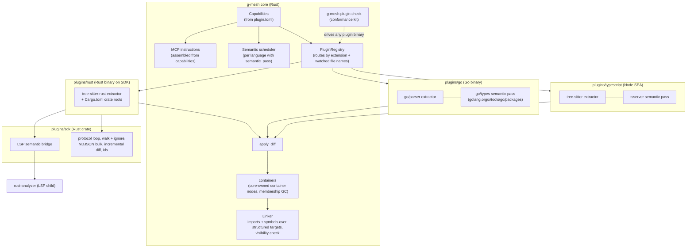
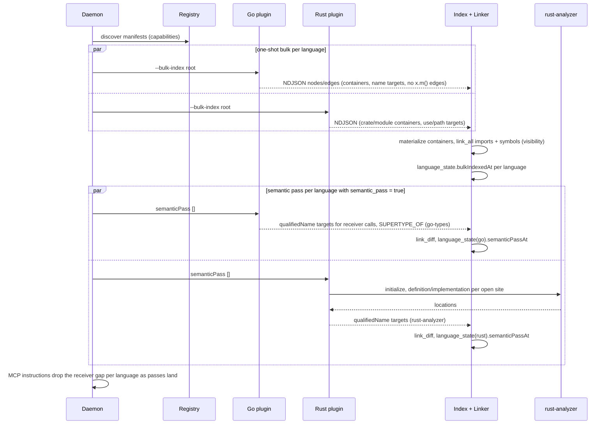

# Multi-language plugins: Go and Rust first, without paying again for language N+1

**Status**: Draft for review (GM-261). Go and Rust are the first two languages
built on this design. C#, C++, Python, Java and Kotlin are planned after them, and
this doc checks the design against them on paper rather than building for them.

## Context & Problem

g-mesh indexes one language. `plugin-modularity.md` made the plugin *mechanism*
multi-language: manifest discovery, lazy per-language processes, one wire model.
But the *graph semantics* the core applies on top are still TypeScript-shaped, and
nothing has tested them against a second language. Reading the core against Go and
Rust (2026-09-15) found the assumptions that would break. The first four are the
ones that decide the design:

- **Cross-file linking is file-addressed.** A plugin marks an unknown symbol with a
  placeholder `<file>#<name>`, and `graph::symbol_links` looks for an *exported*
  symbol of that *bare name* in *that file*. None of the three holds up:
  - a Go package symbol lives in *some* file of a directory;
  - bare names are ambiguous for methods (`Close` exists on many types);
  - `exported` is too coarse, since unexported Go functions are called across the
    files of one package all the time.
- **Imports target one `File`.** `graph::imports` repoints an `IMPORTS` edge onto
  the `File` node at an exact path. A Go import names a package directory, and a C#
  `using` names a namespace, which is no path at all.
- **Receiver calls produce no edge.** `x.foo()` is a documented gap, repeated in
  the MCP server instructions. That is tolerable in TS. In Go and Rust nearly every
  method call has this shape, so `find_callers` on a method would answer almost
  nothing.
- **The semantic layer is hardwired to TS.** `daemon::semantic` calls
  `plugin::BUNDLED_LANGUAGE`, `EdgeSource` is `tree-sitter | ts-compiler` behind an
  SQL `CHECK`, and `meta.semanticPassAt` is a single project-wide flag.
- Smaller gaps:
  - routing is by extension only, so edits to `go.mod`/`Cargo.toml` reach no
    plugin;
  - miss-path heuristics know `index.*` but not `mod.rs`/`lib.rs` or package
    directories;
  - `protocol::conformance` only checks the JSON *shape* of a plugin's output;
  - g-mesh-bench has no Go or Rust corpus.

The requirement is not only Go and Rust working. When C#, C++, Python, Java and
Kotlin arrive, each should cost a plugin rather than another round of core surgery.

## Goals / Non-goals

**Goals**
- Go and Rust plugins that reach TS-level answer quality on the tools' own
  contract: `resolved: true` means right, and a documented gap means a real gap.
  That includes receiver calls, where each language's semantic layer resolves them.
- Core generalizations that are sufficient for all seven languages. Each one is
  justified by a concrete Go or Rust need, and each is checked against the five
  paper languages.
- A plugin SDK and an LSP semantic bridge, so a later language is mostly an
  extractor plus configuration.
- A conformance kit that tests any plugin binary for *meaning*, not only shape.
- Go and Rust corpora in g-mesh-bench, so both plugins are measured the way TS is.
- No regression for TS. This is measured, not assumed.

**Non-goals**
- Cross-language edges (a Go file calling Rust through FFI). A plugin still
  understands only its own language, per `plugin-modularity.md`.
- Building anything for C#, C++, Python, Java or Kotlin now. The multi-file symbol
  model they need is *designed* here (see "Symbols declared in several files") and
  deliberately *not built* until the first of them is.
- Core-side name resolution for every language, in the style of stack-graphs (see
  Options).
- A plugin installer or registry. That stays out of scope as before.

## Constraints

- **Wire and schema changes are hard breaks.** A protocol mismatch fails the load,
  and a schema version bump wipes and reindexes. Both are accepted here, once: one
  protocol bump (v1 → v2) and one schema bump, landed together with the TS plugin
  migrated in the same release. Every user's projects reindex once.
- **Edges never leave their file** in the structural stream. Bulk batches can be
  cut anywhere, and the placeholder handshake exists for exactly that reason. The
  generalization keeps the invariant.
- **Per-file ownership of rows.** A plugin's diff upserts and deletes nodes by id
  for one file at a time. Anything shared across files has to be owned by core,
  never by one plugin's diff.
- **MCP instructions are capped at ~2KB** (Claude Code truncates them), and the
  budget is nearly used. Per-language wording must fit in it.
- **Distribution:** four target triples, built per release. Each plugin written in
  its own language would be its own toolchain times four platforms (.NET AOT, JVM,
  Go, Rust, Node). That cost multiplies with every language.
- Go and Rust developers have their toolchains installed; users of other languages
  may not. Semantic tiers may depend on a toolchain being present. Structural tiers
  may not.

## Options Considered

The decision that shapes everything else is **where cross-file references get
resolved**.

**A. Generalize the placeholder address (chosen).** Keep the handshake: the plugin
emits a placeholder, and core links it against what is actually in the index. The
address gets richer:
- **scope**: a file, or a *logical container*;
- **key**: a bare name, or an exact qualified name;
- **visibility** of the target, sent as data.

A semantic tier (go/types, rust-analyzer) sends exact keys, and a structural tier
sends name keys. TS keeps working as a special case (scope = file, key = name). The
trade-off is that core still owns an addressing contract, so it has to be specified
precisely and enforced by the conformance kit.

**B. Core models scopes and resolves names for every language.** Core would carry a
language-neutral scope graph, the plugins would emit declarations and uses, and core
would resolve. This is the stack-graphs idea, and a language without a semantic
engine would get good references for free. It was rejected on cost. GitHub's
stack-graphs was built for exactly this and never became a general multi-language
solution. The scope rules of seven languages (C++ ADL, Kotlin extensions, Rust
trait resolution) are compilers' work, and every language's real compiler already
does it.

**C. Plugins emit resolved cross-file edges with computed target ids.** Core becomes
a pure store that parks edges whose target has not been indexed yet. Core carries no
addressing convention at all. It was rejected because only a semantic tier knows a
target's file, kind and qualified name well enough to compute its id. The structural
tiers (TS today, Python and C++ without their engines) cannot, so they would need
option A anyway. The id scheme would also become a cross-plugin contract.

**Plugin implementation language.**
- **Go:** the Go plugin is written in Go, because `go/types` gives exact semantics
  in-process with no gopls. Its cost is one duplicated protocol loop (an estimated
  few hundred lines of Go), kept honest by the conformance kit.
- **Everything else:** plugins are written in Rust on a shared SDK:
  - tree-sitter grammars for structure;
  - an LSP bridge for semantics.

  Writing each in its own language was rejected on the distribution constraint.
  gopls through the bridge was the considered alternative for Go: uniform, but it
  needs gopls installed, which Go developers often lack outside an editor.

**Rust semantics.**
- **Chosen: rust-analyzer as an LSP child through the bridge.** The bridge is
  needed for C#, C++, Java, Kotlin and Python anyway, and `rust-analyzer` ships as a
  rustup component.
- **Rejected: in-process `ra_ap_*` crates.** No external binary, but a weekly
  unstable API, a very heavy compile, and nothing any other language reuses.

## Chosen Approach

Five pieces. The first release is the first three, with TS migrated onto them and
no new language. That release alone must show no TS regression on the bench.

1. **Core graph generalization.**
   - Logical containers as core-owned nodes.
   - Structured placeholder targets (scope + key).
   - Visibility as data.
   - An open edge source (tier + engine).
   - Per-language semantic state.
2. **Capability-driven core.**
   - The manifest declares what a plugin can do.
   - Core branches on that, never on a language name: semantic pass, receiver-call
     resolution, watched workspace files, entry-point names, excluded directories.
   - The MCP instructions are assembled from the same declarations.
3. **Conformance kit.** `g-mesh plugin check` runs any plugin against fixtures
   through the real core linker, and asserts meaning as well as shape.
4. **Go plugin** (Go): `go/parser` structure plus `go/types` semantics.
5. **Rust plugin SDK + LSP bridge + Rust plugin** (Rust):
   - structure first;
   - rust-analyzer semantics as a separate release.

Two further pieces are designed but not built:
- **symbols declared in several files**, needed first by C# and C++;
- **per-language bench corpora** beyond Go and Rust.

## Components



| Component | Owns | New / changed |
|---|---|---|
| `protocol::types` | Wire v2: `container`, `visibility`, structured `target`, open `source` | changed, protocol v2 |
| `storage::schema` | `containers`, `placeholder_targets`, `language_state`, `edges.source`/`engine`, `nodes.container`/`visibility` | changed, schema bump |
| `graph::containers` | Materializes container nodes from member declarations; GCs empty ones; parent chain | new |
| `graph::imports` | Links `IMPORTS` onto a `File` *or* a container | changed |
| `graph::symbol_links` | Links structured targets: file/container scope, name/qualifiedName key, visibility check, re-export walk | changed, re-export walk kept |
| `daemon::manifest` | `[plugin.capabilities]`, `[plugin.workspace]` | changed |
| `daemon::registry` | Routes watched workspace file names; per-language reindex | changed |
| `daemon::semantic` | Runs the pass for every language whose manifest declares it; state per language; request timeouts | changed |
| `mcp::mod` | Instructions assembled from the capabilities of the languages present | changed |
| `graph::queries` / `mcp::get_dependencies` | Entry-point names from manifests instead of `index.*` literals | changed |
| `cli::plugin_check` | The conformance kit | new |
| `plugins/sdk` | Rust plugin SDK and LSP bridge | new |
| `plugins/go`, `plugins/rust` | The two plugins | new |
| `plugins/typescript` | Migrated to wire v2, behaviour unchanged | changed |

## Data Model

### Logical containers

A **container** is the unit a language groups declarations into and imports from.
It is a key string namespaced by language:

| Language | Container key | Parent | Imports name it? |
|---|---|---|---|
| TS/JS | none: the file is the scope | none | no, imports name files |
| Go | import path, `github.com/org/repo/pkg` (`pkg_test` for external test files) | none (Go packages are flat) | yes, `import "…/pkg"` |
| Rust | `<crate>::<module path>`, `ripgrep::search::matcher` | enclosing module; crate root has none | yes, `use crate::a::b::*` glob, and path calls `a::b::f()` |
| C# | namespace `System.Collections.Generic`, plus assembly for `internal` | enclosing namespace | yes, `using` |
| C++ | namespace `llvm::sys` (reopenable in any file) | enclosing namespace | no, `#include` names files; `using namespace` names a container |
| Python | module `pkg.sub.mod`; package `pkg.sub` | package | yes |
| Java / Kotlin | package `com.acme.core` (Kotlin: not tied to directories) | none (flat, like Go) | yes, `import a.b.*` |

Every declaration node may carry `container`. **Core, not a plugin, owns container
nodes.** A container has members in many files, so no single file's diff can own
it; see the per-file ownership constraint. Core materializes a node for a key the
first time a member is upserted, and deletes it when the last member goes:

```sql
-- One row per logical container actually present in the index.
CREATE TABLE containers (
    nodeId     TEXT PRIMARY KEY REFERENCES nodes(id) ON DELETE CASCADE,
    language   TEXT NOT NULL,
    key        TEXT NOT NULL,
    parentKey  TEXT,             -- NULL for a root (Go package, crate root, top namespace)
    memberCount INTEGER NOT NULL, -- maintained by apply_diff; 0 => GC
    UNIQUE (language, key)
);

ALTER TABLE nodes ADD COLUMN container TEXT;      -- key, same language as the node
CREATE INDEX idx_nodes_container ON nodes(language, container);
```

A container node is an ordinary `Module` row with `nativeKind = 'container'`, a
`filePath` of `""`, and an id of `hash("container", language, key)`, so plugins and
core compute the same id. Keeping it an ordinary node is what lets
`get_dependencies` walk `File -IMPORTS-> container` edges with no new edge kind.
Its members hang off it by `DEFINES` edges, which core writes alongside the
membership count.

Parents come from the plugin: the member declaration's own `containerParent` field
(see Interfaces). There is no core rule for splitting keys, because `::`, `.` and
`/` mean different things in different languages.

### Visibility

`exported: bool` is replaced on the wire by `visibility`. `exported` stays as a
derived column, so `get_file_outline`'s output does not change.

| `visibility` | Meaning | Examples |
|---|---|---|
| `public` | visible from anywhere | TS `export`, Go capitalized, Rust `pub`, Java/C# `public` |
| `{ "container": "<key>" }` | visible to requesters whose container is `<key>` or a descendant | Go unexported → own package; Rust private → own module; `pub(crate)` → crate root; `pub(super)` → parent; Java package-private; C# `internal` → assembly; Kotlin `internal` → module |
| `file` | visible only within the declaring file | C++ `static` / anonymous namespace; TS non-exported top-level |

Member-level privacy (a `private` field of a class) is **not** modelled. The linker
only ever links top-level and type-member *names* that a structural pass addresses,
and the semantic tiers already answer from the compiler's own rules. Modelling it
would add rows and add nothing a query uses.

### Structured placeholder targets

Placeholder nodes stay `Module` rows with `nativeKind` `pending_symbol`, `reexport`
or `resolved_module`. What used to be packed into `qualifiedName` becomes a row:

```sql
CREATE TABLE placeholder_targets (
    nodeId        TEXT PRIMARY KEY REFERENCES nodes(id) ON DELETE CASCADE,
    scopeKind     TEXT NOT NULL CHECK (scopeKind IN ('file', 'container')),
    scope         TEXT NOT NULL,   -- file path, or container key
    keyKind       TEXT NOT NULL CHECK (keyKind IN ('name', 'qualifiedName')),
    key           TEXT NOT NULL,   -- bare name, '*', 'default', or an exact qualifiedName
    fromContainer TEXT,            -- requester's container, for the visibility check
    fromFile      TEXT NOT NULL    -- requester's file, for 'file' visibility
);
CREATE INDEX idx_targets_scope ON placeholder_targets(scopeKind, scope, key);
```

- **`name` key**: TS's existing contract, used by every structural tier. Only
  visible nodes match. The kind filter still applies: `CALLS` lands only on a
  `Function`, `SUPERTYPE_OF` only on a `Type`. If several match, the edge stays
  unresolved. The re-export walk, `*` and `default` behave as today.
- **`qualifiedName` key**: a semantic tier's answer. It means "this exact
  declaration", so it matches on `(scope, qualifiedName)` only. There is no
  ambiguity to refuse, and it still gets the visibility check. This is what makes
  `T.Close` distinguishable from `U.Close`.
- `resolved_module` imports gain `scopeKind = 'container'`, and `graph::imports`
  links onto a container node as well as onto a `File`.

### Edge source

```sql
-- was: source TEXT CHECK (source IN ('tree-sitter','ts-compiler'))
source  TEXT NOT NULL CHECK (source IN ('syntactic', 'semantic')),
engine  TEXT NOT NULL   -- 'tree-sitter', 'ts-compiler', 'go-parser', 'go-types', 'rust-analyzer', ...
```

The **tier** is the closed set that code and queries branch on. The **engine** is a
free label for diagnostics. A new language needs neither a schema change nor a
protocol change. Migration: `tree-sitter` → (`syntactic`, `tree-sitter`),
`ts-compiler` → (`semantic`, `ts-compiler`). This is moot in practice, because the
schema bump reindexes.

### Per-language index state

```sql
CREATE TABLE language_state (
    language       TEXT PRIMARY KEY,
    bulkIndexedAt  TEXT,
    semanticPassAt TEXT,   -- NULL until that language's whole-project pass has completed
    pluginFingerprint TEXT
);
```

`meta.bulkIndexedAt` / `semanticPassAt` stay as a project roll-up: set when every
present language's row is set. A slow rust-analyzer then does not hold a Go
project's semantic flag hostage, and the "pass still owed" retry in `daemon::mod`
works per language.

### Symbols declared in several files: designed, not built

C++ (`.h` declaration and `.cpp` definition), C# `partial`, Kotlin
`expect`/`actual` and Python `.pyi` stubs all write one symbol in several files. Go
and Rust never need this. TS's merged declarations are same-file and stay in
`declarations`.

- **Chosen shape:** one node per file, plus a new edge kind
  `DECLARATION_OF (declaration node -> defining node)`.
  - The link is made by a `qualifiedName`-keyed placeholder in the symbol's
    container, so no new linker concept is needed.
  - `find_definition` prefers the defining node and lists the others the way it
    lists `declarations` today.
  - `find_references` / `find_callers` aggregate over the group.
- **Rejected:** separating symbol identity from files (a `symbols` table, with nodes
  as declarations). It is cleaner in the abstract, but it rewrites every query and
  breaks per-file diff ownership.

It is built in the first release that adds C# or C++.

## Interfaces

### `plugin.toml` additions

```toml
[plugin]
language = "go"
protocol_version = 2
plugin_version = "0.1.0"

[plugin.spawn]
command = "./g-mesh-plugin-go"

[plugin.languages]
extensions = [".go"]

[plugin.capabilities]
# Core sends semanticPass (per file after a reparse, whole project after a walk)
# only when true. false: core never sends it, and no empty-diff answer is required.
semantic_pass = true
# "resolved": receiver calls (x.foo()) get edges; the MCP instructions do not list
# the receiver gap for this language. "unresolved": they are listed.
receiver_calls = "resolved"
# Whether the structural tier alone resolves receiver calls ("unresolved" here and
# "resolved" above means: resolved once semanticPassAt is set for the language).
receiver_calls_structural = "unresolved"

[plugin.workspace]
# Exact file names (any directory) routed to this plugin. A change triggers a
# per-language reindex, because module paths / crate roots may have moved.
watch_files = ["go.mod", "go.work"]
# Directory names the watcher never routes, matching the plugin's own walk exclusions.
exclude_dirs = ["vendor", "testdata"]
# File or directory names a miss-path lookup treats as a container's entry point.
entry_points = []          # rust: ["lib.rs", "main.rs", "mod.rs"]; typescript: ["index"]

# GM-289, read by the SDK's LSP bridge and by nothing in core - see
# "Implementation notes (GM-289)" for why core deliberately does not parse it.
# Absent means the plugin has no language server behind its semantic tier.
[plugin.semantic]
command = "rust-analyzer"       # a bare name is a PATH lookup; a relative path
                                # resolves against this manifest's directory.
                                # A plugin may probe a candidate before using
                                # it - plugins/rust does, because a PATH hit
                                # can be a rustup proxy for a component that
                                # is not installed (GM-290)
args = []
engine = "rust-analyzer"        # the `engine` label on every edge it emits;
                                # defaults to the command's file stem
implementation_kinds = ["trait"]  # nativeKinds asked textDocument/implementation
[plugin.semantic.env]           # added to the inherited environment, never an
                                # allowlist - a server has to find its toolchain
RA_LOG = "error"
[plugin.semantic.initialization_options]   # passed to `initialize` verbatim
cachePriming = { enable = false }
```

Capabilities are read from the manifest rather than the handshake. Routing and
instruction assembly need them before any plugin process exists, and the manifest
is already the startup-time source of truth. Validation follows `read_manifest`'s
hard-failure rule - which is exactly why `[plugin.semantic]` is not part of it.

### Wire v2 (`protocol::types`, `CURRENT_PROTOCOL_VERSION = 2`)

```rust
pub struct WireNode {
    // ...v1 fields, minus `exported`...
    pub visibility: Visibility,               // replaces `exported`
    #[serde(default, skip_serializing_if = "Option::is_none")]
    pub container: Option<String>,            // container key, if the language has one
    #[serde(default, skip_serializing_if = "Option::is_none")]
    pub container_parent: Option<String>,     // parent key of `container`, sent with members
    #[serde(default, skip_serializing_if = "Option::is_none")]
    pub target: Option<PlaceholderTarget>,    // required iff nativeKind is a placeholder kind
}

#[serde(rename_all = "camelCase")]
pub enum Visibility { Public, File, Container(String) }

pub struct PlaceholderTarget {
    pub scope: TargetScope,                   // { "file": "src/a.ts" } | { "container": "github.com/x/pkg" }
    pub key: TargetKey,                       // { "name": "foo" } | { "qualifiedName": "Server.Close" }
    #[serde(default, skip_serializing_if = "Option::is_none")]
    pub from_container: Option<String>,
}

pub struct WireEdge {
    // ...v1 fields...
    pub source: SourceTier,                   // "syntactic" | "semantic"
    pub engine: String,
}
```

The control messages are unchanged apart from one addition. `fileChanged` and
`semanticPass` keep their shapes, and the `FileChangeDiff` answer is the same diff.

- **New:** `workspaceChanged { filePath }`, a notification. It exists so a plugin
  can drop cached module or crate maps. Core follows it with the per-language
  reindex, so the plugin does not have to answer with a diff.

### Linker contract: what `graph::symbol_links` guarantees

For a placeholder with target `(scope, key, fromContainer, fromFile)` and a usage
edge of kind `K`:

1. **Candidates.**
   - `scope = file`: the nodes whose `filePath = scope`.
   - `scope = container`: the nodes whose `(language, container) = (placeholder
     language, scope)`.
   - Placeholders are always excluded.
2. **Key filter.**
   - `name`: `name = key` and the node is *visible* to the requester (below).
   - `qualifiedName`: `qualifiedName = key`.
3. **Kind filter.** `CALLS` → `Function`, `SUPERTYPE_OF` → `Type`, `REFERENCES` → any.
4. **Result.**
   - Exactly one candidate: repoint the edge and set `resolved = 1`.
   - None under a `name` key: walk the re-exports of `scope` as today (bounded at
     8 hops).
   - Otherwise: leave the edge alone.
5. **Visibility.**
   - `public`: always visible.
   - `file`: visible iff `fromFile = node.filePath` **and the node is looked up in
     a container scope**. In a file scope a `file`-visible node is never a
     candidate (GM-266): a file sees its own unpublished declarations only
     lexically, as direct same-file edges, and the narrowing keeps TS exactly
     equivalent to its old `exported = 1` rule for a placeholder addressed at its
     own file.
   - `container(c)`: visible iff `fromContainer` is `c` or has `c` on its parent
     chain (from `containers.parentKey`).
   - A `qualifiedName` key is checked too, so a semantic tier's mistake cannot link
     a private symbol from outside.

`link_diff` gains one trigger: a node upserted into a container can answer
placeholders waiting on that container, the counterpart of today's
"new export in a file". Building it showed a second one is needed for
`link_all` and `link_diff` to agree: a container that comes into existence
extends the parent chain of every container below it, so the placeholders in
those containers' files are revisited too. `graph::symbol_links`' module doc
has the full contract, including how re-exports apply to a container scope.

### Conformance kit

```
g-mesh plugin check <plugin-dir> --fixture <project-dir> [--expect <expect.toml>]
```

Built in GM-276 as `g-mesh plugins check` (next to `plugins list`; `plugin`
stays accepted as an alias), without `--expect`, which GM-277 adds. The checks
as built, with the evidence each reads and why `semanticPass` diffs are
exempt from the per-file stream rules, are documented in
`core/src/cli/plugin_check/checks.rs` and the README's "Writing a language
plugin" section.

The kit runs the plugin exactly as the daemon does (spawn, handshake, `--bulk-index`,
`fileChanged`, `semanticPass`) against an in-memory index and the real
`apply_diff` + linker. It asserts:

- **Shape:** the v1 checks plus the v2 fields; a placeholder `nativeKind` requires
  a `target`.
- **Stream order:** every edge's `fromId` and same-file `toId` were emitted before
  the edge, and no edge in a file's stream targets another file's node id.
- **Same-file rule:** same-file edges are `resolved: true`, and edges onto
  placeholders are `false`.
- **Id stability:**
  - two bulk runs produce identical id sets;
  - a whitespace-only edit yields an empty diff;
  - `deleteNodeIds` only name ids previously emitted.
- **Ownership:**
  - `DEFINES`/`EXPORTS` run File → symbol;
  - `language` matches the manifest;
  - no plugin emits `nativeKind = 'container'`.
- **Capabilities:**
  - `semantic_pass = false` plugins are never sent the request;
  - `receiver_calls = "resolved"` is backed by the expectations file actually
    containing receiver calls.
- **Expectations** (`expect.toml`, per language), checked after linking. Each is
  answered by the same query code the MCP tools use:

  ```toml
  [[callers]]
  symbol = "Server.Close"
  expect = ["cmd/main.go:run", "server_test.go:TestClose"]
  [[implementations]]
  symbol = "io.Closer"            # project-local interface in the fixture
  expect = ["Server", "Conn"]
  [[imports]]
  file = "cmd/main.go"
  expect = ["container:github.com/x/app/server"]
  ```

The same fixtures run in core's CI for every bundled plugin. They are the
per-language acceptance test, replacing "the TS integration tests happen to cover
it".

### Plugin SDK (`plugins/sdk`, Rust crate)

```rust
pub trait Extractor: Send + Sync {
    const LANGUAGE: &'static str;
    /// One file, parsed from `source`. Pure: no filesystem access beyond `ctx`.
    fn extract(&self, ctx: &ProjectContext, path: &RelPath, source: &str) -> FileGraph;
    /// Workspace model (crate roots, module map). Rebuilt on workspaceChanged.
    fn load_project(&self, root: &Path) -> anyhow::Result<ProjectContext>;
}

pub struct FileGraph {
    pub nodes: Vec<WireNode>,
    pub edges: Vec<WireEdge>,
    /// Use sites the structural tier could not resolve (receiver calls, ambiguous
    /// paths): position + kind. Kept by the SDK in memory and handed to the
    /// semantic bridge. Never sent to core.
    pub open_sites: Vec<OpenSite>,
}

pub trait SemanticEngine {
    /// Answer open sites for `files` (empty = all). Returns upgrades as a diff:
    /// qualifiedName-keyed placeholders plus `source = semantic` edges, and
    /// retractions of the syntactic edges they replace.
    fn answer(&mut self, files: &[RelPath], index: &SdkIndex) -> anyhow::Result<FileChangeDiff>;
}

pub fn run<E: Extractor>(extractor: E, semantic: Option<Box<dyn SemanticEngine>>) -> !;
```

- **What the SDK owns:**
  - the handshake and control loop;
  - `--bulk-index` streaming;
  - the project walk (`ignore` crate: `.gitignore` plus the manifest's
    `exclude_dirs`);
  - the per-file cache and id-keyed incremental diff (the TS plugin's
    `incremental.ts` logic);
  - id hashing;
  - placeholder builders;
  - a `#[test]` helper that runs `g-mesh plugin check` against a fixture.
- **`LspBridge: SemanticEngine`** (built in GM-289; see "Implementation notes
  (GM-289)" below for the seven decisions this sketch left open)**:**
  - spawns the configured server (command from the manifest's
    `[plugin.semantic] command`);
  - runs `initialize`, `didOpen`/`didChange` from the SDK's file cache;
  - asks:
    - `textDocument/definition` at each open site;
    - `textDocument/implementation` on each trait/interface node;
    - `callHierarchy/incomingCalls` only where definition is insufficient;
  - maps each returned location to a node by position from `SdkIndex` and emits a
    `qualifiedName` target.
  - Budgets: per-request timeout, a max number of sites per pass, and
    readiness-waiting (see Failure Modes).

#### Implementation notes (GM-284)

Built as `plugins/sdk` (`g-mesh-plugin-sdk`). Seven decisions the sketch above
left open, recorded here so a later language does not have to re-derive them;
each one's full reasoning is in the module doc named beside it.

1. **Workspace layout, and where the wire types live.** The repository root
   became a cargo *workspace* (`Cargo.toml`, virtual) over `core/`, `wire/` and
   `plugins/sdk`, so `cargo test` at the root covers all three. The build
   directory moved with it, from `core/target/` to `target/`, which is why
   `.gitignore`, `scripts/build-targets.sh` and the nextest profile
   (`core/.config/` -> `.config/`, since nextest resolves it against the
   workspace root) changed in the same commit.

   **The SDK does not depend on the `g-mesh` crate.** Sharing the wire types
   is non-negotiable - two hand-kept copies is exactly the arrangement that
   makes a protocol version number necessary - but depending on core would
   make every plugin link a statically linked ONNX Runtime, a bundled SQLite
   and tokio. So `protocol::types` moved out into a third crate,
   `g-mesh-wire`, whose entire dependency list is `serde` (plus `schemars`
   behind a default-off feature core turns on for its MCP schemas). Core
   re-exports it as `protocol::types`, unchanged at every call site. The
   extraction was one file move plus a one-line re-export - "cheap", as the
   task's condition for doing it at all.

2. **The id scheme is specified in bytes, in `ids`' module doc**, and pinned
   by `plugins/sdk/tests/id_scheme.rs` against ids the TS plugin's own
   `nodeIdFor`/`edgeIdFor` produced. Both ids are `sha256` of NUL-joined
   fields, hex, first 32 characters: `"node" NUL path NUL kind NUL
   qualifiedName NUL nativeKind` (nativeKind empty when absent) and
   `"edge" NUL fromId NUL kind NUL toId [NUL toDeclaration]` (the ordinal
   field, *and its separator*, absent when there is none). **`plugins/go` must
   match this**; the separator is a NUL rather than a space, which is easy to
   miss from reading `extract.ts`, where it is invisible in the template
   literal.

3. **The incremental diff is id-keyed and content-refined**, the same
   algorithm as `incremental.ts`: a node present on both sides whose fields
   differ is reported as a delete *and* an upsert of the same id, and ranges
   count as fields. `apply_diff` performs every delete before every upsert in
   one transaction, so that lands - the GM-292 failure was foreign-key
   enforcement being on when core believed it was off, not the diff shape.
   `diff`'s module doc says so explicitly and says not to work around it.

4. **`FileGraph` carries `open_sites: Vec<OpenSite>`**, never serialized.
   An `OpenSite` is `{from_id, position, name, kind, edge_kind,
   from_container}` - a position and a name rather than a syntax node, because
   the two engine shapes it has to fit look at a file from opposite ends: an
   LSP bridge asks *at a position* and gets a location, while a
   `go/types`-style engine re-analyses the file and correlates by position.
   Neither can be handed a tree-sitter node.

5. **The semantic engine is lazy by construction.** `run` takes a
   `SemanticEngineFactory` (`FnOnce`), not a built `Box<dyn SemanticEngine>`:
   with the sketch's signature the engine is already running by the time `run`
   sees it. The SDK writes
   `$G_MESH_PLUGIN_CHECK_MARKER_DIR/semantic-engine-started` immediately
   *before* calling the factory (an engine that spawned a server and then
   failed has still started one), so every SDK plugin passes
   `capabilities.semantic-engine-lazy` instrumented rather than skipped.
   A whole-project `semanticPass` first fills `SdkIndex` by walking and
   extracting - the control-plane process never runs the bulk walk, so
   otherwise it would answer about only the files someone happened to edit.

6. **Errors.** A panic in the extractor is caught per file
   (`catch_unwind`): the walk skips that file, and a `fileChanged` answers an
   empty diff and *keeps* its previous baseline. Taking the process down would
   cost the project every other file. A syntax error is not an error at all -
   `extract` has no way to report one, deliberately; it returns the partial
   graph with `hasSyntaxErrors` set.

7. **The test helper** is `testing::PluginCheck`. The plugin binary is passed
   in as `env!("CARGO_BIN_EXE_<name>")` - exact, and it makes cargo build the
   binary before the test runs. Core's binary is found by `G_MESH_BIN`, else
   by looking beside the test binary in the shared workspace target directory;
   not found is an error naming what to run, never a skip. The helper writes a
   `plugin.toml` into a scratch directory (a cargo-built plugin has none) and
   points the plugin at it with `G_MESH_PLUGIN_MANIFEST`, so the run exercises
   the manifest path rather than the in-code fallback.

Two deliberate differences from the TS plugin, both in `walk`'s module doc:
symlinks are **not** followed (JS needs them for workspace packages linked
into `node_modules`; no language this SDK is for has that convention, and the
guard TS needs against cycles and escapes is real machinery), and the walk
reads neither the user's global gitignore nor `.gitignore` above the project
root, so an index does not depend on the machine it was built on.

The toy plugin the SDK's own conformance test drives (`plugins/sdk/toy/`) is a
line-oriented language with five line shapes. It is built by `cargo build` and
shipped by nothing: no `plugin.toml` of its own exists outside the scratch
directory one check writes.

#### Implementation notes (GM-289): the LSP bridge

Built as `plugins/sdk/src/lsp/` (`lsp::LspBridge`), with every decision argued
in the module it belongs to. Recorded here are the seven the sketch above left
open, plus the two places it turned out to be *incomplete* rather than merely
unspecified.

1. **`[plugin.semantic]` lives in `plugin.toml` and core never reads it**
   (`lsp::config`). The section carries `command`, `args`, `env`, `engine` (the
   edge label), `implementation_kinds` and a free-form
   `initialization_options` table. Core's `daemon::manifest` is **unchanged**:
   it would do nothing with any of these (it never spawns the server, and the
   memory limit already counts it by sampling the plugin's process *tree*), and
   a field core parses is a field core hard-fails on - so a typo in a server
   command would have stopped the plugin being discovered at all, taking its
   structural tier down to protect a string only the plugin reads. The SDK
   already re-reads its own manifest for the walk, and reads three more keys
   out of the same file through the same search order. The env table *adds*
   variables rather than allowlisting them: a language server is a program that
   finds a toolchain (`PATH`, `CARGO_HOME`, `GOMODCACHE`, `JAVA_HOME`, …), and
   an allowlist written by someone who is not that language's maintainer fails
   silently - the server starts, finds nothing, and answers nothing.
2. **No LSP crate** (`lsp::client`). The bridge sends six requests and four
   notifications and reads a URI and two integers out of the replies.
   `lsp-types` is the whole specification as Rust types (and pins a protocol
   version); `lsp-server`/`tower-lsp` bring crossbeam or tokio. The SDK is what
   languages #3-#7 inherit, so a dependency here is paid seven times and
   removed never. The framing is shared with the control plane
   (`plugins/sdk/src/framing.rs`), which is one implementation of the byte
   format rather than two.
3. **Columns are converted, in both directions** (`lsp::position`). The wire
   counts Unicode scalar values; LSP counts UTF-16 code units unless the
   negotiation says otherwise. The bridge offers `utf-32, utf-16, utf-8` in
   `initialize` and honours what the server picks, converting against the text
   the SDK's index holds - the same bytes the server was sent in `didOpen`,
   which is the only reason a conversion computed on this side is true on the
   other. Both directions are load-bearing and both are tested with a
   non-ASCII fixture line: dropping either one makes
   `tests/lsp_bridge.rs`'s definition test emit nothing at all.
4. **Readiness has a definition for servers that report none.** All begun
   `$/progress` ended → ready; no progress begun within a two-second settle →
   ready (a server that answers immediately is not penalised beyond that,
   once per server rather than once per pass); neither within the readiness
   budget → the pass asks nothing and reports itself incomplete, so no site is
   ever recorded as "no target" on the strength of a cold server's silence.
   Readiness is not only a startup condition: an empty answer that arrives
   while a progress is in flight is deferred until that progress ends and asked
   once more, rather than believed or re-asked in a spin.
5. **Retraction has two rules and one deliberate refusal.** The bridge
   withdraws its own earlier answers for a file it has finished again and not
   re-produced, and it withdraws a syntactic edge an answer contradicts - but
   only when the extractor said which edge that is. That is the new
   `OpenSite::replaces` field: `from_id` plus `edge_kind` does *not* name an
   edge (one function calling two same-named methods through different
   receivers produces two sites with an identical pair), so retracting on that
   basis would delete correct edges to repair ones that were never wrong. Only
   the extractor knows which edge it wrote for which site. `plugins/rust` sets
   it to `None` everywhere, correctly: its open sites are sites it emitted no
   edge for. The shape that needs it is Go's `placeholderCall`.
6. **Budgets** (`lsp::Budgets`): a 10s per-request timeout, 20,000 sites per
   pass, 8 questions in flight, and a whole-pass budget of
   `max(15 min, 8s × files)` (90s for a per-file pass). Each is inside the
   limit core kills the plugin at - `max(20 min, 10s × files)` and a flat 120s
   (`daemon::plugin::RoundTripTimeouts`) - because a bridge that runs to
   *core's* limit is killed rather than reporting anything, and loses the
   answers it had already built. A unit test asserts the containment at
   several project sizes so the two cannot drift apart silently.
7. **An incomplete pass is a diff plus a flag, not an error.**
   `FileChangeResponse` gains `incomplete` (absent means `false`, so every
   plugin written before this keeps answering unchanged), and
   `watcher::apply::apply_semantic_pass` commits the diff and *then* fails the
   whole-project pass, which is exactly what leaves
   `language_state.semanticPassAt` unset for a retry on the next daemon start.
   A JSON-RPC error was the alternative and is worse: it carries no diff, so
   reporting that the last hundred sites are missing would throw away the nine
   thousand the pass did resolve. The SDK's own half is
   `SemanticAnswer { diff, complete }` (`semantic.rs`) - and the flag is only
   put on the wire for a *whole-project* pass, because a per-file one has no
   completion record to protect and the only thing the flag could do there is
   print a line per keystroke-save, which is the noise the design's "log once"
   rule exists to prevent.

Two things the sketch above did not say, found while building it:

- **An `Implementation` open site cannot be answered by this bridge, and that
  is a gap in the *site*, not in the engine.** `plugins/rust` records one for
  `impl Trait for T` where `T` is declared in another file, at the position of
  `T` - the subtype - while the edge it wants runs from `T` to the trait.
  `definition` there answers "where is T" (the wrong end) and `implementation`
  answers "what implements T" (a different question). The same fact is
  reachable from the other end, by asking `implementation` on the trait's own
  node, which is what `implementation_kinds` drives. Closing it properly needs
  the site to carry the trait as well as the type; until then the bridge counts
  these sites, logs them and answers nothing, which is honest rather than
  incomplete-forever.
- **A request has to land on an identifier.** A node's range starts at the
  whole declaration (`pub trait Foo` starts at `pub`), and a server asked there
  resolves a keyword. The bridge aims at the first occurrence of the node's own
  name inside its range - a heuristic, but a language-agnostic one, with the
  range's start as the fallback.

The fixture is a real process: `plugins/sdk/fake-lsp/` is a language server
whose whole behaviour is a JSON script the test writes (readiness mode,
per-position answers, delays, a crash after *n* requests, silence from the
*n*th). A mocked client would have tested the easy half and skipped the
transport, and "the plugin survives its server dying" cannot be faked at all -
it is a statement about a process. Fourteen integration tests drive it,
including the readiness gate (which fails, as it must, when the gate is
removed), both column conversions, the implementation mapping, a request
timeout, and a crash mid-pass after which the bridge starts a fresh server.

### Go plugin (`plugins/go`)

- **Structure:** `go/parser` with `parser.ParseComments | parser.AllErrors`.
  - It returns a partial AST on syntax errors, so `hasSyntaxErrors` can be set.
  - It is per file and needs no toolchain.
  - Package names come from the `package` clause, and import paths from `go.mod`'s
    `module` plus the directory (`go.work` for multi-module repos).
  - Every declaration gets `container = <import path>`; `_test.go` files of
    `package x_test` get `<import path>_test`.
  - Visibility: capitalized → `public`, otherwise `container(<import path>)`.
- **qualifiedName:** `F`, `T`, `T.M` (pointer and value receivers normalize to `T.M`,
  with `nativeKind = "method"` and the receiver kind in `signature`). Interface
  methods are `I.M`.
- **Structural edges:**
  - bare calls and same-package references → a `name`-keyed placeholder in the own
    container, `resolved: false`, because the target may be in a sibling file;
  - same-file hits → direct and `resolved: true`;
  - `pkg.F()` → a placeholder scoped to the imported container;
  - `x.M()` → an open site, not an edge.
- **Semantics:** `golang.org/x/tools/go/packages` with `NeedTypes | NeedTypesInfo |
  NeedSyntax`, run over the project's own packages.
  - It needs the `go` binary on `PATH`. Without it the plugin logs once and
    degrades to structural.
  - Whole-project pass: `types.Info.Uses` / `Selections` resolve every open site to
    an exact declaration. The result is a `qualifiedName` target in the declaring
    package's container.
  - Interfaces: `types.Implements` over (interfaces × named types) within project
    packages → `SUPERTYPE_OF type → interface` edges, `semantic`/`go-types`.
  - Per-file pass: re-check the file's package, reusing the loaded dependency
    packages. Dependents' edges into a changed package are refreshed when they are
    next checked, the same staleness TS accepts today.
- **Distribution:** a static binary per target via `GOOS`/`GOARCH` cross-compile,
  `CGO_ENABLED=0`. No native runner and no embedded runtime - `.github/workflows
  /release.yml` still builds each target on its own runner (the JS/TS plugin and
  the Rust binary both need to), but unlike those two, the Go binary could be
  built for all four targets from any single one of those runners; it stays in
  the same per-target loop only because that is where `scripts/build-targets.sh`
  already runs (`scripts/bundle-go-plugin.sh`, called there alongside
  `scripts/bundle-plugin.sh`). See "Implementation notes (GM-279)" point 6
  below for the per-target manifest this generates to close the Windows
  binary-naming gap the dev-checkout build leaves open.

#### Implementation notes (GM-279)

The first Go plugin release is a scaffold: the wire v2 control loop, the
`--bulk-index` NDJSON stream, the project walk and the id scheme, all proven
against `g-mesh plugin check` end to end - but the extractor emits `File`
nodes only, no symbols and no edges. `go/parser` structure (real declarations,
containers, `DEFINES`/`EXPORTS`) is GM-280; `go/types` semantics (the pass
this scaffold already answers, honestly, with nothing) is GM-281. Six
decisions this task had to settle rather than infer, recorded here so GM-280/
GM-281 do not have to re-derive them:

1. **`semantic_pass = true` from the first release, with no marker written.**
   The manifest declares the capability now (not once GM-281 lands): a plugin
   that will grow a real semantic tier should not lock in "core never asks"
   before that tier exists, and this plugin already answers every
   `semanticPass` honestly - an empty diff, because there is nothing yet to
   resolve. The conformance kit's semantic-engine marker
   (`G_MESH_PLUGIN_CHECK_MARKER_DIR`/`semantic-engine-started`, `session.rs`'s
   own contract) is deliberately **not** written by this scaffold: there being
   no engine to start is not the same claim as "the engine started lazily",
   and writing the marker with nothing behind it would make
   `capabilities.semantic-engine-lazy` either vacuously pass or fail on a
   technicality unrelated to laziness. The kit reports this correctly today -
   `SKIP ... not instrumented` - which is the honest answer until GM-281
   spawns/loads `go/packages` and writes the marker at that moment, the same
   way the TS plugin's `semantic.ts` does for `tsserver`.
2. **Id scheme reproduced field-for-field from `extract.ts`, checked against
   real TS output.** `nodeIdFor`/`edgeIdFor` in `plugins/go/ids.go` hash the
   exact same space-joined strings `plugins/typescript/src/extract.ts`'s
   `nodeIdFor`/`edgeIdFor` do (sha256, hex, first 32 characters). `ids_test.go`
   asserts against values computed by actually running that TS code
   (`node -e '...'` with the functions copied in verbatim, Node v20.6.1 - the
   transcript is in this task's own completion report), not recalled from
   memory or re-derived independently in Go.
3. **The walk's `.gitignore` support is hand-rolled, not a dependency.**
   `plugins/go/ignore.go` translates each pattern to a regexp by hand -
   literal segments, `*`/`?` within a segment, `**` across segments, a
   directory-only trailing `/`, an anchoring leading or embedded `/`,
   negation, later-line-and-later-layer-wins - the same subset
   `ignorePolicy.ts`'s own `ignore` dependency is exercised for by this
   repo's fixtures, and the same tier of coverage small Go gitignore
   libraries offer. Chosen over a dependency so `plugins/go/go.mod` stays at
   zero requirements for a scaffold whose only job is proving the wire
   contract; `ignore.go`'s own doc comment has the full trade-off, including
   the heavier alternative (go-git's `gitignore` sub-package) considered and
   rejected. Symlink handling (`plugins/go/symlinks.go`) matches
   `symlinks.ts`'s guard exactly: followed, not skipped, under a guard that
   refuses a cycle, a second path onto an already-claimed real location, and
   an escape outside the project root - proven by `walk_test.go`'s own cycle/
   dangling-link/claimed-twice cases.
4. **File nodes only, `visibility: "file"` - not `"public"`.** GM-279's own
   task text said `visibility public` for the File node; this repo's one
   concrete example of a Go plugin's node
   (`core/tests/fixtures/valid_v2.ndjson`) uses `"file"`, matching the TS
   plugin's own convention (`extract.ts`'s `addNode`: a node is file-visible
   unless something marks it exported, and nothing ever marks the File node
   itself exported - only what it *defines* can be public). The golden
   fixture was treated as authoritative over the task's own prose.
5. **Unknown methods and `workspaceChanged` never crash, mirroring
   `index.ts`'s own gaps.** A method this plugin does not recognize is
   logged and dropped, never answered - even when it carried an id - matching
   `plugins/typescript/src/protocol.ts`'s `parseControlEnvelope` refusing
   anything outside its four known methods the same way. `workspaceChanged`
   *is* recognized (the TS plugin predates it and has no workspace files to
   watch at all), but this scaffold caches nothing at the workspace level -
   no module/crate map exists yet to invalidate - so it is a no-op beyond a
   log line. GM-280/GM-281 are expected to give it real work once there is a
   cached package map to drop.
6. **Distribution for a dev checkout: a prebuilt binary via `core/build.rs`,
   not `go run ./...`.** `go run` recompiles the whole module on every single
   spawn - and the daemon spawns this plugin repeatedly, including one
   one-shot process per `--bulk-index` call - so it would mean a full compiler
   invocation on the hot path of a reindex. `core/build.rs` now builds
   `plugins/go` into `plugins/go/g-mesh-plugin-go` the same best-effort way it
   already builds the TS plugin's `dist/` (a `cargo:warning`, not a build
   failure, when no Go toolchain is on `PATH`), so `cargo build`/`cargo
   test`/`g-mesh plugins check`/`g-mesh plugins list` all work from a fresh
   checkout with nothing extra to run by hand. `plugin.toml`'s `command =
   "./g-mesh-plugin-go"` has no `.exe` suffix, so this only produces a
   spawnable binary on macOS/Linux today; Windows naming was left to GM-283
   (distribution), which owns per-target binary naming for the release
   matrix - resolved there (see "Distribution" above and
   `scripts/bundle-go-plugin.sh`'s own header comment) by generating a
   separate, per-target manifest for the archive rather than by editing this
   checked-in one: the archive's `plugin.toml` is derived from this file with
   only its `command` line rewritten to the binary actually staged beside it
   (`g-mesh-plugin-go.exe` for the Windows target), so the dev-checkout
   contract above is unchanged and the two manifests cannot drift apart on
   every other field. Verified before relying on it: `go build -o
   g-mesh-plugin-go .` with `GOOS=windows` does **not** append `.exe` on its
   own when `-o` names the output explicitly (only when `-o` is omitted), so
   the rewrite is required, not cosmetic - and separately, Rust's own
   `std::process::Command` resolver on Windows (`resolve_exe` in
   `library/std/src/sys/process/windows.rs`) would likely have tolerated the
   unmodified name too (it tries `<path>.exe` first, then falls back to the
   literal path, which Windows can execute directly via its full path
   regardless of extension), but a release archive should not depend on that
   fallback when naming the file correctly costs one generated manifest.

#### Implementation notes (GM-280)

GM-280 replaced the scaffold's File-node-only extractor with the real
`go/parser` structural tier: declarations, containers, visibility,
`DEFINES`/`EXPORTS`, the three placeholder shapes, open sites and an
id-keyed incremental diff. `go/types` semantics stay GM-281's; the semantic
pass still answers every request with an empty diff. Eight decisions this
task had to settle rather than infer, recorded here so GM-281/GM-282 do not
have to re-derive them:

1. **Local scope is tracked by the walk itself, never read off the AST.**
   `go/ast`'s `Object`/`Scope` fields look like they answer "is this name
   local", and they are both deprecated *and* wrong for this: the parser
   resolves names with no type information, and under `AllErrors` whatever
   it managed is partial in a way nothing flags. So `plugins/go/scope.go`
   builds the chain from the declarations the walk actually sees, which
   behaves identically on a complete and on a partial AST. A name the chain
   binds is dropped without ever asking what it is bound to - parameters,
   named results, receivers, type parameters, `:=`, local `var`/`const`/
   `type`, closure parameters, `if`/`for`/`switch`/`select` init bindings,
   type-switch bindings and range variables. Statements are walked in
   source order and a name is bound at the point it is declared, so
   `helper := helper()` still reads the package-level `helper` on the
   right. Labels are not tracked at all but *skipped* (a `LabeledStmt`'s
   label and a `BranchStmt`'s label are never visited), which is exact
   rather than approximate: a label lives in its own namespace and can
   never denote a package symbol. Ambiguity resolves the same way
   everywhere in this tier - toward the missing edge. The two places it
   bites are a composite-literal key that is a bare identifier (a struct
   field name and a map key are the same syntax, so it is skipped; a key
   that is not a bare identifier is unambiguous and is walked) and a
   selection through a value, which becomes an open site.
2. **Dot, blank and aliased imports, each decided.** An **alias** binds the
   alias and changes nothing else. A **blank** import binds nothing and
   still gets its placeholder and `IMPORTS` edge - the dependency is the
   only thing such an import states, and `get_dependencies` would be wrong
   to omit it. A **dot** import binds every exported name of another
   package into this file invisibly, and the set of those names is exactly
   what a structural tier cannot see; so a file containing one emits **no
   own-container placeholders at all**, keeping only what stays exact
   (direct same-file hits, which are lexical, and qualified `pkg.F()` uses
   through other imports, which name their container). Guessing the other
   way would produce a wrong edge every time the name really came from the
   dot import and the own package happened to declare one too. The name an
   unaliased import binds is guessed from the path's last segment, with
   major-version suffixes handled (`.../v2`, `gopkg.in/yaml.v2`); a wrong
   guess degrades to an open site, never to a wrong edge.
3. **Method sets are not modelled, only declarations.** `func (s *Server)
   Close()` and `func (s Server) Close()` both become `Server.Close` with
   `nativeKind = "method"` and the receiver kind in the printed signature;
   Go forbids declaring both, so the normalization can never merge two
   distinct declarations. A generic receiver normalizes the same way
   (`*Stack[T]` → `Stack`). An interface method is `I.M`,
   `nativeKind = "interface_method"` - a *declaration*, never an
   implementation claim. **Struct embedding promotes methods, and nothing
   structural says so**: an embedded field is walked as an ordinary type
   reference and no promoted method is invented. Interface satisfaction is
   the same case: Go's interfaces are structural, so no `SUPERTYPE_OF`
   edge exists at this tier at all, including for the `var _ I = (*T)(nil)`
   idiom, which does state it syntactically but is one spelling among
   several. Both belong to GM-281's `types.Implements` / method-set pass.
4. **`containerParent` is always absent, and core is fine with it.** Go
   packages are flat (this doc's own Logical containers table). A container
   with no parent yields an empty `parent_chain`, which makes Go's
   `container(pkg)` visibility exactly "the same package and nothing else"
   - exactly Go's own rule for an unexported name. GM-265's gap rule
   (an ancestor with no members truncates the chain) cannot bite here,
   because Go has no way to produce an intermediate container at all. This
   was verified rather than assumed: the fixture declares `helper`,
   unexported, in two different packages, and `plugins/go/conformance/
   expect.toml` asserts each one's caller set is exactly its own package's.
5. **`package main`, two packages in one directory, and generated files.**
   `main` is *not* special: it gets the ordinary directory-derived import
   path (`github.com/example/app/cmd`), which is what `go list` calls it
   too, so two `main` packages in one repository get two containers instead
   of colliding on the name. An external test package (`package x_test`) is
   Go's one legal two-packages-in-one-directory case and gets
   `<import path>_test`, keyed off the *package clause* rather than the file
   name (Go reserves that suffix for external test packages); an *internal*
   test file is an ordinary member of the package it tests, which is what
   lets it reach unexported symbols. Two packages in one directory that are
   not a test pair is illegal Go but reachable on disk, and both land in the
   same container key - the same answer `go list` gives before it reports
   the error, with a bounded consequence (a name declared in both becomes
   ambiguous and core refuses to link it). **Generated files are indexed
   like any other**: they are real, compiled, callable code, and dropping
   them would make `find_callers` silently incomplete for everything they
   call. Whether one is *interesting* is a query's question, and a
   repository that considers generated output not-source already says so in
   `.gitignore`, which the walk honours.
6. **`init` is kept, and disambiguated in `nativeKind`.** A package may have
   any number of `func init()`, and so may one file, so they collide on
   qualifiedName and therefore on node id. Skipping them was rejected: an
   `init` body is ordinary code making ordinary calls, and with no node to
   hang them on every one of those calls would lose its caller. So the first
   `init` of a file is `nativeKind = "init"`, the second `"init#1"`, and so
   on in source order - `nativeKind` participates in the node id, so the ids
   are distinct and stable as long as the order of a file's inits is (adding
   one at the end changes nothing about the ones before it). Two inits in
   one file share a qualifiedName and are therefore ambiguous to any name
   lookup, which is correct: nothing in Go can name an `init` to call it.
7. **Build constraints are indexed, every alternative.** `//go:build` and
   `_windows.go` change nothing structurally - a node id carries the file
   path, so `sys_windows.go`'s and `sys_linux.go`'s `Platform` are two
   distinct nodes that never collapse. GM-281's `go/packages` pass only ever
   type-checks the host `GOOS`/`GOARCH`, so files excluded by the host's
   constraints keep this structural graph and receive no semantic upgrade -
   this doc's "Go build constraints" failure mode, documented rather than
   hidden.
8. **The workspace model is parsed by hand, and `workspaceChanged` now has
   real work.** `plugins/go/workspace.go` reads every `go.mod` in the tree
   plus `go.work`'s `use` directives, and takes the union: a `go.work` is not
   required for a multi-module repository (nested `go.mod` files alone make
   one), and a workspace may name a directory the walk would skip. A
   directory belongs to the *innermost* module containing it, so a nested
   module owns its own subtree. `golang.org/x/mod/modfile` was rejected to
   keep `plugins/go/go.mod` at zero requirements (GM-279's decision 3, same
   trade-off), and `go list -m` was rejected because it would make the
   *structural* tier depend on a toolchain, which this doc's Constraints
   forbid. With no `go.mod` anywhere the container key falls back to the
   project-relative directory, which still links same-package uses across
   one directory's files and can never match an import specifier - the right
   failure, since a directory with no module is not importable in Go either.
   `workspaceChanged` reloads that model and drops the whole per-file cache,
   because a cached graph carries the old container keys inside its nodes.

Two things GM-280 deliberately left to its successors. The **open sites**
(`x.M()` receiver calls and value field accesses) are collected per file in
plugin memory with the position, the selected name and the enclosing
symbol/caller ids, and never sent to core - GM-281 consumes them.
`plugins/go/conformance/expect.toml` is **minimal on purpose**: GM-282 owns
the full Go expectations file, and the entries there now exist only to prove
GM-280's own end-to-end claim (that a container-scoped placeholder is an
address core resolves) with a comparison that was shown capable of failing.

#### Implementation notes (GM-281)

GM-281 added the `go/types` tier (`plugins/go/semantic.go`): every open site
resolved to an exact declaration, `types.Implements` over the project's own
interfaces, the lazy-engine marker, and the `receiver_calls = "resolved"`
flip in `plugin.toml`. Eight decisions this task had to settle rather than
infer:

1. **One `packages.Load` per module root, not one per project.** `./...`
   from the project root lists the packages of *one* module; a nested
   `go.mod` is outside it, so `go list ./nested/...` from the root fails
   there, and a `go.work` only rescues that when the workspace happens to
   name the module. So the whole-project pass runs `./...` once per module
   root found by `workspace.go`, with the loader's working directory set to
   that module - the one form that behaves identically with and without a
   workspace file, and exactly one invocation for the ordinary
   single-module repository. A per-file pass instead asks for
   `file=<abs path>`, `go list`'s own spelling of "the package containing
   this file", which is what "re-check that file's package" means
   operationally.
2. **`NeedDeps` deliberately absent.** The load mode is `packages.LoadSyntax`'s
   (`NeedName|NeedFiles|NeedCompiledGoFiles|NeedImports|NeedTypes|NeedSyntax|
   NeedTypesInfo`). With `NeedDeps`, every transitive dependency - the whole
   standard library included - is type-checked *from source* to build syntax
   trees this pass never reads: the only thing it ever asks about a
   dependency's symbol is its package path and name, and export data carries
   both. Without it, dependencies arrive as compiled export data through the
   go build cache, which is also the only "reusing loaded dependencies" that
   is actually available - `go/packages` has no incremental API, so there is
   no in-process package graph to reuse. Measured on `junegunn/fzf`
   (89 `.go` files, 6 packages): 17.9s and 304MB peak RSS with a cold build
   cache, 2.3-2.7s and 91-95MB warm; on `spf13/cobra` (36 files, 2 packages)
   8.7s/136MB cold and 1.5s/45MB warm.
3. **`Tests: true`.** Without it `go/packages` skips every `_test.go` file,
   which would leave the receiver calls in a repository's test suite
   permanently open while the structural tier indexed them - the silent-gap
   failure this project treats as worst. The cost is that a package is
   loaded in up to four variants; the pass deduplicates by node and edge id,
   and named types by their `*types.TypeName`, so a declaration reached
   through two variants collapses to one answer.
4. **Every answer is a `qualifiedName`-keyed placeholder, never a computed
   node id.** This process knows the declaring *file*, so it could compute
   the target's node id and emit a direct, `resolved: true` edge. It does
   not know that core has that file *indexed* (gitignored, under an excluded
   directory, not yet walked), and an edge onto an id nothing declares is a
   dangling row no query can see past, whereas a placeholder degrades to
   "unresolved". The address is `{ container: <import path>, qualifiedName:
   "Server.Close" }`, and it still gets core's visibility check, so a
   mistake here cannot link a private symbol from outside its package.
   Targets outside the project are dropped for the same reason: their
   packages are not indexed, so the address could only ever go unresolved.
5. **What each of GM-280's six leftovers became.** Receiver calls, method
   promotion through embedding and interface dispatch are all one mechanism:
   `types.Info.Selections[expr].Obj()` is the *declared* method - on the
   embedded type for a promoted one, on the interface for a call through an
   interface value - which is precisely the declaration a caller list should
   point at. A **call through an interface value is attributed to `I.M`**,
   not to every implementer: which concrete method runs is a run-time
   question, and `find_implementations` is the hop that answers it, which is
   why `SUPERTYPE_OF` matters as much as the caller edge. A **mis-guessed
   import binding name** lands in the same place from the other side: the
   structural tier saw `that.F()` as a selection, `Selections` has no entry
   for a qualified identifier, and the fallback to `types.Info.Uses`
   resolves it exactly. **Dot-imported bare names** needed one extractor
   change - a file carrying a dot import now records each suppressed bare
   name as an open site of its own (`openSiteBareName`) instead of silently
   dropping it - resolved through `Uses` as well. **`pkg.T(x)` conversions**
   needed the opposite: the structural tier *did* answer them, with a
   `CALLS` edge core's kind filter will never land on a `Type`, so every
   `CALLS` edge onto a placeholder is now recorded as a `placeholderCall`
   and the pass retracts by id exactly the ones whose name turns out not to
   be a function, re-stating them as the `REFERENCES` edge a conversion
   actually is. That last one is not hypothetical: 22 such edges on fzf, 6
   on cobra.
6. **`types.Implements` over pairs, with a method-name pre-check.** The
   pairing is quadratic in principle (every project named type against every
   project interface). A per-type method-name set, compared against the
   interface's method names before `types.Implements` is called at all,
   rejects almost every pair before a method set has to be built - which is
   why it does not show up in the measurement above. Both the value and the
   pointer method set are tried, because `func (s *Server) Close()` makes
   `*Server` satisfy the interface while `Server` does not, and the node
   this index has is `Server`. Four kinds of pair are skipped on purpose and
   documented in `plugins/go/README.md`: the empty interface (satisfied by
   everything, useful to nobody), constraint interfaces with a type set (not
   something a type "implements" in the sense `find_implementations`
   answers), type aliases (an edge from one would restate what the
   underlying declaration already says), and generic named types (`Stack[T]`
   is one node here but a family of types there, so there is no single
   honest answer to attach).
7. **The marker is written immediately before the first `packages.Load`,
   and nothing else in the process imports `golang.org/x/tools`.** GM-279
   left `capabilities.semantic-engine-lazy` at `SKIP ... not instrumented`
   because there was no engine to start; it is a `PASS` now. Writing it at
   the top of `handleSemanticPass` would have been a claim about the request
   rather than about the engine, and writing it at process start would have
   made the check pass for a plugin that loads eagerly. The one call site is
   reachable only from `semanticPass`, so "the engine started" and "a
   semanticPass arrived" cannot come apart by construction rather than by
   discipline.
8. **Retraction is per file and edges only.** A re-pass of a file deletes
   the semantic edge ids this process emitted for it last time and did not
   produce again - a renamed method, a type that stopped satisfying an
   interface - so a long-lived daemon does not accumulate edges out of
   declarations that have moved. Placeholder *nodes* are never deleted: one
   with no edges left on it is inert, while `deleteNodeIds` is held to
   "every id was emitted before" by the conformance kit and is not worth the
   bookkeeping for rows nothing reads. The state lives in the process, so a
   restart forgets it, the same honest limitation the structural per-file
   cache already has.

The cost of the dependency, since GM-279's zero-requirement property is
gone: `golang.org/x/tools v0.50.0` plus the two modules it brings with it,
`golang.org/x/mod` and `golang.org/x/sync` - 8 `go.sum` lines, 13MB
extracted in the module cache (12MB of it `x/tools`), the plugin binary
5,778,352 -> 8,822,032 bytes (+3.0MB, +53%), and a from-scratch `go build`
after `go clean -cache` 15.4s -> 21.8s real / 32.0s -> 44.7s user (measured
back to back on one heavily loaded machine, so the ratio is the number to
read, not the seconds). Nothing is vendored. The **structural** tier still
has no dependency of its own, and `GOPROXY=off go build` succeeds and its
`--bulk-index` walk produces byte-identical output once `go mod download`
has run once - which is what keeps this doc's "Structural tiers may not
[depend on a toolchain]" constraint true: the toolchain requirement is the
semantic tier's alone, and without it the plugin logs one line and answers
every `semanticPass` with an empty diff.

#### Implementation notes (GM-282)

GM-282 owns the full `plugins/go/conformance/expect.toml` GM-280/GM-281 left
deliberately minimal, wires it into the CI plugin-check job GM-277 added, and
adds a second CI job that runs it with `go` off `PATH`. Two decisions:

1. **The fixture needed no new files.** Every ACCEPTANCE category (bare and
   package-qualified calls, receiver/embedded/interface-dispatched calls,
   implicit implementations, container imports, references, definition) had
   a real site already in the nine-file fixture GM-280/GM-281 built for a
   narrower purpose - `[[references]]` reuses `Server`'s own type (used at
   several sites, never called, which is what makes it provable only by this
   handler and not `[[callers]]`), and `[[definition]]` reuses
   `Server.Addr`'s and `Placeholder`'s declarations. One deliberate
   non-choice: `helper` (declared twice, unexported, in two containers) was
   *not* used for a "file disambiguates an ambiguous name" `[[definition]]`
   entry, because it cannot pass one. Go's `qualifiedName` carries no
   container (unlike TypeScript's, which can differ between two same-named
   declarations) - see this doc's Data Model, "Logical containers" - so
   `find_definition`'s `file`-narrowed retry, which re-resolves by
   `qualifiedName` alone (`expectations.rs`'s decision 3, since
   `find_definition` has no `symbol_id`), lands on the same ambiguity a
   second time for *any* two Go declarations that share a bare name. This
   isn't a fixture gap to work around; it is verified and documented in
   `expect.toml`'s own comment, matching this repo's own rule that a
   constant belongs in the record once it is computed, not guessed at again
   by the next reader.
2. **A reduced expectation set is read out of the one file, not copied into
   a second one.** `expect.toml` entries take an optional `tier =
   "semantic"` (default `"structural"`); `g-mesh plugins check --expect
   ... --skip-semantic-expectations` answers every tagged entry with `Skip`
   in place, at the same id, instead of running it - so CI's "no toolchain"
   job and its ordinary counterpart read the exact same file, and a new
   entry is only ever exempted from the reduced run by a fixture author
   deliberately tagging it, never by an id list this doc or a script would
   have to keep in sync by hand. Full reasoning: `expectations.rs`'s module
   doc, decision 6. The CI job that exercises this (`.github/workflows/
   ci.yml`'s `go-plugin-without-toolchain`) still needs the toolchain to
   *build* `plugins/go/g-mesh-plugin-go` (`core/build.rs`'s own `go build`),
   so it installs Go, builds, and only then computes and switches to a `PATH`
   with Go's own directory filtered out for the one check step - verified by
   refusing to run that step at all if `go` still resolves afterward, rather
   than assumed to have worked.

### Rust plugin (`plugins/rust`, on the SDK)

- **Structure:** tree-sitter-rust.
  - Crate roots come from parsing `Cargo.toml` (`[lib] path`, `[[bin]]`, the
    `src/lib.rs`/`src/main.rs` defaults, workspace `members` globs) with the `toml`
    crate, and do not invoke cargo.
  - Module tree: `mod foo;` → `foo.rs` | `foo/mod.rs` | `#[path]`; inline
    `mod foo { }` → same file, child container.
- **Container:** `<crate>::<module path>`. Visibility: `pub` → `public`,
  `pub(crate)` → the crate root, `pub(super)` / `pub(in path)` → that module,
  private → the own module.
- **qualifiedName:**
  - `f`, `T`, `T::m` for inherent impls;
  - `T::m` with `nativeKind = "trait_impl_method"` for `impl Trait for T`;
  - `Trait::m` for trait declarations;
  - `macro_rules!` → `Function`, `nativeKind = "macro"`.
- **Structural edges:**
  - `use a::b::C` → a name placeholder in container `a::b`;
  - `use a::b::*` → a container import;
  - `pub use` → a `reexport`;
  - path calls `a::b::f()` → a container-scoped placeholder;
  - `Self::f()` / `self.f()` inside an impl → the impl type's method (like TS
    `this`);
  - `x.m()` → an open site;
  - `impl Trait for T` → `SUPERTYPE_OF T → Trait` (subtype → supertype, as
    `find_implementations` expects).
- **Documented structural gaps:** macro-generated items, `cfg`-gated alternatives
  (all are indexed, none is chosen), and trait-method dispatch through generics.
- **Semantics:** a separate release, rust-analyzer via `LspBridge`.
  - It answers open sites and `implementation` for traits, and sees macro
    expansions.
  - It needs `rust-analyzer` on `PATH` or through rustup; without it, structural
    only. See "Implementation notes (GM-290)" for why "on `PATH`" is not the
    same as "works", and what the plugin does about it.
- **Distribution:** a cargo binary in the same workspace as core, built by the
  existing native release matrix. See "Implementation notes (GM-288)" below
  for how that turned into `scripts/bundle-rust-plugin.sh`, and why it is not
  a GM-283-style cross-compile even though this crate's own dependency list
  would allow one.

#### Implementation notes (GM-288)

Four decisions this task had to settle rather than infer, recorded here so a
later change (or the Go plugin's own distribution, when it returns to this
branch) does not have to re-derive them:

1. **The staged manifest is generated, not the checked-in one, and for the
   same reason as both other bundled plugins**: `plugins/rust/plugin.toml`'s
   `command` is a dev-checkout path into the workspace's own `target/`, which
   does not exist in an installed layout. `scripts/bundle-rust-plugin.sh`
   derives the installed manifest from it by rewriting only the
   `[plugin.spawn] command` line - the same one-substitution pattern
   `scripts/bundle-go-plugin.sh` uses for the Go plugin, chosen over
   hand-duplicating every other field for the reason that script's own header
   gives.
2. **Windows naming needs no GM-283-style rewrite of its own, because cargo
   already does it.** `cargo build --target x86_64-pc-windows-msvc` names its
   output `<bin>.exe` on its own - unlike `go build -o <name>`, which never
   appends one - so the manifest substitution above only has to pick the
   right filename (`exe_name_for` in the bundler), not work around a build
   step that silently produces the wrong one.
3. **Built the way core itself is built, not cross-compiled.** This crate
   has no C dependency of its own (unlike core's ONNX Runtime/SQLite/
   Oniguruma), so a `GOOS`/`GOARCH`-style cross-compile from one host was
   technically available, the same shape `scripts/bundle-go-plugin.sh` uses
   for the Go plugin. It was rejected: the Rust plugin already sits inside
   core's own cargo workspace, and the release matrix already runs a native
   job per target to build core (`rustup target add` + `cargo build
   --target`, on that target's own runner - see
   `.github/workflows/release.yml`'s "WHY A MATRIX ON NATIVE RUNNERS"
   section). Building this crate the same way, in the same job, is reusing
   that mechanism rather than adding a second one for a single plugin -
   `scripts/bundle-rust-plugin.sh` builds with exactly the same two commands
   core's own build step uses, just scoped to `plugins/rust` instead of
   `core`. No CI toolchain setup was added for it, unlike Go's `setup-go`:
   the Rust toolchain the job already installs for core is all this needs.
4. **`plugins/sdk` and `wire/` ship nothing of their own.** Both are library
   crates with no `[[bin]]` a release would install; they are statically
   linked into `g-mesh-plugin-rust` (and, for `wire`, into core's own binary
   too) at build time, the same way any Rust dependency is. There is nothing
   for `scripts/bundle-rust-plugin.sh` to stage for either beyond what
   already exists inside the one binary it copies.

#### Implementation notes (GM-286)

Built as `plugins/rust/src/extractor/`, on tree-sitter-rust. The seven
decisions this task had to settle are each argued in full in the module
named beside them; `plugins/rust/README.md` is the reader-facing summary,
including the gap list. Recorded here are the three places the sketch above
turned out to be *wrong* rather than merely incomplete, so that a later
language does not copy them.

1. **`qualifiedName` carries the module path, and a trait impl's method
   carries the trait** (`extractor::keys`). The sketch's `f` / `T` / `T::m`
   is not injective, and a node's id is
   `(filePath, kind, qualifiedName, nativeKind)`. Two inline modules of one
   file can each declare `helper`; a type can implement `Display` and
   `Debug` and have two `fmt`s. Both collapse to one id under the sketch, and
   the second declaration silently replaces the first. So a declaration is
   named by its path from the crate root minus the crate name
   (`parse::Lexer::next`), and a trait impl's member by Rust's own
   disambiguation syntax (`<Point as Display>::fmt`). `nativeKind` stays
   `trait_impl_method` as the sketch says - it was never the part carrying
   the information. The cost is one documented gap: a fully-qualified
   `Point::fmt()` path call addresses the inherent method, not the trait's.
2. **Every `use` is an `IMPORTS` edge, not only the glob.** The sketch lists
   a container import for `use a::b::*` alone. `get_dependencies` is
   answered from `IMPORTS` edges, so that would make it report "no
   dependencies" for essentially every Rust file. A `use` names a module;
   the plugin emits the container import *and*, for a named leaf, the
   `pending_symbol` placeholder - the same pair the TS plugin emits for a
   specifier plus each imported name.
3. **A path call needs two different key kinds.** `a::b::f()` uses a `name`
   key, so core's re-export walk can follow a `pub use` chain; `T::f()` uses
   a `qualifiedName` key, because a module holding `impl Reader { fn new }`
   and `impl Writer { fn new }` - which is most modules - offers two
   declarations *named* `new` and core rightly refuses both. Which of the
   two a path is, is decided by Rust's naming convention, and only ever
   chooses between two *addresses*: either guess fails to a missing edge,
   never to a wrong one.

Two facts about core that this plugin now depends on, both already
documented there and both worth naming because they are what the fixture
exercises: `graph::containers::parent_chain` stops at a memberless
ancestor, which is why every `mod` item is emitted as a member of the module
that *declares* it; and a container whose last member goes is GCed together
with the `IMPORTS` edges pointing at it, which is why a module consisting
only of `pub use` has no container node at all (its re-exports still resolve
- the walk reads a node's own `container` column, not the `containers`
table).

#### Implementation notes (GM-290): the rust-analyzer engine

R4, built as `plugins/rust/src/semantic.rs` plus two corrections inside the
SDK's generic bridge. The bridge was written against the specification and a
scripted fixture; this was the first time it was pointed at a real language
server, and two of its rules turned out to be wrong rather than incomplete.
Both were found by tracing rust-analyzer against this plugin's own
conformance fixture, and both are recorded here because neither is about
Rust.

**1. "The server is ready when every progress it began has ended" is false
for any server whose startup is a sequence.** GM-289's readiness rule (rule 1
of `plugins/sdk/src/lsp/bridge.rs`) watched the set of in-flight work-done
tokens and called the server ready the moment it emptied. rust-analyzer
1.97.1 reports its startup as seven *consecutive* tokens - `Fetching`,
`Building CrateGraph`, `Roots Scanned`, `Building compile-time-deps`,
`Loading proc-macros`, `cachePriming`, and a `flycheck` - each begun after
the previous ended. Traced on the fixture: the set first emptied 5.83s in,
in a 0.28s gap, and the last token did not end until 14.21s. The first
version of that trace obeyed GM-289's rule exactly, declared readiness at
3.38s, and got `null` from all nine questions it then asked - including
`textDocument/implementation` on a trait with two impls in the same file.
Nothing was recorded as "no target" (an empty answer records no edge), but
the pass would have been reported *complete*, which is worse: core would
have set `semanticPassAt`, dropped Rust's receiver gap from the generated
instructions, and stood behind an index with no semantic layer in it at all.

The fix replaces both of GM-289's readiness rules with one: the server is
ready when nothing has been in flight for `Budgets::settle` *continuously*.
A server that reports no progress is quiet from birth and is ready after
exactly that period, which is what rule 2 said; a server that reports a
sequence cannot be fooled by a gap shorter than the settle. The period is
paid once per server rather than once per pass (`LspClient::settle` latches),
so the per-file pass after an edit does not spend two of its ninety seconds
proving a point that was settled at start-up. The same quiet test now gates
the re-ask of an empty answer, for the same reason.

**2. An implementation answer names a site, and a site is not a
declaration.** GM-289 mapped each `textDocument/implementation` location
straight through `SdkIndex::node_at` to the node an edge should start at.
That holds for Go, whose `implementation` on an interface points at the
concrete type's declaration. rust-analyzer points at the implementing type's
name *inside the `impl` header*: for `impl Shape for Square` it answers
`shapes.rs:67:15`, the `Square` on the `impl` line, not the `struct Square`
declared 38 lines earlier. No plugin emits a node for an `impl` block - it
declares nothing of its own - so `node_at` found only the enclosing `File`,
which is never an answer's target, and the whole sweep produced **zero**
edges.

So a location that does not land on a declaration this index knows now gets
one more question: `textDocument/definition` at that same position, which is
the server's own way of being asked "what is this name". Measured:
`implementation` on `Loud` answers `shapes.rs:81:14` and
`beta/src/main.rs:30:14`, and `definition` at those two answers
`shapes.rs:33:11` (`struct Circle`) and `beta/src/main.rs:28:11` (`struct
Megaphone`) - the declarations the edges have to start at, one of them in
another crate. The follow-up is asked only when the first answer did not
resolve (gopls pays nothing), only for a file this index holds, and never
recursively.

**3. The `Implementation` open site stays unanswered, and the sweep is why
that is now a decision rather than a gap.** GM-286 records `impl Trait for T`
where `T` is declared in another file as an open site at `T`'s position, and
GM-289 observed that this is unanswerable: the wanted edge runs `T → Trait`,
`definition` there answers "where is `T`" - the wrong end - and the site
carries no position for the trait at all. Both suggested fixes were weighed
and neither was taken:

- *Extend the site to carry the trait's position.* It is a wire-visible
  change to `OpenSite` that every plugin inherits, to describe one of the two
  shapes this construct has - and it does not cover the other one at all.
  `impl Loud for Megaphone` in `crates/beta`, where the trait arrives through
  `use alpha::prelude::*`, produces no open site of any kind: the extractor
  resolves a bare *type* name that is neither declared nor imported by item
  to `Bound::Nothing`, deliberately, so that `Vec` and `String` do not swamp
  the bridge. A richer site would leave that case exactly where it was.
- *Rely on the trait-node sweep.* Taken. Asking `implementation` on the
  trait reconstructs both shapes from the other end, including the one no
  site exists for, and it needs nothing new on the wire - only correction 2
  above, which every language on the bridge wanted anyway. The sweep's edges
  are remembered against the *trait's* file for retraction, because a pass
  over some implementor's file has no idea the sweep ever happened.

The cost is that `implementation_kinds` must be non-empty for a language to
get implementation answers at all, and that a trait outside the project is
never swept - which is correct, since its implementors' edges would point at
a declaration the index does not hold.

**4. A `rust-analyzer` on `PATH` is not evidence of a rust-analyzer.**
`~/.cargo/bin/rust-analyzer` is a rustup *proxy*: a symlink to `rustup` that
exists for every binary rustup knows how to forward, installed or not. On the
machine this was built on, `which rust-analyzer` answered
`/Users/…/.cargo/bin/rust-analyzer` while `rust-analyzer --version` exited 1
with "Unknown binary 'rust-analyzer' in official toolchain" and `rustup which
rust-analyzer` failed too. Handed to the bridge, that is a server which
starts and immediately dies - not `ErrorKind::NotFound`, so the bridge's
permanent degradation never fires and the plugin re-spawns the proxy once per
pass until `MAX_SERVER_STARTS` stops it four starts later.

So `plugins/rust/src/semantic.rs` resolves *and probes*: the manifest's
command (a bare name, so the OS does the `PATH` lookup), then `rustup which`,
each accepted only if `--version` exits 0. One spawn per plugin process, and
the version it prints goes in the log line. Nothing usable is a factory
error, which the SDK reports exactly once and turns into an empty,
*incomplete* diff for the rest of the process's life - "log once and an empty
diff", with `semanticPassAt` left unset so the receiver gap stays listed
until the toolchain is actually there.

**5. Exactly one `initializationOption`, and the one that was nearly two is
the more interesting.** `checkOnSave = false` is uncontroversial: it runs
`cargo check` for diagnostics this bridge never reads, and it *builds*, which
wrote a `target/` directory and a `Cargo.lock` into the fixture the first
time this tier was pointed at one.

`cachePriming.enable = false` was set too, measured as a win, and then taken
back out - which is worth recording because the first measurement was of the
wrong thing. Time-to-quiet with priming off is shorter, and on the fixture
the whole pass is faster: ~7s against ~9.5-13s, four samples each at load
average 4. But priming is the work that decides whether the *first query* is
milliseconds or minutes, and turning it off does not remove that work; it
moves it out of start-up, where `Budgets::readiness` allows ten minutes, and
into the first `textDocument/definition`, where `Budgets::request` allows ten
seconds and whose own doc says it assumes "a server that has finished
indexing". At load average 693 that is exactly what happened: eight questions
blew the per-request budget and the pass came back incomplete. It is
correction 1's bug entering through a second door - a server made to look
ready before it can answer - so the setting is gone and the three-second
difference is paid.

`procMacro` and `cargo.buildScripts` are deliberately left on for a different
reason: they are slower and hungrier than either of the above, and unlike
either they change which edges *exist*.

**The open question above - how long the receiver gap stays listed after
structural readiness - is answered for a small workspace and still open for a
large one.** `meta.bulkIndexedAt` is recorded before the pass runs, by
design, so the gap's duration is exactly the semantic pass's own wall clock.
Measured with a real `g-mesh init` over this plugin's fixture, three runs at
load average 3.9-4.7, reading core's own two timestamps out of the index
rather than timing from outside: `bulkIndexedAt` to `semanticPassAt` is
**9-10s** (the columns are second-resolution), against the plugin's own
report of 9.47-9.54s for the pass and 16.8-17.1s for the whole `init`. Peak
RSS of the plugin's process tree over the same work is **535-555 MiB**,
essentially all of it rust-analyzer - which is what `[plugin] memoryLimitMb`
would be sampling, and a useful floor to know: a limit below about 600 MiB
would suspend this language on any project at all.

Almost all of those ten seconds are rust-analyzer reaching quiet; the
questions themselves are milliseconds (a warm `definition` measured 6ms, and
the per-file pass that follows an edit 3.4-77.9ms). The number does not
extrapolate - a two-crate workspace with no dependencies is the best case,
and cold-load time is dominated by `cargo metadata` and sysroot discovery
over the *dependency* graph. "Many minutes on a large workspace, with the
structural index serving meanwhile" stands as the expectation, and measuring
it on the Rust bench corpus is still R4 bench work rather than something this
task settled.

### Python plugin (`plugins/python`, on the SDK)

Language #3, and the first one built entirely from the paper stress test's own
row rather than from a design section written in advance - which is the point of
the row existing. Same shape as `plugins/rust`: a Rust crate on `plugins/sdk`,
a `ProjectContext` computed once per `load_project`, an extractor that asks it
one question per file.

#### Implementation notes (GM-295)

`plugins/python/src/project/` is the project model - roots, container keys, and
nothing else; its module doc argues all seven decisions in full. Four are worth
lifting out because a later language will meet them again:

1. **No source is parsed to build the package tree.** Rust needs a scanner
   because `mod foo;` is a *statement*; Python's module structure is a pure
   function of the path on disk, so the SDK's `walk_project` output is the whole
   input. Language #4 should check which of the two it is before writing a
   scanner: Java and Kotlin are Python-shaped, C# and C++ are not.
2. **A module is a container *and* a member of its parent.** `from pkg.sub.mod
   import f` needs `pkg.sub.mod` to be a container; `from pkg.sub import mod`
   needs `mod` to be a *member* of `pkg.sub`. Python has no `mod child;`
   statement to hang the second on, so `ContainerInfo::Module` carries both the
   own key and the `parent`/`name` pair, and GM-296 must emit the extra
   self-announcement node. This is also what keeps `parent_chain` gap-free
   across a PEP 420 namespace package: the namespace directory gets a member the
   moment anything directly inside it announces itself, with no
   namespace-specific machinery at all. The one residual gap - an *intermediate*
   namespace package with no direct content of its own - is accepted, not
   hidden: it is the missing-edge side of the rule, and manufacturing a
   canonical announcer would couple a file to a container its own text says
   nothing about.
3. **Roots are three sources tried in order, first one wins outright**:
   `pyproject.toml` hints (`[tool.poetry] packages[].from`, `[tool.setuptools]
   package-dir[""]`), then a `src/` that actually holds Python, then the project
   root as a fallback. A project that declares its layout is never
   second-guessed by what is on disk, so a stray `src/` beside a declared root
   contributes orphans rather than a phantom root - pinned by
   `a_declared_root_is_not_joined_by_a_stray_src_directory`, because the doc
   first promised the opposite and the failure is silent.
4. **`.pyi` stubs are indexed but never announce themselves.** A stub computes
   the *same* key its sibling module would, which is what `DECLARATION_OF` will
   need later; letting it also emit the Decision-2 membership node would put two
   files' declarations under one container and make `from pkg import mod`
   ambiguous - a wrong answer where skipping is merely a missing one.

`plugins/python/src/extractor/` is a File-only stub until GM-296. The
conformance kit already passes on it (13 passed, 2 skipped: no declarations yet
to edit, and `semantic_pass = false`), which is the same pre-extractor state
`plugins/rust` documented before GM-286.

#### Implementation notes (GM-296)

Built as `plugins/python/src/extractor/`, on tree-sitter-python. The eight
decisions this task had to settle are each argued in full in the module named
beside them; `plugins/python/README.md` is the reader-facing summary, including
the gap list. Recorded here are the four places the row above, and GM-295's own
notes, turned out to be *wrong* rather than merely incomplete, so that language
#4 does not copy them.

1. **A `qualifiedName` needs the whole lexical path, not just the enclosing
   class.** The task's own sketch is `f`, `C`, `C.m`, `outer.inner` - which
   leaves a method of a *nested* class unspecified, and the obvious reading
   (`Inner.m`, named by its immediate parent) is not injective. One file may
   hold `class Request: class Inner:` and `class Response: class Inner:`, and a
   node's id is `(filePath, kind, qualifiedName, nativeKind)`, so both `Inner.m`
   collapse to one node and the second silently replaces the first. The answer
   is `Outer.Inner.m` - which is also CPython's own `__qualname__` for it. This
   is the *same* failure `plugins/rust`'s GM-286 notes record for two inline
   modules each declaring `helper`: it is not a Rust quirk, it is what happens
   whenever a language can nest two namespaces of one name in one file, and
   language #4 should assume it applies until it has checked that it does not.
   (Where this plugin departs from `__qualname__` is the `<locals>` marker
   CPython inserts for a function nested in a function: `nativeKind` already
   separates `function` from `method`, so the marker would spell a fact the
   node states twice.)

2. **`self.m()` is resolvable in Python too, and not by trusting the name.**
   The row above gives Rust `Self::f()` / `self.f()` -> the impl type's method
   and gives Python nothing of the kind, on the reasonable-looking grounds that
   `self` is a convention rather than a keyword and a structural tier must not
   trust a convention. That reasoning is right about the *name* and wrong about
   the *construct*: what the language guarantees is that the **first parameter**
   of a method is the instance it was called on, which is a fact about the
   parameter's position, not its spelling. So `<first parameter>.m(...)`
   resolves to the enclosing class's own member, `@staticmethod` is excluded the
   way Python itself excludes it, and code that names the parameter `s` or `cls`
   resolves identically. The general lesson for language #4: before writing off
   a receiver as unknowable, check whether the language *declares* the receiver
   somewhere - it often does, in a place the convention is merely pointing at.

3. **A structural tier needs to know which dotted names are the project's
   own, and Python's manifest cannot tell it.** The row above says nothing about
   external modules, and GM-295's project model had no query for it, because
   Rust and Go both get the answer free (`Cargo.toml` names every crate,
   `go.mod` every module path). `pyproject.toml`'s `[project] dependencies` is
   *not* that list: it holds distribution names, which routinely differ from
   import names (`pip install pillow` imports as `PIL`), so reading it would be
   reading the wrong list confidently. The only honest source is the package
   tree the walk already produced, which is why `ProjectContext::has_container`
   (Decision 8, added by this task) exists. Language #4's check: does its
   manifest name *import* units or *distribution* units? If the latter, it has
   this problem.

4. **`__all__` had to be read as a re-export, and nothing else.** GM-295's
   notes settle that `__all__` is not visibility. What they leave open, and what
   this task found, is that reading it as a re-export is not optional
   decoration: `from pkg import Greeter` against a package whose `__init__`
   declares nothing has **no** path to `pkg/mod.py`'s class except core's
   re-export walk, so without the `reexport` nodes the single most common
   Python import shape resolves to nothing. The same is true of
   `from mod import *`, which needs the `*`-at-both-ends shape for the same
   reason. Both are pinned end to end in `conformance/expect.toml` rather than
   only in a unit test, because the failure is invisible in one file's graph -
   the placeholder looks fine; it simply never links.

Two facts about core that this plugin now depends on, both already documented
there: `graph::containers::parent_chain` stops at a memberless ancestor, which
is what the module self-announcement node (GM-295's Decision 1, emitted here)
closes for PEP 420 namespace packages; and a `name`-keyed placeholder walks
re-export chains while a `qualifiedName`-keyed one does not, which is why a
module-qualified call (`helpers.assist()`) keeps a `name` key and a
class-qualified one (`Base.describe()`) does not.

The kit now reports 14 passed, 1 skipped: `id-stability.declaration-edit-applies`
became a real `PASS` the moment real declarations existed, and
`capabilities.semantic-engine-lazy` still legitimately skips because
`semantic_pass = false`.

#### What language #4 actually cost (GM-300)

Zero. `git diff --stat <parent> <merge> -- core/` on all four Python merges
(GM-295 project model, GM-296 structural extractor, GM-297 conformance
assertions, GM-298 distribution) is empty for three of them; `plugins/sdk/`
is empty for all four. The one non-empty result, GM-297's
`core/src/mcp/instructions.rs` (+40/-0), is a test, not a capability change:
every added line sits inside `#[cfg(test)] mod tests` (that module starts at
line 415 of the file; the diff starts at line 505), adding
`bundled_python_capabilities()` - a copy of the existing
`bundled_go_capabilities`/`bundled_rust_capabilities` pattern, reading
`plugins/python/plugin.toml` rather than transcribing it - and one
`#[test] fn python_only_lists_the_receiver_gap_with_no_semantic_tier_yet`,
which asserts that a Python-only index renders the same receiver-gap
sentence the existing Rust test proves for Rust. The generator itself did
not change: it was already written to generalize over "any present language
with `receiver_calls: unresolved` and no semantic pass" for GM-281 (Go), and
Rust and now Python both exercise that same code path unchanged. One
confound is worth ruling out explicitly, since GM-290 (Rust's semantic
release) landed a real core fix the same week: it cannot have leaked in here
because `release-3.3.0` is not an ancestor of `release-3.4.0` -
`git merge-base --is-ancestor <GM-290 merge> release-3.4.0` returns false;
`release-3.4.0` branches off `main` at the point `release-3.2.0` was merged,
one step before `release-3.3.0` exists.

Plugin size backs the same conclusion. Counting `git ls-files <dir> | xargs
wc -l`, splitting each `.rs` file at its own trailing `#[cfg(test)] mod
tests` (verified per file, not assumed - every plugin here puts tests at the
bottom) and treating `extractor/tests.rs` and `tests/*.rs` as wholly test:

| | implementation | tests | conformance fixtures+expect | config/docs | total |
|---|---:|---:|---:|---:|---:|
| `plugins/python` | 3,876 | 2,042 | 489 | 292 | 6,699 |
| `plugins/rust` | 4,013 | 2,032 | 542 | 246 | 6,833 |
| `plugins/go` | 4,843 | 2,866 | 417 | 229 | 8,355 |
| `plugins/typescript` | 8,200 | 6,914 | 177 | 816 | 16,107 |

Python's implementation is 137 lines *smaller* than the Rust structural tier
it mirrors (Rust here is `release-3.4.0`'s copy, before GM-290 added the
semantic engine on `release-3.3.0` - structural to structural, not
structural to semantic), and the two plugins' test line counts are within
0.5% of each other. Go and TypeScript are not on the same axis: Go already
carries a semantic tier (`semantic.go`, 1,013 lines) and reimplements the
wire protocol itself (`wire.go`, `jsonrpc.go`) because it cannot import a
Rust crate; TypeScript predates the SDK entirely and carries its own
semantic pass (`semanticPass.ts`, 1,242 lines) plus the workspace/incremental
machinery the SDK now centralizes. The ~2.4x gap between the two SDK-based
plugins (~6,700-6,800 lines each) and pre-SDK TypeScript (16,107) is closer
to what "a plugin, not core surgery" is actually claiming credit for than
the Python-vs-Rust gap is.

SDK reuse is total and unextended: every `g_mesh_plugin_sdk::` item Python
imports - `run`, `PluginSpec`, `Extractor`, `FileGraph`, `FileGraphBuilder`,
`NodeSpec`, `OpenSite`/`OpenSiteKind`, `PlaceholderKind`, `RelPath`,
`walk_project`, `BASELINE_EXCLUDED_DIRS`, `ids::{edge_id, node_id}`, the
whole `wire` module, `testing::{PluginCheck, Verdict}` - is the same surface
`plugins/rust` imports, and `plugins/sdk/` did not change for Python (above).
The one candidate for "worked around" is `ProjectContext::has_container`
(GM-296, Decision 8): Python's manifest cannot name import units
(`pyproject.toml`'s `[project] dependencies` lists distribution names, not
import names - `pillow` imports as `PIL`), so the plugin computes "is this
dotted name ours" from its own package tree instead of trusting a manifest -
the same shape `plugins/rust/src/extractor/keys.rs` already resolves
`a::b` against `Cargo.toml`-declared crates
(`a_bare_first_segment_is_a_child_module_before_it_is_an_external_crate`),
entirely inside the Rust plugin, not the SDK. Rust already carries this
exact kind of language-specific resolution logic itself; Python needing its
own copy is the established pattern repeating, not a gap the SDK should have
closed.

Duration, from the tracker, caveat first: `created_at`/`updated_at` are
wall-clock timestamps in a session that ran several tasks concurrently, not
effort - they do not separate one task's working time from time spent
waiting or on siblings. GM-295 (Python project model): created 08:34:29Z,
updated 15:19:30Z, same day -> 6h45m. GM-296 (Python structural extractor,
`complexity_hint: high`): created 08:34:29Z, updated 16:40:14Z -> 8h06m.
GM-285 (Rust project model): created 2026-09-15 13:32:52Z, updated
2026-09-16 11:03:44Z -> 21h31m, crossing an overnight gap. GM-286 (Rust
structural extractor, also `complexity_hint: high`, worked by the opus
subagent after a session interruption per its own completion summary):
created 2026-09-15 13:32:52Z, updated 2026-09-16 13:52:45Z -> 24h20m, also
overnight. The Rust pair's wall-clock span is roughly 3x the Python pair's,
but most of that gap is the overnight idle period the Rust timestamps
straddle and GM-286's own interruption, not a clean measurement of building
speed. The only defensible reading: Python's structural tier did not take
longer to build than Rust's, and the tracker has nothing more precise than
that to offer either way.

What this covers, and what it does not. The paragraph above was written of
the structural tier alone, while GM-299 (Python's semantic tier, a pyright
bridge) was still deferred. It has since landed, so the open question it left
now has an answer, and the answer is worth stating in the same breath as the
claim rather than only in the notes below: **no core change, and one generic
SDK field.** The field is `SemanticConfig::settings`, which answers
`workspace/configuration` - needed because pyright ignores
`initializationOptions` entirely (GM-299 proved it with a one-variable A/B:
the same settings object produced 4 diagnostics through one channel and 1
through the other). So the honest scorecard for language #4 is *not* "zero
changes outside the plugin": it is zero to core, one to the SDK, and that one
is protocol surface any LSP server might need rather than a Python
accommodation - which is the distinction the R1 claim actually rests on. A
semantic tier is exactly where Rust needed its one real core fix (GM-290 -
core did not tell a spawned plugin which manifest it had read), so Python
getting away with an SDK field is a genuine result rather than a formality.
This document's own Open Questions already name Python's dynamic dispatch as
a gap that persists "even with pyright." Had `has_container`
required a new SDK function instead of reusing `walk_project`, or had the
GM-297 conformance work needed the instructions *generator* to change rather
than exercise it, this section would report the opposite finding - the
generalization would have been narrower than R1 claimed, and the C#/C++/
Java/Kotlin plans in the stress test above should have been revisited before
being built. Neither happened.

#### Implementation notes (GM-299): the pyright engine

Built as `plugins/python/src/semantic.rs` plus one addition inside the SDK's
generic bridge. GM-290 was the first time `LspBridge` met a real language
server; this was the first time it met a *second* one, and the value of that
is that it separates "what the bridge assumed" from "what rust-analyzer
happens to do". Four of the five findings below are the second kind, and none
of them is about Python.

**What it cost core and the SDK.** GM-300's own note ends by saying it is
silent on whether Python's semantic tier would need core work. The answer is
**no core capability change** and **one SDK addition**.

Core's diff is `core/src/mcp/instructions.rs`, +54/-27, and every changed line
sits inside `#[cfg(test)] mod tests` (that module starts at line 415; the three
hunks start at 514, 626 and 643) - the same shape and the same file GM-300
reports for GM-297. What changed there is what *had* to: GM-297 wrote
`python_only_lists_the_receiver_gap_with_no_semantic_tier_yet` to read
`plugins/python/plugin.toml` rather than transcribe it, precisely so that a
pyright tier landing would break it, and it did. It is now the pair
`python_only_before_…`/`python_only_after_…`, exactly the transition GM-290
made for Rust. The *generator* is untouched: Python flipping to
`receiver_calls = "resolved"` exercises a branch written for Go in GM-281 and
used by Rust since GM-290.

The SDK addition is `SemanticConfig::settings` (finding 2 below), and it is
generic protocol surface rather than a Python accommodation:
`workspace/configuration` is a base-protocol method and the next server that
takes its settings that way needs nothing further. So the "zero" of GM-300
becomes "zero core capability, one generic SDK field, one test that was built
to fail this way" once a second engine exists - a weaker claim than R1's and
still a strong one.

**1. `pyright-langserver` has no `--version`, so GM-290's probe does not
transfer.** GM-290's rule - a candidate is accepted for *answering*
`--version`, not for existing - is right and is kept. Its implementation is
not portable:

```text
$ node_modules/.bin/pyright-langserver --version
Error: Connection input stream is not set. Use arguments of createConnection
or set command line parameters: '--node-ipc', '--stdio' or '--socket={number}'
$ echo $?
1
```

The npm package ships two `"bin"` entries, `pyright` (a CLI) and
`pyright-langserver` (a server), and only the CLI answers. So each candidate is
probed through its **CLI twin** - same directory, same npx invocation, one name
changed. The general lesson for language #5: the thing you can ask for a
version may not be the thing you are about to run, and "probe it" has to mean
"probe the same installation", not "probe the same file".

Two consequences fell straight out of that. `args = ["--stdio"]` is
**mandatory** in the manifest, where rust-analyzer needed no args at all - a
manifest that omits it configures a server that exits before reading a byte.
And the probe is now **bounded** (`PROBE_BUDGET`, 60s, the child killed rather
than waited on), which `plugins/rust`'s unbounded `Command::output()` is not:
rust-analyzer's `--version` is ~20ms of local work, while the measured costs
here are 0.89s for a `node_modules` probe and 4.94s for an `npx` one that has
to populate npm's cache - and an unreachable registry does not fail fast.

**2. `initializationOptions` is not the settings channel, for pyright it is not
a channel at all.** GM-289 modelled a server's settings as
`initializationOptions`, and the task that scheduled this work repeats that
("initialization options: basic type checking; the project's own venv"). LSP
has a second channel - the server *asks*, with `workspace/configuration` - and
GM-289's client answered that with a fixed array of `null`s, which is exactly
right for rust-analyzer and exactly wrong here. One variable changed, same
fixture, same value:

```text
initializationOptions {"python":{"analysis":{"typeCheckingMode":"off"}}}
  -> 4 diagnostics, severity 1     (identical to the no-settings run)
workspace/configuration reply {"analysis":{"typeCheckingMode":"off"}}
  -> 1 diagnostic,  severity 2
```

and, for the venv, `python.pythonPath` through the same channel makes pyright
log `Setting pythonPath for service "…"`, while a deliberately bogus path turns
`Assuming Python version 3.9.6.final.0` into `Unable to get Python version from
interpreter` - a discriminating pair in both directions.

So `SemanticConfig::settings` is a map of LSP *section* to JSON, read from
`[plugin.semantic.settings]`, answered positionally by
`client::server_request_reply`. It sits *beside* `initialization_options`
rather than replacing it: the two are different mechanisms and servers differ
in which they read. A plugin may also add to it at run time, which is how
`python.pythonPath` gets in at all - it names a path inside the project being
indexed, and a manifest ships beside the plugin binary.

**3. `textDocument/implementation` is optional, and the obvious manifest value
would have been catastrophic rather than merely useless.** `plugins/rust` sets
`implementation_kinds = ["trait"]`; the obvious Python reading is `["class"]`.
pyright advertises no `implementationProvider` and answers the request with
`{"code":-32601,"message":"Unhandled method textDocument/implementation"}`. The
bridge reads a JSON-RPC error as a *refused question* - correctly, since a
server that errors has not said "nothing there" - which marks the file
uncovered and the pass **incomplete**. One wrong word in the manifest would
therefore have meant: every class asked, every answer an error, every pass
incomplete, `semanticPassAt` never set, and the receiver gap listed forever -
on a tier that otherwise works. `implementation_kinds = []` is the shipped
value and the manifest says why at length.

The cost is honest and stated in the plugin README: `find_implementations` for
Python is exactly as structural as it was in 3.4.0, and a subclass whose base
arrived through a star import (`conformance/project/pkg/dynamic.py`) is
invisible to it. The general lesson: `implementation_kinds` is the one manifest
key whose wrong value fails *closed on the whole pass* rather than on itself,
so a language's plugin has to check the server's `initialize` result rather
than assume the request exists.

**4. The bridge's question set is narrower than "what the engine could
answer", and that is where this task's own description was wrong.** The task
says the tier "sees re-exports pyright resolves that the structural tier could
not". pyright *does* resolve them - asked directly at `class Megaphone(Speaker)`
where `Speaker` arrived through `from pkg.base import *`, it answers
`pkg/base.py:11:6` - and the tier still does not see it, because the bridge
asks one question per **open site** and `plugins/python`'s extractor records an
open site only for a receiver call. A bare name that resolves to nothing is
deliberately not one (it would make the open-site set mostly builtins). So the
limit here is not the engine's reach but the structural tier's question list,
and closing it would be a change to `OpenSiteKind`, not to a manifest. Worth
knowing before language #5 writes the same sentence into its own task.

**5. A `.pyi` stub next to its module makes every `definition` answer
ambiguous, and GM-295's Decision 6 silently saves the tier.** pyright answers
`greeter.render()` with **two** locations - `pkg/mod.pyi` and `pkg/mod.py` -
because a stub shadows its module for a type checker. The bridge refuses an
answer whose locations disagree (that is the linker's job, not a guess of
its own), so two *addressable* nodes would have produced no edge. It works only
because GM-295 decided a `.pyi` contributes its `File` node and nothing else:
`node_at` finds the `File`, `is_addressable` rejects it, and one target
survives. That decision was taken to keep `from pkg import mod` unambiguous and
had nothing to do with a semantic tier; had stubs been indexed as declarations,
this tier would have emitted *zero* edges for every stubbed module, and the
symptom would have been an empty caller list rather than an error.

**Readiness, measured, and deliberately not changed.** pyright's `$/progress`
is one token with an empty title, created through
`window/workDoneProgress/create`, and its whole life is ~0.18s - nothing like
rust-analyzer's seven sequential tokens over 14.21s. It arrives ~0.63s *after*
`didOpen`, so the 2s settle covers the gap with a 3.2x margin, and readiness
lands at ~3.06s of which 2.0s is the settle itself.

The measurement that matters is the counterfactual: asking pyright the same
nine questions with the settle set to **zero** - the first at 0.28s, before the
progress token had even begun - returns **byte-identical answers**, the first
request taking 773ms and the rest 2-9ms. pyright analyses on demand; its
progress token is a background diagnostics pass, not an indexing gate. So for
Python the readiness rule is pure latency: about 2.0s of a 3.3-3.5s
whole-project pass, ~60%, is the bridge waiting for a server that was ready
before it was asked.

`Budgets::settle` is per-bridge and `LspBridge::with_budgets` would let this
plugin shorten it. **It is deliberately left at the default.** The measurement
is of one server version, on one twelve-file fixture, with nothing installed in
the environment; "a server made to look ready before it can answer" is the exact
bug GM-290 found twice, and the failure mode of getting it wrong is a pass that
reports itself complete having resolved nothing. Two seconds of a cold start is
a cheap insurance premium, and a per-engine settle is a decision for whoever
measures it on a real corpus rather than for whoever noticed it first.

**Cold load, memory and the gap, on the twelve-file conformance fixture.**
Three `g-mesh init` runs against an isolated `G_MESH_HOME` with only the Python
plugin discovered (`G_MESH_PLUGIN_ROOTS_OVERRIDE`), the project carrying its
own `node_modules` so resolution branch 2 is what answered, reading core's own
two timestamps back out of the index rather than timing from outside:

| | rep A | rep B | rep C |
|---|---:|---:|---:|
| load average at start (1m) | 6.00 | 5.97 | 5.53 |
| `g-mesh init`, `real` / `user` / `sys` | 11.23 / 22.02 / 1.44 | 10.29 / 21.37 / 1.31 | 10.44 / 21.47 / 1.39 |
| plugin's own report for the pass | 3.59s | 3.43s | 3.39s |
| `bulkIndexedAt` → `semanticPassAt` | 4s | 4s | 3s |
| peak process-tree RSS | 130.8 MiB | 130.7 MiB | 132.1 MiB |
| …of which node/pyright | 125.1 | 125.1 | 126.4 |

`user` at roughly twice `real` says the whole `init` is doing parallel work
rather than waiting on something, which is what makes these timings a
measurement of the code rather than of the machine. The gap column is
second-resolution, which is all `language_state` stores.

Peak RSS is the whole tree, which is what `[plugin] memoryLimitMb` samples, and
it splits 5.6-5.7 MiB of plugin to 125-126 MiB of node: **pyright costs about a
quarter of what rust-analyzer does** (535-555 MiB in GM-290), so the ~600 MiB
floor that note records for Rust is not the floor here - a limit around 200 MiB
would leave Python room on a fixture this size. The sampler walks the tree
about twice a second, so the peak is a lower bound rather than an exact
maximum.

A second set of three reps taken earlier, at load averages 3.41, 18.47 and
18.81, gives 3.31-3.47s for the pass and 128.6-131.6 MiB peak - indistinguishable
from the quiet set. That is itself the finding: the pass is 2.0s of fixed
settle plus ~1.4s of work, and neither is CPU-bound enough for a six-fold
change in this machine's load to show. The per-file pass that follows an edit is
33-36ms, because `LspClient::settle` latches: a server that has proved its
shape once is never made to prove it again.

**The `npx` branch costs 74 MiB that nothing gets to use.** Same fixture, same
three-rep harness, with the project's `node_modules` removed and nothing on
`PATH`, so branch 3 is what answered (the log line says so, which is what it is
for): the pass takes 4.13s instead of ~3.4s, the gap is 6s instead of 3-4s, and
peak tree RSS is **204.1 MiB instead of 130.8** - `npm` itself stays resident
beside the server it launched, at 73.7 MiB, for the whole life of the pass. It
is a *parent* of the node process, so `process_tree_rss_mb` charges the plugin
for it and `[plugin] memoryLimitMb` would too. That is a 56% memory surcharge
for a launcher that has finished launching, and it is the strongest argument
for the ordering: `npx` works, and it should be the branch nobody reaches.

None of this extrapolates. Twelve files with no third-party dependencies is the
best case; pyright's cold load on a real project is dominated by resolving
imports against a venv's `site-packages` and by the typeshed it bundles, which
this fixture does not exercise at all. "Many minutes on a large repository"
remains the expectation for every engine on this bridge, and measuring it on a
Python bench corpus is bench work this task did not do.

### MCP instructions

The fixed text keeps its current rules. The receiver-call gap sentence is generated
from the languages present in the index and their `receiver_calls` state:

- **No present language lists the gap:** the sentence is omitted.
- **Some languages list it:** "(1) a method call through a variable receiver
  (`x.foo()`) produces no edge **in go, rust and typescript** …". Go and Rust are
  each listed until *their own* semantic pass has completed
  (`language_state.semanticPassAt`) - GM-281 shipped Go's with
  `receiver_calls = "resolved"` and `receiver_calls_structural = "unresolved"`,
  so a Go-only project reads the original two-gap sentence between the cold-start
  walk and the first completed pass (one present language is never named), and
  the "One real gap" wording - clause (1) gone entirely - afterwards. A project
  with no Go toolchain never reaches that second state, which is exactly right:
  the edges are not in its index.

The builder asserts the byte budget in a unit test over the worst case: every
bundled language listed. The wording is deliberately not fixed here. GM-262 carries
the measured numbers and every consideration, and the budget is checked once the
builder exists:
- today's string is 1804 bytes against a ~1900-byte working ceiling;
- the receiver clause alone is 269 bytes;
- there is a fallback wording if seven language names do not fit;
- truncation order, mid-session staleness, and the bench snippet-drift guard.

### Plugin memory limit (`[plugin] memoryLimitMb`)

```toml
# ~/.g-mesh/projects/<hash>/config.toml - the per-project file that already holds
# idleTimeoutMinutes (GlobalConfig has no [plugin] section; not adding one)
[plugin]
idleTimeoutMinutes = 60     # unchanged
memoryLimitMb = 4096        # optional; absent (the default) = no limit, idle sleep only
```

- **Off by default.** Absent means exactly today's behaviour: a plugin is only put
  to sleep after `idleTimeoutMinutes` without requests.
- **When set,** idle sleep keeps working, and the limit is enforced alongside it.
  - It applies to **each language plugin's process tree separately**: the plugin
    plus its children, so tsserver, rust-analyzer and a language server behind the
    LSP bridge all count against their plugin.
  - It is one number for every language. A per-language override is not built,
    because a user who needs one has not appeared yet.
  - `config::PluginConfig` gains `memory_limit_mb: Option<u64>`. `g-mesh config`
    (the wizard) offers it next to the idle timeout, with empty meaning off.
- **Enforcement.**
  - The supervisor samples the tree's resident memory on the same timer that already
    drives idle-sleep checks.
  - Over the limit, it puts that plugin to sleep through the existing
    `sleep_now(reason)` path, with the reason naming the limit and the measured
    figure, and suspends semantic passes for that language.
  - The next `fileChanged` wakes the plugin for structural work only. Core does not
    send `semanticPass` to a suspended language, and a plugin starts its semantic
    engine lazily on the first `semanticPass` (a conformance-kit check). So the
    engine that blew the limit is not immediately reloaded into a wake → load →
    over-limit loop.
- **The suspension lasts until the daemon restarts** or the config changes. It is
  reported by `g-mesh status` per language. What the semantic tier had already
  committed stays in the index. `language_state.semanticPassAt` is left as it was:
  if the pass never completed, the receiver gap stays listed for that language, so
  the instructions do not overclaim.

#### Implementation notes (GM-274)

Six decisions this task had to settle rather than infer, recorded here so a
later change does not have to re-derive them:

1. **Sampling without shelling out: `sysinfo`, not hand-rolled platform code.**
   `core::daemon::memory::process_tree_rss_mb` uses the `sysinfo` crate
   (`default-features = false, features = ["system"]` - see the dependency
   comment on it in `core/Cargo.toml` for the full weighing) rather than
   `libproc`/`proc_pidinfo` on macOS, `/proc/<pid>/status` on Linux and
   `Toolhelp32`/`GetProcessMemoryInfo` on Windows by hand. The trade is
   correctness-per-effort, not dependency aversion: this repo already
   hand-rolls the *much smaller* unix/libc-vs-windows-sys split in
   `src/process.rs` (three lines of behaviour each: is this pid alive, kill
   it), but resident memory of a whole process tree on three platforms is a
   different order of surface - one already-vetted crate against three
   bespoke FFI surfaces this project would then have to keep correct with no
   CI runner exercising all three during ordinary development. Windows is
   `["system"]`-supported by `sysinfo` too, so sampling is not expected to be
   a hard no-op there - but this daemon's Windows transport is named pipes
   rather than the socket every other platform uses, and CI is the only place
   any of this has been exercised; verified locally on macOS only (see this
   task's own completion report for what that leaves unverified).
2. **Descendants are walked fresh, every sample.** No child-pid list is
   cached anywhere - `process_tree_rss_mb` takes one whole-system snapshot per
   call and walks parent → children links down from the plugin's own pid. A
   semantic engine a plugin starts lazily (rust-analyzer, tsserver - see this
   doc's own "a plugin starts its semantic engine lazily on the first
   `semanticPass`" note above) is caught by the very next sample once it
   exists, with nothing to invalidate.
3. **Sampling interval = the existing idle-check tick**, unchanged by this
   task: `daemon::lifecycle::IdleTimeouts::tick` - a quarter of the shorter
   configured idle timeout, clamped to [50ms, 30s], which is a flat 30s under
   production defaults (`plugin.idleTimeoutMinutes` default 1h).
   `PluginRegistry::check_memory_limits_all` runs on that same tick, right
   alongside `sleep_if_idle_all`. **Open question, not solved here**: a spike
   that crosses `memoryLimitMb` and is gone again (or the plugin crashes)
   before the next tick samples it is invisible to this mechanism - it is a
   ceiling on *sustained* growth (a cold `rust-analyzer`/`go/packages` load
   that keeps climbing), not a guard against a transient spike. A tighter
   interval, or sampling on a different trigger, is future work.
4. **"Until the daemon restarts or the config changes" is honestly just
   "until it restarts".** `config::read_project_config` is read once, at
   `daemon::run` startup, and nothing in this daemon hot-reloads
   `config.toml` while it is running - a `memoryLimitMb` edit takes effect on
   the next start, the same as every other `[plugin]`/`[daemon]` setting
   already does. So "or the config changes" describes a *coincidence*
   (whoever edited the config also happens to restart the daemon to pick it
   up), not a second, independent trigger this implementation watches for.
5. **Suspension lives in memory, per supervisor, not in the index.**
   `daemon::lifecycle::PluginSupervisor` gets a `semantic_suspended:
   AtomicBool`, set once by `check_memory_limit` and never cleared for that
   supervisor's lifetime - a restart clears it for free by simply not
   carrying it forward (a fresh supervisor starts unsuspended, exactly as it
   starts awake). Both gates route through this one flag: the per-file gate
   (`PluginProcess::apply_file_change`/`ensure_fresh` now take a
   `semantic_suspended: bool` parameter, ANDed with the manifest's own
   `capabilities.semantic_pass`) and the whole-project scheduler
   (`PluginSupervisor::semantic_pass`, which both
   `daemon::semantic::run_with_registry`/`run_once` and
   `daemon::workspace_reindex` call through) check it before doing anything
   else, so neither caller needs to know suspension exists.
6. **`g-mesh status` learns suspension the same way it learns everything
   else about a daemon: off disk, never by asking a live one a question**
   (see `cli::status`'s own module doc). The mechanism is a
   `plugin-<language>.suspended` marker file next to that language's own
   `plugin-<language>.pid` (`daemon::registry::plugin_suspended_marker_file_name`),
   containing the human-readable reason `check_memory_limit` built. It is
   written the moment a language is suspended and outlives that language's
   pid file (which idle-sleep's own `put_to_sleep` path already removes) -
   deliberately independent of the pid-file listing, since a suspended
   language has no live pid by the time anyone runs `status`. It is cleared
   in exactly the two places a restart is observable from outside the daemon
   process: `daemon::run` startup (right beside the existing stale-socket
   clear, under the same singleton-lock guarantee) and `cli::stop`'s own
   state-file cleanup (once the core is confirmed not listening).

#### Implementation notes (GM-291)

Two things this task settled from measurement, not from re-reading GM-290's
or GM-274's own notes and assuming they still held once a real rust-analyzer
was pointed at both mechanisms together.

**1. The 3.2.0 -> 3.3.0 `expect.toml` diff is not *quite* "exactly the
semantic cases".** Fourteen of the fifteen changed/added rows are
`tier = "semantic"`, or fixture-only comment additions. One is not:
`[[references]] file = "crates/alpha/src/shapes.rs"` (untagged, i.e.
structural) gained `shapes::total_dyn` to its expected set. The cause is not
a change in structural resolution - it is that GM-290 added `total_dyn`
(a function taking `&dyn Shape`) to the fixture *as fixture material the new
semantic cases needed*, and a `&dyn Shape` parameter is an ordinary same-file
type reference the structural tier has always resolved on its own. Proof
this is exactly that and nothing more: `tests/conformance.rs`'s own
`without_a_semantic_tier_the_structural_expectations_still_hold` runs the
*3.2.0 manifest* (no semantic tier at all) against the *current* fixture and
this exact row still passes - the structural tier's own behavior did not
move, only the fixture it is being asked about grew a new symbol. So the
criterion holds in the sense that matters (no structural *resolution*
changed) but not in the most literal sense (one non-semantic row's expected
*text* did change) - recorded here because "exactly the semantic cases" is
the kind of claim that is worth being precise about rather than rounding up.

**2. `PluginSupervisor::semantic_pass` and `PluginSupervisor::check_memory_limit`
share one mutex, and that mutex is held for the pass's entire round trip - not
just to dispatch it.** `check_memory_limit` cannot sample *during* the pass
that is inflating memory; it can only run before that pass starts or after it
returns. That matters for this section's own "language_state.semanticPassAt
is left as it was: if the pass never completed, the receiver gap stays
listed... and not one moment longer" - the sentence is true as written, but
"the pass never completed" turns out to be the *less* common outcome for the
exact scenario `memoryLimitMb` exists to catch: a language's first cold pass
tripping the very limit its own memory growth crosses. `daemon::semantic
::run_with_registry`/`run_once` record `language_state.semanticPassAt`
immediately after `semantic_pass` returns `Ok(true)` - same thread, no yield
point - while `check_memory_limit`, even if it was already blocked on the
same lock before the pass began, needs an OS wakeup plus a whole-system
`sysinfo::refresh_processes` call before it can even measure RSS. Raced with
real threads over a real rust-analyzer three times, at load averages from
~15 to ~78 (`core/tests/plugin_memory_limit.rs`): the pass returned at
13.3s/16.9s/17.3s of wall time and `check_memory_limit` returned 0.412s-0.417s
later every single time (13.7s/17.3s/17.7s), and `semanticPassAt` was already
set every time by the time `check_memory_limit` finished. So suspension
cannot preempt the request that causes it - it only ever catches the *plateau* it leaves
behind, on whatever the next `check_memory_limit` call after that plateau
forms happens to be. This is not a defect this task fixes (no code in
`daemon::lifecycle` changed): it is a previously-unmeasured consequence of
GM-274's own design worth recording plainly, since the section above reads
as a stronger guarantee than the mechanism actually gives for a language's
*first* pass. The test suite built for GM-291 does not assert a fixed winner
of this race (that would be flaky); it reads which side won and asserts the
generated instructions are correct for that outcome either way.

**3. The open question - does the sampling interval catch the spike before
it is gone again - has a cleaner answer than "compare interval to spike
duration" once the plateau is actually measured.** Sampled at high frequency
against a real `g-mesh daemon` over GM-290's own fixture: rust-analyzer's RSS
rises gradually (never more than roughly 65MB between two samples 0.4-1s
apart, even under load 120-160) to a plateau of 563-580MB, and then *holds
there* - flat for 19+ seconds of continued sampling after the pass completed,
never falling back down. So this is not a transient spike a short interval
might catch and a long one might miss; it is a sustained step function. Any
sampling interval shorter than the plateau's own lifetime (which, absent
something else putting the plugin to sleep first, is indefinite - nothing
about rust-analyzer's own behavior ever releases that memory back) will
eventually observe it, including the production default (a flat 30s tick at
`idleTimeoutMinutes = 60`, confirmed catching it within one to two ticks in
`core/tests/plugin_memory_limit.rs`'s own real-daemon test). The genuine
limit on "catches it before it's gone" is not the tick period at all - it is
finding a moment where `check_memory_limit` can actually acquire
`PluginSupervisor::inner` (note 2, above), which for a *sustained* plateau it
eventually always can.

## Data Flow

### Cold start in a mixed Go + Rust repo



### Editing a Go file

`fileChanged(a.go)` → structural diff (nodes, name targets, removed open sites) →
`apply_diff` → container membership updates → `link_diff` → `semanticPass([a.go])`
→ re-check the package → upgrade diff → `link_diff`.

An edit to `go.mod` goes `watch_files` → `workspaceChanged` → per-language reindex:
delete that language's rows, bulk, link, semantic.

## Failure Modes & Edge Cases

- **Semantic engine missing** (no `go` binary, no `rust-analyzer`): the plugin logs
  once and answers `semanticPass` with an empty diff. The receiver gap stays in the
  instructions for that language, because `semanticPassAt` is never set. The
  structural graph is complete and honest.
- **Semantic engine hangs or is slow.** Today a request with no answer blocks that
  language's stream forever: `watcher::apply` has no read timeout. The fix:
  - per-request timeouts, sized per method (fileChanged short, whole-project
    semanticPass long);
  - on timeout the supervisor restarts the plugin through the existing
    crash-recovery path, and the language's `semanticPassAt` stays unset;
  - the other languages are unaffected, because streams are per language.
- **rust-analyzer not ready.** A cold rust-analyzer load of a large workspace takes
  minutes and answers `definition` with nothing while it loads. The bridge waits for
  the server's progress end (`$/progress` for indexing) before asking, within the
  pass timeout. An empty answer before readiness is never recorded as "no target".
- **Container key collisions across languages** are impossible, because keys are
  unique per `(language, key)`. Within a language, two Go modules vendoring the same
  import path are excluded by `exclude_dirs = ["vendor"]`.
- **A container whose last member file is deleted** is GCed by `memberCount`. Edges
  into it go with it, and importers' placeholders come back on their next reindex,
  the same deliberate non-eager behaviour as `graph::imports` for deleted files.
- **Go build constraints** (`_windows.go`, `//go:build`): go/packages type-checks for
  the host GOOS/GOARCH. Excluded files keep their structural graph and get no
  semantic upgrade. This is documented, not hidden.
- **Rust `cfg`:** the structural tier indexes every alternative, and rust-analyzer
  resolves under the default features. A caller may therefore see a callee defined
  under an inactive `cfg`.
- **Memory on large repos:** go/packages over a Kubernetes-sized repo and
  rust-analyzer over a large workspace both take GBs.
  - **By default** only idle sleep applies, as today.
  - **With `memoryLimitMb` set,** a plugin tree over the limit is put to sleep and
    its language's semantic passes are suspended until the daemon restarts (see
    "Plugin memory limit"). The structural graph keeps updating, and the receiver
    gap stays honest.
  - The bench corpora are chosen at medium size, so the limit is exercised by a
    test with an artificially low value, not by the corpora.
- **Receiver calls with no semantic tier** (Rust before its semantic release):
  - no edge is emitted, never a guess;
  - `find_callers` pages for a method carry the documented gap;
  - nothing claims completeness it does not have.
- **TS migration regression:** the risk that the v2 rewrite changes TS answers. It
  is guarded three ways:
  - TS integration tests unchanged and passing;
  - a TS `expect.toml` fixture in the conformance kit;
  - a g-mesh-bench token-economy sweep on both TS corpora against the 2.12.0
    baseline, with the rep count justified from those tasks' variance.

## Paper stress test: languages #3–#7

| | C# | C++ | Python | Java | Kotlin |
|---|---|---|---|---|---|
| **Container** | namespace, assembly for `internal` ✓ | namespace (reopenable) ✓ | module / package ✓ | package ✓ | package (not dir-bound) ✓ |
| **Visibility** | public / internal (assembly) / file-less private ✓ | `static` / anon ns → `file` ✓ | none, `_` convention → `public` ✓ | public / package-private ✓ | public / internal ✓ |
| **Imports** | `using` → container ✓ | `#include` → file ✓; `using namespace` → container ✓ | `import a.b` → container; `from x import y` → name target ✓; `import *` → re-export-like ✓ | `import a.b.C` → name target; `.*` → container ✓ | same as Java; import aliases → re-export ✓ |
| **Symbol in several files** | `partial` → needs `DECLARATION_OF` (designed) | header/impl → needs `DECLARATION_OF` (designed) | `.pyi` stubs → `DECLARATION_OF` (optional) | no | `expect`/`actual` → `DECLARATION_OF` |
| **Overloads** | yes → `declarations` + `toDeclaration` ✓ (semantic tier required) | yes, plus templates → semantic required | no | yes ✓ | yes ✓ |
| **Receiver calls** | semantic (Roslyn/csharp-ls via bridge) | semantic (clangd; needs `compile_commands.json`) | semantic (pyright via bridge); dynamic → honest gap | semantic (jdtls) | semantic (kotlin-lsp) |
| **Workspace files** | `*.csproj`, `*.sln` → **needs glob, not exact name** ⚠ | `compile_commands.json`, `CMakeLists.txt` ✓ | `pyproject.toml`, `setup.cfg` ✓ | `pom.xml`, `build.gradle(.kts)` ✓ | `build.gradle.kts` ✓ |
| **Extension routing** | `.cs` ✓ | `.h` shared with C and ObjC → **manifest collision rule is a hard error** ⚠ | `.py` ✓ | `.java` ✓ | `.kt`, `.kts` ✓ |

What the paper test changes in the design now:
- **`watch_files` accepts globs** (`*.csproj`), not only exact names. This is cheap
  to build in the first release, so it is built.
- **`.h` ownership.** One C/C++/ObjC plugin will claim `.h`, rather than three
  plugins colliding. This is recorded as the intended resolution, so the
  hard-failure rule on shared extensions stays.

What it leaves for later, deliberately:
- `DECLARATION_OF`, built with C# or C++;
- the C++ preprocessor and include paths, which belong to clangd and
  `compile_commands.json`, and not to core;
- Python's dynamic dispatch, which stays a documented gap even with pyright.
  Built and measured in GM-299: pyright answers a receiver whose type it can
  infer (a local from its initializer, a parameter from its annotation, a call
  result) and answers `null` for an unannotated parameter, which is the most
  ordinary shape in un-hinted Python. `plugins/python/README.md` states the
  whole boundary; the fixture asserts the `null` case by the *absence* of a
  caller row.

## Rollout

One protocol bump and one schema bump, so every existing project reindexes once, in
the first release.

| Release | Content | Exit criterion |
|---|---|---|
| R1 core generalization | wire v2, schema (containers, targets, visibility, source tier, language_state), capability manifest, per-language semantic scheduler + timeouts, `memoryLimitMb`, generated instructions (GM-262), `watch_files` globs, `g-mesh plugin check`, TS plugin migrated | TS integration + conformance green; bench on both TS corpora shows no regression vs 2.12.0 |
| R2 Go | Go plugin (structure + go/types), Go fixture `expect.toml`, release matrix cross-compile, Go corpus in g-mesh-bench | conformance green; bench tasks on the Go corpus (lookup, callers incl. receiver calls, implementations, deps) |
| R3 Rust structural | `plugins/sdk` (loop, walk, diff, ids, test helper), Rust plugin structural, Rust fixture, Rust corpus | conformance green; bench on the Rust corpus with the receiver gap declared |
| R4 Rust semantic | `LspBridge` in the SDK, rust-analyzer engine, readiness handling | receiver calls and trait implementations resolved on the Rust corpus; bench before/after R3 |

R2 and R3 are independent once R1 lands.

**Bench corpora:** pinned external repos of medium size, never g-mesh itself (a
moving target under development).
- Go candidates: `junegunn/fzf`, `spf13/cobra`.
- Rust candidates: `BurntSushi/ripgrep` (a workspace, with traits).
- The choice goes to the bench task.

## Open Questions / Risks

- **Memory ceiling:** decided. `[plugin] memoryLimitMb`, off by default (see
  Interfaces). Still open: whether the sampling interval (the idle-check timer) is
  fine-grained enough to catch a fast rust-analyzer load spike before the OS does.
  R4 measured the *floor* rather than the spike: the Rust plugin's whole process
  tree peaks at 535-555 MiB on a two-crate fixture, essentially all of it
  rust-analyzer, so a limit below about 600 MiB suspends this language on any
  project at all. Whether the sampler catches a spike on a large workspace is
  still bench work.
- **rust-analyzer cold-load time vs `semanticPassAt`.** Measured for a small
  workspace in R4 and still open for a large one. Because `meta.bulkIndexedAt` is
  recorded before the pass, the gap's duration *is* the pass's wall clock: 9-10s on
  the Rust plugin's own two-crate fixture, almost all of it rust-analyzer reaching
  quiet rather than answering. That does not extrapolate - cold-load time is
  dominated by `cargo metadata` and sysroot discovery over the dependency graph,
  which the fixture does not have - so "many minutes on a large workspace" stands
  as the expectation, and measuring it on the Rust bench corpus is still R4 bench
  work. See "Implementation notes (GM-290)".
- **go.work and multi-module repos.** Container keys are import paths, so they
  compose. go/packages loading across modules needs checking on a real multi-module
  corpus, and no candidate above is one.
- **Instruction budget:** tracked in GM-262. It is measured once the builder
  exists, not decided now.
- **SDK-vs-TS duplication.** The TS plugin keeps its own Node implementation of what
  the SDK provides. Porting TS onto the SDK is **not** planned: it would mean
  rewriting a measured, tuned extractor for uniformity alone. The conformance kit is
  what keeps the two honest.
- **R1 is a large change with no new language in it.** Its value only shows in
  R2/R3, and it is justified by the TS no-regression criterion plus the Go/Rust
  fixtures exercising the new linker paths in R1's own tests.
