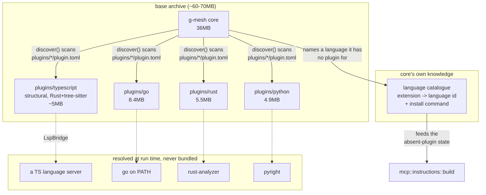
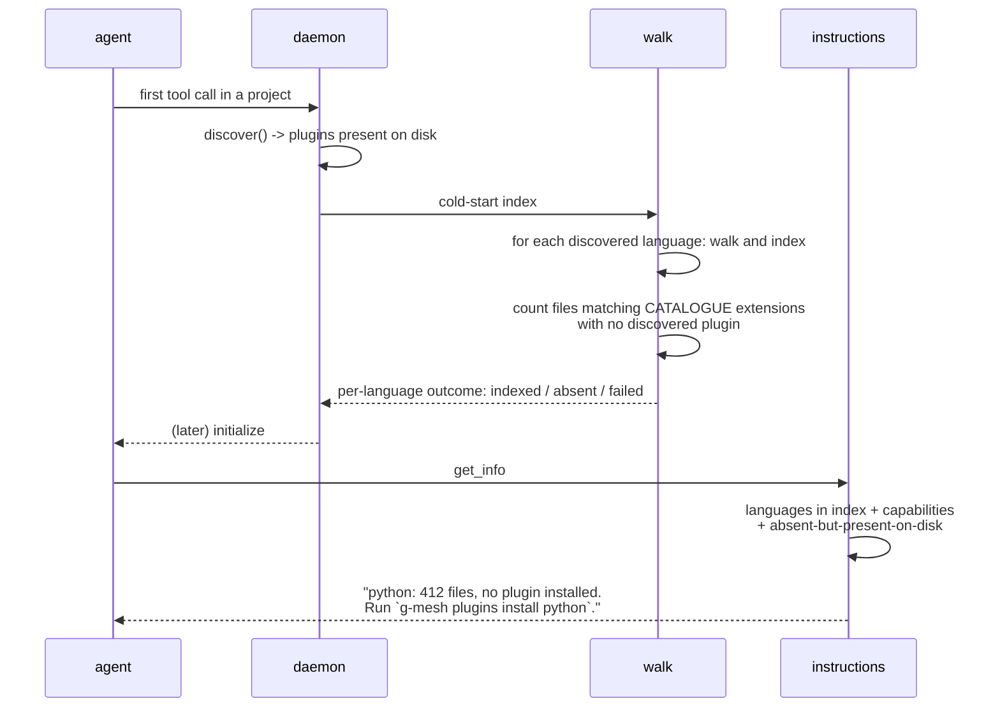

# Plugin distribution and lifecycle

## Context & Problem

g-mesh ships one archive containing core and every bundled plugin. Measured on
the 3.5.0 artifact for `x86_64-apple-darwin`:

| component | unpacked | share |
|---|---:|---:|
| `plugins/typescript` | **87 MB** | **59%** |
| `g-mesh` (core) | 36 MB | 24% |
| `plugins/go` | 8.4 MB | 6% |
| `plugins/rust` | 5.5 MB | 4% |
| `plugins/python` | 4.9 MB | 3% |
| total | **147 MB** (50 MB compressed) | |

Two things follow immediately, and both contradict the intuition that started
this design.

**The archive is one plugin.** TypeScript is 59% of it, because it is a Node
SEA: it embeds the Node runtime (the system `node` on the measuring machine is
94 MB on its own) plus the 23 MB `typescript` package. Go, Rust and Python
together are 18.8 MB - 13%. Making *plugins in general* optional buys almost
nothing; making *TypeScript* optional buys nearly everything. Any design that
treats the four symmetrically for size reasons is solving the wrong problem.

**Core is not the problem either.** 36 MB including bundled SQLite, Oniguruma
and the ONNX Runtime that `search_code` needs. It is the second-largest single
item and it is not where the weight is.

The second problem is not about size at all. Today a language whose plugin is
absent is *invisible*: `mcp::instructions` builds from
`present_languages_with_semantic_state`, which reads the languages that have
`File` nodes in the index, and a language nothing indexed has none. So an agent
asking g-mesh about a Python file in a project with no Python plugin gets an
empty answer that is indistinguishable from "there is nothing there". That is
the failure shape this project spends most of its effort eliminating, and it is
currently built in.

## Goals / Non-goals

**Goals.**
- Make the default archive small enough that a user who does not write
  TypeScript is not paying 87 MB for it.
- Make "this language has no plugin" a state the agent is *told about*, with
  the command that fixes it, rather than a silent empty result.
- Let one language's absent or broken plugin cost only that language.
- Keep install and uninstall symmetric without a config file to edit.
- Let a user fetch a plugin deliberately, with the checksum discipline
  `install.sh` already has.

**Non-goals.**
- Bundling language *servers* (rust-analyzer, pyright, a TS server). Rejected
  under Options below; rust-analyzer alone is 40 MB on disk and 535-580 MB
  resident, and each would have to be version-tracked against upstream.
- Automatic network fetches by the daemon. The daemon is spawned by an agent,
  not a human; a process that downloads and executes binaries without a person
  asking is a trust boundary this design will not cross.
- Changing what the plugins *do*. This is packaging, discovery and reporting.

## Constraints

- **The daemon has no human.** It is spawned by the agent on the first tool
  call. Nothing in the daemon path may ask a question, and any prompt belongs
  in the CLI (`g-mesh config` already hosts one).
- **Discovery is already filesystem-based.** `daemon::manifest::discover()`
  scans `plugins/*/plugin.toml` under each root in precedence order at daemon
  start, keyed by language, earlier root winning. Adding a directory adds a
  plugin; removing it removes one. There is no registry to keep in step - which
  is why uninstall needs no design of its own, only a note (below).
- **Instructions are already dynamic.** `mcp::instructions::build` assembles the
  `initialize` text per session from the languages in the index and their
  `[plugin.capabilities]`. The mechanism to tell an agent what is and is not
  covered exists; what it lacks is a way to know about a language that was
  never indexed.
- **GM-316 decided that a partial index is dangerous.** One unspawnable plugin
  fails the whole cold-start index today, deliberately: "a partial index that
  keeps serving is indistinguishable to an MCP caller from a complete one." That
  argument is sound and this design must answer it rather than ignore it.
- **The TS structural tier already uses tree-sitter** - `tree-sitter`,
  `tree-sitter-javascript`, `tree-sitter-typescript` from npm. It uses the Node
  *bindings* to the same grammars that `plugins/python` and `plugins/rust` use
  from Rust. Porting is a binding change, not a strategy change.
- **Every language already has a semantic tier.** TypeScript is not the only one
  with semantics; it is the only one that *pays for them in archive size*. Go
  needs `go` on PATH, Rust needs rust-analyzer, Python needs pyright. TypeScript
  needs nothing because it carries tsserver.

## Options Considered

### For TypeScript's weight

**A. Keep the SEA (status quo).** 87 MB, and TypeScript's semantic tier is the
only one that works with no installation at all. Costs the whole archive
problem, and keeps a class of defect this project has already been bitten by:
the embedded runtime is not the system Node, and GM-317 was exactly a
Node-20-vs-22 behavioural difference that only appeared once CI ran.

**B. Un-embed Node, keep the JavaScript plugin.** The plugin becomes roughly the
`typescript` package plus its own code - order 25 MB - and requires a system
Node. Cheapest change by far; removes two thirds of the weight. But it swaps a
known runtime for an unknown one, which is the GM-317 problem made permanent
rather than removed, and it leaves TypeScript structurally different from the
other three for no remaining reason.

**C. Port the structural tier to Rust; drive a TS language server through
`LspBridge`.** TypeScript becomes what Python is: a Rust binary on tree-sitter
(`plugins/python` is 4.9 MB) plus an external server resolved at run time. Base
weight falls to about 5 MB. It removes the embedded-runtime class of defect
entirely and makes all four languages uniform. The cost is real and must be
stated plainly: **TypeScript loses the only free semantic tier in the product.**
It is also the largest job here - the TS plugin is the oldest and most-tested
component (298 tests, and the bench numbers this project's claims rest on).

### For semantic tiers generally

**S1. Bundle every server.** Honest "all-in-one", and the archive grows rather
than shrinks: rust-analyzer 40 MB, pyright an npm tree, a TS server likewise.
Each then needs version-tracking against upstream, and rust-analyzer's 535-580
MB resident is a cost the user pays whether or not they asked. Rejected.

**S2. Bundle none; resolve all externally.** What Go, Rust and Python already
do, and what the resolve-and-degrade machinery is already built for (GM-290,
GM-299: probe candidates, log one line, answer an empty incomplete diff, keep
the gap listed). Uniform and small. TypeScript is the only language that would
lose something.

**S3. Structural always; semantic per-language and optional.** The base archive
carries every structural tier - they are 4.9-8.4 MB each and cost nothing worth
optimising - and a semantic tier is fetched per language by explicit command.
"All-in-one" and "small" become the same build with a different set of optional
components fetched, not two products.

## Chosen Approach

**C + S3, staged.** The base archive carries core plus four structural plugins
and nothing else; semantic tiers are external, resolved at run time, and
`g-mesh plugins install <language>` is the explicit way to get what a given
language's semantics needs. TypeScript's structural tier is ported to Rust so it
stops being the exception.

Projected base archive: core 36 MB + four structural plugins at roughly 5-8 MB
each ≈ **60-70 MB unpacked**, against 147 MB today; compressed, roughly 20 MB
against 50 MB.

Why C over B, given B is far cheaper: B leaves TypeScript depending on a Node it
does not control, which is the GM-317 defect made permanent. C removes the
dependency rather than relocating it, and it makes the four plugins one shape
instead of three-plus-one - which is the whole premise of `plugins/sdk` and the
reason a fifth language is supposed to be cheap. B remains available as an
interim if C's schedule is a problem; the two are not mutually exclusive, since
B is a strictly smaller step along the same path.

**The honest cost, restated so nobody discovers it later:** after C, a user with
no TypeScript language server gets structural TypeScript only - `find_callers`
on a method reached through a variable will under-report, and the instructions
will say so. Today that user gets full semantics for free. This is a real
regression for the most common language in the product's audience, and it is the
price of the archive dropping by two thirds. It should be taken only with that
sentence understood.

### The two decisions that depend on each other

Per-language degradation (below) is **only safe because** the instructions
declare coverage. GM-316's argument against a partial index - that it is
indistinguishable from a complete one - is exactly right, and the answer is not
to reject it but to remove its premise: once the agent is told which languages
are covered and which are not, a partial index is no longer indistinguishable
from a complete one. Neither change is safe without the other, and they must
land together or not at all.

## Components



**The language catalogue is the one genuinely new component.** Core must be able
to name a language it has *no plugin for* - otherwise the absent-plugin state
cannot exist, because the index has no files for it and discovery has no
manifest. The catalogue maps file extension to language id and carries the
install command for each. It ships with core, not with plugins.

This is a second place that knows about languages, and that deserves
justification rather than a shrug: a manifest describes a plugin that is
*present*, and this describes one that is *absent*. Nothing that ships with a
plugin can answer a question about the plugin not being there. The catalogue
must be kept deliberately thin - extension, id, install command - so that it
cannot drift into a second source of truth about capabilities, which remain the
manifest's alone.

## Data Flow



The walk already visits every file to decide what to hand a plugin. Counting the
ones it *would* have handed to a plugin that is not there is nearly free, and it
is what turns silence into a sentence.

## Interfaces

### `LanguageOutcome` - the per-language result of a cold-start index

```rust
enum LanguageOutcome {
    /// A plugin was discovered and indexed this language.
    Indexed { files: usize },
    /// The catalogue names this language and the project has files for it,
    /// but no plugin was discovered. NOT an error.
    PluginAbsent { files: usize, install: String },
    /// A plugin was discovered and could not be used. An error for this
    /// language, and only for this language.
    Failed { error: String },
}
```

`bulk_index::run` returns one of these per language instead of aborting on the
first failure. The whole index fails only when *every* discovered plugin failed,
which is the case that means something is wrong with the installation rather
than with one language.

### Instructions: three states, not two

`instructions::build` gains the absent case. The existing input describes
languages that are present; it must also carry those the catalogue names and the
project has files for:

```rust
struct AbsentLanguage {
    language: String,
    files: usize,
    /// The exact command, e.g. "g-mesh plugins install python".
    install: String,
}
```

The rendered contract, per language, is one of:
- **supported and working** - today's text, including the receiver-call gap
  sentence when the semantic tier has not run;
- **supported, plugin absent** - names the language, the file count, and the
  install command, and says plainly that g-mesh has no answers for this language
  until then, so the agent does not read an empty result as "nothing found";
- **not supported** - said once, generically, rather than per language; the
  catalogue is not a promise of future support.

This is the half of the design that makes a static line in `CLAUDE.md` safe. A
manifest that tells an agent "g-mesh handles Python" is *actively harmful* while
the plugin is absent, unless the instructions can correct it at run time. They
can - but only once this contract exists.

### CLI

```
g-mesh plugins list                 # exists
g-mesh plugins check <dir>          # exists
g-mesh plugins install <language>   # new: fetch from the GitHub release
g-mesh plugins install --from <path>   # new: from a local file
g-mesh plugins remove <language>    # new: delete the directory
```

`install` reuses `install.sh`'s checksum discipline (already 21 lines of it) and
verifies before unpacking. `remove` deletes `plugins/<language>/` and nothing
else - there is no config to edit, which is the whole benefit of
filesystem-based discovery.

**Both require a daemon restart to take effect**, because `discover()` runs once
at startup. This should be stated by the command rather than discovered by the
user; whether the daemon should instead re-discover on change is left open
below.

## Failure Modes & Edge Cases

- **Zero plugins installed.** A valid state, not an error: the index is empty
  and the instructions say g-mesh currently covers nothing and name the install
  command. This is what makes "ship without plugins" possible at all, and it is
  precisely what today's code cannot express.
- **A plugin is present but its binary is missing.** `Failed` for that language.
  GM-316's actionable message already names the cause and the fix; it now
  reaches the agent as well as the log, and does not take the other three
  languages with it.
- **Every discovered plugin fails.** The whole index fails, as today. Something
  is wrong with the installation rather than with one language.
- **The catalogue names a language whose plugin exists but is older than the
  catalogue entry.** The manifest wins on capabilities; the catalogue is only
  consulted for languages with no manifest at all.
- **A plugin is removed while the daemon runs.** Discovery is read at startup,
  so the daemon keeps using what it found. The index is not corrupted - the
  plugin simply keeps being spawned from a path that no longer exists, which
  degrades to `Failed` for that language on the next spawn.
- **Downloaded plugin fails its checksum.** Refuse, delete the partial file, and
  say which release and which digest were expected. Never unpack on a mismatch.

## Open Questions / Risks

- **Is TypeScript's free semantic tier worth 87 MB?** This design says no, but it
  is the single reversible-with-difficulty decision here and the one to push back
  on. The answer may differ for an audience that is mostly TypeScript.
- **Should the daemon re-discover plugins without a restart?** It would make
  install and remove take effect immediately, at the cost of a filesystem watch
  on the plugin roots and a re-entrancy question during an in-flight pass. Left
  out of this design deliberately; `plugins install` printing "restart the
  daemon" is honest and costs one line.
- **How much of the TS test suite survives the port?** 298 tests encode
  behaviour that the bench results depend on. The port is only safe if the
  conformance fixture and `expect.toml` carry that behaviour across, and that
  should be established before the port starts, not after.
- **Where does the catalogue's install command come from for a language g-mesh
  does not yet support?** Saying "not supported" generically avoids promising
  anything, but a user with a Kotlin project gets no signal at all. That may be
  correct; it is not obviously correct.
- **Windows.** Every size figure here is macOS. The SEA's weight in particular
  may differ, and nothing in this design has been measured on Windows - where,
  as of this writing, four tests still fail for unrelated reasons (GM-322).
