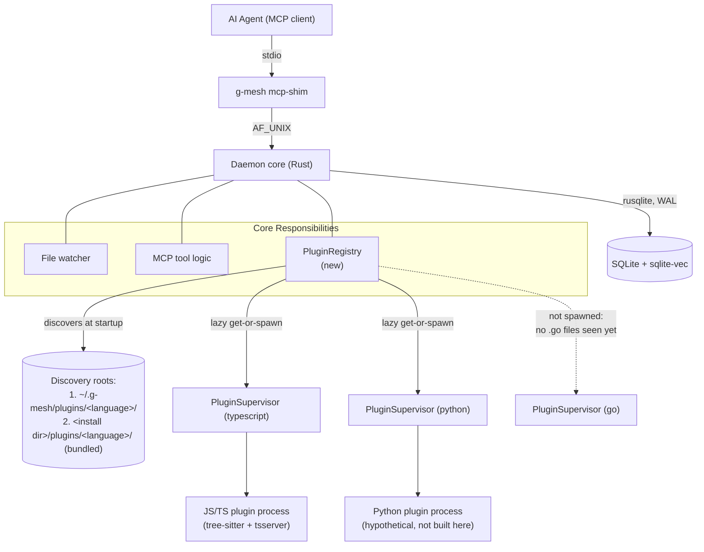
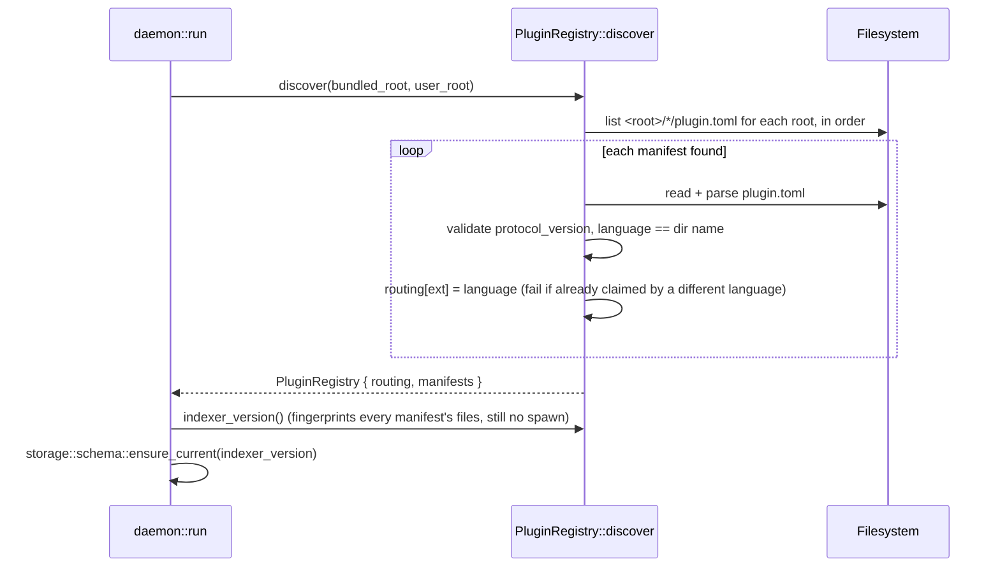
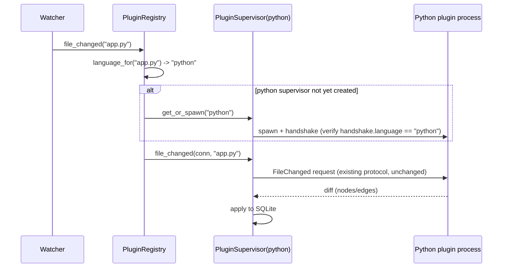

# Modular multi-language plugin system

> Extends [`g-mesh-v1.md`](./g-mesh-v1.md) — that doc already commits to the
> goal ("support additional languages later without redesigning the core")
> and sketches the target shape in one line (Distribution section:
> `~/.g-mesh/plugins/<language>/` + manifest). This doc is the actual design
> for that line: manifest schema, discovery, file-to-plugin routing, and the
> daemon-side lifecycle changes needed to run more than one plugin process at
> once. It introduces decisions the v1 doc did not make, so — unlike that
> doc — this one is not a synthesis of something already agreed elsewhere.

## Context & Problem

Today `g-mesh` runs exactly one language plugin (JS/TS), and it is wired in
as a compile-time special case: `core/src/daemon/plugin.rs::plugin_entry_path()`
resolves a path baked in at compile time (`CARGO_MANIFEST_DIR/../plugins/js-ts/dist/src/index.js`),
`core/src/cli/plugins.rs` `include_str!`s that one plugin's `package.json`,
and nothing in the daemon routes a changed file to "which plugin" — there is
only one, spawned unconditionally. Both modules say so directly in their own
doc comments, e.g. plugin.rs: *"the general `~/.g-mesh/plugins/<language>/`
discovery/manifest scheme documented in the v1 architecture doc is
deliberately not built: this MVP release bundles exactly one plugin, so
there is nothing to discover."*

The problem: turn that single hardcoded plugin into N discoverable ones, so
adding a second language (Python, Go, Rust, ...) is "drop a plugin directory
in" rather than a core code change — the goal v1 already committed to.

## Goals / Non-goals

**Goals**
- A plugin is self-describing (a manifest) and discoverable without a core
  rebuild.
- The daemon can run plugins for several languages in the same project
  concurrently, each with its own crash-recovery/idle-sleep lifecycle.
- A changed or queried file is routed to the right plugin by its extension.
- The currently-bundled JS/TS plugin goes through the exact same mechanism
  as any other plugin — no permanent hardcoded special case left behind.
- `g-mesh plugins list` reports every discovered plugin, not one hardcoded
  entry.

**Non-goals**
- Remote installation (`g-mesh plugin install <language>` pulling from a
  registry) — explicitly out of scope per the v1 architecture doc's
  non-goals; this design is local-drop-in discovery only.
- OS-level plugin sandboxing — unchanged from v1's existing position.
- Cross-language semantic resolution (e.g. a Python call into a native
  extension) — each plugin still only understands its own language.
- Building any *actual* second-language plugin. This design makes one
  possible; writing e.g. a Python plugin is separate follow-up work.

## Constraints

- Must reuse the existing wire protocol as-is: `Handshake { protocol_version,
  language, plugin_version }` (`core/src/protocol/types.rs`) is already
  language-agnostic and JSON-RPC (control) + NDJSON (bulk) is already
  implemented and tested (`core/tests/protocol_conformance.rs`) — this design
  does not touch the wire protocol, only what decides which process to talk
  to over it.
- Must keep `storage::schema::ensure_current`'s reindex-on-plugin-change
  guarantee: today `daemon::plugin::indexer_version()` = core pipeline
  constant + one plugin's content fingerprint. With N plugins, staleness
  must still be caught if *any* active plugin's build changes.
- Config conventions already exist and this should not invent a second one:
  `core/src/config/mod.rs` documents TOML, `serde(default)`, "missing file
  is not an error", all rooted under `~/.g-mesh/...`. The plugin manifest
  should follow the same house style.
- Resource footprint matters (v1 constraint: CPU-only, modest footprint) —
  a plugin for a language not actually present in the project must not cost
  a spawned process.

## Options Considered

Three decisions were confirmed with the user before detailing the design
below; each had a real alternative:

1. **Does the bundled JS/TS plugin go through discovery too, or stay a
   permanent hardcoded fallback alongside it?**
   Keeping it hardcoded is less work now but leaves two parallel mechanisms
   (hardcoded spawn/fingerprint/list vs. discovered spawn/fingerprint/list)
   that both have to stay correct forever — exactly the shape the existing
   doc comments flag as an MVP shortcut, not a destination. **Chosen: unify.**
   The bundled plugin ships its own manifest and is discovered like any
   other, via a fixed bundled root scanned alongside the user's
   `~/.g-mesh/plugins/`.
2. **Eager or lazy per-language plugin spawn?**
   Eagerly spawning every discovered plugin at daemon startup is simpler but
   spends a process (and, for something like a `tsserver`-style child, real
   memory) on a language that may not appear anywhere in the project.
   **Chosen: lazy, per-language** — a plugin is spawned the first time a
   file of its language is actually touched, reusing the sleep/wake state
   machine `PluginSupervisor` already has, just keyed by language instead
   of singular.
3. **Two manifests claim the same file extension — silently pick one, or
   refuse to start?** Silent first-match is friendlier but can mask a
   misconfiguration (e.g. two Python plugins from two sources) with no
   signal beyond "the wrong one runs". **Chosen: hard-fail at daemon
   startup**, naming both languages and both manifest paths — the same
   "protocol is code, a mismatch is a hard load failure" philosophy
   `protocol::handshake::verify` already applies to protocol version
   mismatches.

## Chosen Approach

Every plugin — bundled or user-installed — is a directory containing a
`plugin.toml` manifest plus its own runtime files, discovered by scanning a
fixed, ordered list of roots at daemon startup. Discovery builds two tables
before anything is spawned: a `language → spawn command` map (from each
manifest) and an `extension → language` routing table (from each manifest's
declared extensions), and validates both — protocol version per manifest,
and no two languages claiming the same extension — before the daemon
finishes starting. A new `PluginRegistry` owns one `PluginSupervisor` per
language, created lazily the first time that language's plugin is actually
needed, replacing the single `Arc<PluginSupervisor>` field `daemon::run`
holds today. `PluginSupervisor` and `PluginProcess` themselves change
little: mostly what they take at spawn time (a resolved command from a
manifest, instead of a hardcoded `node` + baked-in path).

## Components



- **`PluginRegistry`**: owns discovery results (routing table + manifests)
  and the map of language → `Arc<PluginSupervisor>` for languages actually
  spawned so far. Lives where `daemon::run` currently holds its single
  `Arc<PluginSupervisor>`.
- **`PluginSupervisor`** (existing, per-language now instead of singular):
  unchanged responsibility — sleep/wake, dirty-file replay, idle timeout —
  just one instance per active language instead of one for the whole
  daemon.
- **`PluginProcess`** (existing): unchanged responsibility — handshake,
  crash detection, relaunch. Its `spawn` takes a resolved command from the
  manifest instead of a hardcoded `node <baked-in path>`.
- **Manifest (`plugin.toml`)**: new, one per plugin directory, read at
  discovery time only — never re-read while the daemon runs (a plugin
  install/upgrade takes effect on the next daemon start, same as a plugin
  rebuild does today via the fingerprint/build-staleness check).

## Data Flow

**Startup — discovery (no processes spawned yet):**



**Runtime — a file changes:**



A file whose extension matches no discovered plugin is skipped (logged once
per language per daemon run, not per file) — an expected steady state for a
mixed-language repo with only some languages plugin-supported, not an error.

## Data Model

`plugin.toml`, one per plugin directory. TOML to match the house style
`core/src/config` already established, not the wire protocol's JSON — this
is local config-shaped data, read once at discovery, never sent over the
wire.

```toml
[plugin]
language = "python"          # must equal the containing directory's name;
                              # mismatch is a hard-fail at discovery
protocol_version = 1         # must equal core's CURRENT_PROTOCOL_VERSION;
                              # a fast pre-check before ever spawning — the
                              # live Handshake remains the authoritative check
plugin_version = "0.1.0"     # free-form, shown by `g-mesh plugins list`

[plugin.spawn]
command = "node"             # argv[0]: resolved on $PATH if it has no path
                              # separator, else relative to this manifest's
                              # own directory (so a native-binary plugin can
                              # ship "./g-mesh-plugin-python" here instead)
args = ["dist/src/index.js"] # extra argv entries, relative paths resolved
                              # the same way as `command`; core always
                              # appends the project root as the final arg,
                              # exactly as it does for the JS/TS plugin today

[plugin.languages]
extensions = [".py", ".pyi"] # lowercase, with the leading dot

[plugin.fingerprint]
ignore = ["node_modules"]    # optional; directory names skipped when
                              # digesting this plugin's own files for
                              # indexer_version() (see Interfaces below) -
                              # added to, not replacing, the built-in
                              # baseline ignore list below
```

**Built-in baseline ignore, applied to every plugin regardless of
manifest**: `.git`, `node_modules`, `__pycache__`, `.venv`, `venv`,
`.pytest_cache`. Rationale, not just a guess: fingerprinting exists to catch
task 116's exact failure mode (plugin logic changed, nothing noticed,
existing index kept serving wrong answers with no symptom) — a missed
change (false negative) is a correctness bug, a spurious extra reindex
(false positive) is only a slowdown. That asymmetry is why this design
walks *every* file under the plugin directory by default (a new source file
is caught automatically, with no action from the plugin author) and only
carves out known-junk by name, rather than requiring the plugin author to
enumerate every file that matters (an allow-list would silently miss a
newly-added source file the author forgot to list — reintroducing task
116's exact bug). The baseline covers the common dependency-manager/VCS
directories across the ecosystems a plugin is likely to be written in;
`plugin.fingerprint.ignore` extends it for anything unusual. The bundled
JS/TS manifest does not need to repeat `node_modules` — the baseline
already covers it.

Directory layout:

```
~/.g-mesh/plugins/python/plugin.toml   # user-installed, global (not per-project)
~/.g-mesh/plugins/python/dist/...      # whatever the manifest's command/args point at

<g-mesh install dir>/plugins/js-ts/plugin.toml   # bundled, ships in the release archive
<g-mesh install dir>/plugins/js-ts/dist/src/index.js
```

In a repo checkout (not an installed release), "`<g-mesh install dir>`"
resolves the same way `plugin_entry_path()` does today for dev builds:
relative to `core`'s own source tree (`CARGO_MANIFEST_DIR/../plugins/`) —
that fallback stays, just now pointed at a manifest instead of a hardcoded
entry file. A real install resolves it from `std::env::current_exe()`,
matching the "JS/TS plugin ships in the same release archive" line already
in the v1 doc's Distribution section.

## Interfaces

```rust
// core/src/daemon/manifest.rs (new)

pub struct PluginManifest {
    pub language: String,           // == containing directory name
    pub protocol_version: u32,
    pub plugin_version: String,
    pub command: PathBuf,           // resolved absolute path or bare command
    pub args: Vec<String>,          // resolved (relative entries joined to manifest dir)
    pub extensions: Vec<String>,    // lowercase, leading dot
    pub fingerprint_ignore: Vec<String>,
    pub manifest_dir: PathBuf,      // for error messages and fingerprinting
}

/// Reads and validates one `plugin.toml`. Hard error on: malformed TOML,
/// missing required field, `language` != directory name, unknown
/// `protocol_version`.
pub fn read_manifest(dir: &Path) -> Result<PluginManifest>;

/// Scans `roots` in order; a language found in an earlier root shadows the
/// same language name in a later one (logged, not an error — the deliberate
/// override path: `~/.g-mesh/plugins/` is scanned before the bundled root,
/// so a user-installed plugin can intentionally replace a bundled one).
/// Two *different* languages claiming the same extension is a hard error
/// naming both languages and both manifest paths.
pub fn discover(roots: &[PathBuf]) -> Result<DiscoveredPlugins>;

/// Generalizes today's test-only `G_MESH_JS_TS_PLUGIN_PATH`. When set,
/// replaces the entire default roots list (`~/.g-mesh/plugins/` + the
/// bundled root) with this one directory - a test drops whatever
/// `<language>/plugin.toml` fixtures it needs under it, the same way other
/// integration tests already build fixture directories, rather than needing
/// one override variable per language. Real installs never set this.
pub const PLUGIN_ROOTS_OVERRIDE_ENV: &str = "G_MESH_PLUGIN_ROOTS_OVERRIDE";

/// Roots discovery scans, honoring the override above.
pub fn default_roots() -> Vec<PathBuf>;

pub struct DiscoveredPlugins {
    pub manifests: HashMap<String, PluginManifest>, // language -> manifest
    pub routing: HashMap<String, String>,            // extension -> language
}
```

```rust
// core/src/daemon/registry.rs (new) — replaces the single
// `Arc<PluginSupervisor>` field `daemon::run` holds today

pub struct PluginRegistry {
    project_root: PathBuf,
    discovered: DiscoveredPlugins,
    idle_timeout: Option<Duration>,
    embedding: Arc<EmbeddingPipeline>,
    supervisors: Mutex<HashMap<String, Arc<PluginSupervisor>>>, // lazily filled
}

impl PluginRegistry {
    pub fn new(project_root: &Path, discovered: DiscoveredPlugins, ...) -> Self;

    /// None if no plugin claims this file's extension.
    pub fn language_for(&self, file_path: &str) -> Option<&str>;

    /// Existing supervisor for `language`, or spawns and memoizes a new one.
    pub fn get_or_spawn(&self, language: &str) -> Result<Arc<PluginSupervisor>>;

    /// Routes to the right supervisor via `language_for`; a no-match logs
    /// once per language per process and returns without error — mirrors
    /// today's `PluginSupervisor::file_changed`'s "failures are reported and
    /// dropped" contract, just with routing in front of it.
    pub fn file_changed(&self, conn: &Mutex<Connection>, file_path: String);

    /// Core generation + every discovered manifest's fingerprint, sorted by
    /// language before hashing so scan order can't change the result.
    /// Computed from files on disk only — no plugin needs to be spawned to
    /// answer this, consistent with lazy spawn.
    pub fn indexer_version(&self) -> String;
}
```

`PluginProcess::spawn` (existing, `core/src/daemon/plugin.rs`) changes from:

```rust
Command::new("node").arg(&entry).arg(project_root)
```

to:

```rust
Command::new(&manifest.command).args(&manifest.args).arg(project_root)
```

and, right after `handshake::perform`, adds one check with no precedent
today because there was only ever one plugin to compare against:

```rust
if handshake.language != manifest.language {
    bail!(
        "plugin at {} declares language \"{}\" in its manifest but its \
         handshake reports \"{}\" - refusing to load",
        manifest.manifest_dir.display(), manifest.language, handshake.language,
    );
}
```

`fingerprint()` / `digest_of_plugin_build()` generalize from "walk `.js`
files under the entry's parent" to "walk every regular file under
`manifest.manifest_dir`, skipping any directory name in
`manifest.fingerprint_ignore`" — the JS/TS manifest sets `ignore =
["node_modules"]` to match today's behavior (which never touched
`node_modules` because it wasn't inside `dist/`, but a whole-directory walk
now would reach it). `indexer_version()` moves from `daemon::plugin` to
`PluginRegistry` and becomes core-constant + a single re-hashed digest over
every manifest's `(language, fingerprint)` pair, sorted by language.

`core/src/cli/plugins.rs::list()` replaces its `include_str!(package.json)`
read with `daemon::manifest::discover(roots)?.manifests`, one `PluginInfo`
per entry — `status: Bundled` for the bundled root, `Installed` for
`~/.g-mesh/plugins/` (new enum variant). A manifest that fails to parse is
listed with an error string rather than silently dropped, or aborting the
whole command — unlike daemon startup, a listing tool's job is to surface
what's there, including what's broken, not refuse to run because one entry
is bad.

One naming gap this design surfaces and should close: `cli::plugins`
currently displays `"javascript/typescript"` as the language label, but the
JS/TS plugin's actual `Handshake.language` (and, going forward, its
manifest's `language`) is `"typescript"` (see
`core/src/protocol/types.rs` test `assert_eq!(handshake.language,
"typescript")`). The manifest's `language` field is the wire identifier and
must match what `Handshake.language` reports — `plugins list` should either
adopt `"typescript"` as the canonical display string or keep a separate
human-readable label distinct from the manifest key; either is fine, but
they cannot silently drift as they do today.

## Failure Modes & Edge Cases

- **Malformed manifest at daemon startup** (bad TOML, missing field,
  `language` ≠ directory name, unrecognized `protocol_version`): hard-fail
  daemon startup, naming the manifest path and the specific problem — same
  "hard load failure with a clear, actionable error" philosophy as
  `protocol::handshake::verify`.
- **Two languages claim the same extension**: hard-fail daemon startup,
  naming both languages and both manifest paths (confirmed with the user;
  see Options Considered #3).
- **Same language name in two roots**: the higher-precedence root
  (`~/.g-mesh/plugins/`) silently wins, logged at info level — a deliberate
  user-override path, not an error.
- **A manifest's declared `protocol_version` is fine but the live process's
  handshake reports a different one**: still caught by the existing
  `handshake::verify` hard-fail — the manifest check is a fast pre-flight,
  not a replacement for it.
- **Manifest's `language` doesn't match the live handshake's `language`**:
  new check (see Interfaces), hard-fail — same rationale as protocol
  version: this is a configuration bug, not a recoverable runtime state.
- **File extension matches no discovered plugin**: not an error — skipped,
  logged once per language per daemon run.
- **A spawned language's plugin process crashes**: unaffected by this
  design — `PluginSupervisor`/`PluginProcess`'s existing per-instance crash
  recovery (relaunch + replay pending) is reused unchanged, per language;
  other languages' supervisors are untouched. This falls out of the registry
  shape for free and is worth calling out as a benefit, not just a
  consequence.
- **Cold-start bulk walk** (`daemon::bulk_index`): currently assumes one
  plugin for the whole project. It becomes a `PluginRegistry` consumer —
  routes each file to its language's (lazily spawned) supervisor the same
  way the watcher path does, rather than holding a raw `PluginSupervisor`.
- **No plugins discovered at all** (both roots empty/missing): not fatal —
  daemon starts with an empty registry, every file is skipped, same as
  today's "no `.g-mesh` config" missing-file-is-not-an-error convention.
  Matches a plausible real state (a fresh install with no bundled plugin
  present for some reason) more usefully than refusing to start.

## Decision Record (ADR)

No `docs/adr/` directory exists in this repo yet, so this decision is
recorded inline as its own section rather than inventing a new file
location unprompted — happy to split it into a separate ADR file/directory
convention if that's preferred going forward.

**Status**: Proposed (pending user approval before task-planning turns this
into tracked work).

**Context**: g-mesh's core hardcodes exactly one language plugin (JS/TS),
contradicting the v1 architecture doc's own stated goal of supporting more
languages "without redesigning the core," and its own code comments
describe this as a deliberate MVP shortcut with a sketched-but-unbuilt
target design (`~/.g-mesh/plugins/<language>/` + manifest).

**Decision**: Build that target design as: (1) a per-plugin-directory TOML
manifest declaring language, protocol version, spawn command, and claimed
file extensions; (2) discovery that scans two fixed ordered roots
(`~/.g-mesh/plugins/`, then a bundled root resolved relative to the running
binary) and validates protocol versions and extension-uniqueness before the
daemon finishes starting; (3) a `PluginRegistry` that lazily spawns one
`PluginSupervisor` per language on first use, reusing the existing
sleep/wake/crash-recovery machinery unchanged per instance; (4) the
currently-bundled JS/TS plugin goes through this same mechanism — no
permanent hardcoded fallback survives it.

**Rejected alternatives**:
- Keep the bundled plugin hardcoded and only build discovery for *extra*
  plugins — rejected because it permanently doubles the code paths for
  spawn/fingerprint/list instead of retiring the MVP shortcut, the opposite
  of "without redesigning the core."
- Eagerly spawn every discovered plugin at daemon startup — rejected on the
  resource-footprint constraint: a plugin for a language absent from the
  project would still cost a live process.
- Silently resolve an extension claimed by two plugins (first-match-wins) —
  rejected because it can mask a real misconfiguration with no visible
  signal beyond "the wrong plugin ran."
- A remote plugin registry / installer — explicitly out of scope; this
  design is local-drop-in only, per the v1 architecture doc's own
  non-goals.

**Consequences**:
- Adding a language plugin becomes "write a `plugin.toml` + a plugin
  binary/script and drop the directory in" — no core rebuild.
- `daemon::plugin`, `daemon::lifecycle::PluginSupervisor`,
  `cli::plugins`, and `storage::schema`'s staleness check (via
  `indexer_version()`) all need code changes — this is not additive-only;
  see Interfaces above for the concrete diffs each takes.
- `indexer_version()` moves ownership from `daemon::plugin` to the new
  `PluginRegistry`, and its output format changes shape (now a hash over N
  manifests' fingerprints, not one plugin's) — every existing project's
  index goes stale on first upgrade and gets a one-time reindex, the same
  kind of transition `CURRENT_INDEXER_VERSION` bumps already cause today.
- The doc comments in `core/src/daemon/plugin.rs` and
  `core/src/cli/plugins.rs` that currently say "deliberately not built" need
  updating once this ships — they are now stale pointers to this design
  rather than to an unbuilt future.

## Open Questions / Risks

Three items originally flagged here were worked through and resolved (see
Data Model and Interfaces above for where each landed):

- **`fingerprint.ignore` defaults**: resolved as a built-in baseline
  (`.git`, `node_modules`, `__pycache__`, `.venv`, `venv`,
  `.pytest_cache`) applied to every plugin, extended per-manifest for
  anything unusual — not left to each plugin author to enumerate from
  scratch. Rationale: an allow-list would risk silently missing a new
  source file (task 116's exact failure mode); an ignore-list only risks an
  unnecessary extra reindex, a strictly cheaper mistake.
- **Windows command/path resolution**: judged low architectural risk and
  closed rather than left open. The manifest format itself (explicit
  `command` + `args`, no shell-script-as-command magic) already avoids most
  Windows-specific pitfalls; what remains (`PATH`/`PATHEXT` lookup,
  `.exe`/`.cmd` resolution) is exactly what `std::process::Command` already
  handles cross-platform and needs no bespoke resolver here — an
  implementation-time verification (ideally a Windows CI run), not an
  architecture decision.
- **Bundled-root env override**: resolved as `G_MESH_PLUGIN_ROOTS_OVERRIDE`,
  one variable replacing the whole default roots list rather than one
  variable per language — generalizes today's test-only
  `G_MESH_JS_TS_PLUGIN_PATH` without reintroducing a per-plugin special
  case, consistent with this design's "one discovery mechanism, not N
  hardcoded ones" goal.

**Still genuinely open:**

- The baseline ignore list above is a best guess at common
  dependency-manager/VCS junk across likely plugin ecosystems, not validated
  against a real second plugin's actual directory layout — expect to extend
  it (or a manifest's own `ignore`) once one is built, rather than treating
  it as final.
- This doc does not size the implementation work or produce tasks — that is
  the deliberately separate next step (`task-planning` skill, per the
  user's request), once this design is approved.
