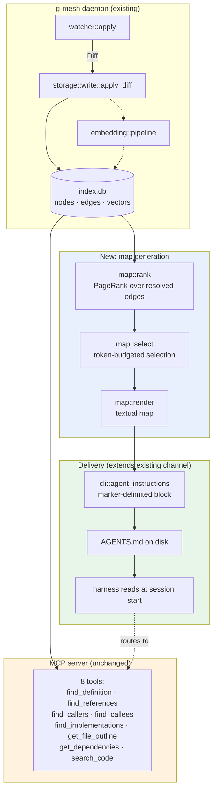
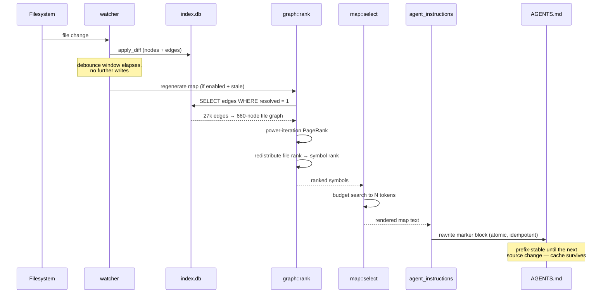
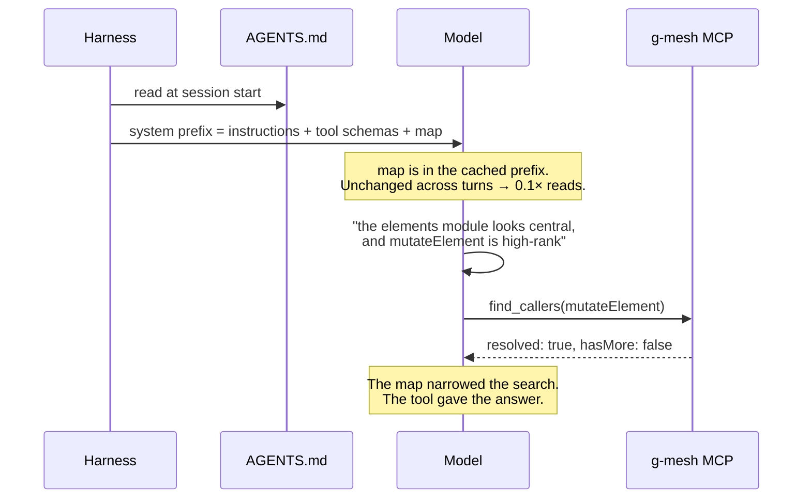

# Pushed context: an Aider-style repo map for g-mesh

> Backlog research for task #93. This is a design-doc-level investigation, not an
> implementation plan — nothing here is scheduled, and no production code was
> written for it. Numbers marked "measured" come from the indexes and payloads
> named inline; everything else is flagged as an estimate.

## Context & Problem

g-mesh gives an agent structural codebase knowledge **by demand**: eight MCP
tools (`find_definition`, `find_references`, `find_callers`, `find_callees`,
`find_implementations`, `get_file_outline`, `get_dependencies`, `search_code`)
that the agent calls when it decides it needs one. The agent pays for the tool
*schemas* on every turn whether it calls a tool or not, and pays for the
*answers* only when it asks.

g-mesh-bench's session-economy experiment (`docs/results/v0.2.0-session-economy-findings.md`)
found a structural cost problem with that shape. Two findings matter here:

1. **`cacheCreationTokens` amortizes; `cacheReadTokens` does not.** A clean
   5-call smoke test showed cold-start cache creation collapsing 18,422 → 402
   tokens on the second call. But cache *reads* grow with conversation length,
   roughly monotonically — measured on the excalidraw chain at 32.7k tokens at
   position 1 rising to 221.3k by position 14. The tool schema is a constant
   additive term inside that growing re-read prefix, so a longer session re-reads
   it *more* times, not fewer. Session chaining makes the majority-category
   picture worse, not better.
2. **The tax only pays for itself where it prevents a turn-count blowup.**
   `lookup` tasks (12 of 20 in the corpus) don't trigger a grep blowup in the
   baseline, so g-mesh adds cost there with nothing to win back. `multi-hop` and
   `ambiguous-name` are where it wins, and it wins decisively.

Aider takes the opposite shape: instead of tools, it computes a PageRank-ranked,
token-budgeted textual summary of the repo's most important symbols and pushes it
into context on every prompt. The question this doc answers is whether g-mesh
should do the same — now that the embeddings/vectors epic has landed (schema
version 7, `vectors` table, `search_code` live) and there is, in principle, a
relevance-ranking substrate to build it on.

**Three things reframe the question before the design starts.** All three were
discovered while researching this task and none of them were assumed in the
original backlog item:

- **The problem is materially smaller than when the item was filed.** §4 of the
  same findings doc reports a post-fix re-run: the #90/#91 schema trim (plus the
  barrel re-export fix, shipped together and not separable) cut the `lookup`
  disadvantage from **+45.6% → +13.8%** isolated and **+66.9% → +29.0%** in
  session mode, and the session-mode blended all-category disadvantage from
  ~+34% → **~+9%**. Session-mode multi-hop, in a run with zero
  `budget_exceeded`/`skipped` records, shows g-mesh **-35.5%** cheaper.
- **Cache-read tokens are billed at ~0.1× base input rate**, cache writes at
  1.25× (5-minute TTL) or 2× (1-hour). The bench measures *tokens*, not dollars.
  The 221k-token cache-read tail at position 14 is ~22k tokens of billed-equivalent
  input. The token curve is real and the *direction* of the finding stands, but it
  overstates the dollar severity by roughly an order of magnitude.
- **g-mesh cannot implement Aider's mechanism, because Aider owns its own prompt
  assembly and g-mesh does not.** This is the load-bearing constraint and the rest
  of the doc turns on it. See Constraints below.

## Goals / Non-goals

**Goals**

- Decide build / don't-build / hybrid, with reasoning tied to measured numbers.
- If build: identify a push channel g-mesh actually controls, and a ranking
  substrate that is query-independent and has real coverage.
- Preserve every precision guarantee the current tools make. A pushed summary
  must never become something the agent trusts *instead of* a resolved query.
- Keep the always-on cost bounded, predictable, and opt-in.

**Non-goals**

- Replacing the MCP tools. Not on the table (see Options, B).
- Per-turn, query-relative context injection. Architecturally unavailable to an
  MCP server, and cache-hostile even if it weren't.
- Reusing `storage::vectors` as the ranking mechanism for the map. Investigated
  as the task's own stated premise, and rejected on evidence — see
  "Why not embeddings".
- Multi-language ranking tuning. The design is language-agnostic because it runs
  on core's own edge table, but only TypeScript has a plugin today.

## Constraints

### C1 — g-mesh's push channels are narrow, and only one is viable

Aider constructs the entire prompt: it can recompute the map every turn and
splice it wherever it likes. g-mesh is an MCP server invoked by a harness it does
not control. Its complete set of channels into a model's context:

| Channel | Where it lands | Size ceiling | Verdict |
|---|---|---|---|
| Tool `description` fields | `tools` block, prefix position 0 | ~2KB each (Claude Code) | **Unusable.** A tool-definition change invalidates the *entire* cache — tools, system, and messages. A map that changes on every file edit would rebuild the whole conversation prefix. |
| `ServerHandler::with_instructions` | initialize / system region | ~2KB, truncated by Claude Code (documented in `core/src/mcp/mod.rs:451`) | **Unusable.** Already fully consumed by the anti-grep routing guidance, with an explicit "keep under ~1900 bytes" budget note. No room. |
| MCP resources | Only if the agent fetches one | n/a | **Not push.** `ServerCapabilities::builder().enable_tools()` is all g-mesh declares, and a resource the agent must request costs exactly the round-trip a tool call costs. Self-defeating. |
| `AGENTS.md` / `CLAUDE.md` on disk | Harness reads at session start; sits in the stable cached prefix | No hard cap | **Viable.** Already built and shipped — see below. |

The fourth row is the finding. `core/src/cli/agent_instructions.rs` already
writes a marker-delimited block into `AGENTS.md` (with one-line `@AGENTS.md`
bridge files for Claude Code and Gemini CLI), installed by
`g-mesh init --agent <tool>`. **g-mesh already has a push-into-context channel
and already uses it** — today it carries ~8,052 characters (~2,000 tokens) of
routing prose. A repo map is an extension of a mechanism that exists, not a new
mechanism.

### C2 — Prompt-cache economics forbid a per-turn-varying map

Caching is a strict prefix match with render order `tools → system → messages`.
Any byte change invalidates everything after it. The invalidation tiers:

| Change | Invalidates tools | system | messages |
|---|---|---|---|
| Tool definitions, model | yes | yes | yes |
| System prompt content | no | yes | yes |
| Message content | no | no | yes |

A map that varies with the user's current turn — the thing that makes Aider's map
*good* — necessarily changes the prefix on every turn. Each change re-writes the
changed span at 1.25× instead of re-reading it at 0.1×: a **12.5× penalty per
token on the changed region**, plus full-price re-processing of everything
downstream. Aider's own issue tracker has this exact bug filed
([Aider-AI/aider#1874](https://github.com/Aider-AI/aider/issues/1874), "Unstable
repomap breaks caching when nothing has changed"), and Aider ships
`--map-refresh {auto,always,files,manual}` specifically to let users trade map
freshness for cache stability. Aider can *choose*; a design that pays the cost
unconditionally would be strictly worse than the tool-schema tax it set out to fix.

**Conclusion: a pushed map must be prefix-stable — regenerated on source change,
never on user turn.**

### C3 — Whatever ships must not cost the precision guarantees

g-mesh's differentiated value, per the bench's own bottom line, is not "cheaper on
average" — it's a bounded, predictable cost on multi-hop and ambiguous-name
questions where grep has reproducible tail risk (20-40+ turns, 300-580k tokens,
and in one run a literal budget ceiling). That value rests on guarantees a
summary cannot make: per-call-site resolution to one exact declaration, the
`resolved: false` / `allUnresolved: true` confidence signalling, and completeness
of a `hasMore: false` page. A ranked list of names has none of these. It must be
positioned as a *routing hint*, never as an answer.

### C4 — Index scale (measured)

From a live index of a 659-file TypeScript project (the excalidraw bench corpus,
`~/.g-mesh/projects/*/index.db`):

- 13,424 nodes — of which 8,278 are `Module` import placeholders and 659 are
  `File`. Real symbols: **4,487** (Function 2,644, Variable 1,116, Type 727).
- 27,107 edges: REFERENCES 10,350, CALLS 5,888, DEFINES 4,501, IMPORTS 4,119,
  EXPORTS 2,235, SUPERTYPE_OF 14.
- Resolution quality: REFERENCES and CALLS both **98.1% resolved**; DEFINES,
  EXPORTS, SUPERTYPE_OF 100%; IMPORTS 79.2%.

A graph of ~660 file nodes and ~27k edges is trivially small for PageRank —
milliseconds, in-process, no new dependency beyond a ~50-line power iteration.

### C5 — The tool schema has grown since the last measurement

The #91 measurement (`tools/list` 11,787 → 10,535 bytes) predates `search_code`.
There are now eight tools, not seven. The current payload has not been re-measured.
Any experiment on this design must re-baseline first, or it will attribute a
schema regression to the map.

## Why not embeddings

The backlog item deferred this work until the embeddings epic landed, on the
premise that "a serious version of that idea needs the same relevance-ranking
substrate." Having read `core/src/storage/vectors.rs` and
`core/src/mcp/search_code.rs`, **that premise does not hold.** Three reasons, in
order of severity:

**1. Embedding similarity is query-relative; a repo map has no query.**
`search_code::handle` requires `embedding.embed_query(&params.query)` before it
can rank anything — `vectors::search` takes a `query: &[f32]` and orders by
`vec_distance_cosine(embedding, ?1)`. There is no "importance" ordering in the
vector store, only "closeness to this text." To rank a map you would have to
supply a query, and the only available query is the user's current turn — which
lands you squarely in C2's cache-invalidation trap. The one query-independent
thing you could do with the vectors (cluster them, rank by centrality in
embedding space) measures *topical typicality*, not importance, and would rank a
project's most boilerplate-adjacent code highest.

**2. Coverage is partial, and skewed.** `pipeline::text_to_embed` embeds
`doc_comment + "\n\n" + signature`, and skips a node with neither entirely — so
`vectors` is 1:0-or-1 with `nodes`, and `search_code`'s inner join silently drops
the unembedded. Measured on the same index:

| Node kind | Nodes | Embedded | Coverage |
|---|---:|---:|---:|
| Function | 2,644 | 2,644 | 100% |
| Variable | 1,116 | 45 | 4.0% |
| Type | 727 | 71 | 9.8% |
| Module | 8,278 | 0 | 0% |
| File | 659 | 0 | 0% |

Real symbols: **2,760 / 4,487 = 61.5%**. A map that can only see functions is not
a map of the repo.

**3. Most of the vectors are signature-only.** Of the 2,644 embedded functions,
only **443 (16.8%)** have a doc comment. The other 83% embed a bare signature —
so for the large majority of the index, the vector encodes roughly the function
name plus its parameter names. That is a fuzzy lexical matcher wearing a semantic
model's clothes. It's entirely adequate for `search_code`'s job (a top-k where any
plausible hit lets the agent proceed) and inadequate as a global importance signal.

**The right substrate was already in the database.** The `edges` table is dense
(27k edges over 660 files), near-fully resolved (98%+ on the two kinds that
matter), and query-independent. It is a *better* graph than the one Aider ranks
over — see below.

## How Aider's repo map actually works

From `aider/repomap.py` and the public docs, so the comparison is concrete:

**Graph.** A `networkx.MultiDiGraph` whose nodes are filenames. Tree-sitter tag
queries classify each tag by prefix: `name.definition.*` → `defines[ident].add(file)`,
`name.reference.*` → `references[ident].append(file)`. An edge is drawn from a
referencing file to a defining file **when the identifier strings match**.

**Weights.** Base `mul = 1.0`, adjusted by heuristics:

| Condition | Multiplier |
|---|---|
| `ident in mentioned_idents` | ×10 |
| snake/kebab/camel case and `len(ident) >= 8` | ×10 |
| `ident.startswith("_")` | ×0.1 |
| `len(defines[ident]) > 5` (over-used name) | ×0.1 |
| referencing file is in the chat | ×50 |

Reference counts are damped: `num_refs = math.sqrt(num_refs)`.

**Ranking.** `nx.pagerank(G, weight="weight", **pers_args)` — personalized on the
chat files. File rank is then redistributed to individual definitions
proportionally to outgoing edge weight
(`data["rank"] = src_rank * data["weight"] / total_weight`, accumulated into
`ranked_definitions[(dst, ident)]`).

**Budget.** Binary search on the number of tags included, against a token count,
accepting a 15% error (`ok_err = 0.15`). Token counting is sampled for large texts
(`step = num_lines // 100 or 1`) and extrapolated. Default `--map-tokens` is 1k;
with no files in the chat the target expands by `map_mul_no_files` (default 8),
clamped to `max_context_window - 4096`. Output lines are truncated to 100 chars.

**Caching.** Tree-sitter tags cached on disk in SQLite (`CACHE_VERSION = 4`),
invalidated on file mtime. Map-level refresh modes: `manual` (return `last_map`),
`always` (never cache), `files`, and `auto` (cache once
`map_processing_time > 1.0`). In `auto` mode the cache key includes mentioned
files and identifiers — i.e. it varies per turn, which is the source of #1874.

**What it trades away.** Two things, both structural:

- *Precision.* `defines`/`references` are matched by **string name**, with no
  scope or import resolution. The ×0.1 penalty for identifiers defined in more
  than five files is an explicit, crude patch for exactly the ambiguity problem
  that g-mesh resolves properly — and it is precisely the `ambiguous-name`
  category where g-mesh's bench advantage is largest (**-24.6%** in session mode).
- *Answers.* The map lists symbols and signatures. It cannot tell you who calls
  `mutateElement`, or which of three same-named `getNonDeletedElements` a given
  call site resolves to. Aider's user recovers by adding files to the chat and
  re-reading them — the grep-baseline failure mode, one level up.

**What g-mesh would do better.** g-mesh's edges are produced by tree-sitter *plus*
a `tsserver` semantic pass and confirmed per call site (`EdgeSource::TsCompiler`,
`resolved: true`). A PageRank over `edges` would be ranking a resolved call/reference
graph rather than a name-collision approximation — no ×0.1 hacks needed, because
the ambiguity is already settled. This is the one place where g-mesh can build a
genuinely better version of Aider's feature rather than a copy.

## Options Considered

**A — Don't build. Keep tuning the schema.**
The #90/#91 trim already recovered most of the measured gap (session blended
~+34% → ~+9%), cache reads bill at 0.1×, and the remaining `lookup` disadvantage
is +13.8% isolated. The AGENTS.md routing snippet already tells the agent to
prefer grep for simple lookups, which addresses the same problem with zero
always-on tokens. Cheapest option; risks leaving a real capability unbuilt and
leaves g-mesh with no answer to "the agent doesn't know this codebase exists
until it decides to ask."

**B — Replace the tools with a pushed map (Aider-faithful).**
Rejected on two independent grounds. It is *architecturally unavailable*: g-mesh
does not assemble the prompt, and the only per-turn channels it has (tool
descriptions, `instructions`) are the two most cache-hostile positions in the
request plus a 2KB ceiling. And it would trade away exactly the guarantees the
bench says are g-mesh's actual value — the multi-hop (-35.5%) and ambiguous-name
(-24.6%) wins come from resolved answers, which a summary cannot provide.

**C — Hybrid: a prefix-stable, structurally-ranked map alongside unchanged tools.**
Generate a PageRank-ranked, token-budgeted map from the resolved `edges` table;
write it into the existing `AGENTS.md` marker block; regenerate it when the
*source* changes, never when the *turn* changes. Tools untouched. Costs a fixed
budget of always-on tokens in exchange for the agent knowing the codebase's shape
without asking, and knowing which symbols are worth a precise query. This is the
recommendation.

**D — A `get_repo_map` MCP tool.**
Mentioned only to dismiss it. Adding a ninth tool schema to fix a tool-schema
cost problem is self-defeating, and a map the agent must request is not pushed
context — it's a tool call with worse ergonomics than `get_file_outline`.

## Chosen Approach

**Build option C, opt-in and off by default, gated on a bench experiment.**

The reasoning, in constraint order:

1. C1 says the only usable push channel is the `AGENTS.md` block g-mesh already
   writes. That makes this a bounded extension of `cli::agent_instructions`, not a
   new subsystem.
2. C2 says the map must be prefix-stable. Regenerating on file-change (which the
   daemon's watcher already observes) rather than per-turn satisfies that, and
   costs the prompt cache nothing between edits.
3. C3 says the tools stay exactly as they are, and the map's own text must route
   *toward* them.
4. The evidence in "Why not embeddings" says rank on `edges`, not `vectors`.

The honest counter-argument, stated plainly: **this design spends always-on
tokens to fix an always-on-token problem.** The AGENTS.md block already costs
~2,000 tokens on every turn; a 1,000-token map makes that 3,000. That is the same
shape of cost as the tool-schema tax, paid to every project, forever. It is only
justified if it measurably reduces turn count — by letting the agent skip
orientation reads and aim its first precise query correctly. That is an empirical
claim, not an architectural one, which is why the gate below is not optional.

**Ship gate.** Before this is merged on by default, a g-mesh-bench arm
(`gmesh` + map vs `gmesh` alone vs baseline) must show, on the `lookup` category
specifically, either a turn-count reduction or a token reduction that exceeds the
map's own per-turn cost. If it doesn't, the map ships as an opt-in flag and the
default stays off — and that is a perfectly acceptable outcome for a research
task. Re-baseline the current 8-tool `tools/list` payload first (C5).

## Components



| Component | Owns |
|---|---|
| `graph::rank` (new) | Builds the file-level weighted digraph from `edges`, runs power-iteration PageRank, redistributes file rank to individual symbols. Pure function of the DB; no I/O beyond one read transaction. |
| `map::select` (new) | Takes ranked symbols + a token budget, returns the subset that fits. Owns the budget search and the per-file grouping. |
| `map::render` (new) | Formats the selected symbols as the textual map, including the routing footer that points at the MCP tools. |
| `cli::agent_instructions` (extend) | Gains a second marker-delimited block (`<!-- g-mesh:repo-map:begin -->` / `:end`), written with the same idempotence contract as the existing snippet. |
| `cli::map` (new subcommand) | `g-mesh map` — prints the map to stdout; `g-mesh map --write` refreshes the AGENTS.md block. Makes the feature inspectable and scriptable before any automation is trusted. |
| `daemon` (extend) | After a debounce window with no writes, if the map block is stale and the feature is enabled, regenerate it. Never on a request path. |

Nothing in `core/src/mcp/` changes. Nothing in `storage::vectors` or
`embedding::` changes.

## Data Flow

### Map generation (out of band, never on a request path)



### Session



The division of labour is the whole design: **the map answers "where should I
look", the tools answer "what is actually true".** The map never claims
completeness and never claims resolution.

## Data Model

No schema change. `CURRENT_SCHEMA_VERSION` stays at 7. The map is derived state,
recomputable from `nodes` + `edges` in milliseconds, and is not persisted in the
database — it lives in `AGENTS.md` and in an in-memory cache keyed by the
index's last-write generation.

Intermediate types (illustrative, not final):

```rust
/// A file node in the ranking graph. `id` is the File node's id.
struct FileRank { id: String, path: String, rank: f64 }

/// One symbol eligible for the map, with the share of its file's
/// rank that flowed to it through incoming resolved edges.
struct SymbolRank {
    id: String,
    name: String,
    kind: String,        // Function | Type | Variable
    file_path: String,
    signature: Option<String>,
    rank: f64,
    inbound: u32,        // distinct referencing files (for tie-breaks)
}

/// What `map::select` returns: a budget-respecting, file-grouped selection.
struct RepoMap {
    files: Vec<MapFile>,      // ordered by file rank, descending
    est_tokens: usize,
    truncated_files: usize,   // files that ranked in but had no budget left
    generation: u64,          // index write generation this was built from
}
```

### Ranking, concretely

Edges are aggregated to the file level and weighted, mirroring Aider's shape but
dropping every heuristic that only existed to paper over unresolved names:

| Aider weight | g-mesh equivalent | Why |
|---|---|---|
| `mul *= 10` if identifier mentioned in chat | **dropped** | Requires a per-turn query. C2. |
| `mul *= 10` for long camel/snake names | **dropped** | A proxy for "probably a real API symbol". g-mesh knows this exactly from `exported`. Use `exported = 1` instead. |
| `mul *= 0.1` for `_`-prefixed | kept, as a `kind`/`exported` check | Same intent, better signal. |
| `mul *= 0.1` if defined in >5 files | **dropped** | Exists solely to damp string-name collisions. g-mesh's edges are already resolved per call site — the collision does not occur. |
| `use_mul *= 50` for chat files | **dropped** | Per-turn. C2. |
| `num_refs = sqrt(num_refs)` | kept | Damping is sound regardless of resolution quality. |

Rank flows only along `resolved = 1` edges of kind `CALLS`, `REFERENCES`, and
`IMPORTS`. `DEFINES` and `EXPORTS` are structural, not dependency signal.
Unresolved edges are excluded deliberately: an edge g-mesh could not confirm is
exactly the kind of guess Aider is forced to make, and including it would import
the imprecision this design is trying to avoid.

## Interfaces

### CLI

```
g-mesh map [--tokens N] [--format text|json] [--write]
```

- `--tokens` — budget, default 1000 (matching Aider's default; see Open Questions).
- `--write` — rewrite the marker block in `AGENTS.md` instead of printing.
- Exits non-zero with a clear message if the project is not indexed yet.

### Config (`config.toml`)

```toml
[map]
enabled = false      # off by default until the bench gate is cleared
tokens  = 1000       # budget for the rendered map
refresh = "on-change"  # "on-change" | "manual"
```

`refresh = "manual"` exists for users who want byte-stable prompts across a whole
work session regardless of edits — the same escape hatch Aider's `--map-refresh
manual` provides, for the same cache reason.

### Rendered format (sketch)

```
<!-- g-mesh:repo-map:begin -->
## Repo map (g-mesh, 1024 tokens, 659 files indexed)

Ranked by reference centrality over the resolved call/import graph. This is an
orientation aid, not an answer: it lists what is central, not what is complete.
For exact callers, references, or implementations, query the g-mesh tools —
their results carry per-call-site resolution this list does not.

packages/element/src/mutateElement.ts
  export function mutateElement(element, updates, options?): ElementUpdate
  export function newElementWith(element, updates): T

packages/element/src/types.ts
  export type ExcalidrawElement = ...
  export type NonDeleted<T> = ...

... 47 more files omitted (budget)
<!-- g-mesh:repo-map:end -->
```

Two properties matter. The block is **marker-delimited and idempotent**, matching
`ensure_agents_md`'s existing contract — a second run replaces the block and never
touches hand-written content around it. And the header **explicitly disclaims
completeness**, so the map can never be read as the guarantee the tools make.

## Failure Modes & Edge Cases

| Case | Behaviour |
|---|---|
| Project not indexed / index still building | `g-mesh map` errors with the same "still building, retry" message the MCP tools use. The daemon skips regeneration; the stale block stays. Never write a partial map. |
| No `AGENTS.md`, or the map markers are absent | No-op. The map block is only ever refreshed in place; g-mesh does not create the file for this feature alone (`g-mesh init --agent` remains the entry point). |
| User hand-edits inside the markers | Overwritten on next regeneration, exactly like the existing snippet block. Documented. |
| Very large monorepo (100k files) | PageRank on ~100k nodes is still fast, but the map at 1k tokens becomes a vanishingly thin slice and its usefulness degrades toward zero. Consider suppressing the map above a node-count threshold rather than emitting a misleading one. Open question. |
| Rapid edit storms | Debounce; regenerate at most once per window. Regeneration is never on a request path, so a slow rebuild delays freshness, never a query. |
| Map goes stale (daemon down, `refresh = "manual"`) | Degrades to *slightly wrong orientation*, not to a wrong answer — the tools remain the source of truth. This is the design's main safety property. |
| Agent treats the map as complete | Mitigated by the header disclaimer and by the routing prose already in the AGENTS.md snippet. Genuinely a residual risk; the bench oracle should include a task that *only* passes if the agent queried rather than trusted the map. |
| Multi-language project, one plugin | The map reflects only indexed languages. Header should state the indexed file count so the gap is visible. |

## Decision Record (ADR)

**Decision.** Build a prefix-stable, PageRank-over-resolved-edges repo map,
delivered through the existing `AGENTS.md` block, alongside unchanged MCP tools.
Opt-in, default off, merged on by default only after a bench arm demonstrates net
benefit on the `lookup` category.

**Status.** Proposed. Research task; not scheduled.

**Rejected — replacing the tools with a pushed map.** Architecturally unavailable
(g-mesh does not assemble the prompt) and it would trade away the resolved-answer
guarantees that produce g-mesh's only measured wins (-35.5% multi-hop, -24.6%
ambiguous-name in session mode).

**Rejected — ranking the map with `storage::vectors`.** This was the backlog
item's own stated premise and it does not survive contact with the code.
Embedding search is query-relative (`search_code` requires an `embed_query` call
before it can rank), covers 61.5% of real symbols, and 83% of the function vectors
it does have are signature-only. The resolved `edges` table is query-independent,
98% resolved, and is a strictly better ranking substrate than the string-name
graph Aider ranks over.

**Rejected — per-turn map refresh.** A prefix change costs 1.25× writes against
0.1× reads on the changed span plus full re-processing downstream. Aider hit this
(issue #1874) and shipped `--map-refresh` to work around it. Paying it
unconditionally would be worse than the tool-schema tax this was meant to fix.

**Consequence.** g-mesh gains always-on orientation without giving up precision,
at a fixed, bounded, opt-in token cost. It does *not* gain Aider's per-turn
relevance targeting — deliberately, because the cache math makes that a net loss
for a server that cannot control the prompt.

## Open Questions / Risks

- **The gate may fail, and that's a real outcome.** The strongest argument
  against building this is that the problem it targets has already shrunk by
  two-thirds (session blended ~+34% → ~+9%) and that cache reads bill at 0.1×.
  If the bench shows no turn-count reduction, the correct answer is to ship the
  `g-mesh map` CLI as a useful inspection tool and leave the automatic injection
  off permanently.
- **Budget size is unvalidated.** 1,000 tokens is Aider's default, chosen for a
  tool with a different context strategy. Aider also expands it ×8 when no files
  are in the chat — a per-turn signal g-mesh doesn't have, so g-mesh's single
  fixed budget is doing a harder job. Sweep 500 / 1,000 / 2,000 in the bench.
- **Interaction with the existing 2,000-token snippet is unmeasured.** The
  routing prose and the map compete for the same always-on budget and may be
  partially redundant. It is plausible that the best configuration is a *shorter*
  snippet plus a map, not both at full size.
- **`tools/list` needs re-baselining before any experiment** (C5) — eight tools
  now, last measured at seven.
- **Monorepo behaviour is unresolved.** At 100k files a 1k-token map is
  ~0.1% coverage. Suppress, scale the budget, or scope the map to the working
  subtree? No good answer yet, and it may be the case that this feature is only
  ever appropriate below some project size.
- **Testing that the agent still queries.** The main behavioural risk is the map
  becoming a plausible-looking substitute for a resolved answer. The bench needs
  at least one oracle that fails if the agent answers from the map alone —
  ideally an ambiguous-name task where the map lists the symbol but cannot say
  which declaration a call site binds to.
- **Multi-language ranking** is untested; only TypeScript has a plugin. The
  ranking runs on core's language-agnostic edge table, so it should generalize,
  but "should" is doing work there.
