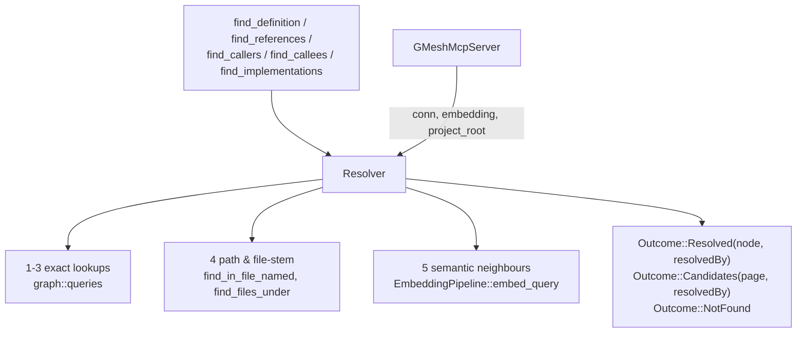
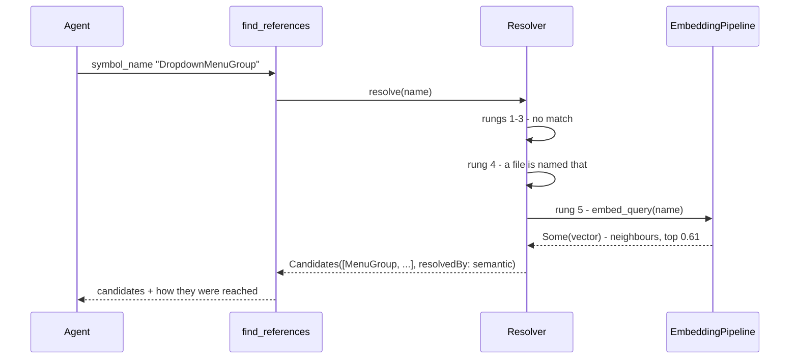

# Symbol resolution: a ladder inside the tool, not rules outside it

## Context & problem

Every symbol-anchored tool — `find_definition`, `find_references`, `find_callers`,
`find_callees`, `find_implementations` — resolves its anchor through one function,
`find_definition::resolve_symbol_name`. That function tries an exact `qualifiedName`, then a bare
name, and then refuses.

Everything that happens after a refusal happens *outside* g-mesh: in the guidance doc it ships, or
in the calling agent's next turn. Both are expensive, and we have the numbers. The doc costs +4,453
tokens of prompt prefix **per turn** and cannot simply be shortened — cutting it 57% moved
`find_definition`-before-another-tool from 3 of 12 runs to 9 of 12 and lost more in round trips than
the prefix saving returned (`g-mesh-bench/docs/results/v0.20.0-guidance-doc-pays-for-itself-findings.md`).
A round trip costs 18,000–22,000 tokens at that prefix
(`v0.20.0-losing-task-traces-findings.md`). Recovery *inside* the tool costs neither.

Three fixes in two days each did that recovery locally: matching a queried name against file names
(task 0b95d41c), accepting a path where `module_id` documented a node id (0299043a), and the
proposed semantic fallback (3b6b2cc5). They are one missing concept, patched three times.

## Goals / non-goals

**Goals.** One ladder, in one place, that every symbol tool inherits. An answer that says how it was
reached, so a suggestion is never mistaken for a resolution. No new rules in the guidance doc — the
whole point is that the tool stops needing them.

**Non-goals.** Accepting a directory as a real anchor and aggregating it (an answer-shape question of
its own). Changing what is indexed. Making `get_dependencies`' walk semantic — that tool's miss path
is fixed by paths, and measurement says semantics does not help it.

## Constraints

- **`anchor::resolve` takes only `&Connection`.** `EmbeddingPipeline` lives on `GMeshMcpServer`,
  `project_root` on `PluginRegistry`. Anything the ladder needs beyond SQLite has to be plumbed.
- **The embedding model is optional** — a 612 MiB opt-in. `EmbeddingPipeline::embed_query` already
  returns `Option`, so "no model" is a `None`, not an error. A machine without it must behave
  exactly as today.
- **A missing edge beats a wrong one.** The project's standing rule (`graph::symbol_links`). It is
  what forbids returning a similarity hit as a definition.
- **Measured, not assumed, about semantics**: it answers a symbol-name miss
  (`DropdownMenuGroup` → the right declaration, score 0.61, top hit) and does not answer a
  package-name miss (`@excalidraw/math` → `round` in an unrelated file, 0.468). Doc comments and
  signatures are embedded; paths and specifiers are not.

## Options considered

**A. Thread the extra context as parameters.** `resolve_symbol_name(conn, embedding, root, …)`.
Smallest diff, five call sites. But every later rung that needs something new re-threads every
signature, and the paused snippet work (a18638d0) already needs `project_root` through the same
path — so this is the option that has to be paid twice.

**B. A `Resolver` holding the context.** `conn`, `embedding`, `project_root`, constructed once per
handler from what `GMeshMcpServer` already owns; the tools call methods on it. One place to add a
rung, one place to test, and it is where the snippet work's `project_root` belongs too.

**C. Recover at the handler layer**, in `mcp/mod.rs`, where the pipeline already is. No plumbing at
all — and the ladder would be written five times, which is the duplication `resolve_symbol_name`
exists to prevent.

**Chosen: B.** The deciding argument is not elegance but that two pending changes need the same
context, and C reintroduces exactly the duplication the shared resolver was extracted to remove.

## Chosen approach

Six rungs, tried in order, each labelled by what it establishes:

| # | rung | establishes | `resolvedBy` |
|---|---|---|---|
| 1 | exact node id | resolution | `id` |
| 2 | exact `qualifiedName` | resolution | `qualifiedName` |
| 3 | bare name, single match | resolution | `name` |
| 3′ | bare name, several matches | **suggestion** — today's ranked candidate page | `nameAmbiguous` |
| 4 | the name is a path, or a file's stem | resolution *of the file*, suggestion about the symbol | `fileName` |
| 5 | semantic neighbours above threshold | **suggestion** | `semantic` |
| 6 | nothing | refusal | — |

Rungs 1–3 are what exists. Rung 4 is what 0b95d41c and 0299043a each built locally, lifted into the
shared path. Rung 5 is new and runs only when `embed_query` returns `Some`.

The distinction that carries the design: **rungs 3′, 4 and 5 return the same shape** — a page of
candidates the caller re-queries by id — and differ only in `resolvedBy`. That reuses a contract the
guidance doc already teaches ("re-call with a candidate's `id` as `symbol_id`"), so the new rungs
need no new rules, which is the point.

## Components



`Resolver` owns the ladder and nothing else: it does not walk edges, format results, or decide what
a tool does with a candidate page. Each tool keeps its own answer shape and simply carries
`resolvedBy` through.

## Data flow



Without the model, rung 5 is skipped on a `None` and the answer is rung 4's, or the refusal.

## Interfaces

```rust
pub enum ResolvedBy { Id, QualifiedName, Name, NameAmbiguous, FileName, Semantic }

pub enum Outcome {
    Resolved { node: NodeRecord, by: ResolvedBy },
    Candidates { page: CandidatePage, by: ResolvedBy },
    NotFound { message: String },
}

impl Resolver<'_> {
    pub fn anchor(&self, params: &SymbolQueryParams) -> Result<Outcome, ErrorData>;
    pub fn by_name(&self, name: &str, cursor: Option<&str>) -> Result<Outcome, ErrorData>;
}
```

On the wire, both response shapes gain one field:

```json
{ "id": "…", "qualifiedName": "MenuGroup", "filePath": "…", "resolvedBy": "name" }
{ "results": [ … ], "resolvedBy": "semantic", "hasMore": false }
```

`resolvedBy: "semantic"` is the caller's signal that these are neighbours, not matches.

## Failure modes & edge cases

- **No embedding model.** `embed_query` returns `None`; rung 5 is skipped silently. Verified as a
  live case — the Linux container in task 6cb162b4's run had no weights and `search_code` correctly
  reported semantic search unavailable.
- **Semantics confidently wrong.** The only real risk. Mitigated by never returning rung 5 as a
  resolution, and by a threshold calibrated against measured scores across both bench corpora — the
  one signal available is 0.61 for a right answer against 0.47 for junk, and picking a cutoff
  without measuring would turn a refusal into confident nonsense, which is worse than the refusal.
- **Cost on the happy path.** Rungs 4 and 5 run only after 1–3 miss. A successful lookup pays
  nothing: no file scan, no embedding call.
- **Latency on the miss path.** A warm semantic query measured 43–48 ms; the first one loads the
  model, 2.4 s. Against a saved round trip, both are noise — but the cold case should be stated in
  the doc rather than surprising someone.
- **A file-kind anchor** already has a hint (`anchor::file_anchor_hint`) for the case where a name
  resolves to a `File` node and every edge walk then returns an honest, useless empty page. Rung 4
  makes that path more common, so the hint becomes load-bearing rather than incidental.

## Open questions / risks

- **Threshold calibration is a measurement task, not a constant.** It needs right-answer and
  junk-answer scores across both corpora before a number is chosen. Until then rung 5 should be off
  by default.
- **Does `resolvedBy` change agent behaviour?** Unknown. It is information the caller did not have;
  whether it improves decisions or just adds tokens is measurable on the bench, and should be
  measured rather than assumed — the same mistake as assuming the doc could be cut.
- **Snippets (a18638d0) fold in here**, since `project_root` arrives with the `Resolver`. Whether a
  snippet also rides on candidate rows, or only on a resolution, is a question for that task once
  this shape is settled.
